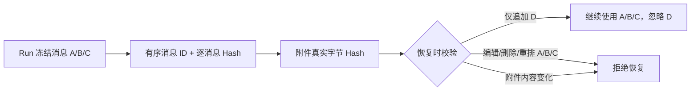
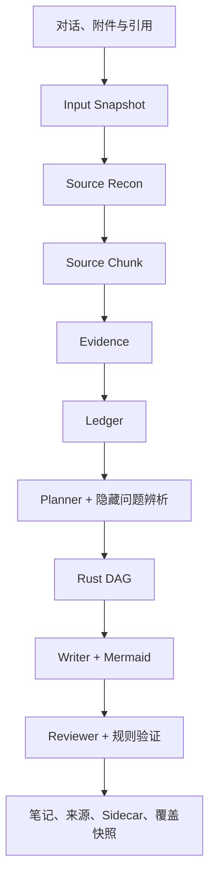
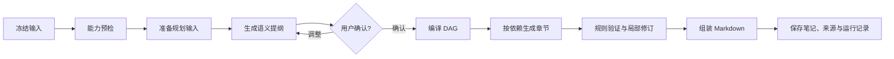
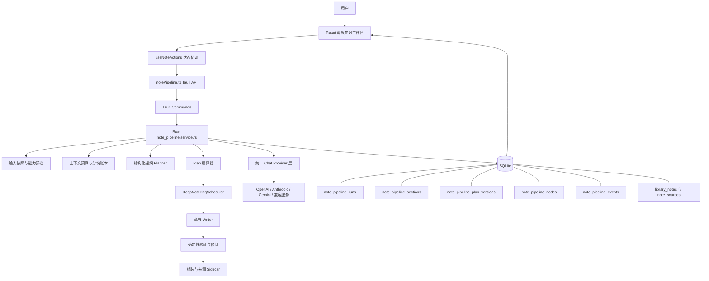
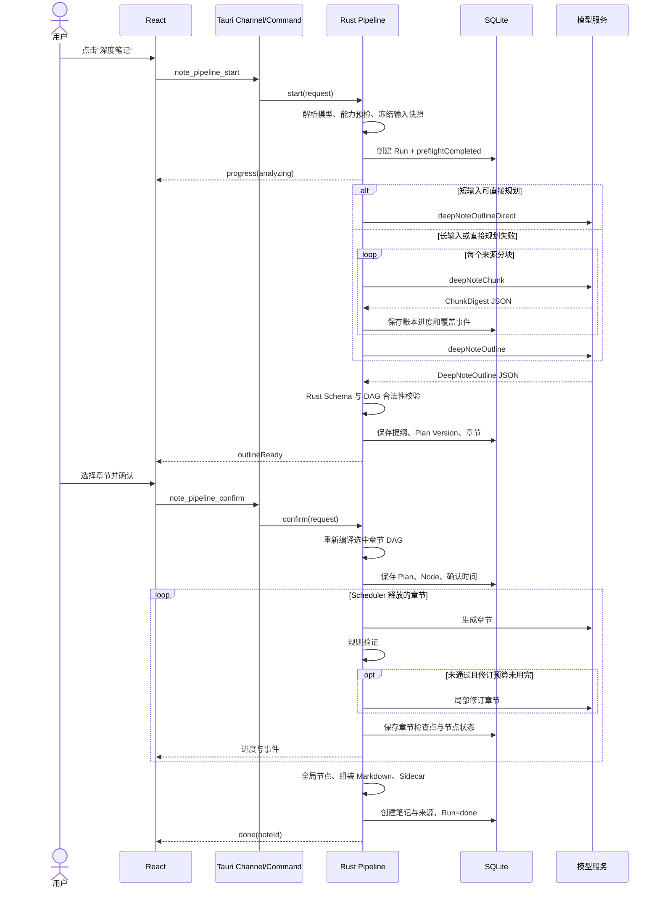
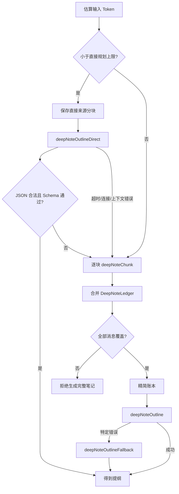
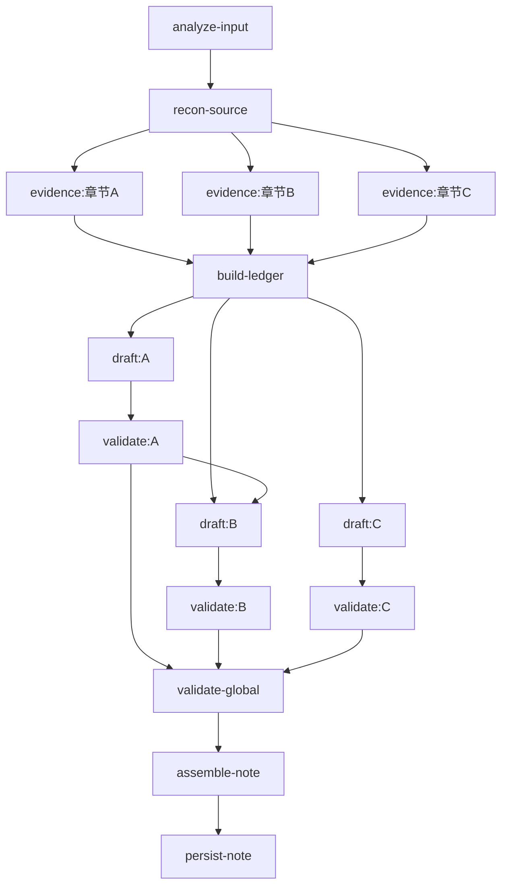
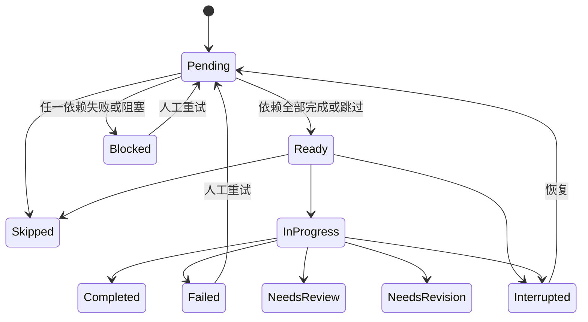
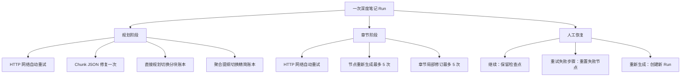
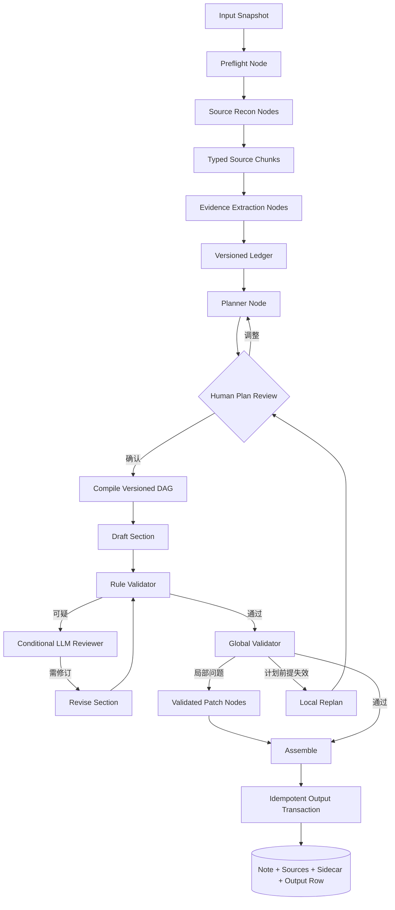

# Mnemora 深度笔记生成系统：现状、链路、DAG、重试与演进审计

> 文档性质：基于当前源码的专题审计，而不是产品宣传稿，也不是对 Plan09 的照抄。
>
> 审计基线：`main` 分支提交 `0bf215d`，应用版本 `0.1.15`，审计日期 `2026-08-21`。
>
> 结论口径：本文把“当前真实实现”“仅有数据结构或表”“旧实现遗留”“规划中的目标”严格分开。凡是没有贯穿生产调用链的能力，不写成“已经完成”。

> 2026-08-21 实施更新：本文最初审计基于提交 `0bf215d`。其后已按 Plan10 打通安全快照恢复、只读附件 Reader、Skill Profile、Source Chunk、Evidence、Ledger、DAG 产物门禁和已有笔记增量检查。下方第 0 节是当前实现增量；文中仍写“附件正文/Skill/Evidence 未打通”的旧段落仅保留为历史审计背景，不再代表最新代码。

---

## 0. 2026-08-21 当前实现增量

深度笔记当前新增了一条明确的安全合同：**Run 开始时冻结来源，恢复时允许尾部追加，但不允许修改冻结前缀。**



最新主链已经实现：

1. `DeepNoteInputSnapshot` 保存有序消息 ID、逐消息 Hash、附件 ID、附件真实字节 Hash、引用和模型快照。
2. 暂停或停止后，只要 A/B/C 不变，新增 D 不阻止恢复；运行时会投影冻结前缀，因此 D 不进入旧 Run。
3. 文本、PDF、DOCX、XLSX 使用 Rust 确定性只读 Reader，不依赖模型 Function Calling；图片使用专门 Vision Source 节点。
4. 有附件时强制走分块 Ledger Planner；Writer 也必须消费附件 Ledger，不能回退为纯对话 transcript。
5. Source Chunk、Evidence、Ledger 已真实写入 SQLite，并由详情接口返回；明确来源无匹配时 Evidence 为 `Insufficient`，不会扩大到全部来源。
6. Verified Evidence ID 会写入 Evidence 节点、章节 `draft/validate` 节点、章节检查点和验证报告，不再用消息 ID 冒充证据 ID。
7. DAG 的 `ReconSource`、`ExtractEvidence`、`BuildLedger` 只有存在真实产物时才完成。
8. Planner/Writer/Reviewer 使用冻结的 Skill Profile：`question-framing`、`knowledge-capture`、`beginner-teaching`、`document-authoring`、`markdown-notes`、`diagram`，图片时增加已默认启用且支持 Notes 的 `visual-evidence-analysis`。
9. 提纲增加隐藏问题、知识缺口、误解、因果链和图形机会；关系复杂的章节优先生成安全 Mermaid。
10. 深度笔记 Reader 使用更小窗口（文本 100 行、Office 50 项、PDF 2 页）并拥有独立 64K 输出上限；截断会阻止覆盖完成，普通 Agent Tool 上限不变。
11. SQLite schema v8 增加 `deep_note_coverage_snapshots`。已有笔记不再只凭最后消息 ID 判断是否可更新，而是校验完整覆盖前缀和附件 Hash。
12. 前后端共同门禁重复生成：`upToDate` 提示最新，`updateAvailable` 询问是否只合入新增消息，`invalidated` 阻止不安全增量并要求明确确认后重新生成。

更新后的层次关系：



仍未完全实现的部分主要是独立全局语义 Reviewer、真正并行执行、跨 Run 解析缓存，以及 `note_pipeline_outputs` 的完整幂等恢复事务。详细实现记录见 `md/modify/04-深度笔记安全恢复与Skill-Tool-DAG增强.md`。

---

## 1. 先给出结论

Mnemora 当前的深度笔记，不是“一次请求让模型输出一篇长 Markdown”，也不是普通 Chat Agent 的 ReAct 循环。更准确的定义是：

> **一个由 Rust 主导、SQLite 持久化、带人工计划确认的 Plan-and-Execute Pipeline；其章节执行顺序由受约束的 DAG Scheduler 管理。**

它同时具备 Workflow 的业务流程特征，但还不是一套通用 Workflow Engine。可以用下面的关系理解：

```text
产品功能：深度笔记
    └─ 外层生命周期：Plan-and-Execute
        ├─ Plan：分析输入、生成结构化提纲、等待用户确认
        └─ Execute：按章节生成、验证、修订、组装、保存
            └─ 内部执行表示：DAG
                └─ 执行器：DeepNoteDagScheduler
```

当前最重要的事实有九条：

1. **Rust 是运行真相，React 不是调度器。** React 发命令、接事件、展示状态；真正的阶段推进、预算、取消、恢复、章节检查点和写库都在 Rust。
2. **存在真实的 DAG Scheduler。** 它会根据依赖释放章节、阻塞下游、恢复中断节点，并把状态写入 SQLite。
3. **当前并没有真实并行。** `maxParallelNodes = 2` 只限制一次取出最多两个 Ready 章节，但后续仍在普通 `for` 循环中逐个 `await`，所以实际是串行执行。
4. **Evidence 与 Ledger 主链已经打通，但全局语义 Reviewer 仍未完成。** Source Chunk、Evidence Artifact 和 Ledger 会真实持久化，准备节点必须能反查产物；当前仍缺少独立的跨章节语义审校与自动 Replan 闭环。
5. **深度笔记使用冻结的阶段级 Skill Profile，但不进入开放式 Tool Loop。** Planner、Writer、Reviewer 会真实注入经过 Notes 安全条件筛选的方法论 Skill；Rust 仍掌握来源、权限、预算和 DAG。
6. **附件正文已经通过受限 Source Recon 进入主链。** 文本、PDF、DOCX、XLSX 由 Rust 本地只读 Reader 解析，图片由 Vision Source 节点分析；有附件时 Planner 和 Writer 必须使用可追溯 Ledger。
7. **DAG 的章节依赖确实发挥作用。** 例如 B 依赖 A 时，`draft:B` 必须等待 `validate:A` 完成，并能得到 A 的有限正文摘录作为依赖上下文。
8. **重试分为多层。** 网络请求重试、节点重新生成、章节语义修订、JSON 修复、规划降载回退、人工恢复和全新重启不是一回事。
9. **当前已经接近“可追溯的本地知识编排管线”，但语义质量闭环仍不完整。** 安全恢复、附件来源、Skill、Evidence 和 DAG 事实链已经建立；独立 Reviewer、Replanner、真正并行和幂等输出仍有明确差距。

### 1.1 本文如何判断“已经实现”

为了避免把设计文档、数据库表或界面文案误认为生产能力，本文采用下面的证据优先级：

```text
生产调用链中的 Rust Service
    > 实际写入/读取 SQLite 的 Repository 方法
    > Tauri Command 与前端事件投影
    > 单元测试和 E2E 测试
    > 仅存在的类型、表、枚举或 Plan 文档
```

本文使用四种状态标签来描述能力：

| 状态 | 判定标准 | 文档中的写法 |
| --- | --- | --- |
| 已打通 | 从入口到结果有真实调用、状态转换和持久化 | “当前生产使用” |
| 有骨架 | 类型、表或节点存在，但主链没有真实执行器 | “结构存在，主链未打通” |
| 遗留实现 | 代码仍在仓库，但生产入口不再调用 | “legacy/旧实现” |
| 目标设计 | 计划或建议中的未来改造 | “建议/目标架构” |

这一区分非常重要。例如，`note_pipeline_evidence` 表存在，不等于系统已经完成逐条证据验证；`ReviewSection` 枚举存在，也不等于每章已经经过独立 Reviewer。后文会反复把“名称”“数据结构”和“真实执行”分开说明。

---

## 2. 零基础解释：为什么不能只请求模型一次

假设一段对话很长，包含用户提问、模型回答、纠错、引用和多个主题。如果直接把全部内容发给模型，并要求“生成一篇完整笔记”，常见问题包括：

- 输入超过模型上下文窗口；
- 中转站处理时间过长，返回 HTTP 504；
- 模型漏掉前面的内容；
- 章节顺序不合理，前置概念在后面才解释；
- 生成到一半失败，无法从断点继续；
- 模型输出格式不合法；
- 用户不喜欢提纲，却只能等整篇生成完再返工；
- 无法知道卡在输入处理、网络请求、章节生成还是写数据库。

因此当前实现把任务拆成多个可观察阶段：



这就是 Pipeline 的价值：把一个不可解释的大请求，拆成可暂停、可恢复、可诊断的步骤。

---

## 3. 它到底是 Workflow、Pipeline、Plan-and-Execute、DAG，还是 Agent

这些词并不互斥，但关注点不同。

| 概念 | 通俗含义 | 当前深度笔记是否符合 |
| --- | --- | --- |
| Pipeline（管线） | 数据依次经过若干处理阶段 | 是，且是最直接的实现形态 |
| Workflow（工作流） | 带状态、等待、人工操作、分支和恢复的业务流程 | 是，但仅为深度笔记专用，不是通用引擎 |
| Plan-and-Execute（先规划后执行） | 先产生结构化计划，再按计划执行 | 是，用户确认提纲后才正式写章节 |
| DAG（Directed Acyclic Graph，有向无环图） | 用节点和依赖表示执行先后关系 | 是，章节依赖由真实 Scheduler 管理 |
| Agent（智能体） | 模型能根据观察动态选择工具、反思和改变动作 | 仅有模型参与，不是开放式 Agent |
| ReAct | Reason + Act + Observe 的开放循环 | 否，深度笔记没有自由 Tool Loop |

### 3.1 为什么它不是普通 Agent

普通 Chat Agent 的关键特征是：模型可以在每一轮选择 Tool，系统执行 Tool 后把结果返给模型，模型再决定下一步。深度笔记则是：

- 节点类型由 Rust 预先限定；
- Prompt 类型固定；
- 模型不能自由新增工具节点；
- 模型不能自行决定“任务完成”；
- 用户在执行前确认计划；
- Rust 规则决定节点状态和持久化。

所以它更接近“LLM 参与的可靠工作流”，而不是“让模型自由行动的通用智能体”。这对笔记生成反而是合理的，因为最终目标和输出格式都很明确，过度开放会增加不确定性、费用和不可恢复性。

### 3.2 为什么它又可以叫 Workflow

当前功能不只是线性函数调用，它包含：

- `awaitingOutline`：等待用户确认；
- `paused`：暂停；
- `cancelled`：停止但保留检查点；
- `error` / `blocked`：失败或阻塞；
- 人工重试、继续、重新生成；
- 章节依赖和失败传播；
- 应用重启后的恢复扫描。

因此 UI 中使用“工作流”这个词没有问题。需要避免的只是把它误解为“项目已经实现任意可视化节点编排平台”。

---

## 4. 系统层次图



各层职责：

| 层 | 主要职责 | 不应承担的职责 |
| --- | --- | --- |
| React | 操作入口、进度展示、提纲选择、日志、预览、备用模型入口 | 不直接推进 DAG，不作为状态真相 |
| Tauri Command | IPC 参数边界和调用转发 | 不保存业务状态 |
| Rust Service | 业务编排、模型调用、预算、恢复、检查点、持久化 | 不依赖页面是否仍挂载 |
| Scheduler | 依赖判断和节点状态转换 | 不理解 UI，也不自由调用模型 |
| Provider 层 | 协议适配、网络重试、超时、取消、用量记录 | 不决定笔记业务阶段 |
| SQLite | Run、Plan、Node、Section、Event 和笔记来源的持久真相 | 不生成语义内容 |

---

## 5. 从用户点击到笔记落库的端到端链路

### 5.1 前端入口

前端 `useNoteActions.startDeepNote(conversationId)` 会先在内存中建立一个“启动中”的引用，避免同一时刻重复启动，然后调用：

```text
startNotePipeline
    → invoke("note_pipeline_start")
    → Rust note_pipeline::start
```

Tauri `Channel<NotePipelineProgress>` 用于接收实时事件。事件类型包括：

- `progress`
- `outlineReady`
- `paused`
- `done`
- `cancelled`
- `error`

前端还会以 250 ms 的合并刷新策略调用 `getNotePipelineDetail`，读取 SQLite 中更完整的 Run、节点、章节、预算和事件记录。Channel 用于“及时通知”，SQLite 详情用于“恢复和校准事实”。

这里存在两条互补的数据通道：

| 通道 | 优点 | 局限 | 当前用途 |
| --- | --- | --- | --- |
| Tauri Channel | 延迟低，可以立刻显示模型请求、重试和阶段变化 | 页面错过事件或重新挂载后不能只靠它恢复全部历史 | 实时进度通知 |
| SQLite Detail | 可持久化、可重读、可在应用重启后恢复 | 需要主动刷新，实时性略低 | 事实校准、日志、检查点与恢复 |

因此前端不是看到一条事件就盲目把状态永久改掉，而是收到事件后触发合并刷新，再以持久化详情为准。这个“快通道通知 + 慢通道校准”的设计，是当前 UI 不容易与后端任务状态长期漂移的重要原因。

### 5.2 后端启动

`note_pipeline::start` 的核心顺序如下：

1. 从会话仓库读取完整会话；
2. 解析深度笔记使用的模型；
3. 执行能力预检；
4. 读取输出上限、思考开关和网络重试设置；
5. 创建 `DeepNoteInputSnapshot`；
6. 计算快照 Hash；
7. 建立 `DeepNoteRuntimeState`；
8. 在 SQLite 创建 `note_pipeline_runs` 行；
9. 记录 `preflightCompleted` 事件；
10. 把阶段改为 `analyzing`；
11. 在 Tauri 后台任务中启动分析。

模型解析优先级为：

```text
专用笔记模型
    ↓ 不可用
当前会话模型
    ↓ 不可用
全局默认模型
    ↓ 仍不可用
拒绝启动
```

系统不会静默修改用户模型或自动替换 Provider。

### 5.3 阶段合同：每一步到底读什么、写什么

| 阶段 | 主要输入 | 主要动作 | 持久化结果 | 是否模型调用 |
| --- | --- | --- | --- | --- |
| Preflight | 会话、模型配置、附件元数据 | 解析模型、检查 Vision/Tool 能力 | Run、Preflight、Input Snapshot、事件 | 否 |
| Context Preparation | 消息文本、上下文窗口 | Token 估算、直接模式或分块、覆盖核对 | Source Chunk、Context Budget、Ledger、事件 | 长输入时是 |
| Planning | 完整短输入或精简 Ledger | 生成并校验 `DeepNoteOutline` | Outline、Runtime 中的 Plan 草案 | 是 |
| Human Review | Outline、用户章节选择或调整要求 | 调整计划或确认范围 | Selected IDs、确认后的 Plan Version、DAG Node 行 | 调整时是，确认本身否 |
| Drafting | 章节计划、来源上下文、Ledger、依赖章节 | 写初稿、规则校验、必要时修订 | Section Checkpoint、DAG 状态、事件 | 是 |
| Global/Assembly | 已完成章节 | 拓扑排序、组装 Markdown、生成 Sidecar | Runtime、组装节点状态 | 当前主要为本地逻辑 |
| Persisting | Markdown、来源、Sidecar | 创建笔记、关联来源、标记 Run 完成 | `library_notes`、`note_sources`、Run Done | 否 |

这个表也揭示了当前的一个架构事实：UI 展示为六个阶段，但数据库阶段枚举、DAG 节点和具体模型调用并不是严格一一对应。UI 阶段是面向用户的投影；Rust Phase 是任务生命周期；DAG Node 是执行依赖；模型 Operation 是某次远程语义工作。它们必须相关联，但不应混成同一个概念。

### 5.4 完整时序图



---

## 6. 输入快照：为什么恢复时不会混入新消息

`DeepNoteInputSnapshot` 保存的不是完整正文副本，而是当前执行边界的身份信息：

- 会话修订时间；
- 消息 ID 列表；
- 附件 ID 列表；
- 附件元数据 Hash；
- 选中文献 ID；
- 选中笔记 ID；
- 模型快照和上下文窗口；
- 权限模式；
- 创建时间。

正文并非完全没有持久化：规划阶段会把当前使用的对话片段写入 `note_pipeline_source_chunks.excerpt`，章节正文也会单独写入 `note_pipeline_sections`。更准确地说，Input Snapshot 本身负责“输入身份锁定”，Source Chunk 和 Section Checkpoint 负责“内容检查点”。当前的问题是恢复校验仍主要比较会话修订和附件元数据 Hash，而不是对所有已消费正文建立统一的内容寻址清单。

恢复时 `validate_recovery_snapshot` 会重新计算当前快照并比较。如果会话、附件或引用已经变化，旧 Run 不会混用新数据，而是要求重新生成。

这解决了一个很重要的问题：

```text
旧计划基于消息 A、B、C
用户后来修改或增加了 D
如果直接继续旧 Run，计划、来源和正文就不再对应
```

当前选择是“拒绝混用”，而不是悄悄把 D 塞进旧计划。这有利于可重复性和错误排查。

限制也要说明：附件 Hash 当前基于附件 ID、名称、大小和存储路径计算，并不是重新读取文件内容后计算字节级 SHA-256。因此，如果文件在原位置被同大小替换，理论上可能无法识别。由于附件通常被复制进应用管理目录，风险较低，但仍不等于严格的内容寻址。

---

## 7. “语义分析”“语义计划”“语义调用”分别是什么意思

这三个词容易混淆。

### 7.1 语义分析

“语义”指内容的意思、概念关系、事实、冲突和用户意图，而不是字符长度、文件大小这类机械信息。

当前语义分析主要有两条路径：

1. 对短输入，不单独建立 `ChunkDigest`，而是把完整的预算内转写直接交给 Planner；此时“理解内容”和“生成提纲”发生在同一次模型调用中；
2. 对长输入，先逐块提取 `ChunkDigest`，形成知识账本，再由 Planner 根据账本生成提纲。

每个 `ChunkDigest` 包含：

- 摘要；
- 规范术语；
- 已验证事实；
- 已覆盖主题；
- 未解决问题；
- 冲突；
- 全局约束；
- 真实消息 ID。

所以“正在分析知识结构”不是一个神秘黑盒步骤，而是“把原始对话转成可规划的语义材料”。

### 7.2 语义计划

语义计划就是 `DeepNoteOutline`。它不是底层线程或数据库任务列表，而是面向用户和模型的内容计划：

- 笔记目标；
- 目标读者；
- 内容范围；
- 标题和摘要；
- 薄弱点；
- 证据策略；
- 章节；
- 章节依赖；
- 来源消息；
- 成功标准；
- 是否允许 AI 补充。

“语义”强调章节描述的是知识关系；“计划”强调它尚未等同于执行。用户确认后，Rust 才把它编译为底层 DAG。

### 7.3 语义调用

当前 UI 中的“语义调用”是一次高层模型任务调用的预算计数。下列动作各消耗一次：

- 一个来源分块提取；
- 一次分块 JSON 修复；
- 一次直接提纲生成；
- 一次账本提纲生成；
- 一次精简提纲回退；
- 一次章节初稿；
- 一次章节语义修订。

它与 HTTP 自动重试不同。一次语义调用在网络层可能发生：

```text
语义调用 1 次
    ├─ HTTP 首次请求
    ├─ 网络重试 1
    ├─ 网络重试 2
    └─ 最终成功
```

因此网络重试不会重复增加 `semanticCallsUsed`。这种分层计数能避免把“网络不稳定”和“工作流主动做了多少次模型工作”混在一起。

需要改进的是命名。“语义调用”对普通用户不直观，更清晰的 UI 文案可以是“模型任务调用”，旁边再解释网络重试单独计算。

### 7.4 四类对象不要混淆

| 对象 | 它回答的问题 | 示例 |
| --- | --- | --- |
| Workflow Phase | 整个任务现在处于哪一类生命周期阶段 | `analyzing`、`drafting`、`persisting` |
| DAG Node | 哪个依赖单元可以执行、完成或被阻塞 | `draft:sec-2`、`validate:sec-2` |
| Semantic Call | 工作流主动要求模型完成了几次高层语义任务 | 分块摘要、提纲、章节初稿、章节修订 |
| HTTP Attempt | 某一次模型任务在网络层实际发出了几次请求 | 首次请求、429 后重试、连接失败后重试 |

举例来说，`draft:sec-2` 是一个 DAG 节点；它的一次执行可能先产生一次章节初稿语义调用。如果该调用遇到两次临时网络错误后成功，则仍是 1 次语义调用、3 次 HTTP Attempt。若正文没通过规则，又触发一次章节修订，则语义调用变为 2 次。UI 若把这四个数字混为“重试次数”，用户就无法判断问题究竟来自网络、模型质量还是 DAG 恢复。

---

## 8. 上下文预算与长对话处理

### 8.1 Token 估算

当前采用轻量估算：

```text
ASCII 字符约 4 个字符 = 1 Token
非 ASCII 字符约 1 个字符 = 1 Token
```

它不是各 Provider 的精确 tokenizer，但速度快、无需引入每个模型的分词器，适合作为安全预算。

### 8.2 已知上下文窗口

若模型数据库或用户配置提供上下文窗口 `window`，系统会预留：

- Planner 输出 Token；
- 4096 Token Prompt 固定开销；
- 至少 4096 Token 安全余量，或窗口的约 1/12；
- 直接 Planner 输入最多 3000 Token。

直接输入之所以限制得很小，是为了降低中转站长请求的首字节等待和 504 风险，并保证相同来源仍能在单章生成时复用。

### 8.3 未知上下文窗口

未知时使用较保守的 8000 Token 分块目标，不伪造模型支持超长上下文。

### 8.4 直接规划与分块规划



关键保护是“覆盖门禁”：最多允许 96 个分析分块；如果还有消息未处理，系统会报错，不会把遗漏内容伪装成完整笔记。

### 8.5 分块账本的恢复

每完成一个分块就更新：

- `processedChunkCount`；
- `processedMessageCount`；
- Ledger；
- `contextChunkCompleted` 事件。

暂停或崩溃后，只要分块策略和输入没有变化，就可以从未完成分块继续，而不是重新处理全部会话。

---

## 9. 提纲生成、确认与编译

### 9.1 结构化输出

Planner 被要求只输出 JSON。Rust 会：

1. 去掉可能存在的 Markdown 代码围栏；
2. 反序列化为 `DeepNoteOutline`；
3. 清理标题和字段；
4. 限制章节数为 1 到 40；
5. 删除不存在的消息 ID；
6. 检查章节 ID 唯一；
7. 检查依赖是否存在、是否指向自身；
8. 检查章节依赖无环。

模型不支持原生 Structured Outputs 时，也不会把返回内容直接当作可信计划，而是由 Rust Schema 兜底。

### 9.2 用户确认

模型生成提纲后，Run 进入 `awaitingOutline`。用户可以：

- 选择保留哪些章节；
- 提交补充要求重新规划；
- 确认并执行；
- 停止任务。

这相当于一个轻量的 Plan Mode：用户审核语义计划，不需要编辑底层 DAG。

### 9.3 一个真实缺陷：调整提纲不等于完整 Plan Version 历史

分析完成时 `compile_plan` 使用 `saved.current_plan_version + 1` 计算版本，但此时尚未调用 `save_note_pipeline_plan_version` 更新 Run 的 `current_plan_version`。实际的 Plan Version 主要在用户确认时保存。因此，多次在 `awaitingOutline` 阶段调整提纲，可能反复得到相同版本号，旧的未确认提纲也会被覆盖。

这说明当前满足的是“确认后的执行版本”，还不是“每一次规划草案都可回溯的不可变版本历史”。

---

## 10. DAG 是如何编译出来的

`compile_plan()` 会生成以下结构：



如果章节 B 的 `dependsOn = [A]`，编译结果不是 `draft:B → draft:A`，而是：

```text
draft:B depends on validate:A
```

这意味着 A 不仅要写完，还必须经过当前的章节验证节点，B 才能开始。

### 10.1 节点状态



`NeedsReview` 和 `NeedsRevision` 状态在 Scheduler 转移规则中存在，但当前生产主链没有真实使用它们；它们属于预留能力。

---

## 11. DAG 是否真的发挥了作用

答案是：**发挥了，但只发挥了其中一部分。**

### 11.1 已真实发挥的作用

1. **依赖合法性检查**：拒绝重复节点和悬空依赖。
2. **无环保证**：章节计划有环时拒绝执行。
3. **Ready 释放**：只有依赖完成的章节才进入 Ready。
4. **失败传播**：上游失败后，下游变为 Blocked。
5. **独立分支保留**：A 分支失败时，不依赖 A 的 C 仍可继续。
6. **恢复**：`InProgress` / `Interrupted` 节点恢复为 Pending，再重新计算 Ready。
7. **完成章节复用**：SQLite 中已完成章节会被重新装入，并同步标记 `draft` 和 `validate` 节点完成。
8. **依赖产物注入**：下游章节会收到依赖章节最多约 2400 字符的摘录。
9. **稳定拓扑组装**：最终按依赖合法且尽量保持计划顺序的拓扑顺序组装。

### 11.2 尚未真实发挥或仅形式化的部分

#### A. 没有真实并行

Scheduler 会执行：

```text
ready_section_ids(maxParallelNodes)
```

默认最多取两个章节，但代码随后是：

```text
for section_id in ready:
    await execute_dag_section(section_id)
```

没有 `join!`、`JoinSet` 或并发 Future。因此 UI 中不应把它描述为“2 路并行”；准确说法是“每批最多选择两个可执行节点，目前逐个执行”。

#### B. 准备节点不是由 Scheduler 实际执行

`complete_preparation()` 会把这些节点直接标为 Completed：

- `analyze-input`
- `recon-source`
- `evidence:*`
- `build-ledger`

这表示 DAG 是在提纲已经分析完成后才进入正式 Scheduler。它能描述前置阶段，但不能逐个调度和重放这些准备节点。

#### C. Evidence 节点已经有真实产物门禁

当前会为每个章节构建并持久化 `DeepNoteEvidenceArtifact`。`evidence:*` 只有拿到 Verified Evidence ID 才能完成；若章节声明了明确来源但没有匹配 Source Chunk，则 Evidence 保持 `Insufficient`，不会扩大到全部来源。Evidence ID 同时写入节点和章节检查点，便于反查。

#### D. Validate 节点没有独立执行器

真实规则验证发生在 `execute_dag_section` 内。返回成功后，外部才把 `validate:section` 从 InProgress 立即切到 Completed。因此 Draft 与 Validate 在数据图上分离，在执行代码上仍耦合。

#### E. 全局验证是状态占位

`validate-global` 当前只是从 Ready 切到 InProgress 再切到 Completed，没有执行跨章节事实一致性、术语统一、重复率或引用覆盖审查。

#### F. Review、Revise、ApplyPatch、Replan 尚未完整接入

节点枚举和预算中已经预留：

- `ReviewSection`
- `ReviseSection`
- `ApplyPatch`
- `replanLimit = 4`
- `replansUsed`

但 `compile_plan()` 没有生成这些节点，`replansUsed` 也没有生产代码更新。当前的章节修订是 `execute_dag_section` 内部循环，不是独立 DAG 节点；`replanning` 阶段基本只存在于状态枚举和恢复分支中。

因此最准确的评价是：

> DAG 已从“仅画图”升级成真实的章节依赖调度和恢复骨架，但还没有成为覆盖分析、证据、审查、修订和重规划的完整执行图。

---

## 12. 章节生成、验证和修订

### 12.1 章节输入

每个章节 Prompt 包含：

- 全局标题和摘要；
- 所有章节的简要目录；
- 当前章节的结构化计划；
- 精简知识账本；
- 当前章节允许使用的原始消息或账本摘要；
- 已完成依赖章节的摘录。

如果原始来源超过单章预算，就使用可追溯的 Ledger 摘要；如果既没有原始来源也没有摘要，则拒绝生成该章。

### 12.2 确定性验证

当前 `validate_section_markdown` 不调用另一个 Reviewer 模型，而是执行本地规则：

- 正文不能为空；
- 必须以 `## 章节标题` 开头；
- 正文至少约 180 字符；
- 不能包含全文 H1；
- 计划需要 AI 补充时必须标注“AI 补充背景”；
- 失败占位文本不能通过；
- 根据成功标准关键词给出覆盖警告。

其中“错误”会导致不通过，“成功标准可能未覆盖”目前只是 Warning，不会阻止 Completed。`checkedEvidenceIds` 现在记录本章 Verified Evidence ID，而不是消息 ID；但 Evidence 当前仍是按章节证据要求与 Source Chunk 绑定的结构化产物，不应误解为对正文每个自然语言 Claim 都完成了独立 NLI 级验证。

### 12.3 章节修订

初稿未通过规则时，会把以下内容发给修订 Prompt：

- 章节计划；
- 当前正文；
- 验证报告。

最多修订 5 次。需要注意，`revision_count` 是跨节点尝试累计的：一旦已经达到 5 次，后续节点尝试不会再获得新的修订机会，只能重新生成初稿。

### 12.4 节点尝试

每章最多 5 次节点尝试。一次节点尝试意味着“重新请求章节初稿”，其内部还可能进行最多 5 次修订。理论最坏情况下单章可能产生较多模型调用，因此全局语义调用预算会进一步限制实际规模。

### 12.5 当前质量边界

当前能保证“格式基本合格”，但不能强保证：

- 每个核心论断都可定位到真实片段；
- 所有成功标准都被语义覆盖；
- 不同章节之间没有事实冲突；
- Mermaid 一定可解析；
- 表格、代码、公式一定正确；
- AI 补充事实已外部核验。

---

## 13. 重试、修订、回退与恢复：完整分层

“重试”至少有七种含义。



### 13.1 Provider 网络自动重试

- 来源：应用设置 `retry_attempts`；
- 当前 Run 接受 0 到 5；0 表示只发送首次请求，不进行网络自动重试；
- 语义是“首次请求之外最多重试 N 次”；
- 因此默认 5 时，最多可能发送 6 次 HTTP 请求；
- 支持指数/策略等待和 `Retry-After`；
- CancellationToken 可以中断请求和退避等待。

数据建模仍需区分下面两个概念：

```text
retryEnabled = false
retryAttempts = 5  // 保留用户偏好，但本次 Effective Max Retries = 0
```

当前采用后者：Run 字段允许 `0..=5`，并已有“关闭自动重试仍能启动深度笔记”的回归测试。长期仍可拆分“用户配置档位”和“本次生效重试数”，使诊断语义更直观。

并非所有错误都重试：

- ProviderUnavailable 不重试；
- 提纲聚合阶段的 UpstreamTimeout 不在原大请求上盲目重试，而是尽快返回上层，切换更小 Payload；
- 其他错误还要经过统一 `should_retry` 判断。

### 13.2 JSON 修复

来源分块返回非法 JSON 时，系统会消耗一次新的语义调用，用更严格 Prompt 再请求一次。它不是网络重试，因为模型需要完成一项新的“修复结构”任务。

直接提纲返回可请求但 Schema 不合法时，当前会进入账本路径；最终聚合提纲如果返回非法 JSON，则直接失败，并没有通用的最终提纲 JSON 修复循环。

### 13.3 规划降载回退

遇到超时、连接、Provider 或上下文长度错误时：

```text
直接完整输入提纲
    → 分块知识账本提纲
    → 精简账本提纲
```

这不是降低任务类型，也不是生成简版笔记，而是缩小 Planner Payload。章节和最终输出目标仍保持深度笔记。

### 13.4 节点尝试

单章最多 5 次初稿尝试。每次都消耗语义调用，并且每次底层还可能发生 HTTP 重试。

### 13.5 章节语义修订

初稿格式或规则不合格时最多修订 5 次。它与重新生成初稿不同：修订会携带当前正文和验证报告，目标是局部修正。

### 13.6 人工继续

用于 `paused` 或 `cancelled`：

- 暂停后继续：从已有状态恢复；
- 停止后继续：增加 `execution_version`，保留已完成章节和失败状态；
- 不重置成功检查点。

### 13.7 人工重试失败步骤

仅用于 `error` 或 `blocked`：

- 失败、阻塞、待审查、待修订、中断的 Section/Node 重置为 Pending；
- 成功章节保持不变；
- 按当前已用次数额外预留最多 12 次语义调用，单 Run 硬上限 640；
- 单个 Run 最多 5 次人工恢复，之后必须重新生成。

### 13.8 重新生成

重新生成会：

- 把旧 Run 停止；
- 使用当前会话内容重新做能力预检和输入快照；
- 创建全新 Run ID；
- 不复用旧计划和旧失败状态。

它适合输入已变化、想切模型、旧计划方向错误或恢复次数耗尽的情况。

### 13.9 重试上限总表与最坏调用量

| 层级 | 当前上限 | 是否消耗语义调用 | 是否重用旧结果 |
| --- | ---: | --- | --- |
| 单次语义调用的 HTTP 自动重试 | 设置值 0 到 5 次生效；默认开启时为 5 | 否 | 重发同一高层请求 |
| Chunk JSON 修复 | 1 次额外修复调用 | 是 | 携带同一分块并强化 JSON 约束 |
| Planner 精简回退 | 1 次网络重试档位，并产生新的回退语义调用 | 是 | 使用更小的 Ledger Payload |
| 单章初稿节点尝试 | 最多 5 次 | 是 | 每次重新生成初稿 |
| 单章语义修订 | 跨初稿尝试累计最多 5 次 | 是 | 携带当前正文与验证报告 |
| 单 Run 人工恢复 | 最多 5 次 | 本身不消耗；恢复后的节点会消耗 | 保留成功检查点 |
| 全新重新生成 | 无旧 Run 内次数复用 | 从零重新计算 | 创建新 Run，不复用旧计划 |

“节点尝试 5 次 + 修订 5 次”不是每次初稿后都重新获得 5 次修订，因此单章工作流层模型任务的理论上限通常是 10 次，而不是 30 次：最多 5 次初稿，加上跨所有尝试累计最多 5 次修订。若每个模型任务都在网络层使用默认 5 次重试，则极端情况下单章可能发出最多约 60 次 HTTP 请求。不过全局 `semantic_call_limit`、不可重试错误、成功提前退出和 Planner/章节的特定 504 策略通常会让实际数量远低于这个上限。

这个最坏值说明为什么必须同时展示：语义预算、网络尝试、章节尝试和修订计数。只显示一个“已重试 5 次”既无法估算成本，也无法判断当前是不是在重复做同一类工作。

---

## 14. 暂停、停止、遗弃的区别

| 操作 | 是否保留检查点 | 能否继续 | 是否取消当前网络请求 | 典型场景 |
| --- | --- | --- | --- | --- |
| 暂停 | 是 | 是 | 是 | 稍后继续同一任务 |
| 停止/取消 | 是 | 是，可“从检查点继续” | 是 | 用户暂时不想运行 |
| 失败 | 是 | 可重试失败步骤 | 请求已经失败 | 网络、模型、预算或验证错误 |
| 遗弃 | 保留诊断记录 | 否 | 是 | 来源会话被删除 |
| 重新生成 | 旧 Run 保留 | 新建 Run | 旧 Run 先停止 | 改用新输入或新模型 |

### 14.1 暂停如何工作

暂停不是把 Tokio Future 冻结在内存里。流程是：

1. 数据库先把 Run 标为 `paused`；
2. 取消当前 CancellationToken；
3. 正在运行的 DAG 节点变为 `Interrupted`；
4. 已完成章节和预算写入 SQLite；
5. 继续时把中断节点改回 Pending，重新计算 Ready。

这是“检查点式暂停”，比保存一个不可序列化的内存调用栈可靠。

### 14.2 停止后的部分草稿语义

若取消发生在章节循环中，代码具备组装已完成章节为部分草稿的路径。但若 CancellationToken 在具体模型调用中返回后直接触发错误路径，是否一定能进入部分组装取决于中断位置。因此“停止后必然保存部分草稿”仍应作为需要持续回归测试的行为，而不是仅凭 UI 文案假设。

---

## 15. Skill 与 Tool：当前到底能不能调用

### 15.1 结论表

| 能力 | 普通 Chat Agent | 深度笔记当前实现 |
| --- | --- | --- |
| 用户手动选择 Skill | 支持 | 不直接沿用用户本轮选择；使用冻结的阶段级 Profile |
| 自动 Skill 命中 | 支持 Chat 场景的注册表逻辑 | 不做自由搜索；Run 创建时按 Notes 安全条件装载固定 Profile |
| `search_skills` / `skill` Tool | 支持 | 禁用 |
| 附件读取 Tool | 支持 | Rust 通过受限只读 Gateway 确定性调用 |
| PDF/DOCX/XLSX Tool | 支持 Chat Agent | 复用同一 Reader，但不开放给模型自由选择 |
| 模型自由 Tool Loop | 支持有 Tool 能力的普通 Chat | 不支持 |
| 图片来源 | 普通 Chat 可直接发送图片 | 专门 Vision Source 节点，要求模型具备 Vision |
| 固定 Rust 本地处理 | 有 | 有，负责预检、Source Recon、证据、DAG 和持久化 |
| Reasoning/Thinking | 可按模型输出流展示 | 只把全局开关传给模型，不展示深度笔记调用的 reasoning |

### 15.2 Skill 如何真实进入深度笔记

深度笔记仍把模型请求标为辅助调用，因此不会开放普通 Chat 的 Skill Tool Loop：

```text
operation = "deepNote"
activated_skill_ids = []
slash_skill_id = None
```

但这不等于 Skill 正文没有生效。Run 创建时会从本地仓库读取满足以下条件的 Skill：

- 已启用；
- `supported_modes` 包含 `notes`；
- 风险不是 High；
- 不要求禁用模型调用。

系统保存 Skill ID、版本、Content Hash 和已渲染正文，在 Planner/Writer/Reviewer 对应模型请求前把冻结正文合并进系统 Prompt，并记录 `skillProfileLoaded` 与 `skillApplied`。因此 Skill 是“阶段方法论快照”，不是运行时自由工具。

当前固定 Profile 包含 `question-framing`、`knowledge-capture`、`beginner-teaching`、`document-authoring`、`markdown-notes`、`diagram`；含图片时 Reviewer 额外加载已默认启用且支持 Notes 的 `visual-evidence-analysis`。

### 15.3 这是否意味着“完全没有 Tool”

需要区分两种含义：

1. **模型自由工具调用（Model Tool Calling Loop）**：当前深度笔记没有；
2. **Rust 确定性 Tool Gateway**：有，固定调用 `read_attachment_text`、`read_pdf_pages`、`read_docx_blocks`、`read_xlsx_rows`。

Gateway 复用普通 Agent Reader 的参数白名单、附件路径边界、超时和解析器，但不暴露网络、工作区、记忆、笔记写入、Skill 脚本或任意 Tool 搜索。每次真实执行写入 `toolStarted` / `toolCompleted` / `toolFailed`。

### 15.4 当前附件链路

预检已经将模型能力与应用 Reader 能力拆开：

- 文本、PDF、DOCX、XLSX 由本地 Reader 处理，不要求模型支持 Function Calling；
- 图片仍要求模型支持 Vision；
- 未知附件在启动前拒绝。

来源进入语义上下文的情况如下：

| 来源 | 是否进入当前深度笔记模型上下文 | 实际内容 |
| --- | --- | --- |
| 用户/助手已完成消息正文 | 是 | `message.content` |
| 文献引用 | 是，但仅限消息中已经保存的引用片段 | 标题、页码、`reference.text` |
| 笔记引用 | 是，但仅限消息中已经选择的片段 | 笔记标题、`selected_text` |
| 会话关联但未在消息中引用的文献 | 否 | 只有 Library Item ID 进入 Input Snapshot，用于身份和恢复检查 |
| 文本/代码附件 | 是 | 带行号的 Text Source Chunk |
| PDF | 是 | 带页码的 PDF Source Chunk |
| DOCX | 是 | 带 block 编号的 DOCX Source Chunk |
| XLSX | 是 | 带 Sheet/行号的 XLSX Source Chunk |
| 图片 | 是 | 单图 Vision Source 节点生成的可核查描述与不确定项 |
| 助手历史 Reasoning | 否 | 深度笔记的 `transcript(..., false)` 明确排除；普通消息最终正文仍会纳入 |

Reader 采用文本 100 行、DOCX/XLSX 50 项、PDF 2 页的小窗口，并仅为深度笔记 Gateway 放宽到 64K 字符输出上限；若输出仍发生截断，该范围直接失败，不会标成完整覆盖。附件 MIME 和扩展名规则在预检与 Reader 中保持一致。

当前附件链路是：

```text
受限附件 Reader / Vision Source
    → Source Chunk
    → 内容 Hash、页码/工作表/段落定位
    → Evidence / Ledger
    → Planner 和章节按需消费
```

### 15.5 仍然保留的 Tool/Skill 边界

- 不开放网络搜索或任意工作区读取；
- 不允许模型写笔记、改记忆或改变 DAG；
- 不执行 Skill 附带脚本；
- 新 Skill 版本只影响新 Run，暂停中的旧 Run 使用冻结快照；
- 图片分析依赖模型真实收到图片且具备 Vision，不能根据文件名假装读取。

---

## 16. 数据库、检查点和可观测性

### 16.1 当前表结构

| 表 | 当前用途 | 真实使用状态 |
| --- | --- | --- |
| `note_pipeline_runs` | Run 阶段、模型、预算、快照 Hash、错误、Sidecar | 生产使用 |
| `note_pipeline_sections` | 章节计划、Markdown、状态、尝试、修订、验证 | 生产使用 |
| `note_pipeline_plan_versions` | 已确认计划及编译 DAG | 生产使用，但草案历史不完整 |
| `note_pipeline_nodes` | 节点依赖和状态投影 | 生产写入 |
| `note_pipeline_source_chunks` | 对话与附件分块、位置及原文摘录 | 生产写入并由详情接口返回 |
| `note_pipeline_events` | 阶段、模型调用、DAG 和恢复事件 | 生产使用 |
| `note_pipeline_evidence` | 章节 Claim、Source Chunk、支持级别与状态 | 生产写入并由详情接口返回 |
| `note_pipeline_ledgers` | 版本化 Ledger 与 Patch | 生产写入，详情优先读取持久化版本 |
| `note_pipeline_outputs` | 幂等最终输出 | 表存在，主链未写入 |
| `deep_note_coverage_snapshots` | 已有笔记的逐消息/附件安全覆盖快照 | schema v8 生产使用；接受增量提案时原子推进 |
| `library_notes` / `note_sources` | 最终 Markdown 和章节级来源 | 生产使用 |

一个重要设计现状是：完整 Runtime State 被 JSON 序列化进 `note_pipeline_runs.preflight_json`。字段名沿用了早期含义，但现在里面不只存 Preflight，还包含 Input Snapshot、Plan、Budget、Ledger 和 Context Budget。功能上可用，命名和数据演进上不够清晰。

### 16.2 事件记录

系统会保存：

- 阶段进度；
- 模型请求开始；
- 重试等待；
- 模型调用完成/失败及耗时；
- 上下文分块完成；
- 覆盖完成；
- 提纲就绪；
- 计划确认；
- DAG 节点开始、完成、失败；
- 暂停、继续、重试、重新生成；
- Run 完成或失败。

`get_detail` 最多返回最近 500 条事件。前端根据事件推导“卡在模型请求”“等待重试”“本地步骤静默”等诊断。

### 16.3 当前事件缺口

生产 DAG 路径主要记录 `dagNodeCompleted`，而前端 `describeNotePipelineEvent` 对旧事件 `sectionCompleted` / `sectionFailed` 有专门中文解释，却没有为 `dagNodeStarted` / `dagNodeCompleted` / `dagNodeFailed` 提供同等级解释。结果是日志里可能直接出现技术事件名。

此外，E2E 测试仍要求 `sectionCompleted`，但该事件只出现在已标记 `dead_code` 的 legacy drafting 路径中。这说明测试断言与生产 Scheduler 路径存在漂移，必须修正。

### 16.4 Task Center 的角色

右上角任务中心使用 `projectDeepNoteTaskRun` 把同一份 Run Detail 投影为六步工作流：

1. 输入与能力预检；
2. 准备规划输入；
3. 生成知识结构与提纲；
4. 确认语义计划；
5. 生成并验证章节；
6. 组装并保存笔记。

它只是只读投影，不是第二套 Scheduler。这个设计是正确的，避免页面组件和任务中心各自维护一套互相冲突的状态机。

---

## 17. 输出、来源和 Sidecar

### 17.1 Markdown

最终内容由：

- H1 标题；
- 提纲摘要；
- 各章节 Markdown；
- 每章来源说明；

组成。章节按稳定拓扑顺序组装，而不是简单按完成时间排序。

### 17.2 来源

`note_sources` 会记录章节与消息 ID 的关联。若章节没有显式消息 ID，则记录为整个会话来源；AI 补充会增加 `AiSupplement` 来源。

当前来源是“章节级来源提示”，不是严格 Claim-level Citation。一个章节引用了三条消息，不代表正文中每个事实都已分别绑定到某条消息。

### 17.3 Sidecar

Sidecar 保存：

- Run ID；
- Plan ID 和版本；
- 输入快照 Hash；
- 模型；
- 章节 ID；
- 依赖；
- 来源消息 ID；
- 正文 Hash；
- 是否验证；
- 是否 AI 补充。

Sidecar 现在保存计划、章节、来源消息、Verified Evidence ID 和正文 Hash；更完整的 Claim/Evidence 内容、Skill 版本和 Tool 事实分别保存在 `note_pipeline_evidence`、运行时 Skill Profile 快照和事件表中，但尚未全部汇总进单一 Sidecar，也还没有独立的全局语义验证报告。

### 17.4 幂等性缺口

Run 创建了 `idempotency_key`，数据库也有 `note_pipeline_outputs` 表和唯一索引，但最终路径直接调用 `create_note_with_sources`，没有写入 `note_pipeline_outputs`。如果应用在“笔记已经创建”与“Run 标为 Done”之间崩溃，恢复理论上可能重复创建笔记。

这意味着当前拥有“幂等设计字段”，但没有完成最终写入事务和输出表闭环。

---

## 18. 当前前端体验

深度笔记已经使用独立工作区，而不是塞进 Chat 消息内部。工作区包含：

- 顶部阶段和控制按钮；
- 当前运行诊断与超时倒计时；
- 章节进度；
- 可折叠、内部滚动的语义计划；
- 运行记录；
- 可折叠内容预览；
- 右侧六阶段工作流；
- 模型和 API 标识；
- 上下文覆盖率；
- 语义调用预算；
- 章节检查点；
- 执行图；
- 失败时切换备用模型并重新开始。

亮点是把“覆盖已完成”和“提纲仍在等待模型”分开显示，避免用户误以为右侧覆盖进度完成就代表 Planner 已完成。

当前仍有三个 UI 真实性问题：

1. 右侧显示 `maxParallelNodes` 的潜在概念时必须避免暗示真实并行；
2. 已修复：右侧现在明确区分“模型 Tool 能力”与“本地 Reader”，并以 `支持 / 不支持 / 未识别` 三态展示；它不再暗示深度笔记启用了开放 Tool Loop；
3. DAG 节点使用英文枚举名，且准备/全局节点可能看起来像完成了真实证据审查，需增加“结构节点/实际执行器”说明。

---

## 19. 当前实现的亮点

### 19.1 运行真相从前端迁到 Rust

旧前端实现 `deepNote.ts` 是典型的：

```text
分析 → for 循环逐章生成 → 组装 → 写库
```

它只有 AbortSignal 和前端内存状态，页面卸载、应用崩溃和复杂恢复都很困难。当前生产链把关键状态放进 Rust 和 SQLite，是一次实质性架构升级。

### 19.2 不静默丢弃长上下文

系统会分块并检查全部消息覆盖；超过 96 个分块则明确失败。这比简单截断前 300,000 字符更诚实。

### 19.3 Planner 504 的降载策略合理

对同一个超大提纲请求反复延长超时，通常无法解决中转站 Gateway Window。当前会切换到分块账本和精简账本，属于对 Payload 和任务粒度的正确治理。

### 19.4 网络重试和语义预算分离

这使成本、质量循环和网络稳定性可以分别观察，也能避免一个临时网络抖动快速耗尽工作流预算。

### 19.5 检查点与恢复边界明确

暂停、停止、失败重试和全新重启有不同语义；恢复前验证输入快照，成功章节不会被无条件清零。

### 19.6 用户确认在正式执行之前

用户可以删掉不需要的章节或要求重新规划，避免在错误方向上浪费所有章节调用。

### 19.7 状态和诊断可见

模型调用包含 Call ID、阶段、尝试次数、超时、输入字符、输出上限、耗时和错误分类。对于定位 504、429、ProviderUnavailable 和客户端超时很有价值。

### 19.8 Provider 无关

深度笔记复用统一 Chat Provider 层，保留了 OpenAI、Anthropic、Gemini 和兼容中转商的协议适配、取消和用量记录能力。

### 19.9 DAG 失败传播已经是真实逻辑

它不是单纯展示一张 Mermaid 图，而是会阻止依赖失败章节的下游，同时允许独立分支继续。

---

## 20. 当前缺陷与技术债

### 20.1 已修复：附件预检与实际读取不一致

PDF、DOCX、XLSX、文本和图片现在会真正进入 Source Chunk；本地 Reader 不再错误依赖模型 Function Calling。剩余边界是扫描 PDF 尚无本地 OCR，图片仍依赖 Vision 模型。

### 20.2 已修复主链：Evidence 与准备 DAG 事实门禁

`DeepNoteEvidenceArtifact` 已写入和读取；`evidence:*` 只有 Verified Evidence 才能完成，Evidence ID 会进入节点与章节检查点。尚未完成的是逐 Claim 的独立语义 Reviewer、冲突裁决和自动 Replan，而不是 Evidence 表完全未用。

### 20.3 P0：最终幂等写入未打通

`idempotency_key` 和 `note_pipeline_outputs` 没有用于最终创建笔记的事务闭环，崩溃窗口可能造成重复输出。

### 20.4 已修复：关闭自动重试的 Run 合同

Store 现在接受 `retry_attempts = 0`，并保留最大 5 次的上限；已增加关闭自动重试场景的回归测试。

### 20.5 P1：DAG 没有真实并行

应先做 Provider 并发和内存基线，再把同批 Ready 章节用 `JoinSet` 有界并发；每个并发任务需要独立不可变输入，结果统一回到调度器提交，不能多个任务同时修改 Runtime State。

### 20.6 P1：准备阶段不在 Scheduler 中执行

分析、来源侦察、证据和 Ledger 目前在 DAG 之外完成后再批量标记。恢复粒度主要依赖 Runtime JSON，不是统一 Node Runner。

### 20.7 P1：全局验证是空状态转换

需要实现跨章节：

- 术语一致性；
- 重复内容；
- 前后矛盾；
- 成功标准覆盖；
- 来源冲突；
- Mermaid/Markdown 结构；
- AI 补充边界。

### 20.8 部分修复：Replan 已执行次数上限，自动闭环仍未完成

人工“调整计划”现在会真实校验并递增 `replansUsed`，执行 `replanLimit = 4`，预留相应语义预算并记录事件。尚未完成的是由 Reviewer 失败自动触发的 Plan Diff、影响分析和重新确认闭环。

### 20.9 P1：Plan 草案版本历史不完整

多次“调整计划”应形成不可变的草案版本，并保存差异、原因、模型、Prompt Profile 和创建时间；当前主要持久化确认后的版本。

### 20.10 已修复：预算字段与执行循环对齐

章节新草稿尝试与语义修订循环现在直接读取 Runtime 的 `nodeAttemptLimit` 和 `sectionRevisionLimit`。初始预算按每章最多 5 次新草稿加 5 次语义修订计算，并为视觉来源、剩余分块、人工恢复和提纲调整动态预留；单 Run 语义调用硬上限统一为 640。

### 20.11 已修复：真实 E2E 测试与生产事件漂移

无窗口 E2E 已改为检查当前生产事件 `dagNodeCompleted`，并增加 `skillProfileLoaded`、`skillApplied`、`sourceChunkCreated`、`evidenceCreated`、Source/Evidence 详情和章节 Evidence ID 断言。

### 20.12 P1：Reasoning 不可观察

深度笔记会传 `thinking_enabled`，但使用非流式 `complete_with_execution`，最终只取 `response.text`。模型的 reasoning 内容既不投影到工作流，也不持久化。若产品要求“生成后可查看真实思考”，需要 Provider 统一返回和安全存储策略；不能用阶段文案冒充原始思维链。

### 20.13 P2：Runtime JSON 字段命名不准确

`preflight_json` 已经承载整个 Runtime State，应迁移为 `runtime_state_json`，并为 Schema 增加版本号和迁移函数。

### 20.14 已修复：详情 API 返回真实 Source/Evidence

`get_detail` 现在读取并返回持久化 Source Chunk、Evidence 和最新 Ledger。当前前端仍可继续增强分页、筛选和按 Evidence 反查的审计体验。

### 20.15 P2：旧前端生成器仍在仓库

`deepNote.ts`、`assemble.ts`、`stagePrompts.ts`、`pipelineState.ts` 主要只被旧测试引用。它们容易让维护者误判生产链，也可能导致后续修复改错位置。应删除、归档或明确标记 legacy。

### 20.16 P2：验证规则仍偏表面

字符数、标题和关键词检查容易被模型“形式上通过”。应采用“规则优先 + 条件式 LLM Reviewer + 可定位证据”的组合，而不是只增加更多 Writer 重试。

### 20.17 P2：一个 Run 的最大规模仍较刚性

超过 96 个来源分块会拒绝执行。本轮已把门禁前移到对话与附件读取过程，达到上限时立即终止且不静默截断；长期仍应增加用户可选范围、分层 Map-Reduce Ledger、主题聚类和增量计划，而不是无限提高上限。

### 20.18 P2：Phase 枚举比生产状态机更宽

`Compiling`、`Queued`、`Replanning`、`Blocked` 等 Phase 已被枚举和恢复逻辑接受，但当前生产主链主要持久化 `Analyzing → AwaitingOutline → Drafting → Assembling → Persisting → Done/Error/Paused/Cancelled`。章节修订调用虽然携带 `Validating` 作为进度 Phase，却不一定把 Run 的数据库 Phase 同步为 `validating`。这会让“事件中的阶段”“Channel 中的阶段”和“数据库 Run Phase”出现粒度差异。

建议为每个 Phase 建立明确的进入函数、退出条件和回归断言；未使用的 Phase 要么真正接入，要么标记为 Reserved，避免恢复分支让人误以为它们已经是稳定生产路径。

---

## 21. 建议的目标架构



这个目标架构仍然不需要把深度笔记改成开放 Agent。模型负责语义工作，Rust 负责合同、节点、权限、证据、预算和写入。

---

## 22. 分阶段提升路线

### 阶段 A：先修复真实性和正确性

1. 统一 `retryEnabled`、配置重试档位和 Run 有效重试数的合同，允许关闭自动重试后正常启动；
2. 把 PDF、DOCX、XLSX、文本、图片解析为 Typed Source Chunk；
3. 无对应解析器或能力时在启动前明确拒绝；
4. 右侧 `Tool` 改为“模型声明支持 Tool / 本工作流未启用开放 Tool Loop”；
5. 修复生产事件与 E2E 断言漂移；
6. 移除或隔离 legacy 前端 Pipeline。

验收：关闭自动重试仍可运行；每个附件都能证明正文进入了 Source Chunk；没有只看文件名生成内容的情况。

### 阶段 B：打通 Evidence 和 Ledger

1. 为每个章节产生真实 Evidence Artifact；
2. 写入 `note_pipeline_evidence`；
3. Ledger 版本写入 `note_pipeline_ledgers`；
4. `evidence:*` 与 `build-ledger` 由真实 Node Runner 完成；
5. UI 可查看来源片段、位置、Hash 和冲突。

验收：核心 Claim 能定位到消息、PDF 页、DOCX 段落或 XLSX 行；伪造引用为 0。

### 阶段 C：修复输出事务和版本

1. 使用 `note_pipeline_outputs`；
2. 将笔记、来源、输出表和 Run Done 放进一个事务；
3. 重放同一幂等键不重复创建笔记；
4. 每次计划调整形成不可变 Plan Draft Version；
5. Runtime State Schema 版本化。

验收：在任意写入点故障注入后恢复，都只有一个最终 Note。

### 阶段 D：完善 Validator、Reviewer 和 Replan

1. 规则 Validator 独立节点化；
2. 只有规则可疑或高风险章节才调用 LLM Reviewer；
3. Review/Revise 写入真实 DAG；
4. 全局 Validator 产生结构化报告；
5. 只对受影响章节生成 Patch；
6. 触发实质变更时进入用户重新确认。

验收：失败原因可以定位到具体成功标准、Claim 或依赖，不以“多重试几次”代替质量判断。

### 阶段 E：有界并行和性能

1. 先测 Provider 并发限制、内存和速率限制；
2. 只并行无依赖的 Draft/Extract 节点；
3. 使用 `JoinSet` 或等价结构，默认并发 2；
4. Runtime State 采用单写者提交结果；
5. 单节点超时、全 Run 预算和 Provider 429 分别处理。

验收：独立 8 章节相较串行显著缩短总时长，同时没有预算竞争、重复写入和 UI 卡顿。

### 阶段 F：Skill Profile 与可观测评测

1. Planner/Writer/Reviewer Skill 版本化；
2. 根据笔记类型渐进加载，不给模型开放修改运行层的能力；
3. 保存 Prompt Profile、Skill Hash 和模型参数；
4. 建立可重复数据集和质量评分；
5. 对提纲、证据覆盖、章节重复和冲突保留进行回归评测。

验收：相同输入和配置可解释地复现流程，Skill 命中可见且不虚构执行。

---

## 23. 值得借鉴的 GitHub 开源项目

> Star 数据通过 GitHub API 于 `2026-08-21` 采集，会随时间变化。Star 只表示社区关注度，不等于架构一定适合 Mnemora。许可证以仓库当前文件为准，实际复制代码前必须再次核验。

| 项目 | Star | 许可证 | 最值得借鉴 | 不建议直接照搬 |
| --- | ---: | --- | --- | --- |
| [Dify](https://github.com/langgenius/dify) | 153,089 | GitHub API 未给出标准 SPDX；仓库自定义许可证需单独核验 | Workflow 可视化、RAG、运行日志、模型与 Tool 管理 | 体量和服务端架构过重；许可证不能按普通 Apache/MIT 处理 |
| [RAGFlow](https://github.com/infiniflow/ragflow) | 88,955 | Apache-2.0 | 多格式文档解析、版面分析、Chunk、引用和检索链路 | 服务端与基础设施较重；适合参考 Source/Evidence 管线，不适合整体嵌入 |
| [AutoGen](https://github.com/microsoft/autogen) | 60,551 | CC-BY-4.0 | Agent/消息协议、事件、可观察执行与多角色协作边界 | 深度笔记不需要升级成多 Agent 社会；许可证与代码复用范围必须谨慎核验 |
| [CrewAI](https://github.com/crewAIInc/crewAI) | 57,403 | MIT | Task、Flow、角色和结构化产物的编排 | 角色化抽象可能增加 Prompt 和状态复杂度；不应替代现有 Rust Orchestrator |
| [LlamaIndex](https://github.com/run-llama/llama_index) | 51,782 | MIT | 多格式文档接入、Node/Index/Retriever、文档工作流 | Python 生态与本地 Tauri/Rust 不同；不宜整体嵌入 |
| [LangGraph](https://github.com/langchain-ai/langgraph) | 40,142 | MIT | Durable Execution、Checkpoint、Interrupt、Human-in-the-loop、状态图 | Mnemora 已有 Rust Scheduler，不必引入 Python 运行时；应学习状态语义 |
| [LightRAG](https://github.com/HKUDS/LightRAG) | 39,039 | MIT | 轻量知识图谱式检索、增量知识组织和跨块关系 | 知识图谱检索不是章节 DAG；只有在跨大量资料检索时才值得引入 |
| [DSPy](https://github.com/stanfordnlp/dspy) | 37,463 | MIT | 用数据和指标优化 Planner/Writer/Reviewer，而非纯手调 Prompt | 需要可靠训练/验证集和评价函数，不能在无评测数据时直接获得收益 |
| [GraphRAG](https://github.com/microsoft/graphrag) | 35,601 | MIT | 跨文档实体关系、社区摘要和全局问题回答 | 建索引成本较高；短会话深度笔记不需要默认启用 |
| [STORM](https://github.com/stanford-oval/storm) | 31,087 | MIT | 长报告研究、提纲、分章节写作和带引用知识整理 | 它面向外部研究检索，Mnemora 需要优先保证本地来源和用户确认 |
| [GPT Researcher](https://github.com/assafelovic/gpt-researcher) | 29,059 | Apache-2.0 | 研究计划、来源收集、报告合成、研究过程可见性 | 开放网络研究 Agent 比固定笔记 Pipeline 更不确定 |
| [Haystack](https://github.com/deepset-ai/haystack) | 26,266 | Apache-2.0 | 组件化 Pipeline、路由、RAG、可替换 Retriever/Generator | 全框架迁移成本高，应借鉴组件契约和测试方式 |
| [Prefect](https://github.com/PrefectHQ/prefect) | 23,647 | Apache-2.0 | Task Retry、缓存、事件、部署和可观察工作流 | 面向数据工程，LLM 语义计划需自行设计 |
| [Temporal](https://github.com/temporalio/temporal) | 22,431 | MIT | Durable Execution、Retry Policy、Workflow Replay、确定性恢复 | 服务部署和编程模型过重，不适合直接塞进单机桌面应用 |
| [Dagster](https://github.com/dagster-io/dagster) | 16,042 | Apache-2.0 | Asset/Dependency 可视化、运行诊断、重算和物化 | 偏数据资产平台，产品复杂度远超当前需求 |
| [Blinko](https://github.com/blinkospace/blinko) | 10,888 | GPL-3.0 | 本地优先 AI 笔记、内容组织和用户体验 | GPL 代码复制会影响分发边界；更适合产品交互参考 |
| [Surf](https://github.com/deta/surf) | 3,531 | Apache-2.0 | 本地 AI Notebook、文件与网页组织、开放模型选择 | 社区规模和成熟度低于前述框架，应重点参考产品链路 |

### 23.1 最适合当前问题的参考组合

不是选择一个项目重写 Mnemora，而是组合借鉴：

```text
LangGraph / Temporal
    → 检查点、Interrupt、恢复和状态语义

LlamaIndex / Haystack
    → 文档解析、Source Node、Retriever、Evidence 数据管线

RAGFlow
    → PDF/Office 版面解析、分块定位、引用回链与解析质量诊断

STORM / GPT Researcher
    → 提纲、研究、引用和长报告生成策略

DSPy
    → 用固定数据集和指标优化 Planner、Writer、Validator 的 Prompt Profile

GraphRAG / LightRAG
    → 仅在跨大量文档、跨块关系查询成为真实瓶颈时借鉴全局知识组织

Dify / Prefect / Dagster
    → 可观测性、节点诊断、重试配置和运行 UI

AutoGen / CrewAI
    → 参考任务消息、事件和角色合同；不把深度笔记直接改造成自由多 Agent

Blinko / Surf
    → 本地笔记产品的交互与内容组织
```

按当前缺陷与参考项目对应，最务实的研究顺序是：

1. 先研究 RAGFlow、LlamaIndex、Haystack，修复附件正文、Source Chunk 和 Citation；
2. 再研究 LangGraph、Temporal，收敛节点执行、恢复和幂等写入语义；
3. 参考 STORM、GPT Researcher 完善证据驱动的提纲与章节写作；
4. 建立评测集后再引入 DSPy 类 Prompt 优化；
5. 只有多文档全局关系查询确有数据收益时，才评估 GraphRAG/LightRAG；
6. AutoGen/CrewAI 主要用于理解 Agent 合同，不作为本地深度笔记的默认运行时。

### 23.2 为什么不建议直接引入完整框架

Mnemora 是 Tauri + Rust + React 的本地桌面应用。直接嵌入 Python Workflow 服务会带来：

- 安装包和内存显著增加；
- Python 运行时生命周期；
- 进程通信和崩溃恢复；
- 数据目录迁移复杂度；
- Windows 签名和安全面扩大；
- 与现有 Rust Provider、权限和 SQLite 状态重复。

更合理的路线是：保留当前 Rust Orchestrator，吸收开源项目的状态模型、接口设计、文档解析方法和评测思想。

---

## 24. 测试现状与建议矩阵

### 24.1 当前已有

- Scheduler 单元测试：依赖释放、失败阻塞、独立分支、稳定拓扑；
- Service 单元测试：预算、分块覆盖、前缀快照恢复、附件真实字节 Hash、Evidence 范围、Planner 回退和错误重试策略；
- Store 单元测试：Source/Evidence/Ledger、DAG Evidence ID、覆盖快照原子推进、0 次自动重试与恢复检查点；
- 前端测试：工作流投影、诊断和任务中心；
- 无窗口 Tauri E2E：可使用隔离目录、Mock 模型或真实配置执行启动、提纲确认、章节、写库、Skill/Source/Evidence 事件和来源检查。

当前完整回归结果：Rust 290 个测试通过；前端 42 个测试文件、161 个测试通过；`cargo check`、E2E feature 编译、`npm run build`、格式与 diff 检查通过。

### 24.2 当前测试不能证明什么

- Mock E2E 不能证明真实 Provider 的 504、首字节延迟和输出质量；
- 一个模拟章节不能证明 DAG 并行或复杂依赖；
- Source Count 不等于 Evidence 正确；
- UI 节点显示完成不等于节点做了语义工作；
- 旧前端 `deepNote.test.ts` 不能证明当前 Rust 主链。

### 24.3 建议测试矩阵

| 场景 | 必须断言 |
| --- | --- |
| 短纯文本 | 直接规划、全部消息覆盖、提纲确认、Note 唯一 |
| 长纯文本 | 分块恢复、无遗漏、Planner 降载 |
| 章节 A→B、C 独立 | B 等待 A；C 可独立继续 |
| 上游失败 | 下游 Blocked；独立分支不受影响 |
| 暂停在分块 | 已处理分块不重做 |
| 暂停在章节请求 | 节点 Interrupted；继续后恢复 |
| 取消后继续 | 成功章节复用，未完成章节执行 |
| 人工重试 | 仅失败/阻塞节点重置 |
| 输入变化 | 拒绝旧快照恢复 |
| 写库故障注入 | 恢复后只有一个 Note |
| PDF/DOCX/XLSX/图片 | 正文实际进入 Source Chunk，并可定位 |
| Provider 504 | 大请求不原样盲重试，触发降载 |
| Provider 429 | 遵循等待；UI 展示错误类别 |
| 关闭自动重试 | Run 能成功创建；每个语义调用只发送首次 HTTP 请求 |
| 非法提纲依赖 | Rust 拒绝循环和悬空引用 |
| 全局验证 | 跨章冲突被报告并阻止最终完成 |
| Mermaid | 生成后运行解析器验证，失败进入修订 |

---

## 25. 架构演进复盘

Git 历史显示，深度笔记不是一次完成的：

| 时间/提交 | 演进重点 | 暴露的问题 |
| --- | --- | --- |
| `3c73e90`，2026-08-04 | 建立深度笔记和增量笔记编辑；同时存在前端与 Rust 实现 | 初版链路能工作，但状态和可靠性边界尚不统一 |
| `ad5c76c`，2026-08-18 | 强化长上下文、超时和独立工作区 | Release 使用暴露 504、卡住和诊断不足 |
| `f076c44`，2026-08-19 | 改进任务进度和工作流展示 | 需要区分真实阶段、模型请求和本地步骤 |
| `bc7d4d7`，2026-08-20 | 强化失败恢复、停止继续和持久化 | 恢复状态契约、人工预算和检查点需要细化 |
| `ec5385e`，2026-08-21 | 正式 Scheduler 与更多 Agent/笔记治理 | DAG 从表示升级为章节依赖执行，但 Evidence 等仍未完整接入 |

整体演进路线可以概括为：

```text
前端串行脚本
    ↓
Rust 持久化 Pipeline
    ↓
长上下文分块与覆盖门禁
    ↓
可取消的 Provider 请求与错误分类
    ↓
暂停、继续、失败重试和重新生成
    ↓
真实章节 DAG Scheduler
    ↓
下一步：Evidence、全局验证、幂等输出和真实并行
```

这条路线的优点是每次重构都针对真实 Release 问题，而不是为了使用某个流行框架。缺点是多轮演进留下了 legacy 文件、旧事件名、预留表和“设计已存在但执行尚未打通”的混合状态，需要一次集中收敛。

---

## 26. 最终评价

如果把成熟度分成五级：

```text
L1 一次模型请求
L2 多阶段前端脚本
L3 Rust 持久化 Pipeline
L4 完整 Evidence + DAG + Durable Execution
L5 可评测、可扩展、跨来源的生产级知识编排平台
```

当前 Mnemora 深度笔记大致处于 **L3.8**：

- 已经跨过“一次请求”和“前端脚本”阶段；
- 拥有真实 Run、Checkpoint、Event、暂停恢复和章节 DAG；
- 长输入覆盖、超时降载和可观察性是明显亮点；
- Evidence、附件正文、Skill Profile 和准备 DAG 已经打通；但全局 Reviewer、Replan、幂等输出和真实并行仍未达到完整 L4。

最值得继续保持的原则是：

> 不让模型自己宣称完成，不因失败静默换模型或降级任务，不为展示效果虚构 Skill、Tool、Evidence 或 DAG 活动；每一步都应有真实输入、真实结果、真实检查点和可解释的状态转换。

最优先的下一步不是增加更多 Prompt，而是依次打通：

```text
已打通的附件正文 → Source Chunk → Evidence Artifact → Ledger
    → 下一步：独立 Validator/Reviewer
    → 版本化 Ledger
    → 幂等输出事务
    → 有界真实并行
```

完成这些之后，Mnemora 的深度笔记才能从“可靠的分阶段生成器”进一步成为“可验证、可恢复、可扩展的本地知识编排系统”。

---

## 27. 代码证据索引

| 主题 | 代码入口 |
| --- | --- |
| 前端 API 与 Channel | `src/features/chat/api/notePipeline.ts` |
| 前端启动、事件、暂停、恢复 | `src/app/hooks/useNoteActions.ts` 的 `useNoteActions` |
| 独立工作区 | `src/features/workspace/views/DeepNoteView.tsx` |
| 六阶段工作流投影与诊断 | `src/features/workspace/runtime/deepNoteDiagnostics.ts` |
| 右上角任务中心投影 | `src/features/tasks/projections/taskRunProjection.ts` |
| Tauri 命令边界 | `src-tauri/src/commands/note_pipeline.rs` |
| Pipeline 主链 | `src-tauri/src/chat/note_pipeline/service.rs` |
| 输入、计划、节点、预算类型 | `src-tauri/src/chat/note_pipeline/types.rs` |
| Plan 编译 | `compile_plan` |
| DAG Scheduler | `src-tauri/src/chat/note_pipeline/scheduler.rs` |
| Provider 超时、重试和 Tool 禁用 | `src-tauri/src/chat/service.rs` |
| Prompt | `src-tauri/src/chat/note_pipeline/prompts.rs` |
| SQLite Run/Plan/Node/Event | `src-tauri/src/library/store.rs` |
| 覆盖快照与增量安全 | `deep_note_coverage_snapshots`、`note_pipeline_inspect_start`、`prepare_note_edit` |
| Skill/Tool/DAG 增强计划 | `md/plan/10-深度笔记Skill与Tool协同增强计划.md` |
| 本轮实现记录 | `md/modify/04-深度笔记安全恢复与Skill-Tool-DAG增强.md` |
| 阶段枚举 | `src-tauri/src/library/types.rs` |
| 无窗口 E2E | `src-tauri/src/deep_note_e2e.rs` 与 `src-tauri/src/bin/deep_note_e2e.rs` |
| 旧前端实现 | `src/features/chat/notePipeline/deepNote.ts` 等，仅旧测试使用 |
| 设计目标 | `md/plan/09-深度笔记Plan-and-Execute与DAG实施计划.md`，不可直接当作现状 |
| 历史问题复盘 | `md/modify/深度笔记超时取消与上下文治理修复.md` |

---

## 28. 术语速查

| 术语 | 在本项目中的含义 |
| --- | --- |
| Run | 一次深度笔记任务实例 |
| Input Snapshot | 冻结该 Run 使用的会话、附件、引用和模型身份 |
| Preflight | 启动前的模型与附件能力门禁 |
| Planner | 生成结构化提纲的模型角色，不是独立模型服务 |
| Semantic Plan | 面向内容目标、章节、依赖和证据要求的提纲 |
| Plan Version | 经编译并确认的计划版本 |
| DAG | 表示节点依赖的有向无环图 |
| Scheduler | 根据依赖和状态释放节点的 Rust 组件 |
| Source Chunk | 有边界、有来源、有 Hash 的输入片段 |
| Ledger | 汇总术语、事实、主题、冲突和分块摘要的知识账本 |
| Evidence Artifact | 已持久化的章节证据对象；明确来源无匹配时为 Insufficient，只有 Verified 证据推进准备 DAG |
| Checkpoint | 已持久化的分块、章节、节点、预算和事件状态 |
| Semantic Call | 一次高层模型任务调用，不包含其内部 HTTP 自动重试 |
| Node Attempt | 章节初稿重新执行次数，最多 5 次 |
| Section Revision | 根据验证报告修订已有章节，最多 5 次 |
| Manual Recovery | 用户继续或重试旧 Run，单 Run 最多 5 次 |
| Sidecar | 与 Markdown 并存的结构化运行和来源元数据 |
| Auxiliary Operation | 禁用 Agent Tool/Skill 的内部模型调用，如 deepNote、noteEdit |
