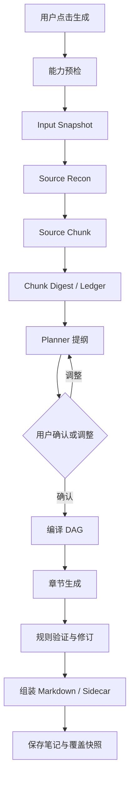
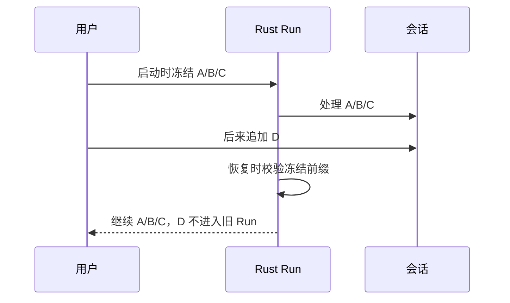
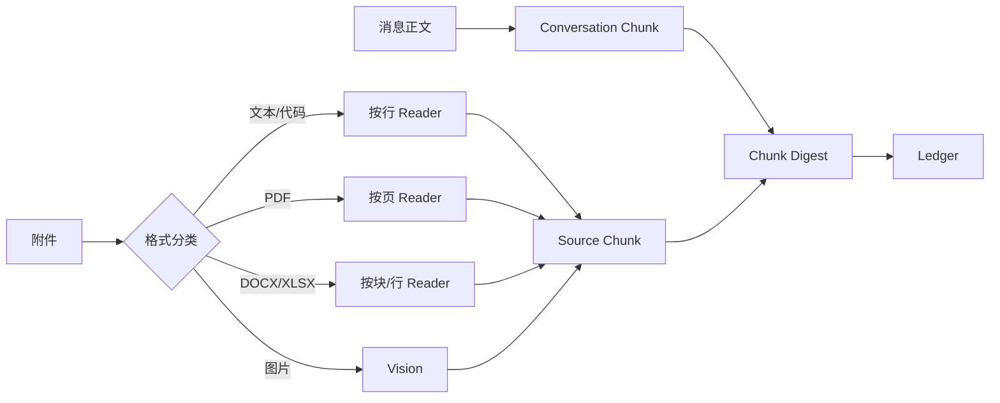
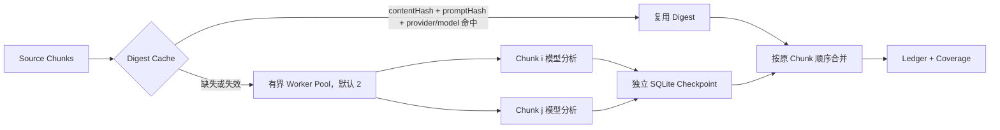
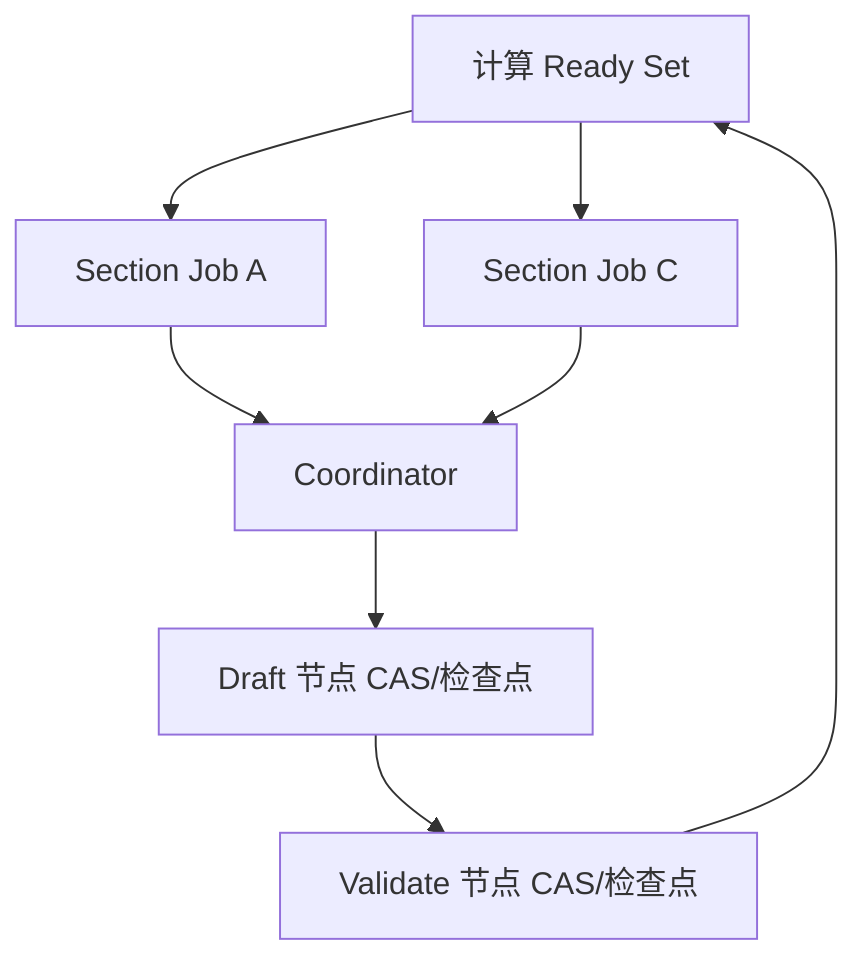
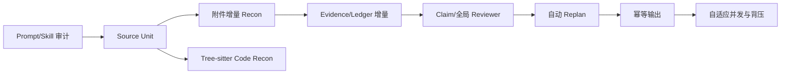

# Mnemora 深度笔记生成系统：当前实现、内置 Prompt、Skill、Tool、DAG 与恢复审计

> 2026-08-24 同步：Source Chunk 摘要与依赖就绪章节已经接入有界并行；Chunk Digest 具备内容/Prompt/模型联合失效的独立 SQLite 检查点；`validate-global` 已成为真实的确定性跨章节提交门；规划 Ledger 使用全范围均匀采样，不再只保留前部来源。内置 Skill 继续采用完整上游目录，Mnemora 只通过 `mnemora.json` 提供兼容元数据。

> 文档性质：当前源码基线审计与使用说明，不把未来计划写成已实现功能。
>
> 审计基线：当前工作区，应用版本 `0.1.22`，日期 2026-08-24。
>
> 事实优先级：生产 Rust 调用链 > SQLite 写入/读取 > Tauri IPC > 前端投影 > 测试与旧代码 > 计划文档。

---

## 0. 核心结论

当前深度笔记不是一次模型总结请求，而是 Rust 主导、SQLite 持久化、带提纲确认的 Plan-and-Execute 管线：



模型负责语义分析和文本生成；Rust 负责来源、权限、预算、状态、恢复、DAG 和数据库写入。

### 0.1 是否使用内置提示词

是。生产链按阶段使用多组内置 Prompt，而不是一个总 Prompt：

| Prompt | 用途 | 状态 |
| --- | --- | --- |
| `ANALYST_SYSTEM_PROMPT` | 直接 Planner；隐藏问题、知识缺口、误解、因果链、图形机会 | 生产调用 |
| `CHUNK_ANALYST_SYSTEM_PROMPT` | 对 Source Chunk 提取可验证摘要 | 生产调用 |
| `FAST_PLANNER_SYSTEM_PROMPT` | 从 Ledger 生成精简 JSON 提纲 | 生产调用 |
| `SECTION_SYSTEM_PROMPT` | 生成单章正文、Mermaid 和公式 | 生产调用 |
| `SECTION_REVISION_SYSTEM_PROMPT` | 根据验证报告局部修订章节 | 条件式生产调用 |
| `VISION_SOURCE_SYSTEM_PROMPT` | 图片转可追溯视觉 Source Chunk | 有图片时调用 |
| `STRICT_JSON_SUFFIX` | JSON 失败后的严格修复要求 | 条件式调用 |
| `NOTE_EDIT_PLAN_PROMPT` | 已有笔记的增量合并计划 | 纯文本更新时调用 |
| `NOTE_EDIT_PATCH_PROMPT` | 生成可确认的章节补丁 | 纯文本更新时调用 |

生产 Prompt 位于 `src-tauri/src/chat/note_pipeline/prompts.rs` 和 `service.rs`。阶段 Skill 的冻结正文还会追加到相应 System Prompt。

注意：`src/features/chat/notePipeline/stagePrompts.ts` 也保留了一套旧 TypeScript Prompt，主要服务遗留实现和测试；当前桌面生产入口以 Rust Prompt 为准。

### 0.2 Skill、Tool、Rust 和模型的关系

```text
Skill = 方法论、讲解标准和证据习惯
Tool  = 真实读取动作
Rust  = 权限、预算、顺序、检查点和持久化控制者
Model = 在给定材料和方法内分析与生成
```

深度笔记使用冻结 Skill Profile 和 Rust 确定性 Reader，不开放普通 Chat 的自由 Skill/Tool Loop。

应用设置里的用户全局 System Prompt 不会被后端隐式复制进深度笔记；深度笔记的可审计方法论来源就是本节列出的 Rust Prompt 与下文冻结的 Skill Profile。

---

## 1. 当前实现状态

| 能力 | 状态 | 准确说明 |
| --- | --- | --- |
| Rust 后台管线 | 已打通 | Tauri 创建 Run，后台分析和生成 |
| Input Snapshot | 已打通 | 消息顺序、逐消息 Hash、附件字节 Hash、引用、模型快照 |
| A/B/C 冻结、D 忽略 | 已打通 | 恢复只处理启动时冻结前缀 |
| 文本/PDF/DOCX/XLSX Reader | 已打通 | Rust 只读 Gateway，不依赖模型 Function Calling |
| 图片 Source Recon | 已打通 | 需要模型 Vision |
| Source Chunk / Ledger | 已打通 | SQLite 持久化并由 Detail 返回 |
| Evidence | 已打通但非 Claim 级 | 按章节契约对 Source Chunk 做确定性词项相关度排序，最多绑定 4 个候选；不是逐句事实审查或 NLI |
| 提纲和人工确认 | 已打通 | JSON 校验、章节选择、最多 4 次调整 |
| 章节 DAG | 已打通 | 依赖、阻塞、检查点、恢复真实生效 |
| 有界并行 Chunk 摘要 | 已打通 | 默认并发 2；乱序完成、逐 Chunk 落库、恢复只重做缺失或失效检查点 |
| 有界并行章节生成 | 已打通 | 仅并行依赖已满足的章节，默认并发 2；协调器单点提交状态和预算 |
| 全局提交门 | 已打通确定性首版 | 校验章节集合、标题、局部规则、Evidence、依赖产物和正文重复；独立语义 Reviewer 仍未接入 |
| 章节验证与修订 | 已打通 | 本地规则 + 最多 5 次语义修订 |
| Mermaid | 已打通并完成 Cherry Studio 风格加固 | 宽松识别围栏、离屏真实宽度渲染、SVG 清洗、Shadow DOM 隔离、中文 HTML Label、自适应尺寸和大图查看器 |
| KaTeX 公式 | 已打通 | `remark-math` + `rehype-katex` |
| 纯文本增量更新 | 已打通 | 提案确认后原子应用 |
| 新增附件增量更新 | 已打通首版 | 只读取覆盖锚点后的新附件，生成 Source Unit、Ledger、全局复核和确认式补丁 |
| 本地文件直接生成 | 已打通首版 | Notes 入口支持 Markdown、TXT、代码/文本、DOCX、XLSX、PDF 和图片；创建隐藏来源会话后复用同一 Reader/Vision、快照、DAG 和恢复链路 |
| 完整重建保留旧笔记 | 已打通 | 新笔记成为未来唯一更新目标 |
| 最终输出幂等表闭环 | 未打通 | `note_pipeline_outputs` 已建表但未用于最终写入 |
| 代码 AST/项目 DAG | 未打通 | 当前仅带语言元数据的静态文本 Source Chunk |

Mermaid 的当前渲染边界不再依赖 Markdown 全局 CSS 修补 SVG 内部颜色。生成阶段先 `parse`，再在具有真实消息宽度的离屏节点中 `render`，修复 Mermaid 偶发的非法 transform 后进行安全清洗，最后进入 Shadow DOM。清洗器保留 Mermaid 用于中文换行的 `foreignObject`，但移除脚本、事件属性、外部图片和非锚点链接。SVG 缺少 `viewBox` 时会从显式尺寸补齐；宿主不再设置固定 `aspect-ratio`，因此高流程图不会因为双重高度合同被异常放大或内层裁切。

---

## 2. 生产入口和生命周期

Tauri 命令位于 `src-tauri/src/commands/note_pipeline.rs`：

```text
start / inspect_start / adjust / confirm
resume / retry / restart
pause / cancel / abandon
get / get_detail
note_edit_prepare / note_edit_resolve
```

生产业务位于：

```text
src-tauri/src/chat/note_pipeline/service.rs
src-tauri/src/chat/note_pipeline/types.rs
src-tauri/src/chat/note_pipeline/scheduler.rs
```

启动时依次执行已有笔记检查、模型和附件能力预检、Skill 冻结、应用设置快照、Input Snapshot 创建、Run 写库和后台分析。分析完成后保存提纲并进入 `awaitingOutline`；用户确认所选章节后才正式编译并执行 DAG。

前端只提交命令、接收 Channel、读取 SQLite Detail 和展示状态，不是调度器。

---

## 3. 输入快照和恢复安全

`DeepNoteInputSnapshot` 保存：

```text
conversationRevision
messageIds
messageContentHashes
attachmentIds
attachmentContentHashes
selectedLiteratureIds
selectedNoteIds
model
permissionMode
createdAt
```

逐消息 Hash 包含角色、正文、附件元数据、文献/笔记引用和状态。附件 Hash 会读取应用安全副本的真实字节并计算 SHA-256，再与附件元数据组合，不是只比较名称和大小。

### 3.1 A/B/C 与新增 D



只追加 D 不影响旧 Run；编辑、删除、重排 A/B/C 或改变其附件字节会使快照失效。系统拒绝混用新旧来源。

Coverage Snapshot 继续承担旧 Run 的严格冻结；SQLite v9 另存细粒度 Source Unit。当前已经覆盖消息正文和附件，文献选区、笔记选区的独立 Source Unit 仍待补齐。

---

## 4. 模型能力和请求合同

| 能力 | 当前用途 |
| --- | --- |
| Tool Calling | 只展示模型声明；深度笔记不开放自由 Tool Loop |
| 本地 Reader | Rust 读取文本/PDF/DOCX/XLSX，与模型 Tool 能力分离 |
| Vision | 有图片时必须明确支持 |
| Reasoning | 模型能力展示和思考选项 |
| Structured Outputs | 不支持时由 Rust JSON 校验兜底 |
| Context Window | 直接规划和分块预算 |

深度笔记请求的持久 operation 是 `deepNote`，工作区模式是 Notes，`activatedSkillIds=[]`，普通 Chat Agent Tool 不会注入。仅图片 Source 节点把图片附件传给模型。

应用全局 System Prompt 不会被后端隐式追加；深度笔记使用调用方明确传入的阶段 Prompt 加冻结 Skill 正文。

---

## 5. 内置 Prompt 细节

### 5.1 Planner：`ANALYST_SYSTEM_PROMPT`

要求只做只读分析，不写正文。重点不是复述表面问题，而是沿以下链路找真正阻碍：

```text
可观察困惑 → 缺失概念/错误假设 → 因果机制 → 如何辨析
```

输出严格 JSON，包括目标、受众、范围、标题、摘要、薄弱点、隐藏问题、知识缺口、误解、因果链、图形机会、证据策略、来源 ID 和章节数组。章节包含依赖、证据要求、成功标准和消息来源。

### 5.2 分块分析：`CHUNK_ANALYST_SYSTEM_PROMPT`

每个 Source Chunk 输出：

```text
summary
canonicalTerms
verifiedFacts
coveredTopics
openQuestions
conflicts
globalConstraints
sourceMessageIds
```

消息 ID 只能复制输入中的真实标记。JSON 失败时追加 `STRICT_JSON_SUFFIX` 做结构修复。

### 5.3 快速 Planner：`FAST_PLANNER_SYSTEM_PROMPT`

从压缩 Ledger 生成 4 到 8 个简洁章节，最多 12 个；只使用账本和真实消息 ID，继续要求隐藏问题、前置知识、误解、因果链和 Mermaid 机会。它用于降低长请求和 504 风险。

### 5.4 Writer：`SECTION_SYSTEM_PROMPT`

要求：

- 以当前 `##` 章节标题开始；
- 先解释真正卡住理解的点；
- 区分材料事实、推断、教学类比和未知；
- `needsSupplement=true` 时标注“AI 补充背景”；
- 三个以上节点、步骤、依赖、分支、状态或时序时优先 Mermaid；
- Mermaid 必须位于正文顶层，不能包在 markdown/text 源码块中；
- 公式使用 `$...$` 或 `$$...$$`；
- 不输出全文 H1 和寒暄。

### 5.5 Reviewer：`SECTION_REVISION_SYSTEM_PROMPT`

这是章节级局部修订 Prompt，不是全局 Reviewer。它接收章节计划、当前正文和验证报告，修复结构、来源、隐藏问题辨析、Mermaid 和公式，但不能扩大来源范围或伪造 Evidence ID。

### 5.6 图片：`VISION_SOURCE_SYSTEM_PROMPT`

只描述图片真实可见的文字、结构、关系、趋势和不确定项，保留箭头、标签、层次和数值，不依据文件名猜测。输出进入 Image Source Chunk。

### 5.7 增量编辑 Prompt

`NOTE_EDIT_PLAN_PROMPT` 先规划 `addSection`、`appendToSection`、`replaceSection`；`NOTE_EDIT_PATCH_PROMPT` 再生成章节补丁 JSON。用户确认提案后才应用。

### 5.8 模型 operation

事件可见的阶段 operation 包括：`deepNoteChunk`、`deepNoteChunkRepair`、`deepNoteOutlineDirect`、`deepNoteOutline`、`deepNoteOutlineFallback`、`deepNoteVisionSource`、`deepNote` 和 `noteEdit`。

模型事件记录 operation、阶段、耗时、输入/输出字符、输出 Token 上限、HTTP 重试次数和超时窗口。

---

## 6. 内置 Skill Profile

Run 创建时冻结满足“已启用、支持 Notes、非高风险、允许模型调用”的 Skill 正文、版本和 Content Hash。

| Profile | Skill | 作用 |
| --- | --- | --- |
| Planner | `question-framing`、`knowledge-capture` | 找核心问题、因果链、范围、事实/观点/未知 |
| Writer | `beginner-teaching`、`document-authoring`、`markdown-notes`、`diagram` | 零基础讲解、文档结构、GFM、Mermaid |
| Reviewer | `knowledge-capture`、`markdown-notes`、`diagram` | 证据边界、格式、来源和图形检查 |
| 图片 Reviewer | 上述 + `visual-evidence-analysis` | 图片直接可见、推断和无法确认的区分 |

`skillProfileLoaded` 记录冻结结果，真正注入阶段 Prompt 时记录 `skillApplied`。Skill 只影响方法，不读取附件、不执行脚本、不写数据库、不改变 DAG/预算/权限。

`src/features/chat/notePipeline/stagePrompts.ts` 和 `deepNote.ts` 是遗留 TypeScript 实现，主要被旧测试引用；生产主链以 Rust Prompt 为准。

---

## 7. Tool 和 Source Recon

### 7.1 四类 Reader

```text
read_attachment_text
read_pdf_pages
read_docx_blocks
read_xlsx_rows
```

Rust Gateway 复用普通 Agent 的参数、路径、取消、超时和输出安全边界，但模型不能自由选择调用。

### 7.2 来源能力

| 来源 | 当前实际能力 |
| --- | --- |
| 对话 | 正文和消息中保存的文献/笔记选区，保留消息 ID |
| 文本/代码 | UTF-8、行号、静态读取；代码记录语言且不执行 |
| PDF | 文本层页提取，无 OCR |
| DOCX | 正文段落和表格块 |
| XLSX | Sheet、行和单元格文本，不重算公式 |
| 图片 | Vision 观察和不确定性说明 |

统一格式注册表位于 `chat/attachment_formats.rs`，负责 MIME/扩展名、代码语言、Dockerfile/Makefile 等特殊文件和敏感配置门禁。`.env`、凭据和 Secret 文件不会自动进入深度笔记。

代码当前只是 Source Chunk，不是 AST、符号、import、调用关系或项目 DAG。

### 7.3 预算

| 限制 | 当前值 |
| --- | ---: |
| 每条消息附件/图片 | 10 / 10 |
| 单文件上传 | 25 MB |
| 单消息附件/图片总量 | 25 MB / 16 MB |
| 单会话附件目录 | 512 MB |
| 文本 Reader 文件 | 2 MB |
| 深度笔记文本窗口 | 最多 100 行/32,000 bytes |
| PDF 窗口 | 2 页 |
| DOCX/XLSX 窗口 | 50 块/行 |
| Reader 调用 | 256 次/Run |
| Source Chunk | 96 块/Run |
| Office | 10 MB 文件、4,096 ZIP 条目、单 XML 16 MB、总 XML 64 MB |

文本 Reader 只返回完整行，再从实际结束行加一继续，不在源码行中间静默截断。

### 7.4 链路



Reader 记录 `toolStarted/toolCompleted/toolFailed`；Source Chunk 记录来源类型、附件 ID、位置、内容 Hash 和摘录长度。

文本切块不再只按空段或字符硬切。当前优先识别 Markdown 标题、空段和 fenced code/Mermaid block；一个代码围栏在预算内时保持原子，超预算时先按完整行拆分，最后才按 Unicode 字符回退。测试会把全部分块重新拼接并断言与原文一致，防止切块优化造成静默丢字。

---

## 8. 上下文预算和 Ledger

当前用保守字符估算 Token：ASCII 约 4 字符为 1 Token，非 ASCII 按 1 字符为 1 Token；另预留 Planner 输出、4,096 Token Prompt 开销和安全余量。

```text
无附件 + 输入 <= 直接规划上限（最多 3000 Token）
    → 直接 Planner

有附件、输入过长或直接 Planner 失败
    → Source Chunk → Chunk Digest → Ledger → 精简 Planner
```

未知上下文窗口采用 8,000 Token 保守预算；Chunk 目标最多 16,000 Token。Outline 超时和上下文错误会缩小 Payload，不盲目重复原大请求。

Ledger 保存目标、受众、术语、验证事实、主题、开放问题、冲突、补充、分块摘要和全局约束。只有覆盖完整且 Ledger 有真实输出，准备 DAG 才能完成。超过 96 Chunk、256 Reader 或存在遗漏消息会失败关闭。

### 8.1 Chunk 并行、检查点与失效



每个 `note_pipeline_chunk_digests` 记录 `runId/chunkId/contentHash/promptHash/providerId/modelId/digestJson/semanticCalls`。并行完成顺序不等于语义合并顺序：Worker 可以乱序返回，但协调器按原 Chunk 顺序构造 Ledger，因此相同检查点集合不会因为网络快慢而改变章节摘要顺序。

启动并行批次前按“初次调用 + 最多一次 JSON Repair”悲观预留语义调用。Worker 成功回收后归还未使用的 Repair 额度；任务进程被强制终止时不归还已发出请求的额度，宁可保守多记，也不漏记可能已经计费的调用。

Planner 为控制上下文对 Ledger 做压缩时，采用覆盖首尾的均匀采样，而不是 `take(N)`。这解决了多附件或长会话后部来源长期进不了 Planner 的饥饿问题；它仍是确定性抽样，不等于语义重要性排序。

---

## 9. 提纲和人工确认

Planner 明确输出隐藏问题、知识缺口、误解、因果链和图形机会。Rust 校验章节数 1 到 40、ID 唯一、消息 ID 有效、依赖存在且无环。

提纲调整只允许在 `awaitingOutline`：最多 4 次，每次预留 2 次语义调用并记录事件。确认所选章节后重新编译 DAG；确认前的每份草案还没有完整不可变版本历史。

---

## 10. DAG 真实能力

当前编译：

```text
analyze-input
recon-source
evidence:<section>
build-ledger
draft:<section>
validate:<section>
validate-global
assemble-note
persist-note
```

`reviewSection/reviseSection/applyPatch` 只存在于类型枚举，生产编译器不生成。

| 节点 | 当前行为 |
| --- | --- |
| `recon-source` | Source Chunk 必须真实存在 |
| `evidence:*` | 对章节标题、目的、摘要和证据要求做词项/CJK bigram 相关度排序；无显式 scope 且无相关命中时为 Insufficient |
| `build-ledger` | 要求覆盖完整和真实 Ledger |
| `draft:*` | Writer 调用和章节检查点 |
| `validate:*` | 保存本地验证结果，不是独立模型 Reviewer |
| `validate-global` | 真实确定性提交门：集合、标题、局部校验、Evidence、依赖产物、重复正文 |
| `assemble-note` | 拓扑排序和 Markdown 组装 |
| `persist-note` | 笔记、来源、覆盖快照写库 |

章节 B 依赖 A 时，`draft:B` 等待 `validate:A`，并获得 A 的有限摘录。调度器每轮选取最多 `maxParallelNodes` 个依赖已满足章节，使用有界异步流并发调用 Writer/Revision；Worker 只返回结果和实际语义调用数，协调器负责唯一的 Scheduler、Runtime、SQLite 和进度变更，避免共享“当前章节”导致串写。



当前并行粒度是“同一 Run 内互不依赖的章节”，不是所有节点无条件同时执行。Reader 仍以受控顺序读取附件，以限制 PDF/Office 解压和图片内存峰值；独立语义 Reviewer 与 Provider 动态限流仍是后续工作。

失败下游会 Blocked；恢复会把 InProgress/Interrupted 重置为 Pending；Retry 重置失败节点但保留成功检查点。

---

## 11. 章节验证、Mermaid 和公式

每章 Prompt 包含全局计划、隐藏问题、因果链、当前 Section、来源/Ledger 和依赖章节摘要。

本地验证检查：非空、精确 `##` 标题、最少 180 字符、无 H1、补充标记、失败占位、成功标准关键词、围栏闭合、Mermaid 顶层位置和危险语法。成功标准关键词目前只是 Warning。

### 11.1 Mermaid

```text
顶层 mermaid 围栏
→ Rust 移除误加的外层 markdown 壳
→ Validator 检查嵌套/闭合/危险内容
→ ReactMarkdown
→ MermaidBlock
→ Mermaid 11 懒加载、串行 parse/render
→ 真实宽度离屏测量
→ 修复 undefined/NaN transform
→ SVG 清洗（保留 foreignObject，移除脚本、外链、事件）
→ Shadow DOM 隔离 Mermaid 内嵌样式
→ 自适应 viewBox / intrinsic max-width
→ 高图滚动视口和大图查看器
```

每条消息最多 10 个 Mermaid，每块 24,000 字符；接近可视区域才渲染。识别兼容反引号、波浪线、引用、列表和信息字符串。历史嵌套 Mermaid 可以安全预览，不默认执行任意源码块。应用 Markdown 全局 CSS 不再使用 `!important` 改写 Mermaid 节点颜色，因此 `classDef` 的黑底白字、主题色和边标签不会被页面样式污染。

图表策略不再默认等同于流程图。Planner 用“图型｜要回答的认知问题｜目标章节”记录机会，Writer/Reviewer 的 `diagram` Skill 按语义选择：层级用 mindmap，状态用 stateDiagram-v2，角色交互用 sequenceDiagram，数据库实体用 erDiagram，类型关系用 classDiagram，真实时间用 gantt/timeline，执行体验用 journey，需求追踪用 requirementDiagram；xychart-beta/pie 只有在来源提供真实数值时才允许。长笔记通常 2~5 张不同目的的图已足够，避免堆叠同质 flowchart。

### 11.2 公式

前端使用 `remark-math` 和 `rehype-katex`。Rust 把旧 `math/latex/tex` 围栏转为统一数学语法；独立 `$$...$$` 和数学围栏默认以代码块式公式容器渲染，工具栏可以切换到原始 LaTeX，并复制纯源码。行内 `$...$` 保持自然排版，不被包成代码块。公式解析失败时仍保留 LaTeX 源码入口，宽公式只在公式内容区域横向滚动。

### 11.3 尝试次数

每章最多 5 次新草稿、跨尝试累计 5 次语义修订。只有 Error 触发修订，Warning 不会重新调用模型。

---

## 12. 重试、预算和超时

```text
semanticCallsUsed = Rust 主动发起的高层语义任务
HTTP attempt       = 同一语义任务的网络请求次数
attemptCount       = 章节新草稿次数
revisionCount      = 章节修订次数
```

一次语义任务网络重试 2 次后成功，仍是 1 次 Semantic Call、3 次 HTTP 请求。

当前上限：网络自动重试 0 到 5（默认 5）、单章草稿 5、单章修订 5、提纲调整 4、人工恢复 5、单 Run 语义调用 640。章节输出 2,048 Token，Chunk Digest 4,096，Planner 2,048，Fallback 1,024。

`ProviderUnavailable` 不重试；Outline 超时优先降载；Chunk JSON 非法进行一次结构修复；章节验证失败进入局部修订。

---

## 13. 暂停、恢复和已有笔记更新

| 操作 | 检查点 | 恢复 |
| --- | --- | --- |
| 暂停 | 保留 | 可继续 |
| 停止/取消 | 保留 | 未遗弃时可继续 |
| 失败 | 保留 | retry/restart |
| Retry | 保留成功、重置失败 | 同 Run |
| Restart | 新 Run | 当前输入重做 |
| Abandon | 保留历史 | 永不可恢复 |

已有笔记检查返回 `new/updateAvailable/upToDate/invalidated`：

- 只有新增正文：生成提案，确认后应用；
- 新增受支持附件：只读取新附件，生成 Source Unit、增量账本、全局复核和确认式补丁；
- 新增不支持或敏感附件：拒绝；
- 旧来源变化：快照失效后明确重建。

完整重建保留旧笔记，并在一个事务中把未来更新锚点切换到新笔记。

---

## 14. SQLite 和事件

schema v13 主要表：

```text
note_pipeline_runs
note_pipeline_sections
note_pipeline_plan_versions
note_pipeline_nodes
note_pipeline_source_chunks
note_pipeline_chunk_digests
note_pipeline_evidence
note_pipeline_ledgers
note_pipeline_events
deep_note_coverage_snapshots
note_edit_proposals
note_pipeline_outputs（已建表、最终写入未接通）
```

Run/Node/Event 还包含 `state_version`、`execution_version`、租约、运行实例、事件序号和 command id 等统一状态机元数据。`note_pipeline_chunk_digests` 是本轮新增的细粒度恢复事实；它不替代 Source Chunk，前者是模型分析产物缓存，后者是可追溯原始来源片段。

主要事件：`preflightCompleted`、`skillProfileLoaded`、`skillApplied`、Tool 事件、`sourceChunkCreated`、覆盖/提纲/Evidence/DAG/模型调用事件，以及暂停、恢复、完成和失败事件。

Detail 最多返回最近 500 条事件，并同时返回 Runtime、Source Chunk、Evidence、Ledger、Skill、DAG 和章节状态。Channel 用于实时通知，SQLite Detail 用于页面重进后的校准。

当前没有把每次完整 System Prompt 保存成不可变数据库对象；事件通过 operation、Skill Hash、字符统计和 Tool 参数间接审计。

---

## 15. 前端显示

详情页展示模型 Provider/名称、Tool 三态、Vision、Reasoning、本地 Reader、Skill Profile、Token 估算、分块进度、分块/章节并发度、语义预算、模型活动、Source Chunk、Evidence、Ledger 和 DAG。

“模型支持 Tool”不等于深度笔记开启自由 Tool Loop。

Task Center 投影阶段：

```text
preflight → context → planning → review → execution → saving
```

应用启动时从 SQLite 读取每个会话最新可恢复 Run；终态任务保留约 15 分钟。Channel 丢失后可由 Run/Detail 重建状态。

---

## 16. 当前缺陷

1. `note_pipeline_outputs` 未接入最终输出事务，崩溃窗口仍可能重复创建 Note。
2. 并行度目前是固定小上限，尚未根据 Provider 429、延迟、设备内存和数据库争用自适应；附件 Reader 仍受控串行。
3. Source Recon/Evidence/Ledger 还不是统一可租约领取的通用 DAG Runner。
4. `validate-global` 已有确定性提交门，但没有第二模型/独立语义 Reviewer，不能发现所有跨章矛盾。
5. 新附件增量 Recon 已有首版，但该分支的 Chunk 摘要仍是串行；文献/笔记选区 Source Unit、Claim 级影响分析和跨 Run 解析缓存仍未完成。
6. 代码没有 AST、符号、import、调用图或项目 DAG。
7. Evidence 的词项相关度是召回门，不是正文逐 Claim 验证、语义蕴含或引用正确性证明。
8. 未确认提纲草案版本历史不完整。
9. Prompt 只有模板代码和事件统计，没有不可变 Prompt Profile 记录。
10. 遗留 TypeScript 深度笔记管线容易误导维护者。

---

## 17. 推荐路线



优先顺序：最终幂等输出 → Claim Evidence/独立语义 Reviewer → 增量分支检查点 → Provider 自适应并发与背压 → Prompt Profile → 项目级代码理解。

---

## 18. 验证基线

2026-08-24 本轮验证：Rust 342 个测试通过；前端 50 个测试文件、212 个测试通过；TypeScript/Vite 生产构建、Rust 格式检查和 `git diff --check` 通过。新增测试包含 schema v13 迁移、Chunk Digest 重开恢复/陈旧清理、结构化分块、全范围 Ledger 采样、Evidence 排序和全局验证。

---

## 19. 代码证据索引

| 主题 | 路径 |
| --- | --- |
| 生产主链和 Prompt 调用 | `src-tauri/src/chat/note_pipeline/service.rs` |
| Prompt 常量 | `src-tauri/src/chat/note_pipeline/prompts.rs` |
| 类型、预算、DAG 编译 | `src-tauri/src/chat/note_pipeline/types.rs` |
| Scheduler | `src-tauri/src/chat/note_pipeline/scheduler.rs` |
| Reader Gateway | `src-tauri/src/chat/agent/registry.rs` |
| Office Reader | `src-tauri/src/chat/agent/documents.rs` |
| 格式与敏感门禁 | `src-tauri/src/chat/attachment_formats.rs` |
| 持久化 | `src-tauri/src/library/store.rs` |
| Tauri IPC | `src-tauri/src/commands/note_pipeline.rs` |
| 前端动作和恢复 | `src/app/hooks/useNoteActions.ts` |
| 详情界面 | `src/features/workspace/views/DeepNoteView.tsx` |
| 任务投影 | `src/features/tasks/projections/taskRunProjection.ts` |
| Mermaid | `src/features/chat/markdown/components/MermaidBlock.tsx` |
| 公式 | `src/features/chat/components/MathMarkdownContent.tsx` |
| 内置 Skill | `src-tauri/resources/skills/*/SKILL.md` |
| 遗留前端管线 | `src/features/chat/notePipeline/deepNote.ts` |

---

## 20. 最终评价

当前深度笔记已经是一条可恢复、可审计、来源受限的本地知识编排管线：

```text
冻结输入 → 预检 → Reader/Vision → Source Chunk → Ledger
→ 内置 Prompt + 冻结 Skill Planner → 用户确认 → Rust DAG
→ Writer/Reviewer → Mermaid/公式规范化 → 笔记与覆盖快照
```

它已经能说明读了哪些材料、用了哪些 Prompt/Skill、为何暂停或拒绝恢复、Chunk 检查点是否复用、章节依赖如何释放、哪些章节并行以及 Evidence 从哪里来；当前已完成有界 Chunk/章节并行和确定性全局提交门，但还不能声称具备 Claim/NLI 级验证、独立语义 Reviewer、项目级代码理解、自适应 Provider 背压或最终输出幂等事务。

> 任何新能力都必须同时补齐真实执行、持久化证据、恢复语义、前端可见性和文档状态；不能只增加枚举、Prompt 或 UI 标签就写成已实现。

---

## 21. 本轮补充：能力、格式和增量边界的完整审计

### 21.1 模型能力字段的真实含义

深度笔记详情页显示的模型能力是能力快照，不是“本次任务已经使用了该能力”的证明：

| 字段 | 当前含义 | 任务中的实际作用 |
| --- | --- | --- |
| tools / function calling | 模型配置或数据库声明 | 深度笔记的本地 Reader 由 Rust 固定调度，因此不要求模型自由 Tool Loop |
| vision | 模型配置或型号数据库声明 | 有图片时必须为 true；未知或 false 由 preflight 阻止 |
| reasoning | 模型能力提示 | 展示和请求选项，不等于模型一定输出可审计思维链 |
| structured outputs | 当前快照固定为 false | Rust 对 JSON 做 Schema/字段/来源 ID 校验和修复 |
| context window | 配置或型号数据库推断 | 用于直接 Planner、分块和 Ledger 的预算 |

因此，“支持 Tool”与“本次深度笔记调用了 Tool”必须在 UI 和文档中分开显示；Reader 事件才是实际读取证据。

### 21.2 四类 Reader 不是四种文件扩展名

当前生产 Reader 是四个逻辑 Gateway：

~~~text
read_attachment_text
read_pdf_pages
read_docx_blocks
read_xlsx_rows
~~~

它们覆盖的输入远多于四种后缀：

- Text Gateway：md、txt、rst、json、yaml、toml、sql、html、css、js、ts、py、rs、go、java、c/cpp、shell、PowerShell、Dockerfile、Makefile 等；
- Code Source：仍走 Text Gateway，但 Source Kind 标记为 Code，带语言和行号，绝不执行；
- PDF Gateway：按页读取当前文本层，暂不提供 OCR；
- DOCX Gateway：正文段落和表格块；
- XLSX Gateway：工作表和行，不重算公式；
- Image Source：不是 Reader，而是 Vision Source Chunk。

当前硬边界包括：单文件/消息附件大小、单 Run Reader 次数 256、文本窗口 100 行/32,000 bytes、PDF 每次 2 页、Office 每次 50 块/行、Source Chunk 96 块。超过上限必须报覆盖不完整，不能静默截断。

### 21.3 Python 等代码文件的诚实处理

代码文件现在可以生成笔记，但语义只到“有来源的静态文本分析”：

1. Reader 返回带行号的窗口；
2. Source Chunk 保存文件、语言、起止行和内容 Hash；
3. Prompt 明确未执行代码，不能推断运行时结果；
4. 不声称有 AST、符号表、import 图、调用图或项目 DAG；
5. 未来 Tree-sitter/项目图必须作为独立、只读、有版本和超时预算的解析阶段。

### 21.4 语义预算、节点尝试和网络重试

三类数字不能混淆：

~~~text
semanticCallsUsed   Rust 主动发起的高层语义任务
HTTP attempt         同一任务的网络请求次数
node attempt         一个章节重新生成的次数
revision count       一个章节依据验证报告修订的次数
~~~

当前默认：

- 每章最多 5 次新稿；
- 每章最多 5 次语义修订；
- 提纲调整最多 4 次；
- 单 Run 语义上限 640；
- 应用网络重试设置为 0–5，默认 5；
- 同一语义任务的 HTTP 重试不额外消耗 semanticCallsUsed；
- ProviderUnavailable 不重试；上游 Outline 超时优先缩小 Payload，而不是盲目重发；
- Chunk JSON 非法可走一次 Strict JSON 修复；
- Warning 不触发模型修订，Error 才进入局部修订。

单 Run 的 640 是总保险丝，不是每章保证拿到 640 次；实际预算由 4 次准备路径加上章节的 5 次草稿和 5 次修订计算，并受上限截断。前端应同时展示已用语义调用、预算、网络重试和当前章节尝试。

### 21.5 内置 Prompt 和 Skill 的审计链

生产 Prompt 来源固定为：

~~~text
src-tauri/src/chat/note_pipeline/prompts.rs
src-tauri/src/chat/note_pipeline/service.rs
~~~

调用链按阶段分为：

1. ANALYST_SYSTEM_PROMPT：发现隐藏问题、知识缺口、误解、因果链和图形机会；
2. CHUNK_ANALYST_SYSTEM_PROMPT：只提取可验证 Source Chunk；
3. FAST_PLANNER_SYSTEM_PROMPT：从 Ledger 生成受预算约束的提纲；
4. SECTION_SYSTEM_PROMPT：写章节、区分事实/推断/补充/未知、生成顶层 Mermaid 和 KaTeX；
5. SECTION_REVISION_SYSTEM_PROMPT：依据验证报告做局部修订；
6. VISION_SOURCE_SYSTEM_PROMPT：只描述图片可见证据和不确定项；
7. STRICT_JSON_SUFFIX：结构解析失败时要求只返回合法 JSON；
8. NOTE_EDIT_PLAN_PROMPT / NOTE_EDIT_PATCH_PROMPT：已有笔记的计划、补丁和确认链。

冻结 Skill Profile：

| Profile | Skill | 作用 |
| --- | --- | --- |
| Planner | question-framing、knowledge-capture | 找真正问题、因果链、事实/观点/未知 |
| Writer | beginner-teaching、document-authoring、markdown-notes、diagram | 教学表达、Markdown 结构、图形机会 |
| Reviewer | knowledge-capture、markdown-notes、diagram | 来源、格式、覆盖和图形检查 |
| 图片 Reviewer | Reviewer + visual-evidence-analysis | 可见内容、推断和无法确认的区分 |

Run 会冻结 Skill 版本和 Content Hash，并记录 skillProfileLoaded/skillApplied。当前没有把完整 System Prompt 作为不可变数据库对象保存，只有 Prompt 常量、operation、Skill Hash、输入/输出统计和事件；这是可审计性仍需补强的地方。

### 21.6 附件增量当前实现

旧 Run 的 A/B/C 输入边界已经冻结；后续 D 不会混入旧 Run。新的更新 Run 现在可以对 D 中新增的受支持附件执行：

~~~text
Source Unit
→ 新附件 Reader/Vision
→ 增量 Chunk/Digest/Ledger
→ 受影响章节分析
→ 附件专用全局复核
→ Diff/Proposal
→ 用户确认
→ Note + Sources + Coverage + Version + Source Unit 事务
~~~

Coverage Snapshot 和 Source Unit 只会在用户确认提案后推进；Reader/Vision、全局复核或事务任一步失败，都保留旧笔记和旧覆盖状态。

### 21.7 当前最大五个工程缺口

1. note_pipeline_outputs 已建表但最终输出幂等事务尚未接通；
2. 当前固定 `maxParallelChunks=2/maxParallelNodes=2` 已真实并发，但尚无 Provider 自适应背压和跨 Run 公平调度；
3. validate-global 已执行确定性跨章门禁，但不是独立语义 Reviewer；
4. Evidence 是章节/来源级，不是 Claim/NLI 级；
5. 代码和复杂文献尚无 AST、复杂版面、OCR 和项目级 DAG。

这些缺口应在面试和产品文档中如实说明。增加 Prompt、Skill、图形或 UI 标签不能替代真实执行、持久化证据和恢复语义。

## 22. 与后续文档的关系

- 插件、桌面宠物、本地文件和附件增量：见 md/plan/11-插件桌面宠物与本地文件笔记增量规划.md；
- 笔记编辑器和 AI Patch：见 md/plan/12-笔记编辑能力增强规划.md；
- IELTS 自适应学习：见 md/Summary/02-英语.md；
- PDF 文献研读：见 md/Summary/03-文献.md；
- 内存和 Benchmark：见 md/Summary/04-内存优化.md；
- 面试材料：见 md/interview/。

---

## 23. 2026-08-22 实施更新：桌面宠物与附件增量 Source Unit

本轮已把 Plan 11 中的桌面宠物 MVP 和“新增附件增量更新”接入生产代码。

### 23.1 桌面宠物

- 设置新增“宠物”分类，默认关闭、无声音、不读取屏幕或麦克风；
- Rust 创建独立透明 pet WebviewWindow，支持置顶、点击穿透、尺寸、透明度和位置持久化；
- 主窗口关闭时销毁宠物窗口，重新打开主窗口时按设置恢复；
- 前端只投影脱敏状态：idle、thinking、tooling、waiting、success、error；
- 深度笔记优先于普通 Chat 状态；Tool 只显示“正在使用工具”，不发送参数和正文；
- 支持 Reduced Motion、状态气泡和双击打开主应用。

### 23.2 新增附件增量更新

此前发现新附件会要求完整重建；现在支持：

~~~text
覆盖锚点后的新消息/附件
→ 格式与 Vision 预检
→ 只读取新增附件
→ Source Chunk
→ Chunk Digest / Incremental Ledger
→ 附件专用 Plan / Patch Prompt
→ 全局复核
→ Diff + Source Unit 预览
→ 用户确认
→ Note、Version、Sources、Coverage Snapshot、Source Unit 原子推进
~~~

SQLite schema 升级至 v9，新增：

~~~text
deep_note_source_units
note_edit_source_units
~~~

每个附件 Source Unit 保存 note/conversation/message/attachment、contentHash、parserId、parserVersion、状态和 chunkIds。提案被拒绝时 Source Unit 和 Coverage Snapshot 都不推进；应用时与旧 Source Unit 合并，并备份旧笔记版本。

当前仍保留的边界：

- 旧附件字节 Hash 改变仍使覆盖快照失效，需要完整重建；
- 不支持或敏感附件仍明确阻止；
- 图片仍要求模型明确支持 Vision；
- 全局复核可以提示 requiresFullRebuild，但最终是否应用仍由用户检查 Diff 后确认；
- Source Unit 已落库，Claim 级 Evidence 和跨 Run 解析缓存仍是后续能力。
