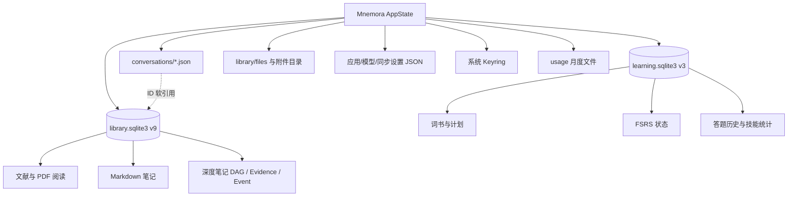
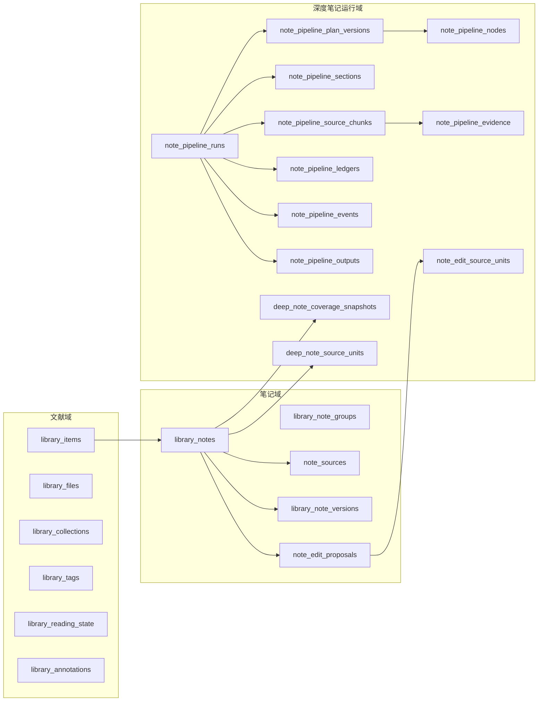
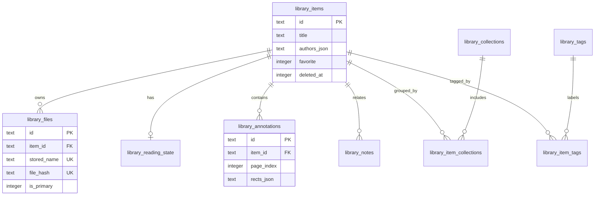
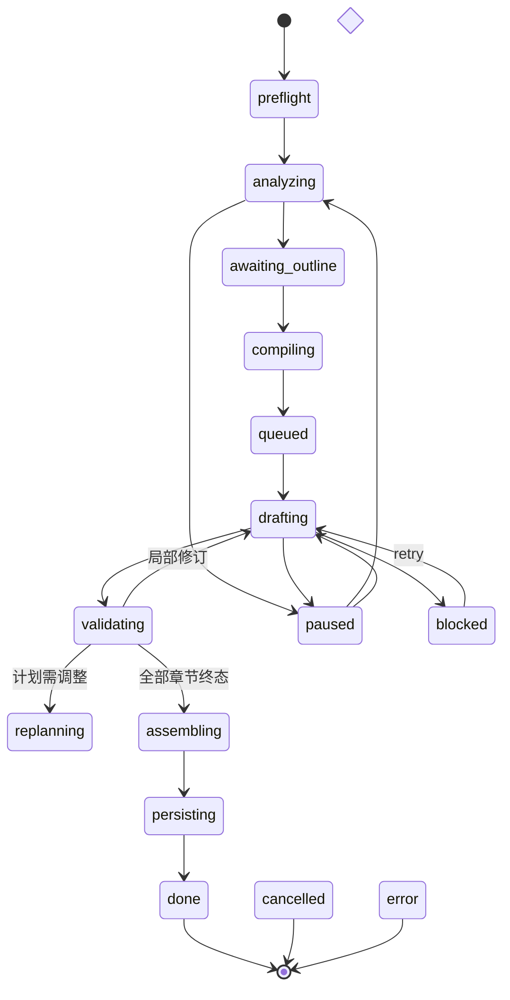
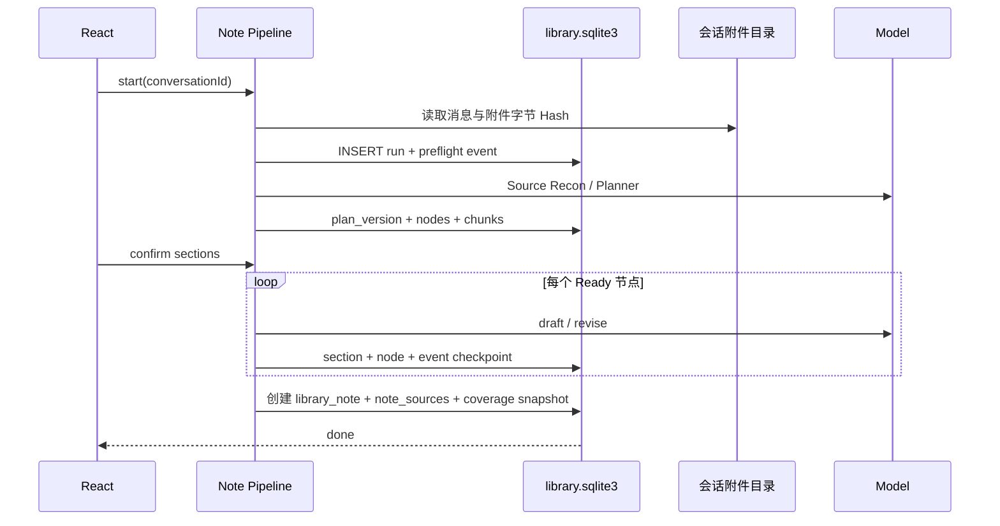
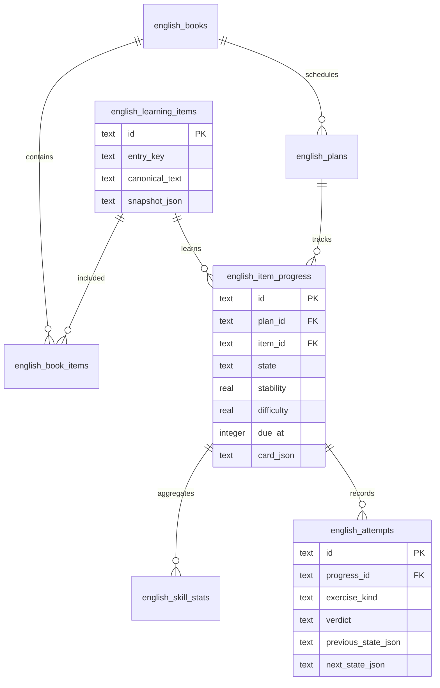

# 05｜Mnemora 数据库与持久化架构深度分析

> 文档性质：当前源码、迁移脚本、Repository、运行时锁和本机只读样本的综合审计。
>
> 源码目标版本：`library.sqlite3` v9，`learning.sqlite3` v3。2026-08-22 本机已安装版本的只读样本仍为 library v7、learning v3；工作区代码下一次打开 Repository 时会按迁移链推进，不应把样本版本误当作源码目标版本。

## 1. 核心结论

SQLite 是 Mnemora 的业务枢纽，但不是全部持久化系统。当前架构是“按一致性边界拆库”：



关键设计判断：

1. 文献、笔记和深度笔记需要跨多表原子更新，因此放在同一 `library.sqlite3`。
2. 英语学习拥有 4.9 万级学习项、FSRS 卡片状态和独立清理策略，因此单独使用 `learning.sqlite3`。
3. Chat 会话采用独立 JSON 文件，不与 SQLite 建物理外键；笔记只保存 `conversation_id/message_id` 软引用。
4. 二进制 PDF、图片和附件不写 BLOB，SQLite 只存元数据、Hash、相对文件名和业务状态。
5. 深度笔记不是一张“任务表”，而是一套事件化 Plan-and-Execute 数据模型。

## 2. 为什么选择 SQLite

### 2.1 适合 Mnemora 的原因

- 本地优先，无需部署数据库服务；
- 单文件易备份、迁移和完整性校验；
- 事务可以同时保护笔记正文、版本、来源和覆盖快照；
- 外键、CHECK、UNIQUE、Partial Index 能把关键约束下沉；
- Rusqlite 与 Tauri/Rust 集成简单，错误边界可控；
- 读写规模以个人设备为主，不需要分布式一致性。

### 2.2 SQLite 不负责什么

SQLite 不负责模型推理、不负责全文附件解析，也不直接存储 Chat 完整消息和大文件。它保存的是：

```text
稳定身份 + 关系 + 状态机 + 检查点 + 来源索引 + 可恢复输出
```

文件系统保存的是：

```text
PDF / 聊天附件 / 图片缩略图 / 音频缓存 / 会话 JSON / 设置 JSON
```

这个划分避免数据库无限膨胀，也允许 PDF.js、图片解码器和 Reader 按需打开文件。

## 3. 两个 SQLite 事务域

| 数据库 | 源码版本 | 表数 | 核心职责 | Repository |
| --- | ---: | ---: | --- | --- |
| `library/library.sqlite3` | 9 | 25 | 文献、PDF 阅读状态、批注、笔记、来源、版本、深度笔记 DAG、增量更新 | `LibraryRepository` |
| `english/learning.sqlite3` | 3 | 7 | 学习项、词书、计划、FSRS 卡片、技能统计、答题历史 | `EnglishLearningRepository` |

二者都在每次操作时打开连接，设置 5 秒 `busy_timeout`，打开外键并执行幂等迁移。应用层还用异步 Mutex 串行化高风险写操作：

- `library_operations`；
- `english_learning_operations`；
- `conversation_writes`；
- `storage_operations`。

## 4. Library 数据库总览

### 4.1 领域分层



### 4.2 文献核心 ER



### 4.3 表级数据字典：文献与笔记

| 表 | 主键/关系 | 功能 | 为什么这样设计 |
| --- | --- | --- | --- |
| `library_items` | `id` | PDF 文献元数据、收藏、软删除、最近打开 | 文献实体与物理文件分离；删除状态不影响立即恢复 |
| `library_files` | `id`；FK `item_id` CASCADE | PDF 文件名、Hash、MIME、来源路径、主文件 | Hash 唯一实现去重；部分唯一索引保证每篇文献只有一个主文件 |
| `library_collections` | `id`；名称 NOCASE UNIQUE | 文献分类 | 独立实体允许重命名且不复制名称到每篇文献 |
| `library_item_collections` | 复合 PK | 文献与分类多对多 | 避免数组 JSON 无法索引和约束 |
| `library_tags` | `id`；名称 NOCASE UNIQUE | 标签词典 | 统一大小写语义，减少重复标签 |
| `library_item_tags` | 复合 PK | 文献与标签多对多 | 可按标签查询，不污染文献主表 |
| `library_reading_state` | PK/FK `item_id` | 页码、滚动、缩放 | 一篇文献只有一份当前阅读现场，删除文献自动级联 |
| `library_annotations` | `id`；FK `item_id` | 高亮、下划线、区域批注 | 页码、颜色、矩形有 CHECK；空间信息用有界 JSON 保存 |
| `library_notes` | `id`；可空 FK `item_id` | 文献笔记与全局 Markdown 笔记 | `item_id=NULL` 统一支持独立笔记，不需要第二套笔记表 |
| `library_note_groups` | 名称 PK | 用户笔记分组注册表 | 组名独立维护；笔记 `group_name` 允许未分类 |
| `note_sources` | `id`；FK `note_id` | 章节到对话消息/AI 补充的来源锚点 | Chat 在 JSON 仓库，不能建立跨库 FK；删除对话时应用层执行 detach |
| `library_note_versions` | `id`；FK `note_id` | 修改前版本快照 | 笔记编辑可回溯，避免原地覆盖不可恢复 |
| `note_edit_proposals` | `id`；FK `note_id` | 待确认的增量补丁、完整 diff 和乐观锁时间戳 | AI 不直接改笔记；`expected_note_updated_at` 防止应用过期提案 |

## 5. 深度笔记数据库为何复杂

深度笔记需要同时解决：长任务恢复、A/B/C 输入冻结、来源追溯、提纲调整、DAG、章节重试、增量附件、幂等输出和用户确认。把所有内容塞进 `note_pipeline_runs.runtime_json` 会导致：

- 无法按节点查询；
- 无法局部重试；
- 无法观察事件顺序；
- 无法独立验证来源覆盖；
- 每次更新重写巨大 JSON。

因此采用“Run 为聚合根，细节拆表”的设计。

### 5.1 深度笔记 ER

```mermaid
erDiagram
    note_pipeline_runs ||--o{ note_pipeline_plan_versions : versions
    note_pipeline_runs ||--o{ note_pipeline_nodes : schedules
    note_pipeline_runs ||--o{ note_pipeline_sections : drafts
    note_pipeline_runs ||--o{ note_pipeline_source_chunks : reads
    note_pipeline_runs ||--o{ note_pipeline_evidence : binds
    note_pipeline_runs ||--o{ note_pipeline_ledgers : summarizes
    note_pipeline_runs ||--o{ note_pipeline_events : audits
    note_pipeline_runs ||--o| note_pipeline_outputs : produces
    library_notes ||--o{ deep_note_coverage_snapshots : anchors
    library_notes ||--o{ deep_note_source_units : covers
    note_edit_proposals ||--o{ note_edit_source_units : stages

    note_pipeline_runs {
      text id PK
      text conversation_id
      text note_id FK
      text phase
      integer current_plan_version
      text input_snapshot_hash
      text idempotency_key
    }
    note_pipeline_nodes {
      text run_id PK_FK
      integer plan_version PK
      text node_id PK
      text status
      text depends_on_json
    }
    note_pipeline_source_chunks {
      text run_id PK_FK
      text chunk_id PK
      text source_kind
      text content_hash
    }
```

### 5.2 运行表数据字典

| 表 | 作用 | 关键设计 |
| --- | --- | --- |
| `note_pipeline_runs` | 任务聚合根和阶段状态机 | Partial UNIQUE 保证一个来源会话最多一个活跃 Run；记录模型、预算、快照 Hash、幂等键和错误 |
| `note_pipeline_plan_versions` | 每次提纲及编译 DAG 的不可变版本 | `run_id + version` 复合主键；调整提纲不会覆盖旧计划 |
| `note_pipeline_nodes` | DAG 节点状态与依赖 | 节点可独立 Pending/Ready/InProgress/Completed/Failed/Blocked；支持检查点恢复 |
| `note_pipeline_sections` | 章节计划、Markdown、尝试次数、修订次数、验证结果 | 文本生成结果独立于节点表，方便预览和局部重试 |
| `note_pipeline_source_chunks` | 对话、文本、代码、PDF、DOCX、XLSX、图片的可追溯块 | 每块有位置、摘录、Hash、页码/行号和 OCR 置信度 |
| `note_pipeline_evidence` | 章节主张与 Source Chunk 绑定 | 区分 source excerpt、model synthesis、支持等级与状态 |
| `note_pipeline_ledgers` | 分块摘要形成的知识账本版本 | 长输入不直接反复发送；可记录增量 patch |
| `note_pipeline_events` | 有序运行审计日志 | `run_id + sequence` 保序；任务中心、诊断和恢复都可重放 |
| `note_pipeline_outputs` | 最终 Markdown、Sidecar 与幂等键 | 目标是 exactly-once 输出；当前源码已建表，但生产写入闭环仍未完全使用 |
| `deep_note_coverage_snapshots` | 已生成笔记覆盖的消息与附件 Hash 快照 | 决定 A/B/C 可恢复、D 是否属于增量；编辑/删除旧来源会使快照失效 |
| `deep_note_source_units` | 消息正文、附件、文献选区、笔记选区的细粒度覆盖单元 | 附件级增量更新的最小事实单元；记录 parser 版本和 Covered/Failed/Unsupported |
| `note_edit_source_units` | 增量提案尚未应用时的 Source Unit 暂存 | 只有用户接受提案后才推进正式覆盖快照 |

### 5.3 任务状态流



### 5.4 生成事务链



## 6. English 数据库

### 6.1 ER



### 6.2 数据字典

| 表 | 功能 | 设计理由 |
| --- | --- | --- |
| `english_learning_items` | 单词、短语、句子、媒体片段及来源快照 | 学习内容与计划解耦；同一条目可进入不同词书和计划 |
| `english_books` | 词书元数据与条目数 | 导入、导出和计划都围绕稳定词书 ID |
| `english_book_items` | 词书与条目多对多、位置 | 保留词书顺序，不复制学习项 |
| `english_plans` | 当前计划、状态和完整设置 JSON | Partial UNIQUE 保证只有一个 active 计划 |
| `english_item_progress` | FSRS 状态、到期时间、掌握审计、卡片 JSON | 数值列支持查询，完整 Card JSON 保留调度器状态与版本演进 |
| `english_skill_stats` | meaning/spelling/listening 分技能聚合 | 不扫描全部 attempts 就能判断薄弱技能 |
| `english_attempts` | 每次作答、提示、响应时长、评分和前后 Card | 审计评分变化，支持错题回流和统计；历史上限 1000 条 |

### 6.3 一次答题为何必须事务化


若中间任一步骤失败而没有事务，可能出现“复习状态已推进但答题历史缺失”或“历史已写但 due_at 未更新”。Repository 使用 transaction 保证这些变化一起提交。

## 7. 跨库关系为什么不用外键

`note_sources.conversation_id/message_id`、`note_pipeline_runs.conversation_id` 指向 `conversations/conv_<id>.json`，不是 SQLite 表。SQLite 无法对文件系统对象建立外键，因此采用应用层完整性：

- 删除单个对话前先遗弃未完成 Run；
- 删除后把笔记来源 detach，而不删除已生成笔记；
- 清空会话时批量 detach；
- 恢复 Run 时重新读取会话并校验快照 Hash；
- 来源文件不存在或前缀变化时拒绝恢复/增量。

这是有意的弱耦合：用户删除聊天不应级联删除知识笔记，但 UI 必须明确“来源跳转失效”。

## 8. 约束、索引和并发

### 8.1 重要数据库约束

- `CHECK` 固定 phase、状态、颜色、批注类型和学习状态；
- UNIQUE `file_hash` 防止重复 PDF；
- Partial UNIQUE `library_primary_file_per_item`；
- Partial UNIQUE `note_pipeline_active_conversation`；
- Partial UNIQUE `english_one_active_plan`；
- 复合 PK 保证 Run 内 Node、Section、Event Sequence 唯一；
- ON DELETE CASCADE 清理从属记录；
- ON DELETE SET NULL 保留任务或输出审计但解除已删笔记关联。

### 8.2 查询索引

高频索引围绕：

- 最近更新、最近打开、收藏、回收站；
- 文献页码批注；
- 笔记版本与提案时间线；
- Run 最近更新时间和 Active Run；
- Node Ready 状态；
- Source Chunk 来源；
- Evidence 章节；
- FSRS due/audit 队列；
- Attempt 时间线。

### 8.3 当前并发模型

```text
SQLite busy_timeout 5s
+ AppState 领域 Mutex
+ BEGIN IMMEDIATE / transaction
+ 后台 spawn_blocking
```

优点是简单、可解释；缺点是长写事务会阻塞同域操作。当前默认 journal mode 是 `DELETE`，没有启用 WAL。个人桌面负载下可接受，但若未来增加后台同步、批量索引或多窗口同时写，WAL 与连接复用需要重新评估。

## 9. 本机只读样本

以下数字仅用于理解量级，不代表所有用户：

| 指标 | library | English |
| --- | ---: | ---: |
| 文件大小 | 约 2.8 MiB | 约 115.8 MiB |
| 页大小 | 4096 B | 4096 B |
| page_count | 715 | 29640 |
| freelist | 14 | 0 |
| journal mode | DELETE | DELETE |
| integrity_check | ok | ok |
| foreign_key_check | 无违规 | 无违规 |

English 样本包含：

- 49,213 个学习项；
- 49,213 个词书映射；
- 49,213 个计划进度；
- 0 条答题历史。

它仍达到约 116 MiB，主要原因不是答题日志，而是每项同时保存 `snapshot_json` 与 `card_json` 等可恢复快照。未来优化应先测量列级占用，再决定是否压缩或规范化，不能盲目 VACUUM。

## 10. 迁移策略

Library 迁移：

```text
v1 文献
→ v3 批注 + 全局笔记
→ v4 笔记分组
→ v5 note_sources
→ v6 后台 Run / Section / Version / Proposal
→ v7 Plan-and-Execute / DAG / Chunk / Evidence / Event / Output
→ v8 Coverage Snapshot
→ v9 Source Unit / 附件增量
```

English 迁移：

```text
v1 FSRS 基础结构
→ v2 archived_from_state
→ v3 答题历史上限与时间索引
```

迁移全部读取 `PRAGMA user_version`，拒绝打开高于当前代码支持的版本。数据目录迁移复制完成后执行 `PRAGMA quick_check`，只有通过才提交目录切换。

## 11. 当前不足

1. `note_pipeline_outputs` 已建但最终持久化尚未真正依赖它完成 exactly-once 闭环。
2. 大量领域结构存为 JSON：灵活但难以 SQL 查询、约束和局部更新。
3. Chat 与 SQLite 的软引用必须依赖应用层补偿逻辑。
4. 默认 DELETE journal 对未来后台并发不够友好。
5. 每次操作新建连接并执行 migrate，简单但有重复开销。
6. 没有统一数据库可观测面板：锁等待、慢查询、页数、索引命中和增长速度不可见。
7. English 快照冗余明显，应建立真实 Benchmark 后评估压缩、字段拆分或只保留必要版本。
8. Source Chunk 和 Event 有持续增长风险，需要 Run 归档/保留策略。
9. 当前没有用户可见的数据库备份版本浏览和单项恢复 UI。
10. 本地文件笔记通过隐藏来源会话复用现有管线；Run 永久遗弃后是否清理来源，仍需要来源引用计数或专门管理 UI，不能简单级联。

## 12. 推荐演进顺序

### P0：正确性

- 完成 `note_pipeline_outputs` 幂等写入闭环；
- 为关键 Run 结束路径增加事务级故障注入测试；
- 为 local-file 隐藏来源会话增加清理策略；
- 所有迁移加入从每个历史版本升级到最新版本的 fixture。

### P1：可观测性

- 数据库状态页：schema version、文件大小、page/freelist、quick_check、最近迁移；
- 记录超过阈值的 SQL 操作耗时和 busy timeout；
- 显示 Run/Event/Chunk 增长量。

### P2：性能

- Benchmark 后决定 Library 是否开启 WAL；
- 批量读取避免重复打开连接；
- English 对 `snapshot_json/card_json` 做列级体积分析；
- 对历史 Run 实施可恢复归档，而不是直接删除审计记录。

### P3：产品能力

- 笔记版本浏览、Diff 和恢复；
- 来源失效修复入口；
- 数据库导出/诊断包；
- 本地文件笔记的来源管理和再次增量更新。

## 13. 面试级一句话

> Mnemora 使用两个按一致性边界拆分的 SQLite 数据库：Library 库承担文献、笔记和可恢复 Agent DAG，English 库承担高基数学习项与 FSRS 状态；Chat 和大文件留在文件系统，通过 Hash 快照、软引用补偿、事务、外键和部分唯一索引，把本地优先产品最关键的“来源—任务—输出—复习”链路连接起来。
