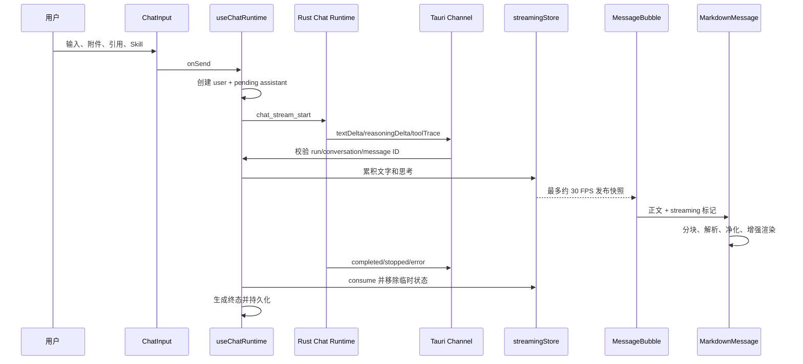
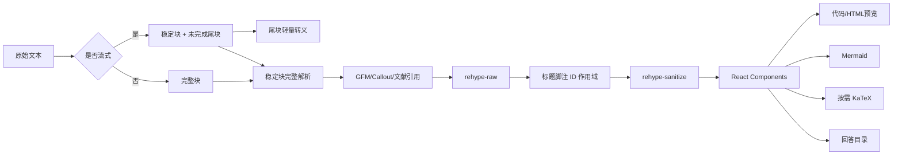

# 08 Chat 与内容渲染

> 2026-08-23 同步：Markdown 会话导出改为便携目录包，正文通过相对链接引用 `attachments/` 中复制的原始附件；深度笔记过程状态由常驻任务中心统一显示，不再额外显示输入区长驻进度 Toast。

## 0. 阅读说明

本文解释一条消息如何从用户输入，经过模型流式事件，最终变成安全、可交互的 Markdown、公式、代码、Mermaid 图表和回答目录。内容以当前 `0.1.7` 工作区源码为准；未提交的 Agent 过程展示也包含在“已实现”中，但不能据此声称已经发布。

状态标识：**已实现**表示当前代码存在；**部分实现**表示主流程可用但仍有已知边界；**规划中**表示后续方向。

## 1. 零基础概念

### 1.1 消息与流式生成

Chat 不是等待服务器一次返回完整字符串。流式传输（Streaming）会不断产生小片段，例如 `textDelta` 和 `reasoningDelta`。前端需要拼接片段、控制更新频率、保持滚动稳定，并在 `completed/stopped/error` 到达后把瞬时内容变成可持久化消息。

`ChatMessage`（`src/types/chat.ts:114-141`）是时间线实体，保存角色、正文、附件、文献/笔记引用、reasoning、状态、模型快照、用量、Skill 快照、Tool 轨迹和工作流摘要。状态为 `pending | streaming | completed | stopped | error`。

### 1.2 Markdown AST 与安全净化

Markdown 渲染不是简单替换字符串。Mnemora 使用 `react-markdown` 和 Unified 管线把 Markdown 解析为抽象语法树（Abstract Syntax Tree, AST），通过 Remark 插件处理 Markdown 层，再通过 Rehype 插件处理 HTML 层，最后生成 React 节点。

模型输出属于不可信输入。即使运行在本地 WebView，允许 `<script>`、事件属性或 `javascript:` URL 仍会带来脚本执行和界面仿冒风险。因此项目采用允许列表净化，不让模型直接控制应用 DOM。

## 2. 完整数据流



## 3. 发送与终态持久化

`useChatRuntime`（`src/features/chat/hooks/useChatRuntime.ts:63-347`）是消息编排层。发送时它验证内容、附件和引用，生成用户消息及助手占位消息，锁定本轮模型与 Skill 快照，并可在上下文达到阈值时先做压缩。发送给 Rust 的 `ChatCompletionRequest` 只带供应商/模型 ID、提示词、模型消息、能力选项和权限模式，不包含 API Key。

流式路径由 `useStreamingRun` 处理（`src/features/chat/hooks/useStreamingRun.ts:37-185`）：

1. 创建唯一 `runId`，记录 `conversationId/messageId`。
2. `textDelta` 和 `reasoningDelta` 分别进入瞬时 store。
3. `toolTrace` 以 `callId` 更新同一轨迹，不重复追加状态节点。
4. `skillActivated` 只保存 Skill 身份与内容哈希快照，不复制整个 Skill 正文。
5. 终态到达后消费完整流式文本，移除审批临时字段，计算 `workflowSummary`，只把稳定终态写入会话。
6. 卸载时取消仍在运行的请求、清空 RAF 和订阅。

非流式路径调用 `completeChat`，一次写入 `response.text/reasoning/usage/toolTraces`。两条路径最终都归一为同一个 `ChatMessage`，因此时间线不依赖具体供应商协议。

## 4. 高频更新为什么不直接修改 Conversation

`streamingStore`（`src/features/chat/stores/streamingStore.ts:1-160`）为每条生成中消息保存 `pendingText`、`pendingReasoning`、公开快照和订阅者。增量先追加到 pending 字符串，再通过 `requestAnimationFrame` 以 `1000/30ms` 间隔发布。`MessageBubble` 用 `useSyncExternalStore` 只订阅正在生成的助手消息。

如果每个 token 都复制整个 `Conversation.messages`：长会话会产生大量数组/字符串副本；React 会扩大更新范围；持久层可能频繁序列化。当前方案把高频瞬时状态与低频领域状态分开，结束时只合并一次。代价是必须正确处理组件卸载、订阅复用和 terminal 事件缺失。

## 5. 消息列表、滚动和回答目录

`MessageList` 使用 Virtua 虚拟化（`src/features/chat/components/MessageList.tsx:17,395-404`）。屏幕外消息卸载，生成中的最后一条消息被 `keepMounted` 保护。吸底采用 32px 离开阈值和 16px 恢复阈值；用户向上阅读后不会被流式更新抢走位置。

`ResizeObserver` 只跟随真实内容增长，不响应 Virtua 测量回调导致的轻微收缩/抖动。实际滚动安排到单个动画帧，避免一批增量触发多次布局。

回答目录是既有的重要设计并被保留。`buildMessageNavigatorNodes` 将对话轮次映射到虚拟渲染索引；四个以上节点才显示 `MessageNavigator`。目录点击通过 `scrollToIndex` 跳转，滚动阅读时用视口 30% 位置计算当前节点。消息内部的 Markdown 标题目录由 `extractMarkdownOutline` 单独生成，两者分别解决“对话轮次导航”和“单条长回答章节导航”。

## 6. Agent 思考、Skill 和 Tool 展示

当前工作区采用真实活动投影：`hasAgentActivity`（`src/features/chat/agent/projections/workflowProjection.ts:30-35`）仅在助手消息存在 reasoning、activatedSkills 或 toolTraces 时显示过程块。普通 Chat 即使处于 pending/streaming，也不会出现“准备工作流”“整理回答”等虚构步骤。

过程显示规则：

- reasoning 到达后显示实际“模型思考”文本。
- Skill 显示名称、版本和手动/Slash/模型按需加载来源。
- Tool 显示真实工具名、运行状态、参数摘要、结果预览、耗时和审批入口。
- 运行中及需审批/错误/停止时自动展开；完成后折叠但保留可查看内容。
- 用户手动展开或折叠后，由 `workflowInteracted` 阻止自动状态覆盖。

`ToolTrace` 是有界审计投影，不保存完整工具输出；字段包括 `argumentSummary/preview/inputChars/outputChars/outputTruncated/errorKind`。这控制了会话体积，也意味着它不是完整可重放日志。

## 7. Markdown 渲染管线

### 7.1 总管线

`MarkdownMessage`（`src/features/chat/components/MarkdownMessage.tsx:1-350`）执行以下步骤：



### 7.2 流式 Markdown 的半成品问题

模型可能先输出 ```` ```mermaid ````，下一帧才闭合代码围栏；也可能输出 `<div>` 后很久才给 `</div>`。若每帧按完整文档解析，解析器会不断改变 DOM 结构，出现闪烁、错误或不安全的半成品 HTML。

`splitStreamingMarkdownBlocks`（`src/features/chat/utils/streamingMarkdown.ts`）把已稳定块和尾块分开。闭合围栏可以提前增强渲染；未闭合尾块使用轻量组件并转义未完成 HTML。相关测试覆盖跨空行 HTML、未闭合 HTML、围栏内 HTML、闭合 Mermaid 和未闭合围栏（`streamingMarkdown.test.ts:7-46`）。

### 7.3 插件顺序

`createMarkdownRemarkPlugins` 使用 GFM、学习 Callout 和文献引用插件；`createMarkdownRehypePlugins` 使用 `rehypeRaw -> rehypeScopeDocument -> rehypeSanitize`（`src/features/chat/markdown/plugins/markdownPlugins.ts:1-20`）。顺序很重要：先解析允许的原始 HTML，再给标题/脚注加消息级 ID，最后统一净化。

`rehypeScopeDocument` 把标题和脚注 ID 加上 messageId，避免长会话中多个回答都出现 `#结论` 或 `fn-1` 时冲突。

## 8. 安全模型

`SAFE_CHAT_HTML_SCHEMA`（`src/features/chat/utils/htmlSecurity.ts:1-105`）只允许静态排版标签。它剥离 `class/style/onclick`，禁止 script、iframe、form、input、audio、video、svg 等可执行或可伪装应用的元素。代码围栏生成的 `language-*` 类例外保留，用于代码语言识别和 HTML 预览按钮。

URL 策略分两层：普通链接允许 `http/https/mailto`、消息内锚点和受控文献协议；图片只允许 `https/asset/blob`，拒绝 `http`、`data:` 和 `file:`。Tauri 环境的外部链接由系统 opener 打开，并带 `noopener/noreferrer`。

Mermaid 生成的 SVG 还要二次净化：删除 `script/foreignObject/iframe/object/embed/image`、事件属性和非片段链接；Mermaid 自身启用 `securityLevel: strict`、禁用 HTML 标签。

## 9. 代码、HTML、公式、图片与 Mermaid

### 9.1 代码高亮

语言围栏由 `normalizeCodeLanguage` 归一化，例如 `TS -> typescript`、`rs -> rust`，不做自动语言猜测。非 HTML、非 Mermaid 代码交给 `HighlightedCodeBlock`，`highlight.js` 按语言动态工作。超过 `maxHighlightedCodeChars=32000` 的内容不做重量级高亮；超过 48 行被视为长代码以提供可控展开。

### 9.2 HTML 预览

只有 `html/htm` 围栏显示预览按钮。点击时才动态导入 `src/features/html-preview/api.ts` 并由独立 Tauri HTML Preview 窗口处理；原始 HTML 不直接在 Chat DOM 执行。Chat 内仍只展示净化后的代码文本。

### 9.3 KaTeX

`containsMath` 先做轻量检测，只有检测到行内或块公式且当前块已经稳定，才 `lazy()` 加载 `MathMarkdownContent`、`remark-math`、`rehype-katex` 和 KaTeX CSS。普通 Chat 不常驻 KaTeX 执行包。服务端静态测试验证 `.katex`、`.katex-display` 和 MathML 输出。

### 9.4 图片

`SafeMarkdownImage` 只接收通过 URL 策略的地址，并有可见性、尺寸和失败回退处理。统一预算规定最大远程图片 8 MiB、最大解码像素 2500 万。预算是应用层保护，不代表能阻止浏览器在所有阶段的网络或解码开销，因此仍需真实 WebView 测试。

### 9.5 Mermaid

标准反引号围栏 ```` ```mermaid ```` 会由 `MarkdownCodeBlock` 转成 `MermaidBlock`。渲染过程为：

1. 初始显示源代码。
2. 元素进入可视区域才动态导入 `mermaid`。
3. 使用当前主题 CSS 变量初始化并先 `parse`。
4. 生成 SVG 后二次净化，再通过 `dangerouslySetInnerHTML` 注入受控 SVG。
5. 离开可视区域清空 SVG 字符串，重新进入时再渲染。
6. 主题属性变化且图表可见时重新渲染。
7. 错误时显示源代码和重试入口；大图可展开。

每条消息最多增强渲染 10 个 Mermaid 块，单图源码最多 24000 字符。超过预算的块退化为代码，不让异常模型输出无限创建 SVG。当前识别预算的正则只匹配反引号围栏，`~~~mermaid` 会退化为普通代码，这是已知限制。

## 10. 文献引用和笔记引用

用户消息可携带结构化 `LiteratureReference` 与 `NoteReference`，而不是把来源伪装成普通 System Prompt。`toModelMessages` 在模型上下文组装时格式化这些引用；助手回答中的“【标题，第 N 页】”由 Remark 插件匹配本轮已验证引用并转为 `mnemora-citation:<id>`。点击后回到 Work PDF 对应文献和页码。

文献引用限制为每条消息最多 8 个、单片段 32 KiB、总计 128 KiB；最多关联 12 篇文献。笔记引用保存 revisionHash、行号和选区，帮助界面提示来源内容可能已变化。

## 11. 错误隔离和可用性

- `RenderFallback` 捕获单个 Markdown 块渲染错误，回退为纯文本，不让整条消息或整个 Chat 崩溃。
- Mermaid 错误保留源码并可重试。
- 未完成流式 HTML 被转义，不进入原始 HTML 管线。
- `MessageBubble` 显示 stopped/error 终态，完成后显示时间、用量、TTFT、速度、缓存率和成本来源。
- 外部链接打开失败仅记录错误，不让消息组件卸载。
- 复制、保存笔记等异步操作具有短暂反馈，并在卸载时清理定时器。

## 12. 已实现、部分实现、规划中

### 已实现

- GFM、原始静态 HTML、Callout、脚注、表格、公式、代码、Mermaid、图片、文献引用。
- 流式块稳定化、约 30 FPS 增量发布、消息虚拟化和回答目录。
- Markdown HTML 与 URL 允许列表、Mermaid SVG 二次净化。
- Mermaid/KaTeX/HTML Preview 按需加载和渲染预算。
- reasoning、Skill、Tool 真实过程在正文外显示并在完成后可回看。
- 消息复制、编辑、删除、重生成、保存笔记、选区引用。

### 部分实现

- 侧栏会话摘要已分页，单个会话的历史消息仍整体加载。
- ToolTrace 只保存有界预览，不提供完整可重放事件日志。
- Markdown 渲染预算是启发式上限，尚未在所有超大混合消息上形成正式 Release 性能基线。
- Mermaid 增强预算只识别反引号围栏，不支持波浪线围栏。

### 规划中

- 历史消息范围分页以及重型消息块的更细粒度卸载。
- 用 Release 压力数据建立 Markdown/Mermaid 内存门禁。
- 只有数据证明离场仍残留大额内存时，才评审 Mermaid/HTML/PDF 的独立 Worker 或 WebView 隔离。

## 13. 替代方案与权衡

| 问题 | 当前方案 | 替代方案 | 取舍 |
| --- | --- | --- | --- |
| 流式渲染 | 稳定块 + 轻量尾块 | 每 token 全文重新解析 | 当前更稳定，但分块算法更复杂 |
| 长对话 | DOM 虚拟化 | 全量 DOM | 降低 DOM 内存，但动态高度定位更难 |
| Markdown 安全 | AST 净化允许列表 | iframe 沙箱全部回答 | 当前交互与性能更好，但必须维护 schema |
| Mermaid | 可见时动态渲染、离场释放 | 全部常驻 SVG | 节省内存，但回到图表需重新渲染 |
| 公式 | 条件动态加载 KaTeX | 全局加载 | 普通 Chat 更轻，首次公式有加载延迟 |
| Agent 过程 | 真实事件投影 | 固定虚拟工作流 | 更可信，但依赖供应商能提供真实元数据 |

## 14. 验证清单

```powershell
npm test -- src/features/chat/components/MarkdownMessage.test.tsx
npm test -- src/features/chat/utils/streamingMarkdown.test.ts
npm test -- src/features/chat/markdown/utils/codeBlock.test.ts
npm test -- src/features/chat/markdown/utils/outline.test.ts
npm test -- src/features/chat/utils/htmlSecurity.test.ts
npm run build
```

手工用例：

1. 发送普通文本，确认没有无意义 Agent 工作流。
2. 流式输出未闭合的代码围栏、HTML 和 Mermaid，确认先显示源码且不闪烁。
3. 完成标准 Mermaid 后确认出现 SVG、源代码切换、复制、错误重试和主题切换。
4. 输入 `<script>`、`onclick`、`javascript:`、`data:image/svg+xml`，确认被剥离。
5. 创建含 11 个 Mermaid 的回答，确认只有前 10 个增强渲染。
6. 打开长会话向上滚，确认新 token 不强制吸底；回到底部后恢复跟随。
7. 点击回答目录和 Markdown 标题目录，确认虚拟列表定位正确。
8. 完成含 reasoning/tool/skill 的回答，确认过程折叠后仍可展开查看。

## 15. 学习路径与面试表达

学习顺序：Markdown 语法 -> AST/Unified -> React 组件映射 -> XSS 与允许列表 -> 浏览器事件循环 -> RAF 和外部 store -> 虚拟列表 -> SVG/Canvas 内存 -> Tauri Channel。

面试可这样表达：

“我没有把流式 Markdown 当作普通字符串直接整页重渲染，而是把稳定块和未完成尾块分开；高频增量先进入独立 store，最多按 30 FPS 发布。完整块经过 Remark/Rehype AST 管线和严格允许列表，公式、Mermaid 与代码高亮按需加载。Mermaid 只在可见时保留 SVG，每条消息还有数量和源码长度预算。长对话用 Virtua 虚拟化，并用双阈值吸底与 ResizeObserver 增长判断消除滚动抢占和反馈闪烁。”

## 16. 证据索引

| 能力 | 源码/测试 |
| --- | --- |
| Chat 编排 | `src/features/chat/hooks/useChatRuntime.ts` |
| 流式 Channel | `src/features/chat/api/chat.ts`、`hooks/useStreamingRun.ts` |
| 30 FPS store | `src/features/chat/stores/streamingStore.ts` |
| 消息虚拟化/回答目录 | `src/features/chat/components/MessageList.tsx`、`MessageNavigator.tsx` |
| 气泡与 Agent 过程 | `MessageBubble.tsx`、`agent/components/AgentWorkflow.tsx` |
| Markdown 总管线 | `src/features/chat/components/MarkdownMessage.tsx` |
| 插件与作用域 | `markdown/plugins/markdownPlugins.ts`、`rehypeScopeDocument.ts` |
| HTML/URL 安全 | `src/features/chat/utils/htmlSecurity.ts`、`htmlSecurity.test.ts` |
| Mermaid | `markdown/components/MermaidBlock.tsx`、`utils/mermaidSecurity.ts` |
| 渲染预算 | `markdown/utils/renderLimits.ts` |
| 流式半成品 | `utils/streamingMarkdown.ts`、`streamingMarkdown.test.ts` |
| 综合渲染测试 | `components/MarkdownMessage.test.tsx` |
