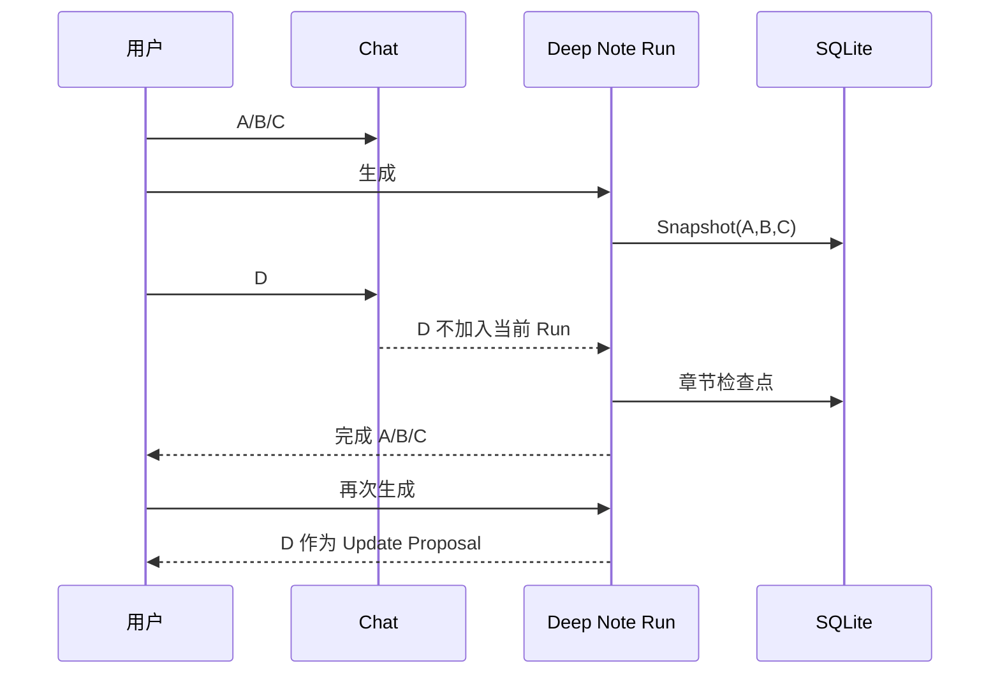
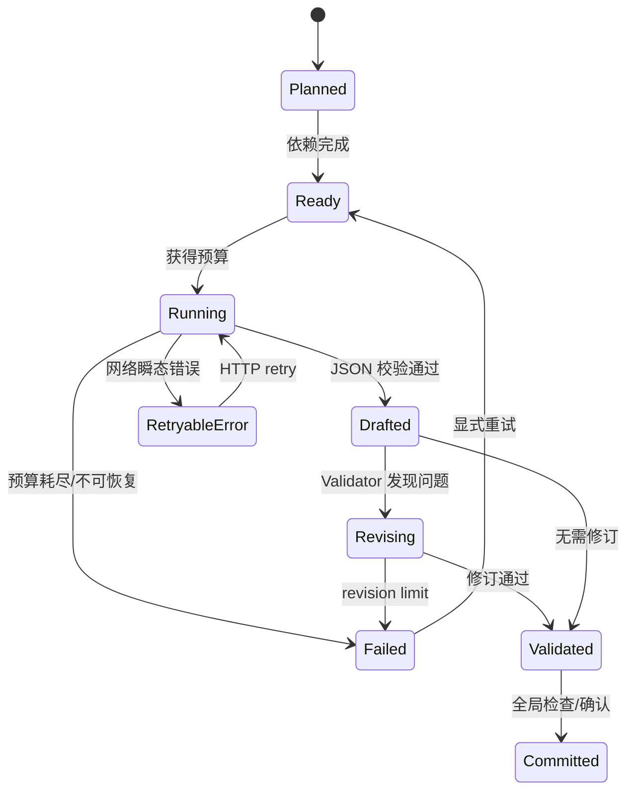
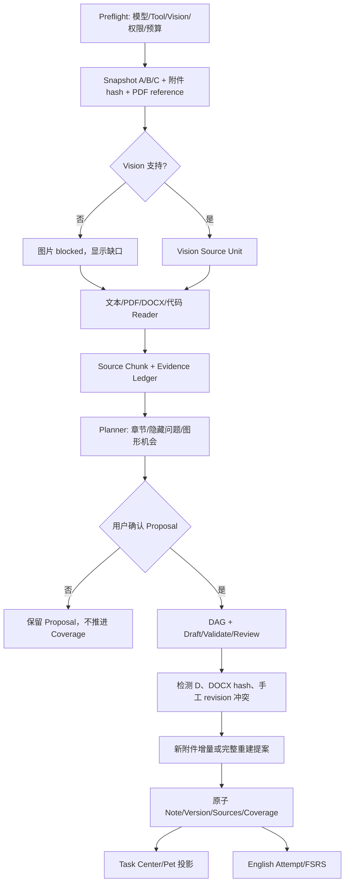

# Mnemora 整体三小时模拟面试（Grilling 深挖版）

> 目标时长：约 180 分钟。面试官不是让候选人把四份专题文档朗读一遍，而是不断追问“为什么、证据是什么、失败怎么办、如何证明、当前是否真的实现”。如果候选人回答过短，使用每题后的继续追问和反事实题；如果回答过长，要求先给结论、再给状态机和指标。
>
> 本文把深度笔记、IELTS 自适应学习、文献研读、内存优化，以及插件/桌面宠物/附件增量放到同一条系统链路中。**已实现、部分实现、规划中必须严格区分。**

## 0. 面试官剧本、时间和评分

| 时间 | 模块 | 主要问题 | 建议追问深度 |
| --- | --- | --- | --- |
| 0–15 分钟 | 项目介绍与边界 | 用户价值、非目标、本地优先、数据权利 | 3 层 |
| 15–55 分钟 | 深度笔记 | Snapshot、Reader、Prompt/Skill/Tool、DAG、增量和渲染 | 5 层 |
| 55–90 分钟 | IELTS 英语 | FSRS、三层状态、训练模式、自适应与 Band | 4 层 |
| 90–120 分钟 | 文献研读 | PDF 解析、选区、Citation、批注、版权 | 4 层 |
| 120–145 分钟 | 内存与性能 | Heap/DOM/GPU/Worker、LRU、Benchmark、OOM | 4 层 |
| 145–165 分钟 | 插件、宠物、附件增量 | Manifest、权限、脱敏、Source Unit、更新确认 | 4 层 |
| 165–180 分钟 | 综合白板与否决题 | 跨链路状态、故障注入、上线门禁 | 5 层 |

### 总评分

| 维度 | 权重 | 评估问题 |
| --- | ---: | --- |
| 问题定义 | 15% | 是否解决真正痛点，而不是堆模型功能 |
| 数据/证据合同 | 20% | 是否知道来源、版本、hash、引用和不确定性 |
| 状态与恢复 | 20% | 是否能画状态机，解释中断、重试、幂等和冲突 |
| AI/工具工程 | 15% | 是否分清 Model、Prompt、Skill、Tool、Rust |
| 安全与隐私 | 15% | 是否有最小权限、数据出境和降级边界 |
| 可观测性与实验 | 10% | 是否用 P95、覆盖率、校准和故障注入证明 |
| 表达/取舍 | 5% | 是否先结论，能承认未完成和代价 |

### 开场规则

面试官先说：

> “请先不要打开推荐答案。每个问题先用 60–120 秒回答；我会打断并继续追问。答案如果依赖当前源码，请区分‘已经实现’和‘应该实现’。”

## 1. 三个版本的项目介绍（0–5 分钟）

### 问题 1：30 秒介绍 Mnemora

**推荐回答**

Mnemora 是本地优先的 Tauri 学习与知识工作台，把 Chat、可恢复的深度笔记、PDF 文献研读和英语复习连在一起。核心不是一次生成文本，而是让来源有边界、输出有证据、任务可恢复、附件可增量更新、资源可回收。Rust/SQLite 负责权限、状态和持久化，模型只在授权上下文内分析与生成。

**继续追问：为什么用户不直接用通用 Chat？**

通用 Chat 擅长即时回答，但不天然保存输入快照、来源 hash、章节检查点、页码选区、学习调度和资源生命周期。Mnemora 的价值是把一次对话变成可回看、可验证、可继续执行的长期资产。

### 问题 2：2 分钟介绍架构

**推荐回答**

前端 React 负责 Chat、阅读器、笔记和任务进度；Tauri/Rust 负责命令边界、模型调用、Reader、DAG、SQLite 事务和窗口生命周期。输入先经过 Preflight，记录模型的 tool/vision 能力、权限和预算；Run 冻结消息与附件 Snapshot；Reader 产生 Source Unit/Chunk；Planner 产出章节和隐藏问题；用户确认 Proposal 后由 DAG 执行 Writer、Validator、Revision、Global Review；最终原子提交 Note、Version、Coverage、Sources。English 和 Literature 复用同一原则：Evidence、版本、状态和可恢复。

“ Mnemora 的架构非常清晰，我用两句话就能说清楚：
它不是一个普通聊天工具，而是一个三层架构的知识操作系统。

前端用 React 做界面（聊天、阅读器、笔记、进度）；核心用 Tauri + Rust 做引擎（负责模型调用、Reader、Planner、DAG 编排、SQLite 事务）；数据用 SQLite 保证原子性和窗口状态。

整个流程像这样：输入先过 Pre-flight 记录能力、冻结成 Snapshot；Reader 把材料拆成块；Planner 规划章节和问题；用户确认后，DAG 执行 Writer → Validator → Revision → Global Review；最后原子提交成 Note、带版本、带来源。
不管是聊天记录还是 PDF 文献，都遵循同一个原则：Evidence + Version + State + 可恢复。
所以它把一次聊天变成了可长期复用的知识资产。

### 问题 3：5 分钟讲“最难的工程问题”

**推荐回答**

最难的不是调用模型，而是处理变化：运行 A/B/C 时出现 D、附件新增或替换、用户手工编辑、窗口关闭、模型不支持图片、网络响应不确定以及大 PDF 造成资源峰值。解决方法是把输入快照、来源单元、状态机、用户确认和事务提交作为一等公民。代价是系统更复杂，需要显示缺口、保留历史并承认部分实现。

“最难的工程问题，不是调用模型本身，而是如何处理所有可能发生的变化。
我先把这些变化都列出来：运行 A/B/C 测试时出现 D、附件突然新增或替换、用户随时手动编辑、窗口一关闭就中断、模型根本不支持图片、网络响应随时可能失败、大 PDF 一下就能把内存打爆……这些场景会让系统瞬间乱套。
解决办法非常直接：把输入快照、来源单元、状态机、用户确认、事务提交这五个东西，当成系统的一等公民。
具体怎么做？输入一进来就先冻结成快照（Snapshot）；大 PDF 被 Reader 拆成小块（Source Unit）；整个状态用状态机管理；每个重要步骤必须经过用户确认（Proposal + Confirm）；最后所有步骤以原子事务提交，保证要么全成功要么全恢复。
代价是系统会比普通聊天工具复杂很多，我们要显示缺口、保留完整历史、并且承认有些地方还是要用户手动确认。
但这就是 Mnemora 的本质：把一次对话变成可回看、可验证、可长期复用的知识资产。”
**评分点**

高分回答会先给边界和可验证指标；低分回答只说“用 Agent + RAG + 向量库”。

## 2. 共同基础：问题、边界和数据权利（5–15 分钟）

### 问题 4：本项目最重要的三个不变量是什么？

**推荐回答**

1. **来源不造假**：未读取的消息、附件、页面或图片不能被标为已覆盖或被当作证据。
2. **状态可恢复**：任何用户能看到的任务进度、版本和确认结果都应从 SQLite Detail 重建，不依赖 React 内存或实时 Channel。
3. **写入可回滚**：AI Proposal、用户编辑、Coverage、Source Unit 和 Version 要么整体提交，要么整体不提交；冲突不能静默覆盖。

### 问题 5：本地优先的代价是什么？

**推荐回答**

本地优先保护隐私、离线可读和可删除，但带来跨设备同步、模型能力差异、数据库迁移、备份和加密责任。不能把“本地”当作安全自动成立；仍需密钥管理、敏感字段最小化、导出/删除、数据出境提示和崩溃恢复。联网模型是可选计算依赖，不是默认拥有全部工作区权限。

### 问题 6：哪些功能你会明确说还没完成？

**推荐回答**

深度笔记目前尚不是完整 Claim 级事实验证，DAG 的并发仍受实际执行约束，最终 `note_pipeline_outputs` 幂等闭环有缺口；代码文件目前是静态带行号读取，没有 AST/调用图；PDF 扫描/OCR/复杂版面仍需低置信度降级；IELTS Band 估计和官方题库校准未完成；内存 Benchmark/soak 需持续建设；插件执行型能力不应在第一阶段开放。明确缺口本身是可信度的一部分。

## 3. 深度笔记主链（15–55 分钟）

### 3.1 问题定义与输入冻结（15–22 分钟）

### 问题 7：深度笔记和摘要有什么本质区别？

**推荐回答**

摘要优化信息压缩；深度笔记优化知识结构和后续行动。它要识别定义、因果、流程、层次、冲突、证据和用户潜在疑问，并能在新来源出现时安全更新。验收包括 Source Coverage、Evidence Validity、Resume Equivalence、Unsupported Claim Rate、Render Success 和用户确认后的修改率。

### 问题 8：A/B/C 运行中加入 D，为什么不能直接继续？

**推荐回答**

Run 是确定函数 `F(Snapshot, Config, PromptVersion, ModelSnapshot)`。把 D 动态加入会使不同章节看到不同世界，重试不可复现，用户无法知道 D 影响了哪一段。启动时持久化 message IDs、规范化内容 hash、附件 hash、引用、模型能力、Prompt/Skill 版本和配置；D 留在会话里，但只在下一次 Run/Update Proposal 处理。



**追问：如果用户说“D 也算上，继续现在这个任务”？**

创建新 Run 或新 Proposal，新的 snapshot hash 包含 D；旧 Run 保持历史不变。UI 可以叫“继续并纳入新消息”，底层仍是新版本。

**反例**

只在前端保存快照，切页后丢失；用时间戳而不是 hash，编辑旧消息后没有发现变化；直接把 D 追加到旧 Ledger，导致来源关系不可解释。

### 3.2 Reader、代码和附件（22–29 分钟）

### 问题 9：四个 read 工具是否只支持四类文件？

**推荐回答**

它们是入口网关：`read_attachment_text` 处理 Markdown/TXT/JSON/YAML 和静态代码，`read_pdf_pages` 处理 PDF 文本层，`read_docx_blocks` 处理 DOCX 块，`read_xlsx_rows` 处理表格行。Python/TypeScript 当前按带行号文本读取，不执行，不拥有 AST、符号表或调用图。未来 Tree-sitter/AST 可以生成项目级 DAG，但 parserVersion、超时、内存和权限必须进入 Source Unit。

### 问题 10：为什么不执行代码来获得更深理解？

任意执行会带来文件、网络、供应链和不可复现风险。第一阶段只做静态分析；若未来需要运行时，应置于隔离 Worker/容器，采用默认无网络、只读工作区、CPU/内存/时间限制，执行产物标为未信任 Evidence。不能因为文件后缀是 `.py` 就声称理解其运行结果。

### 问题 11：新附件为什么不能直接 Patch？

先建立 Attachment Source Unit（attachmentId、hash、kind、parserVersion、status），真实读取并切成 Source Chunk，产生增量 Ledger，判断受影响章节，再生成附件专用 Plan/Patch/Review。首版已经持久化 `deep_note_source_units` 和 `note_edit_source_units`：用户拒绝 Proposal 不推进 Coverage，确认后原子推进 Note/Version/Sources/Coverage/Source Unit；旧附件 hash 变化仍要求完整重建；新增附件最多 24 个 Chunk 作为预算保护，不是语义完整性上限。

### 3.3 Prompt、Skill、Tool、Model（29–34 分钟）

### 问题 12：四者怎么分工？

| 层 | 责任 | 例子 |
| --- | --- | --- |
| Prompt | 本阶段输入/输出契约 | `SECTION_SYSTEM_PROMPT`、严格 JSON |
| Skill | 跨任务方法论和教学标准 | 代码解释、PDF 批判阅读、科学思维 |
| Tool | 真实、受审计动作 | Reader、状态查询、引用读取 |
| Model | 在给定证据内生成/推理 | Planner、Writer、Reviewer |

Rust 编排层负责权限、预算、顺序、取消、DAG 和写库。当前内置 Prompt 包括 `ANALYST_SYSTEM_PROMPT`、`CHUNK_ANALYST_SYSTEM_PROMPT`、`FAST_PLANNER_SYSTEM_PROMPT`、`SECTION_SYSTEM_PROMPT`、`SECTION_REVISION_SYSTEM_PROMPT`、`VISION_SOURCE_SYSTEM_PROMPT`、`STRICT_JSON_SUFFIX` 及笔记/附件编辑 Prompt。生产调用必须记录 Prompt/Skill hash。

### 问题 13：如何挖掘用户没有说出来的问题？

**推荐回答**

采用“观察—候选假设—证据/反例—澄清—教学行动”：从重复、矛盾、未定义术语和跳跃提取观察；提出多个根因；绑定 Source Chunk；询问低成本澄清问题；再生成层次图、流程图和练习。根因是可修改假设，不是对用户的心理诊断。无证据的洞察只能放“待确认”区。

### 3.4 DAG、重试和预算（34–45 分钟）

### 问题 14：请画章节状态机



节点至少有 nodeId、sectionId、dependsOn、attempt、revision、inputHash、outputHash、errorKind 和时间戳。前端显示事件，Rust 校验状态迁移；恢复从数据库重新计算 Ready 集合。

### 问题 15：HTTP retry、semantic call、章节尝试和修订有什么区别？

**推荐回答**

HTTP retry 处理 429/超时/连接断开；node attempt 重新运行一章；section revision 根据 Validator 问题定向改写；replan 重新调整计划；semantic call 是 Run 总账。当前设置是请求重试 0–5（默认 5），每章最多 5 次草稿和 5 次语义修订，单 Run 语义调用上限 640。它们不能混为一个“重试次数”。已有完整文本时不应盲目重放请求，以免重复计费和写入。

### 问题 16：640 次语义调用足够吗？

它是保护阈值而非质量保证。预算应由 `planner + source analysis + sections × (draft + revision) + global review + attachment review` 估算，并考虑失败系数；80% 预警，达到上限显示部分完成和未覆盖原因。未来按阶段、优先级和章节重要性分配预算；不能靠无界重试掩盖规划失败。

### 问题 17：`maxParallelNodes=2` 是否代表已经并发？

不代表。当前章节执行仍有共享客户端、事件顺序、SQLite 和全局预算约束，实际可能串行。真正并发需要原子领取 Ready 节点、独立取消令牌、原子预算扣减、事件序列号、幂等 section upsert 和 provider 背压。配置字段不能被当作性能承诺。

### 问题 18：中断和恢复如何保证不重复？

在 Snapshot、Source Chunk、Plan 确认、每章 Draft/Validation、Global Review、Proposal 和 Commit 边界写检查点。恢复保留已验证节点，只重置失败节点及下游；`Running/Uncertain` 通过 request key 查询或标记待确认。最终输出幂等闭环仍有缺口，应诚实地把它作为上线风险和优先改进项。

### 3.5 渲染、公式和证据（45–52 分钟）

### 问题 19：Mermaid 严重渲染失败的根因链是什么？

模型围栏可能不闭合或嵌套；Markdown AST 把它当普通 code；Mermaid ID/语法非法；React 未把顶层 block 交给 renderer；历史笔记格式不一致。修复应由 Writer schema、Rust 围栏 Validator、AST 专用渲染器、失败可见降级和历史兼容规范化共同完成。图形要表达真实流程/状态/层次，不能只为了好看。

### 问题 20：为什么公式显示为 LaTeX 文本？

检查输入 `$...$`/`$$...$$`、remark-math AST、rehype-katex、KaTeX CSS、代码块边界和不支持宏。旧 `math/latex/tex` 围栏需规范化；失败时显示原式和错误，而不是标记渲染成功。渲染成功也不代表公式结论正确，数值仍需 Evidence。

### 问题 21：用户编辑后再次生成如何避免覆盖？

Proposal 保存 baseRevisionHash 和段落 diff。当前 Note hash 变化时展示冲突；用户手工标题/段落优先，无法自动合并就要求选择。Note、Version、Coverage、Sources 和 Source Unit 必须事务提交，拒绝时保留 Proposal、不推进 Coverage。

## 4. IELTS 自适应学习（55–90 分钟）

> 详细追问参见 `01-深度笔记面试.md` 与 `02-英语面试.md` 的专题章节；本段重点测试跨系统思维。

### 问题 22：FSRS 和 IELTS Band 的边界是什么？

FSRS 管记忆单元的 Stability/Difficulty/Retrievability/Due；IELTS Band 还依赖 Listening/Reading/Writing/Speaking 技能、任务、时间压力和官方 rubric。必须建立 Memory、Skill、Exam 三层状态，不能用单词卡正确率线性换算 Band。

### 问题 23：Meaning、Spelling、Dictation 为什么要独立状态？

它们是不同提取路径。Meaning 处理 sense/词性/语境；Spelling 分类漏字、换位、词形和变体；Dictation 记录音频、口音、语速、播放次数、词边界和拼写。错题可以同时回流 Listening 和 Spelling，但不能用一次 Meaning 成功覆盖全部。

### 问题 24：自适应队列如何解释推荐？

先硬门禁到期卡、考试高风险技能和连续失败项，再按 overdue、mistake、skill gap、exam relevance、difficulty、fatigue 排序。每道题显示推荐理由和预计负担；用户可暂停但不能通过只刷简单题伪造掌握。指标看 1/7/30 天保持率、hint-adjusted accuracy、技能成长、负担、退出率和 Band 校准区间。

### 问题 25：给用户设计一周计划

目标 Band、考试日期、Academic/General、每日时间和历史 evidence 先入计划；前几天做短测确认 Listening/Writing 缺口；每天硬门禁 + Dictation 变式 + 搭配/段落连接练习；每周一次限时 Listening 子测和 Writing Task；Attempt 更新 FSRS、skill_progress 和 task_performance；周末审计是否偏向简单题并调整。

### 反事实

- 用户只做简单题：最低难度覆盖、盲测和解释欠账。
- 音频质量差：降低 evidence 权重，提示换设备，不把噪声当能力下降。
- FSRS 版本升级：保留 schedulerVersion，影子计算和灰度，不重写历史。
- 用户要求保证 Band 7：给区间、证据量和不确定性，不作保证。

## 5. 文献研读（90–120 分钟）

### 问题 26：为什么选区、页码和 hash 要一起保存？

页码能回链，归一化矩形能回到视觉区域，excerptHash 能检测文本变化；三者互补。当前 `LiteratureReference` 能保存文献、页码、文本和类型，PDF Annotation 可有 rects，但 Claim 级 Citation 仍是目标能力，不能夸大现状。

### 问题 27：扫描、多栏、表格、公式怎么办？

当前 `read_pdf_pages` 主要依赖文本层，复杂页面要低置信度；未来分层 OCR/Vision Worker、DocumentElement/bbox/readingOrder/parserVersion。低置信度不支持强断言；图表视觉区域和文本 caption 冲突时保留冲突并让用户确认。

### 问题 28：为什么不发送全文？

最小授权、成本、隐私和版权。ActiveWorkNoteContext 把当前文献 ID、页码、有限快照和 note revision 带入 Chat；Channel 只做通知，SQLite Detail 负责恢复。默认显示发送范围和 provider 保存策略。

### 问题 29：如何评估引用？

Citation Precision/Recall、页码/区域回链、unsupported-claim rate、不确定性校准、用户回原文验证率和多文献维度一致性。结论正确但页码错，answer correctness 可高但 citation precision 为零。

### 文献白板题

用户选第 14 页图 2，问是否支持作者结论，然后与论文 B 比较并生成笔记。先保存文件/页/rect/text hash，检查 Vision；无 Vision 时只能分析可靠 caption，图形本身标 blocked；回答拆成观察、作者主张、证据、缺失信息；论文 B 只读相关选区；Claim/Citation 校验后再生成 Proposal，用户确认后以 revision 事务写入。

## 6. 内存与性能（120–145 分钟）

### 问题 30：虚拟化为何不等于低内存？

它主要减少 DOM；消息字符串、PDF 文档、Canvas/GPU 纹理、Worker 缓冲、Rust 解析结果、缓存和音频仍可能驻留。要同时测 JS Heap、DOM、Canvas 像素/GPU、Worker、private bytes/RSS 和 P95/P99 长帧。

### 问题 31：Canvas 预算怎么计算？

`width × height × scale² × 4` 是 RGBA 粗估；DPR、纹理副本、PDF.js buffer 和合成层会增加开销。当前约 32 MiB 是保护目标而非精确 RSS。保留当前/邻近页，取消离屏任务，降 scale 或退回文本层，并由 ResourceRegistry 验证释放。

### 问题 32：LRU 如何保护用户数据？

L0 当前可见/脏草稿，L1 最近会话，L2 摘要/Source Chunk；按 bytes 而非对象数淘汰。pinned、activeTask、draftDirty 和被引用来源不能淘汰；解析 key 包含 fileHash/parserVersion/optionsHash。淘汰只释放可重建缓存，不删除 SQLite 事实。

### 问题 33：如何做 Benchmark？

固定 commit、OS、WebView2、设备、DPR、数据集和操作脚本；测试 idle、20/500/2000 消息、10 图片、100/1000/5000 页 PDF、Mermaid/KaTeX、深度笔记暂停恢复、音频和宠物；测 cold start、P95/P99、JS Heap、GPU/Canvas、Worker、缓存命中、取消尾延迟和 5/30/60 分钟 soak。

### 综合 OOM 题

5000 页 PDF、2000 消息和 10 图片同时打开：工作区按需加载；PDF 只保留可见页和有限邻近页；图片缩略图优先；会话摘要分层；解析 Worker 有界；Mermaid/KaTeX 延迟；音频/宠物资源注册并释放；取消传播至 Worker/Canvas/订阅；关闭窗口后任务状态仍在 SQLite，重启从 Detail 恢复。

## 7. 插件、桌面宠物与附件增量（145–165 分钟）

### 问题 34：插件 Manifest 要解决什么？

发现、版本、来源、权限、依赖、资源预算、更新、回滚和审计。Manifest 只声明能力，Permission Broker 才授予；第一阶段优先 Skill、Theme、Pet Pack、受限 Reader，不开放任意 DLL/EXE/Shell。

### 问题 35：插件如何与深度笔记连接？

插件通过明确的 Source Provider/Renderer/Skill 接口提供能力，不能直接修改 Note 或 Coverage。所有输入转成 Source Unit，输出走 Proposal 和事务；插件版本/hash 进入 Run Snapshot。网络、工作区、屏幕和凭据权限分开询问，默认拒绝。

### 问题 36：桌面宠物有什么产品价值和风险？

宠物是低干扰的任务状态投影：Thinking、Tooling、Waiting、Success、Error、Paused；它不读取正文、路径或模型参数，只接收脱敏状态。设置支持置顶、点击穿透、尺寸、透明度、位置、气泡和 Reduced Motion；主窗口关闭时销毁窗口，资源进入统一账本。默认关闭、静音、可暂停，避免打扰和隐私泄露。

### 问题 37：附件增量和宠物如何共享状态？

附件 Proposal 的阶段、已读 chunk 数、等待确认和失败原因可投影给宠物，但不发送附件正文或路径。宠物订阅 Task Center 的脱敏事件；任务持久化在 SQLite，切出对话或重启仍能显示最后一条任务进度。

## 8. 跨链路综合白板（165–175 分钟）

### 题目

用户选择 A/B/C 对话、一个 DOCX、一个 Python 文件、一张图片和 PDF 第 14 页选区生成深度笔记；生成中发送 D、关闭窗口；回来后开启 IELTS 学习和桌面宠物；图片模型不支持 Vision，DOCX 被替换，用户手工改了笔记。

### 推荐系统设计



**逐步回答**

1. 预检模型的 tool/vision 能力、重试和语义预算，显示实际发送范围。
2. 冻结 A/B/C 和附件/PDF reference；D 不进入当前 Run。
3. 图片因无 Vision 标记 blocked，不能按文件名猜；DOCX/代码/PDF 只使用真实 Reader 结果。
4. Python 静态带行号读取，不执行；PDF 选区保留页码、rect、excerpt hash。
5. 生成 Source Unit/Chunk/Ledger，Planner 提出流程图/层次图和幕后问题，用户确认后进入 DAG。
6. 关闭窗口后任务仍在 SQLite；重启从最后检查点恢复，宠物显示脱敏的最后进度。
7. DOCX 被替换后 hash 变化，旧引用 stale，走完整重建或明确的附件增量提案；D 作为新来源单独提出。
8. 用户手工修改造成 baseRevision 冲突，AI patch 不得静默覆盖；确认后原子提交。
9. IELTS 只消费已确认的知识单元/Attempt Evidence，不把未覆盖图片内容加入学习卡片。

### 追问：如果模型调用已发出但窗口关闭，不知道是否收到？

标记 `uncertain`，用 request key 查询 provider 或将该节点置为待确认；不能直接重放造成重复计费，也不能假设成功推进 Coverage。

## 9. 反事实与高压追问（175–180 分钟）

### 问题 38：如果不用 LLM，哪些价值仍然成立？

Snapshot、Reader、hash、引用、DAG 状态、事务、缓存和进度恢复仍成立；规则系统可以生成目录和差异，LLM 只是语义生成器。这个回答证明架构不是把所有责任推给模型。

### 问题 39：如果不用 DAG，换自由 Agent 会怎样？

探索更灵活，但覆盖、预算、恢复和审计更困难。可以把 Agent 放进受限节点，工具 allowlist、步数预算和结构化输出仍由外层状态机控制。

### 问题 40：如果不能使用 SQLite？

需要具备事务、版本、查询和离线恢复能力的替代存储，但必须保留相同数据合同；不能退回只在内存保存进度。选择文件日志/嵌入式数据库时要重新证明并发、崩溃恢复和迁移。

### 问题 41：如果用户拒绝所有权限，系统怎么办？

提供本地只读、无网络、无图片、无插件的降级模式；明确哪些功能不可用，不以默认同意绕过权限。宠物、文献和深度笔记都可关闭。

### 问题 42：如果只能做一项改进？

先补齐 Source Unit/Evidence 合同和最终幂等事务。它决定附件增量、文献引用、恢复、渲染错误和英语复习能否相信；更多模型、图形和插件应排在其后。

### 问题 43：什么时候否决上线？

- 未读附件或不支持 Vision 的图片被标为已覆盖；
- D 污染冻结 Run；
- 用户编辑被静默覆盖；
- 恢复导致重复写入或丢失已确认章节；
- Mermaid/KaTeX 显示源码却标记渲染成功；
- FSRS 被宣传为 Band 保证；
- PDF 引用没有页码/区域回链；
- 只测平均 RSS，没有 GPU/Worker/P95/soak；
- 插件绕过 Permission Broker 执行 shell、屏幕捕获或任意网络；
- 宠物携带正文、路径或敏感参数。

## 10. 面试官逐题评分表

| 题组 | 0 分 | 1 分 | 2 分 | 得分 |
| --- | --- | --- | --- | ---: |
| 项目定义 | 只说 AI 总结 | 提到多模块 | 有不变量、非目标和验收指标 |  |
| Snapshot/增量 | D 直接混入 | 知道新任务 | hash、Source Unit、确认、回滚完整 |  |
| Reader/代码 | 四工具=四格式 | 知道静态读取 | 能说 AST 未来和执行安全边界 |  |
| DAG/重试 | 统称 retry | 能列计数器 | 能解释状态、预算和 uncertain |  |
| 渲染/证据 | 归咎模型 | 提到 Mermaid/Citation | 有 AST、hash、降级和指标 |  |
| IELTS | FSRS=Band | 有三种模式 | 有三层状态、校准和公平实验 |  |
| 文献 | 全文上传 | 能选区问答 | 有页码/rect/hash/Claim/版权边界 |  |
| 内存 | 只看 RSS | 会虚拟化 | 有预算、所有权、取消和 soak |  |
| 插件/宠物 | 只讲动画 | 有设置项 | 有权限、脱敏、账本和回滚 |  |
| 综合取舍 | 继续加模型 | 能列风险 | 能按地基优先级和上线门禁决策 |  |

### 面试结论模板

> 候选人是否能把开放式 AI 功能约束成可恢复的产品系统：输入有快照，来源有证据，状态有持久化，失败有边界，输出有渲染和引用，资源有所有权，策略有实验，规划和现状不混淆。若能做到，即使 Claim 级引用、真正并发或 OCR 尚未完成，也具备大厂级工程判断；若用模型流畅度掩盖未读来源、错误页码、重复写入或权限缺口，应判定为高风险。

## 11. 主持人备用追问池（时间不足可跳过，时间充足必须使用）

### 数据一致性

- 两个窗口同时确认同一个 Proposal，谁获胜？
- SQLite 写入成功但前端事件丢失，如何恢复显示？
- 数据库迁移失败时，如何保留旧版本可读？
- 备份恢复后 Prompt/Model hash 不存在，能否重放？

### 模型与成本

- 如何估算一份 200 页 PDF 的 token 和费用？
- Provider 返回部分结构化 JSON，是否重试整次？
- 本地模型只支持文本，如何自动拆分图片任务？
- 如何防止 Prompt injection 藏在附件中改变工具权限？

### 用户体验

- 用户只想要三句话，为什么仍要显示证据和缺口？
- 用户等待超过预算时，如何给部分结果而不制造完成幻觉？
- 如何让宠物提示不变成打扰？
- 用户不懂术语，怎样解释“Source Coverage 83%”？

### 未来扩展

- AST 项目 DAG 如何复用 Source Unit？
- 多文献知识图谱如何避免把推断边当事实边？
- 英语复习如何把文献中的术语纳入卡片而不泄露版权全文？
- 插件如何贡献一个 Reader 而不改变核心数据库？

每个备用问题都应回到同一回答框架：**输入边界 → 状态/所有权 → 失败与降级 → 证据与指标 → 当前/未来状态**。

## 12. 三小时主持人逐段脚本（用于避免“问完目录就结束”）

### 12.1 0–15 分钟：先逼候选人定义问题

主持人不要立刻接受“这是一个 AI 知识管理工具”的回答，连续问：

1. 哪一个用户行为今天最痛苦？是找不到答案、无法判断答案是否可信，还是无法在几天后继续？
2. 如果模型质量提升 20%，而来源和恢复不变，用户是否真的得到更大价值？
3. 哪一个指标能证明用户学会了，而不是读完了更长的笔记？
4. 哪个错误比“模型回答慢”更不可接受？为什么？

**推荐追问链**

用户价值 → 可观测行为 → 数据不变量 → 失败代价 → 上线门禁。候选人若在第二步就回到“接入更强模型”，要求其给出不依赖模型的验收标准。

### 12.2 15–55 分钟：深度笔记打断式面试

按以下顺序打断，每次先让候选人画图，再问代码事实：

| 阶段 | 面试官动作 | 必问细节 |
| --- | --- | --- |
| Snapshot | 擦掉 D 消息 | hash、顺序、模型能力、旧版本 |
| Reader | 给一个 `.py` 和损坏 DOCX | 静态读取、失败状态、未覆盖 |
| Planner | 删除一个章节 | 覆盖矩阵、孤儿来源、用户确认 |
| Writer | 返回非法 JSON | repair、预算、原始响应 |
| DAG | 在 uncertain 节点断电 | request key、幂等、下游重置 |
| Update | 用户改标题 | baseRevision、冲突、事务 |
| Renderer | 放入嵌套 Mermaid | AST、降级、渲染成功定义 |

**主持人提示**：如果候选人说“全局 Reviewer 会检查”，追问 Reviewer 输入是什么、是否独立、如何避免把模型的自评当证据；如果说“直接重试”，追问重试的是 HTTP、语义、章节还是整个 Run。

### 12.3 55–90 分钟：英语模块跨学科追问

先给一个用户画像：

> “用户 60 天后考试，Meaning Recall 85%，Dictation 独立正确率 42%，Writing coherence 低；每天只能学习 25 分钟，常在手机噪声环境下练习。”

连续追问：

- 你需要哪些历史字段才能排除音频噪声？
- 今天 25 分钟如何在硬门禁和成功体验间分配？
- FSRS 更新哪一层，Writing rubric 更新哪一层？
- 如果用户只完成简单题，怎样识别策略被操纵？
- 你如何向用户解释“这道题今天优先”？
- 两周后 retention 上升但模拟考试没有提升，先怀疑什么？

要求候选人画出 Memory/Skill/Exam 三层状态，说明每次 Attempt 的 evidence 和回流关系，而不是只报一个 due date。

### 12.4 90–120 分钟：文献模块证据审讯

给出一个危险场景：扫描 PDF 第 14 页有两栏文字和一张图，模型只能文本输入；用户问“图是否证明作者结论”。

追问顺序：

1. 哪些内容可以发送？
2. 如何知道文本顺序没有错？
3. 什么字段能回到图的区域？
4. 如果回答正确但页码错，哪个指标失败？
5. 用户要求生成笔记，什么时候允许写入？
6. PDF 被替换后旧笔记怎么办？
7. 另一篇论文只提供摘要，能否做强比较？

候选人必须说出低置信度、blocked、待核验和“不确定”，不能用流畅答案掩盖视觉证据缺失。

### 12.5 120–145 分钟：内存现场题

让候选人在白板上画四条曲线：JS Heap、GPU/Canvas、Worker queue、P95 frame time。然后给操作序列：打开 5000 页 PDF → 快速滚动 → 切换 2000 条消息 → 播放音频 → 打开宠物 → 关闭主窗 → 重启。

追问：

- 哪条曲线预期先上升？
- 哪些资源可淘汰，哪些必须 pinned？
- 取消后如何证明没有幽灵任务？
- 只看到 RSS 正常但帧率下降，下一步测什么？
- 低端设备如何降级而不改变证据语义？

若回答只有“用虚拟列表”，要求补充 Canvas 预算公式、lease、ResourceRegistry、AbortSignal、P95/P99 和 soak。

### 12.6 145–165 分钟：权限和产品诱惑题

给插件一个看似合理的需求：

> “为了让宠物更聪明，插件希望读取当前屏幕、访问工作区、执行一个 Python 脚本并把摘要发送到云端。”

必须追问：

- 哪些权限默认拒绝？
- Manifest 与 Permission Broker 分别负责什么？
- 宠物实际需要哪些最小字段？
- 脚本执行如何隔离，第一阶段是否开放？
- 用户撤销权限后已有缓存如何删除？

高分答案会拒绝把体验便利当作权限正当性，并将插件输入转成 Source Unit、输出转成 Proposal，而不是允许直接写 Note。

### 12.7 165–180 分钟：终面压力题

#### 压力题 A：模型成本减半，但错误率增加

要求候选人决定是否上线。推荐思路：按任务类型分层，低风险摘要可用便宜模型，高风险 Citation/Commit 保留强模型或人工确认；用质量门禁、灰度和回滚，而不是全量切换。

#### 压力题 B：用户投诉系统“总在问确认”

区分可自动化的低风险操作和不可逆/来源变化操作。可以合并展示 Proposal、提供默认安全选项和差异预览，但不能为减少点击而静默覆盖、推进 Coverage 或发送未授权文件。

#### 压力题 C：团队要求本周上线 Claim 级引用

先冻结范围：实现最小 Selection Reference → Claim → Citation → 回链闭环，明确 OCR、跨文献图谱和自动迁移不在本周；建立 fixture、指标和回滚开关。拒绝“先让模型生成看起来像引用”的捷径。

#### 压力题 D：线上出现一次重复提交

先冻结发布、保留日志和 request key，复现 uncertain/双窗口/重启路径；检查数据库唯一约束、事务边界和事件重复消费。修复后加入故障注入和回归门禁，不能只在 UI 禁用按钮。

## 13. 跨模块共同数据合同（面试官要求现场写字段）

### Run Snapshot

```text
run_id, conversation_id, message_ids[], message_hashes[], attachment_hashes[],
literature_reference_ids[], provider_id, model_id, model_capabilities,
prompt_hashes[], skill_hashes[], config_hash, created_at
```

### Evidence

```text
evidence_id, source_unit_id, source_chunk_id, excerpt_hash, range/page/rect,
claim_id, support_level, confidence, parser_version, created_at
```

### Attempt Evidence（英语）

```text
attempt_id, unit_id, mode, answer, rating, hint_level, audio_plays,
error_kind, response_ms, environment_quality, scheduler_version, created_at
```

### Resource Lease（内存）

```text
lease_id, owner_id, kind, estimated_bytes, ref_count, pinned,
active_task, created_at, last_used_at, release_reason
```

**追问**：为什么这些对象都需要版本/hash？

因为模型输出、解析结果、学习计划和渲染资源都可能在未来变化；没有版本，无法判断缓存是否 stale、引用是否有效、恢复是否等价以及实验是否可复现。

## 14. 终局决策矩阵

| 方案 | 短期收益 | 主要风险 | 采用条件 |
| --- | --- | --- | --- |
| 全文一次性发送模型 | 开发快 | 成本、版权、幻觉、不可恢复 | 仅内部原型且明确授权 |
| Snapshot + Source Unit | 可追踪、可增量 | 数据建模复杂 | 生产默认方案 |
| 自由 ReAct Agent | 探索灵活 | 覆盖/预算/权限不可控 | 仅限隔离实验节点 |
| 章节 DAG | 可恢复、可审计 | 编排开发成本 | 深度笔记主链 |
| 只做虚拟列表 | DOM 低 | GPU/Worker 泄漏 | 只能作为局部优化 |
| 统一 ResourceRegistry | 可观测、可释放 | 接入成本 | 多窗口/多媒体场景必需 |
| FSRS 直接预测 Band | 表面简单 | 教育误导 | 禁止 |
| Claim/Citation 合同 | 可信回链 | 解析和校验复杂 | 文献/高风险笔记优先 |

面试最后要求候选人按“地基—能力—体验”排序，推荐顺序是：Source/Evidence 与事务 → Snapshot/恢复/指标 → Claim/Citation 与 AST → 真并发和更丰富图形 → 插件生态与高级 Band 估计。

## 15. 终面结束后的书面答辩任务

如果三小时结束后还需要判断候选人是否真正掌握，布置以下 30 分钟 take-home：

1. 给出一个包含 A/B/C/D 消息、替换附件、PDF 选区和一次手工笔记编辑的事件日志；画出两个 Run、一个 Proposal 和所有冲突状态。
2. 写出 Source Unit、Claim/Citation、Attempt Evidence、Resource Lease 四组字段，并说明每个 hash 何时失效。
3. 设计五个故障注入点，给出恢复后的数据库断言和用户可见文案。
4. 选择一个尚未完成能力（Claim 级证据、AST、OCR、真正并发或 FSRS Band 校准），写出四周里程碑、指标、回滚开关和不做的事情。

**推荐评分**：数据合同 30%、状态与故障 30%、取舍与边界 20%、指标与验证 20%。文档画得漂亮但没有状态/证据/回滚，不应通过。
