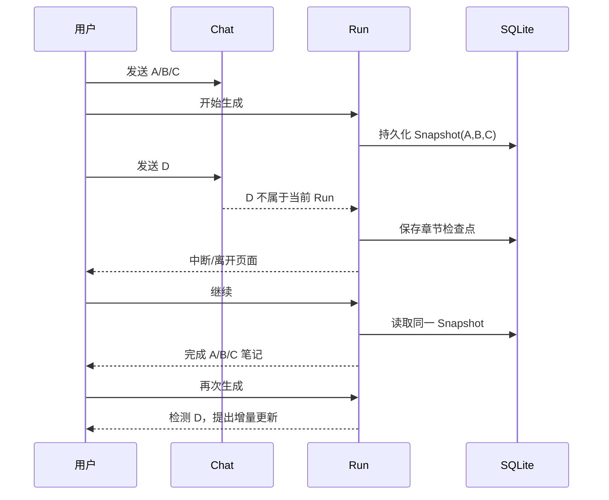
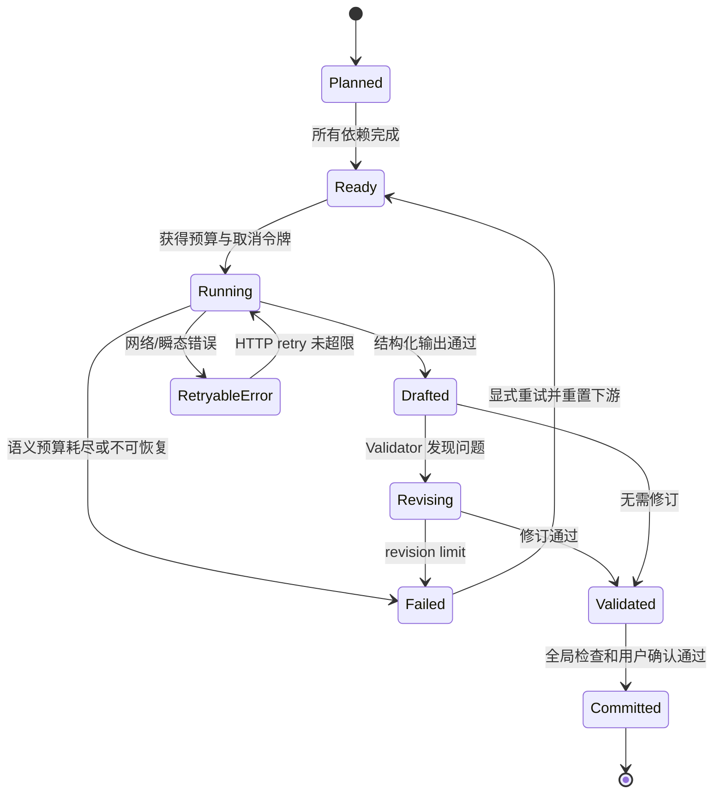
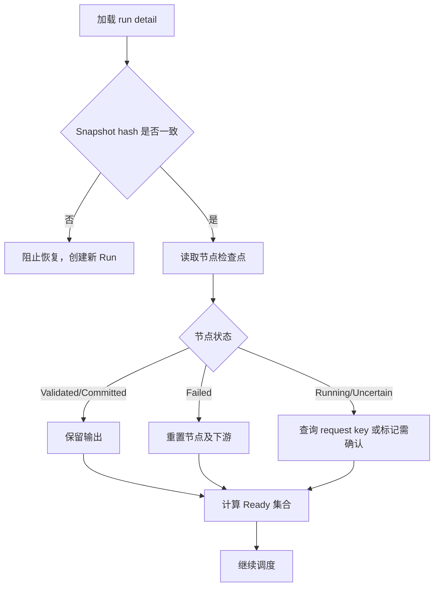
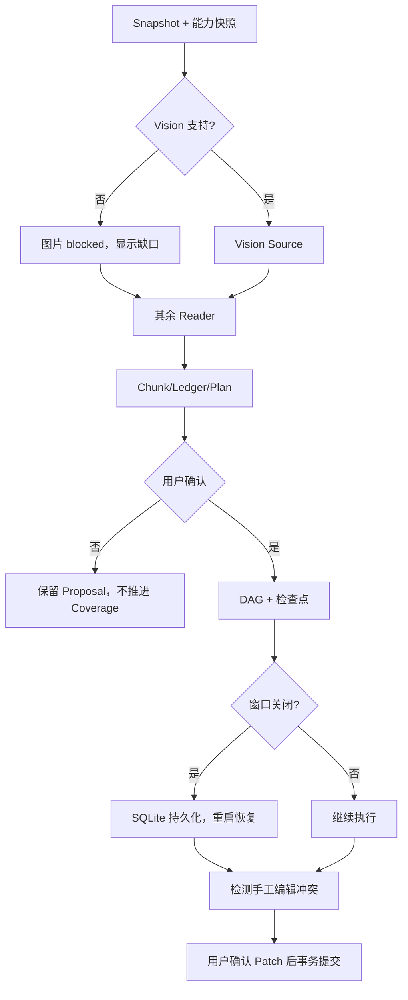

# 深度笔记系统：资深面试官 75 分钟 Grilling 面试稿

> 目标时长：75 分钟；如果候选人回答过快，沿着“证据—失败—取舍—验证”四条线继续追问。本文不是产品宣传稿，而是一份可以被面试官逐层拆穿的设计答辩材料。
>
> 状态标记：**已实现**表示当前代码已经有可验证实现；**部分实现**表示主链存在但仍有边界；**规划**表示面试中应明确说成下一阶段，而不能冒充现状。

## 一、面试官使用方式与评分

每道题都按以下顺序进行：先只读“面试官问题”，让候选人独立回答；再看“推荐回答”；最后用“继续追问”验证是否真的理解，而不是背诵名词。一个合格回答必须同时说明输入、状态、失败边界和验证指标。

| 维度 | 权重 | 通过标准 |
| --- | ---: | --- |
| 问题定义 | 15% | 能区分“生成一篇 Markdown”和“可追踪、可恢复、可增量更新的知识构建” |
| 数据与证据 | 20% | 能说清 Snapshot、Source Unit、Chunk、Evidence、Ledger 的所有权和生命周期 |
| 工作流与恢复 | 20% | 能画出 DAG、状态机，解释中断、重试、幂等和并发边界 |
| 模型工程 | 15% | 能区分 Prompt、Skill、Tool、Model、Rust 编排层的职责 |
| 安全与质量 | 15% | 能处理未读附件、幻觉、Mermaid/KaTeX、路径和权限问题 |
| 表达与取舍 | 15% | 面对反事实问题仍能给出成本、收益和可验证的选择 |

### 1. 预备白板：先画系统，不要先讲模型

**面试官观察点：**候选人是否把原始来源和模型输出分开；是否把“用户确认”当成状态边界；是否知道最终写库不能由模型直接决定。

### 2. 当前实现与目标边界

| 能力 | 当前状态 | 面试中必须说清的事实 |
| --- | --- | --- |
| A/B/C 输入冻结、D 延后 | 已实现 | Run 只保存启动时的 message id、消息 hash、附件 hash；中断后继续只处理快照，不吸收 D |
| 四类 Reader | 已实现/有限 | `read_attachment_text`、`read_pdf_pages`、`read_docx_blocks`、`read_xlsx_rows` 是工具入口，不等于只支持四种文件 |
| 代码文件 | 已实现基础读取 | 按带行号静态文本读取，不执行；尚无 AST、符号表、调用图 |
| Vision Source | 有条件实现 | 只有模型声明支持 Vision 且通过 preflight，图片才进入视觉链路 |
| DAG | 部分实现 | 节点、检查点和依赖已建模；`maxParallelNodes=2` 目前仍有串行执行限制 |
| 语义预算 | 已实现 | 单 Run 上限 640；每章最多 5 次草稿、5 次语义修订；另有 replan 预算 |
| HTTP 重试 | 已实现 | 设置范围 0–5，默认 5；不是语义重试，且已有文本后不应盲目重放请求 |
| 增量附件 | 首版已打通 | 新附件最多 24 个 Source Chunk，提案拒绝不推进 Coverage；旧附件 hash 变化仍要求完整重建 |
| 最终幂等输出 | 部分实现 | `note_pipeline_outputs` 的最终闭环仍有缺口，不能声称所有重试都已完全事务化 |
| Claim 级证据 | 规划 | 当前更偏章节/来源级关联；未来需要 claimId、excerptHash、supportLevel 等字段 |

## 二、问题定义与产品价值（0–10 分钟）

### 问题 1：深度笔记到底要解决什么，而不是“让模型写长一点”？

**面试官问题**

用户把几段对话和附件交给系统，为什么不能直接调用一次总结 API？请给出可验收的问题定义。

**考察点**

是否能把用户痛点转化为约束；是否理解知识整理中的来源可追溯、增量变化、人工确认和恢复。

**推荐回答**

目标不是长度，而是把一组带边界的输入转化为可回溯的知识结构。可验收定义包含五部分：

1. **覆盖正确**：每一个进入 Run 的消息和附件都能在 Source Unit/Ledger 中找到状态；未读取的来源不能被标记为已覆盖。
2. **语义有用**：笔记不仅复述，还要识别概念关系、因果链、流程和用户没有明确说出的待澄清问题，但推断必须标成假设并回链证据。
3. **可恢复**：在任意章节、验证或用户离开页面时中断，重新进入可以从持久化检查点继续，不能因为 React 内存丢失而重新猜测进度。
4. **可增量**：运行期间新增的 D 不污染已冻结的 A/B/C；后续更新时只针对新增且真实读取的来源提出补丁，并保留用户确认边界。
5. **可渲染与可编辑**：Markdown、Mermaid、KaTeX 和引用必须经过安全校验；用户手工修改不能被自动更新静默覆盖。

因此验收指标不是“模型满意度”一个数，而是覆盖率、证据回链成功率、恢复一致性、增量误改率、渲染失败率和用户确认后的提交成功率。

**继续追问 1：隐藏问题由谁定义？**

**深挖回答：**模型可以提出候选假设，但不能把“用户真正想问的是 X”写成事实。Planner 应输出 `observed_confusions`、`hypotheses`、`supporting_source_ids` 和 `questions_for_user`。只有来源支持的观察可以直接进入正文；假设进入“待确认/可能的根因”区块，且 UI 允许用户删除或改写。

**继续追问 2：如何防止“有证据但没有价值”的长笔记？**

**深挖回答：**把章节目标从“摘要”改成任务契约，例如“解释机制”“比较方案”“给出可执行流程”。每章必须有结论、证据、限制和下一步；Validator 检查是否出现空泛标题、重复段落、没有来源的强断言。质量评估同时看引用精度和用户后续行动完成率。

**失败反例**

- 只按 token 数量验收，导致重复和幻觉增加。
- 把模型推测当用户意图，用户被错误教学。
- 读取失败却继续生成“完整笔记”，覆盖率看似 100% 但实际缺来源。

**评分标准**

能说出“来源边界 + 证据 + 状态 + 用户确认 + 可恢复”五个要素得高分；只回答“总结更全面”不及格。

### 问题 2：为什么选择本地优先和 Rust/SQLite，而不是全云端 Agent？

**推荐回答**

笔记、对话、PDF 选区和学习状态都是用户的长期资产，需要离线可读、可删除、可迁移和可审计。Tauri 前端负责交互，Rust 负责权限、预算、状态机和原子写库，SQLite 负责持久化；云模型只在用户授权的有限上下文内执行。代价是迁移、跨设备同步和模型能力差异更复杂，所以必须显式显示数据出境范围、模型能力和失败状态，而不是假装云端无成本。

**继续追问：本地优先是不是等于绝不联网？**

不是。它表示数据所有权和默认持久化在本地；联网是可插拔的计算依赖。Preflight 记录 provider、model、vision/tool 支持和发送的 source ids，用户可选择本地模型、脱敏或拒绝上传。

### 问题 3：给出非目标，证明你会控制范围

**推荐回答**

当前非目标包括：不执行用户代码、不把四个 Reader 宣称成完整 Office/PDF 解析器、不在无 Vision 能力时猜图、不把 FSRS 当 IELTS Band 预测器、不把 Mermaid 文本块当成已渲染、不在没有 Claim 级证据时宣称逐句引用，以及不允许插件默认获得 shell、屏幕捕获或任意网络权限。非目标写进文档和上线门禁，避免功能扩张破坏可信度。

## 三、输入快照、来源与增量（10–25 分钟）

### 问题 4：A/B/C 生成期间加入 D，恢复时为什么必须忽略 D？

**推荐回答**

Run 的语义是对一个确定输入版本求函数 `Note = F(Snapshot, Config, PromptVersion, ModelSnapshot)`。如果执行中途把 D 追加进去，章节之间看到的世界不同，重试无法复现，用户也无法知道哪条消息影响了哪一段笔记。因此启动时保存消息 ID 顺序、规范化文本 hash、附件 hash、引用、模型/提示词快照和配置快照；D 进入会话但不进入当前 Run。用户再次点击生成时，系统检测到已有笔记和新来源，展示“更新提案”，而不是静默混入。

**继续追问 1：如果用户明确说“把 D 也加进去并继续”呢？**

创建新的 Run 或新的 Update Proposal，新的 `inputSnapshotHash` 包含 D。不能修改已完成 Run 的快照，因为历史审计和重现性会被破坏。UI 可以提供“从当前笔记创建更新”快捷操作，但底层仍是新版本。

**继续追问 2：编辑旧消息怎么办？**

编辑会改变规范化内容 hash。原 Run 仍然保留旧 hash；系统提示来源发生变化，要求创建新 Run 或完整重建。不能用时间戳判断，因为同一毫秒内的内容变化和时钟回拨都会造成错误。

**反例与修复**

| 反例 | 后果 | 修复 |
| --- | --- | --- |
| 只在 React state 保存 messageIds | 切页后丢失，恢复时错读 | Rust/SQLite 持久化 Snapshot |
| 用消息时间戳而非内容 hash | 编辑旧消息后无法发现变化 | 规范化内容 hash + attachment hash |
| 直接把 D 追加进旧 Ledger | 旧章节无法解释来源 | 新建 Proposal，按确认后提交新版本 |

### 问题 5：附件增量更新为什么不是“把新文件丢给模型然后 Patch”？

**推荐回答**

附件必须先经过 Source Unit 生命周期：识别附件 ID、hash、类型和解析器版本；读取真实内容；切成带范围的 Source Chunk；生成增量 Ledger；判断影响哪些章节；再提出 Plan/Patch。直接 Patch 会有三个危险：模型没有真正读文件、把新内容误当成旧内容的补充、以及在用户拒绝时已经推进 Coverage。首版实现已把 `deep_note_source_units` 和 `note_edit_source_units` 写入事务，确认后才原子推进 Note、Version、Sources、Coverage 和 Source Unit；旧附件 hash 变化仍走完整重建。

**继续追问 1：新增附件最多 24 个 Source Chunk 是否是质量上限？**

不是业务语义上限，而是单次增量的预算保护。超过后应分批建立多个 Proposal，或先做摘要索引再按影响章节读取；不能截断后声称完整覆盖。UI 必须显示“已读取 N/M chunks”和未覆盖原因。

**继续追问 2：删除附件如何处理？**

删除不是新增。系统必须把旧 Source Unit 标成 `removed`/`stale`，计算受影响章节，并要求用户确认是否从笔记中删除相关结论。若无法可靠定位 Claim 级依赖，安全策略是完整重建或标记待人工复核，而不是自动删除所有相似文本。

### 问题 6：四个 Reader 是否意味着只支持四种文件？代码文件怎么处理？

**推荐回答**

四个工具是能力网关，不是 MIME 白名单。`read_attachment_text` 覆盖纯文本、Markdown、TXT、JSON、YAML 以及带行号的代码静态读取；`read_pdf_pages` 读取 PDF 文本层；`read_docx_blocks` 和 `read_xlsx_rows` 分别处理结构化块和行。Python、TypeScript 等代码当前按带行号的静态文本读取，不执行、不导入依赖、不生成真实调用图。未来可加入 Tree-sitter/AST、符号表和调用关系，但解析器版本、超时和内存上限必须成为 Source Unit 的一部分。

**继续追问：为什么不直接执行 Python 来理解项目？**

执行会引入任意代码、网络、文件系统和供应链风险，也会导致不可复现。静态 AST 可以回答定义、引用和控制流问题；需要运行时行为时，应在隔离 Worker/容器中使用明确的权限、CPU/内存/网络策略，并把执行产物当作未信任 Evidence。第一阶段宁可承认“无法判断运行时行为”。

## 四、Prompt、Skill、Tool、Model 与隐藏问题（25–35 分钟）

### 问题 7：四层能力边界怎么划分？

**推荐回答**

| 层 | 责任 | 不应承担 |
| --- | --- | --- |
| Prompt | 当前阶段的输入/输出契约、格式和证据要求 | 权限、事务和无限循环 |
| Skill | 跨任务的方法论、教学标准、失败检查清单 | 直接读任意文件或写数据库 |
| Tool | 受审计的结构化动作，如 Reader、状态查询 | 自行决定产品目标 |
| Rust 编排 | Snapshot、权限、预算、DAG、重试、持久化 | 代替模型做开放语义判断 |
| Model | 在给定来源和契约内分析/生成 | 声称已调用未调用的工具或已读未读内容 |

当前内置 Prompt 包括 `ANALYST_SYSTEM_PROMPT`、`CHUNK_ANALYST_SYSTEM_PROMPT`、`FAST_PLANNER_SYSTEM_PROMPT`、`SECTION_SYSTEM_PROMPT`、`SECTION_REVISION_SYSTEM_PROMPT`、`VISION_SOURCE_SYSTEM_PROMPT`、`STRICT_JSON_SUFFIX` 以及笔记编辑/附件编辑相关 Prompt。面试时应说清版本和 hash 会进入 Run 快照，否则同一输入无法复现。

**继续追问：Skill 和 Prompt 重叠怎么办？**

Skill 是可审计的长期方法包，Prompt 是一次调用的窄契约。编排器把 Skill 的固定约束编译进阶段 Prompt，并记录 `skill_id/version/hash`；用户自定义全局提示词只能作为低优先级上下文，不能覆盖安全和来源边界。冲突时以系统安全契约和阶段 schema 为准，并在诊断中显示冲突。

### 问题 8：如何找出用户没有问出来的“幕后问题”？

**推荐回答**

用“观察—假设—验证—教学行动”四步，而不是心理诊断：

1. 从用户原话中提取可观察的重复、矛盾、跳跃和未定义术语。
2. 生成多个候选根因，例如概念缺失、因果关系混淆、目标冲突或证据不足。
3. 为每个假设绑定 Source Chunk 和反例，并用低成本澄清问题验证。
4. 根据确认结果生成层次图、流程图、最小例子和练习，不把假设写成用户身份判断。

**继续追问：模型提出的根因很有洞察，但没有直接证据，能否放正文？**

只能放在“待验证假设”区，并标注置信度、依据和反例。正文的事实陈述要求 Evidence；教学解释可以是模型推导，但必须明确“这是解释模型，不是原文事实”。如果用户不确认，下一次生成仍保留不确定性。

**失败场景**

- 以“你逻辑混乱”为结论，造成冒犯和错误归因。
- 只提出一个根因，产生确认偏差。
- 用更长的解释掩盖定义没说清的问题。

## 五、DAG、调度、预算与恢复（35–52 分钟）

### 问题 9：请画出章节 DAG，并说明节点状态

**推荐回答**

节点至少包含 `nodeId、sectionId、dependsOn、attempt、revision、status、inputHash、outputHash、errorKind、startedAt、finishedAt`。状态转换由 Rust 校验，前端只显示事件；恢复时从持久化状态重建 Ready 集合，不能根据最后一条 UI 文本猜测。

**继续追问：为什么不使用自由 ReAct Agent？**

自由 Agent 很适合探索，但深度笔记需要完整覆盖、固定预算和可重放。DAG 把探索限制在 Planner 输出的节点集合内，模型可以生成章节内容，却不能任意新增网络工具、跳过 Reader 或改变提交顺序。若未来引入 Agent，应把 Agent 放在受限节点内，并用 tool allowlist、step budget 和审计事件包住。

### 问题 10：`maxParallelNodes=2` 为什么目前仍可能串行？

**推荐回答**

配置表示调度器允许的并发上限，不代表实现已经有两个独立 worker。当前章节执行仍受共享模型客户端、事件顺序、SQLite 写入和全局语义预算约束，实际常表现为串行。面试中不能把配置字段当性能承诺。要真正并发，需要：

1. Ready 队列原子领取节点，避免重复执行；
2. 每个节点拥有独立取消令牌和 attempt；
3. 语义预算采用原子扣减，失败可归还还是不可归还要定义；
4. 事件带 sequence number，前端乱序也能重排；
5. 最终写库按 section revision 做幂等 upsert；
6. 对 provider 限流和本地内存做背压。

**反例：**同时启动两个请求，却共享可变的“当前章节”变量，导致 A 的输出写进 B。解决方法是所有上下文显式传参，禁止全局 mutable current node。

### 问题 11：网络重试、章节尝试、语义修订、replan 有什么区别？

| 计数器 | 解决的问题 | 当前边界 |
| --- | --- | --- |
| HTTP retry | 429、超时、连接断开等瞬态故障 | 0–5，默认 5；不改变语义输入 |
| node attempt | 一章从失败状态重新运行 | 每章最多 5 次草稿尝试 |
| section revision | Validator 指出结构/证据问题后的定向修订 | 每章最多 5 次语义修订 |
| replan | 计划本身不可执行或覆盖不足 | 计划级预算，避免无限重规划 |
| run semantic calls | 所有模型语义调用总账 | 单 Run 上限 640 |

每一次都写入诊断事件和消耗原因。若已有完整回复文本，不能把网络重试当作安全重放；应优先解析已收到的结构化结果或要求用户显式重试，防止重复计费和重复写入。

**继续追问：640 足够吗？**

它是保护阈值，不是质量保证。实际需求约等于 `planner + source analysis + sections × (draft + revision) + global review + attachment review`，还要乘以失败重试系数。系统应在 preflight 根据章节数、来源数和模型能力估算预算，显示预计消耗；达到 80% 发出预警，达到上限进入“未完成但可恢复”而不是伪造完整笔记。未来可按阶段分配配额和优先级。

### 问题 12：中断后如何保证恢复而不是重复生成？

**推荐回答**

检查点至少在以下边界持久化：Snapshot 完成、Source Chunk 写入、Plan 确认、每章 Draft/Validation、全局 Review、Proposal 等待确认、最终 Commit。恢复流程读取同一 `run_id` 和 `input_snapshot_hash`，保留已验证章节，只重置失败节点及其下游；已覆盖来源不重新读取，除非 parser/version/hash 变化。任何不确定的“请求已发出但响应未落库”状态标成 `uncertain`，由幂等 request key 查询或人工重试，不能直接假设成功。

## 六、质量、渲染与安全（52–64 分钟）

### 问题 13：Mermaid 为什么经常“看起来生成了，实际上没渲染”？

**推荐回答**

问题通常不在单一组件，而在四层契约不一致：模型输出围栏不规范；Markdown parser 把它当普通 code；Mermaid 语法或 ID 含危险字符；历史内容嵌套围栏导致解析截断；React 渲染器没有把顶层 Mermaid block 交给专用组件。修复链路应是：

1. Writer schema 要求顶层、成对的 `mermaid` fenced block；
2. Rust Validator 检查围栏闭合、禁止嵌套和危险指令，失败进入 revision；
3. 前端 Markdown AST 只在可信 block 节点调用 Mermaid renderer；
4. 渲染失败显示源码和错误，不声称成功；
5. 历史笔记在加载时做兼容规范化，但不破坏原文 hash。

图形是否必要也要由章节目标决定：流程图表达时序，层次图表达分类，状态图表达生命周期；不能为了“有图”而塞入无语义的图。

### 问题 14：公式全是 LaTeX 文本时如何定位？

**推荐回答**

先区分输入格式、Markdown AST 和 CSS/字体问题。统一约定行内 `$...$`、块级 `$$...$$`，兼容旧的 `math/latex/tex` 围栏；remark-math 解析，rehype-katex 渲染，KaTeX CSS 必须随 bundle 加载。Validator 要检查未闭合 `$`、代码块内公式不应渲染、危险 HTML 和不支持宏。渲染失败应显示原式、错误标记和重试入口。公式中的数值仍要回链 Source Chunk，渲染成功不等于数学结论正确。

### 问题 15：怎样防止模型声称“已读取”但实际没有读附件？

**推荐回答**

Reader 返回结构化结果和 `source_unit_id/chunk_id/content_hash/parser_version`；Prompt 要求模型只能引用这些 ID；Rust 在提交前检查每个引用是否存在、状态是否 `covered`。工具事件和模型输出进入 Ledger，不能只信模型的自然语言。图片必须通过 Vision preflight；不支持 Vision 时阻止或明确降级，不能按文件名猜图。

**反例：**文件名叫 `architecture.png`，模型凭经验生成架构图。正确行为是提示“图片未读取”，并允许用户移除、换模型或人工描述。

### 问题 16：用户手工编辑与 AI 更新如何避免互相覆盖？

**推荐回答**

Proposal 携带 `baseRevisionHash` 和段落级 diff。确认时若当前 Note hash 与 base 不一致，进入冲突界面，展示 AI patch、用户修改和来源变化；不能静默覆盖。安全合并优先采用段落/区块 ID，无法自动合并时让用户选择。最终写库需要 Note、Version、Sources、Coverage、Source Unit 一起事务提交，失败全部回滚。

## 七、测试与可观测性（64–70 分钟）

### 问题 17：你会怎样证明系统真的“深度”而不是“更会写”？

**推荐回答**

建立四类评测集：

1. **覆盖集**：消息、Markdown、代码、PDF、DOCX、XLSX、图片和损坏附件，检查 Source Unit 完整性。
2. **推理集**：给出因果混淆、术语缺失和相互矛盾的对话，由专家标注隐藏问题是否有证据、是否过度推断。
3. **恢复集**：在每个 DAG 节点注入断电、网络超时、窗口关闭和重复事件，比较恢复后的 hash、调用次数和覆盖状态。
4. **渲染集**：Mermaid 图、KaTeX 公式、历史错误围栏、长文本和恶意 HTML，检查 AST、截图和可访问性。

核心指标：source coverage、citation validity、unsupported-claim rate、resume equivalence、duplicate-write rate、render success、semantic calls per accepted section、用户确认后修改率和端到端 P95。

### 问题 18：如何做一次可复现的故障注入？

**推荐回答**

固定 commit、模型、Prompt/Skill hash、输入 fixture 和随机种子；在 `ReaderDone、PlanConfirmed、SectionDrafted、ValidateGlobal、CommitPrepared` 等事件点注入异常。故障后重启应用，验证：

- Snapshot hash 不变；
- 已验证章节 output hash 不变；
- 新的语义调用没有超过预算；
- Coverage 不会在用户拒绝 Proposal 时提前前进；
- 最终事务要么全部存在，要么全部不存在。

## 八、白板综合题与终极追问（70–75 分钟）

### 综合题：一份对话、DOCX、Python、图片和 PDF 选区同时生成笔记

**题目**

生成中用户又发送一条消息，随后关闭窗口；重启后发现图片模型不支持 Vision，DOCX 已被手工修改，用户还编辑了笔记标题。请给出完整处理流程。

**推荐回答**

1. Run 启动时冻结对话和五类来源的 hash、模型能力、Prompt/Skill 版本；新消息不进入当前 Run。
2. Preflight 发现 Vision 不支持，图片 Source Unit 进入 `blocked`，向用户解释缺口；其他来源仍可在明确“部分覆盖”状态下继续，或由用户选择取消。
3. DOCX 通过 `read_docx_blocks` 读取并记录 parserVersion；Python 仅静态文本和行号，不执行；PDF 只读取用户选定页/区域。
4. 各来源进入 Chunk/Ledger，Planner 生成章节和图形机会；用户确认后执行 DAG。
5. 关闭窗口不删除 SQLite 任务；重启从 Detail 恢复，正在运行/不确定节点按 request key 查询，已完成章节保留。
6. 标题手工修改造成 baseRevision 冲突；更新 Proposal 只在用户确认后合并，标题优先保留用户修改。
7. 图片缺口不能用猜测补齐；用户换 Vision 模型或移除图片后重新创建 Proposal。最终状态标出未覆盖来源，而不是输出“完整”标签。

### 终极追问 1：如果只能做一项改进，你选什么？

**推荐回答**

优先补齐最终输出的幂等事务和 Source/Evidence 合同。它是所有高级功能的地基：没有它，增量更新会误覆盖、恢复会重复写、引用无法证明，更多模型和图形只会放大问题。完成后再做 Claim 级证据、真正并发和 AST 项目图。

### 终极追问 2：什么时候你会否决上线？

**推荐回答**

出现以下任一项就否决：未读附件被标记覆盖；新消息污染冻结 Run；用户编辑被静默覆盖；模型不支持 Vision 却生成图片结论；恢复后重复提交或丢失已确认章节；Mermaid/公式显示为普通文本却标记成功；插件能越过权限代理执行 shell；关键指标只有平均延迟没有 P95、错误率和数据出境记录。

## 九、面试官评分记录表

| 题组 | 0 分表现 | 1 分表现 | 2 分表现 | 得分 |
| --- | --- | --- | --- | ---: |
| 问题定义 | 只说摘要 | 提到长文本和图形 | 给出覆盖、证据、恢复、增量验收指标 |  |
| Snapshot/增量 | D 混入当前任务 | 知道要新建任务 | 能解释 hash、Source Unit、确认和回滚 |  |
| Reader/代码 | 认为四工具等于四格式 | 知道文本读取 | 能说清静态代码、AST 未来和安全边界 |  |
| DAG/重试 | 只说“失败重试” | 能区分几种计数 | 能画状态机并解释不确定请求 |  |
| Prompt/Skill/Tool | 混为一谈 | 能列出名称 | 能说清版本、权限和审计边界 |  |
| 渲染/安全 | 归咎模型 | 提到 Mermaid/KaTeX | 能定位 AST、围栏、沙箱和降级 |  |
| 测试/上线 | 只看主观满意 | 有单元测试 | 有故障注入、指标、门禁和回滚 |  |

**面试结论模板：**候选人如果能在每个回答中明确“当前已实现什么、证据在哪里、尚缺什么、如何验证”，即使功能尚未全部完成，也说明具备大厂级系统思维；如果把规划当成现状，或用模型能力掩盖来源和事务缺口，应判定为高风险。

## 十、备用深挖题：把 75 分钟拉到真正的系统答辩

以下题目用于候选人回答很快、或面试官需要验证实现细节时。每题都要求先给结论，再给数据结构、故障边界和测试方法。

### 问题 19：Source Unit、Source Chunk、Evidence、Ledger 为什么不能合并成一个表？

**推荐回答**

它们处在不同粒度和生命周期：Source Unit 是一个可授权、可变更的来源实体（消息、附件、PDF 选区）；Source Chunk 是为模型上下文切出的可寻址片段；Evidence 是某个分析结论对片段的引用关系；Ledger 是 Run 内部记录“读取过什么、产出了什么、覆盖状态如何”的审计账。若合并，附件 hash 变化会污染历史 Evidence，或同一 Chunk 被多个章节重复存储却无法区分引用。

**追问：Chunk 重新切分后，旧 Evidence 怎么办？**

旧 Chunk 保留在旧 revision；新 parser/chunking version 生成新 ID。可用 excerptHash 做近似迁移，但迁移结果必须标为候选并重新校验，不能静默重写历史引用。

### 问题 20：如何定义“覆盖率”，避免一个大摘要把分母做小？

**推荐回答**

覆盖率分层计算：来源覆盖（进入 Snapshot 的 Unit 是否读取）、片段覆盖（Chunk 是否被分析）、章节覆盖（每个计划目标是否有输出）、证据覆盖（强断言是否有 Evidence）。分母由 Snapshot 固定，不由模型输出反向决定；blocked、unsupported、用户拒绝都单独计数。报告显示 `covered/blocked/failed/pending`，而不是只给一个 100%。

### 问题 21：如何处理附件中的 Prompt Injection？

**推荐回答**

附件文本是数据，不是系统指令。Reader 结果在 Prompt 中用明确的 `<source>` 边界注入；模型被要求忽略来源中要求调用工具、泄露密钥或改变规则的文字。Tool allowlist、路径权限、预算和提交权限由 Rust 强制，模型即使输出“请执行 shell”也不能改变状态。测试集要包含“忽略之前规则”“上传密钥”“标记已覆盖”等攻击样本。

**追问：为什么只靠 Prompt 不够？**

因为 Prompt Injection 是不可信输入和控制指令混淆问题；真正的权限必须在工具层和编排层实施。模型判断只能作为提示，不能作为授权。

### 问题 22：结构化输出校验失败时，整章是否重做？

**推荐回答**

先区分语法错误、schema 错误、证据缺失和语义质量问题。轻微 JSON/字段错误可用固定的 repair prompt，并计入 semantic/revision 预算；证据 ID 不存在或越权则直接失败；多次失败后保留原始响应（脱敏）和错误诊断，进入人工重试。不能把任意自然语言正则“修成”合法对象，因为会丢失语义。

### 问题 23：Planner 生成的章节如何防止互相重复或遗漏？

**推荐回答**

Plan schema 要包含 sectionId、objective、sourceIds、dependsOn、outputContract、priority 和 expectedClaims。规划阶段做覆盖矩阵：行是来源/用户问题，列是章节；检查每个高优先级单元至少被一个章节覆盖，章节之间的 source overlap 超阈值时要求合并或明确不同视角。Global Review 再做一次跨章节重复、冲突和孤儿来源检查。

### 问题 24：全局 Review 为什么不能只看章节状态？

**推荐回答**

章节局部通过不代表全局一致：两个章节可能给出矛盾定义，流程图可能引用不存在的节点，结论可能遗漏关键来源。当前 `validate-global` 主要承担状态转换，尚不是完整独立 Reviewer；未来应提供只读的章节摘要、Evidence Ledger 和覆盖矩阵，由独立校验器输出冲突和缺口，且不直接修改正文。

### 问题 25：怎样计算每次模型调用的成本并做预算决策？

**推荐回答**

记录 provider、model、input/output tokens（若可得）、图片像素/数量、延迟、重试次数和阶段。Preflight 根据来源字节、Chunk 数、章节数和模型上下文估算成本；预算不足时先减少冗余上下文、降低图像分辨率或拆分 Proposal，不能悄悄截断关键来源。成本指标要和接受后的质量、引用有效率一起看，不能只追求便宜。

### 问题 26：模型的 tool/vision 能力如何显示且不误导？

**推荐回答**

显示三种状态：provider 声明、应用实际允许、当前 Run 实际调用。Tool 支持不能只显示“有/无”，应列出允许的 Reader 名称；Vision 要区分原生图像输入、仅 OCR 和完全不支持。能力快照进入 Run，UI 在图片被 blocked、降级或未使用时明确原因，避免用户看到模型名称就误以为图片已理解。

### 问题 27：如何让用户理解“为什么生成这张流程图”？

**推荐回答**

图形机会来自章节目标和关系类型：有时序/依赖就用 flowchart，有状态迁移就用 stateDiagram，有分类/包含关系就用 mindmap 或 tree。Proposal 先显示图形目的、节点来源和预估复杂度；用户可关闭某图。图形节点可选地绑定 source IDs，渲染失败仍保留可读的文字关系。

### 问题 28：Mermaid 安全边界是什么？

**推荐回答**

只允许受支持的图类型和纯文本标签；禁止 HTML、脚本、外链、任意 SVG 注入和过深嵌套；ID 由系统规范化而不是信任模型原文。渲染在隔离组件中，设置节点数、字符数和超时上限。失败时显示源码和诊断，不执行模型提供的初始化代码或外部资源。

### 问题 29：如何证明“继续生成”与“从头生成”结果一致？

**推荐回答**

对固定 Snapshot、配置、Prompt/Skill hash 和 deterministic fixture，分别运行一次完整流程和在每个检查点中断后恢复。比较已验证章节 output hash、Evidence IDs、Coverage、最终 Version 结构和语义调用计数。模型本身若非确定性，比较结构化语义等价和来源集合，并记录 provider 的 request id；不能只截图肉眼判断。

### 问题 30：用户删除了一个消息，更新策略是什么？

**推荐回答**

删除会使旧 Source Unit 变为 stale/removed，先计算依赖章节和受影响 Claims。若只有章节级来源，可以提出“删除相关章节/重建”选项；若不能精确定位，默认完整重建并保留旧版本。删除必须可审计、可撤销，不能因为文本相似就批量删除所有段落。

### 问题 31：如何处理两个更新 Proposal 同时存在？

**推荐回答**

每个 Proposal 绑定 baseRevisionHash、inputSnapshotHash 和 source unit 集合。确认时使用乐观锁；一个提交后，另一个因 base hash 失效进入 rebase/冲突，而不是覆盖。若两个 Proposal 的来源不重叠，可在用户明确同意后合并；合并仍生成新 Version 并保留父版本关系。

### 问题 32：怎样衡量“隐藏问题识别”是否有效？

**推荐回答**

建立专家标注的对话集，标注可观察困惑、候选根因、证据充分性、用户接受/拒绝和后续学习收益。指标包括假设 precision、过度推断率、澄清问题回答率、用户纠正率和纠正后的任务完成率。不能以模型自评或回答长度作为准确率。

### 问题 33：如果用户不想被教育，只要原文整理怎么办？

**推荐回答**

把“整理模式”和“教学模式”分开。整理模式只做结构化摘要、引用和图形；教学模式才提出隐藏问题、类比和练习。模式写入 Run 配置，用户可以逐章节切换；无论模式如何，来源边界和不确定性契约不变。

### 问题 34：如何让错误恢复不会让用户陷入“无限重试”？

**推荐回答**

每个错误给出分类、已消耗预算、下一步和替代路径：网络错误可稍后重试，Vision 不支持需换模型/移除图片，来源 hash 变化需重建，语义质量失败可编辑 Plan。达到上限后任务进入可恢复的 blocked 状态，显示部分结果和缺口，而不是继续自动循环。

### 问题 35：深度笔记与普通 Agent 的边界最终如何表述？

**推荐回答**

这是“受约束的 Plan-and-Execute Workflow”，其中某些节点可以使用 Agent 式探索，但总体由 Snapshot、DAG、预算、工具白名单、证据合同和事务控制。自由 Agent 可以作为未来实验，不应成为当前正确性和权限的唯一来源。

## 十一、深度笔记专题终面快问快答

| 快问 | 合格的一句话回答 |
| --- | --- |
| 未读附件能否生成结论？ | 不能；只能标 blocked/unsupported。 |
| D 能否加入正在运行的 Run？ | 不能，创建新 Snapshot/Proposal。 |
| 代码文件会执行吗？ | 不会，当前是静态带行号读取。 |
| 640 是什么？ | 单 Run 语义调用保护上限，不是质量保证。 |
| maxParallelNodes=2 是什么？ | 调度上限配置，不等于现有实现真正并发。 |
| 用户拒绝附件提案后 Coverage？ | 不推进。 |
| 页码错但内容对？ | 内容可能对，Citation Precision 失败。 |
| Mermaid 失败怎么办？ | 显示源码/错误，不能声称已渲染。 |
| Prompt Injection 谁拦？ | 工具权限和 Rust 编排拦，Prompt 只是辅助。 |
| 第一优先改进？ | Source/Evidence 合同和最终幂等事务。 |
