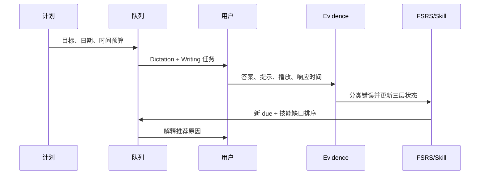

# IELTS 自适应学习模块：资深面试官 75 分钟 Grilling 面试稿

> 本稿用于面试者和面试官共同进行一场可持续约 75 分钟的系统设计答辩。重点不是背 FSRS API，而是证明：记忆调度、语言技能、考试评分、用户体验和数据安全被拆成了不同但可连接的层。
>
> 现状边界：FSRS/学习状态的完整产品链仍处于设计和逐步实现阶段。不要把规划中的 Band 预测、官方题库校准或语音评分说成已经完成。

## 一、开场与评分

| 维度 | 权重 | 高分表现 |
| --- | ---: | --- |
| 学习问题定义 | 15% | 区分记忆保持、技能熟练和考试表现 |
| FSRS 理论与实现 | 20% | 解释 Stability、Difficulty、Retrievability、Due 与不确定性 |
| 训练模式 | 20% | 能处理多义词、提示依赖、听写错误和错题回流 |
| 自适应策略 | 15% | 有硬门禁、软排序、负担控制和解释性 |
| IELTS 校准 | 15% | 不把 FSRS 直接等同 Band，能说清 rubric 和置信区间 |
| 实验与公平 | 15% | 有基线、长期指标、分层分析和回滚方案 |

### 白板总架构


## 二、问题定义（0–10 分钟）

### 问题 1：为什么普通单词卡不够？

**面试官问题**

用户说“背过很多词但 IELTS 还是上不去”。系统究竟要优化什么？

**推荐回答**

至少有三个状态：

1. **Memory state**：用户能否在没有提示时从长期记忆中取回某个意义、拼写或声音。
2. **Skill state**：用户能否把知识用于 Listening、Reading、Writing、Speaking 的任务中，并符合 rubric。
3. **Exam state**：在特定题型、时间压力、题库分布和考试日期下的表现。

单词卡主要测 memory state，不能直接代表写作连贯性或口语流利度。系统的目标是用低成本练习维护记忆，同时用真实任务验证迁移，最后通过校准集估计而不是武断宣布 Band。

**追问：为什么不只做四项完整模拟考试？**

完整模拟反馈慢、负担大、错误难定位。微任务可以快速识别词义、拼写、听辨和句法缺口；周期性整套任务再检查迁移。两者是诊断与验证关系，不是互斥选择。

**反例**

用户点击“我会了”后卡片被永久移除；短期点击率上涨，30 天保持率下降。系统必须保留 mastered audit 和长期抽查。

### 问题 2：用户没有明确说自己缺什么，怎样发现幕后问题？

**推荐回答**

从 Attempt Evidence 而不是人格标签推断：

- Meaning 正确但 Dictation 漏掉词尾，可能是听辨/形态问题；
- Spelling 正确但 Writing 任务中搭配错误，可能是迁移问题；
- Listening 做对但播放三次并依赖字幕，熟练度仍不足；
- Writing 语法正确但观点展开弱，应进入 rubric 训练而非继续刷词卡。

系统输出“观察到的模式—候选原因—下一步验证题”，用户可以否定原因。所有假设保留 evidence ids 和置信度。

## 三、FSRS 理论与数据模型（10–25 分钟）

### 问题 3：FSRS 在这里解决什么？

**推荐回答**

FSRS 根据历史复习结果估计记忆稳定性和难度，并计算在目标保持率下的下一次复习时间。可以用简化的遗忘曲线解释可取回概率：

\[
R(t) = (1 + c \cdot t/S)^{-w}
\]

实际实现应使用固定版本的 FSRS scheduler，而不是手写一个看起来相似的公式。每次 Attempt 记录 rating、响应时间、提示、模式、日期和 schedulerVersion；调度结果保存 due、stability、difficulty、state，升级时可迁移或回放。

**追问：Stability 是“记住的概率”吗？**

不是。Stability 是记忆衰减速度的参数，通常表示达到某个参考保持率所需的时间尺度；Retrievability 是当前时刻的可取回概率。不能把 stability=10 解释成“记住 10%”。

**追问：FSRS 为什么不能直接给 IELTS Band？**

Band 是多技能、任务和评分 rubric 的结果；FSRS 只描述某一可拆分记忆单元的复习状态。必须单独建模 `skill_progress`、任务表现、评分者校准和置信区间。

### 推荐数据模型

```text
learning_units
  id, canonical_form, sense_id, part_of_speech, context, variant_group
memory_states
  unit_id, mode, state, stability, difficulty, due_at, last_review_at,
  scheduler_version, target_retention
skill_progress
  user_id, skill, subskill, mastery, evidence_count, confidence, rubric_version
ielts_tasks
  id, module, task_type, difficulty, prompt_version, source_license
task_attempts
  id, task_id, unit_id, mode, answer, rating, error_kind, hint_count,
  response_ms, audio_plays, evidence_json, created_at
```

**追问：为什么 mode 必须进入 memory key？**

“知道意思”“听到声音能写出”“能在句子中使用”是不同提取路径。共用一个 due 会掩盖短板；同一个 unit 可以有 Meaning Recall、Spelling、Dictation 三个相互关联但独立的状态。

### 问题 4：评分按钮如何映射到 FSRS？

**推荐回答**

用户看到的是 Again/Hard/Good/Easy 等可理解选项，系统内部记录原始表现并映射到 scheduler rating。自动评分只能提出建议：例如拼写漏一个词尾可能是 Hard，也可能是 Again，取决于是否有提示、是否保持意义和任务目标。用户最终确认 rating，防止评分器错误污染长期状态。

**失败场景**

- 只按正确/错误二值，无法区别提示后正确和独立正确；
- 把响应速度当唯一难度，导致非母语输入法用户被误判；
- 评分模型版本变了，却原地重算历史 due。

## 四、三种训练模式（25–40 分钟）

### 问题 5：Meaning Recall 怎样处理多义词和上下文？

**推荐回答**

卡片键不是单词字符串，而是 `lemma + sense + part_of_speech + context_id`。题面给出真实语境，要求用户解释目标义项、词性和一个可接受例句。答案判定分层：

1. 义项正确且词性正确：独立成功；
2. 近义解释但范围过宽：部分正确，给对比例句；
3. 只认出词形、无法解释语境：失败；
4. 依赖首字母/翻译提示：记录 hint dependency，不能等同无提示成功。

**追问：同一个词在 Academic 和 General 语境都出现怎么办？**

保留共享 lemma，但分别维护 sense/context evidence；变式题用于检验迁移，不把一条熟悉语境的成功泛化到所有义项。

### 问题 6：Spelling 如何分类错误？

**推荐回答**

保存规范化答案和原始输入，错误分类包括漏字母、增字母、换位、词形、连字符、英美变体、同音替换、大小写和输入法干扰。编辑距离只能定位表面差异，不能解释 `advise/advice` 这种词性/语义错误，因此需要词法和上下文标签。英美拼写如果都被题库允许，应在题目 metadata 中声明，不能事后随意判错。

**追问：用户连续十次错同一词怎么办？**

触发难点降级：展示音节/词根、拆分拼写、听写短片段和最小对比题；同时限制重复次数，避免挫败。FSRS 记为 Again，但队列加入间隔和变式，而不是无限即时重复。

### 问题 7：Dictation 为什么比“听后选择”更有价值，也更危险？

**推荐回答**

Dictation 同时测音素辨识、词边界、拼写和工作记忆，但容易被口音、音质、语速和设备噪声污染。Attempt 必须记录 speaker/accent、duration、speed、play_count、字幕/回放提示和逐 token 对齐。错误回流到 Listening 和 Spelling 两个技能；如果音频质量低，降低这次 evidence 的权重，不直接更新为用户能力下降。

**追问：播放三次后答对是否算 Good？**

通常不算独立 Good。可以保留“提示后成功”标签，降低 evidence weight；若目标是考试听力且允许一次播放，则更严格。题目策略必须展示给用户，避免黑箱扣分。

## 五、自适应队列与解释性（40–52 分钟）

### 问题 8：硬门禁和软排序如何组合？

**推荐回答**

先用硬门禁保证安全和计划约束：到期卡、考试临近必须覆盖的技能、连续失败需要回流的题不能被跳过；再在剩余候选中按软分数排序：

\[
score =  w_d \cdot overdue + w_m \cdot mistake + w_g \cdot skillGap
       + w_e \cdot examRelevance + w_v \cdot variance - w_f \cdot fatigue
\]

分数只用于排序，不改变 FSRS 的记忆计算。系统显示“推荐原因”，如“听写连续两次漏掉过去式，且考试在 21 天后”，用户可以调整目标或暂缓。

**追问：如果用户只刷简单题，如何防止自适应被操纵？**

设置最低困难覆盖、随机审计和周期性盲测；把“跳过”记录为行为，不伪造成功。队列可允许用户休息，但要显示延期造成的 due 积压。

### 问题 9：错题回流和掌握审计怎么做？

**推荐回答**

错题不是简单复制。先分类错误，再生成最小变式：同义语境、不同词性、不同说话人、相近拼写或短句填空。连续成功后进入 1/7/30 天抽查；30/90/180 天仍需保留低频审计，掌握不是删除。变式成功只能提高对应 skill evidence，不能直接覆盖所有模式。

### 问题 10：怎样在不增加负担的情况下处理欠账？

设置每日时间预算和最大 overdue debt；先处理高风险门禁，再将低风险 overdue 分批平滑。若考试日期变化，重新计算任务优先级但保留历史 scheduler 记录。系统应提供“今天只做 15 分钟”的可完成计划，避免全量欠账让用户放弃。

## 六、IELTS 四项能力与 Band 校准（52–64 分钟）

### 问题 11：四项技能如何与词汇训练连接？

**推荐回答**

词汇单元是共享资源节点，不是四项成绩本身。Listening 连接音频辨识和 Dictation；Reading 连接语境 Meaning 和同义改写；Writing 连接搭配、词性和段落 rubric；Speaking 连接即时取回、发音和流利度。每项 skill 都保存独立 evidence、mastery 和 rubricVersion。

### 问题 12：Band 估计怎样避免伪精确？

只在有足够校准数据时给区间，例如 `estimated_band=6.5, CI=[6.0,7.0]`，并列出证据量、任务类型、评分器版本和未覆盖项。Writing/Speaking 必须用经过训练的 rubric 评分和人工抽检；不能用单词卡正确率线性换算 Band。模型意见与官方/专家标注冲突时显示冲突，不强行平均。

**追问：不同口音、输入法和学习背景是否公平？**

按设备、母语、口音、网络和辅助功能做分层校准，检查 false negative/positive；允许英美变体和无障碍输入，但在考试模拟模式使用相应规则。不要用未经同意的敏感属性推断能力。

## 七、实验、指标与上线（64–72 分钟）

### 问题 13：如何证明自适应比固定队列好？

**推荐回答**

设计至少三组：固定间隔基线、纯 FSRS、FSRS + 技能缺口排序。预注册目标保持率和学习时长，观察 1/7/30 天 retention、技能正确率、hint-adjusted accuracy、错题回流成功率、负担、退出率和 Band 校准误差。不能只看当天题量或点击率。采用用户分层随机化，避免同一用户在策略间污染；考试临近用户单独分析。

### 问题 14：模型改版或 FSRS 版本升级怎么回滚？

**推荐回答**

所有 scheduler、rubric、prompt 和评分器都有版本；Attempt 永远保存原始证据。升级先影子计算新 due，不立即覆盖旧计划，比较离线指标和少量灰度；回滚只切换策略版本，不删除历史。若 due 已发给用户，要记录用户看到的版本，保证审计。

## 八、终极白板题（72–75 分钟）

### 题目：60 天后考试，目标 Band 7；Meaning 好，Dictation 和 Writing coherence 差

**推荐回答**

1. 计划层记录 Academic/General、考试日期、目标 Band、每日可用时间和优先技能。
2. 通过历史 evidence 计算 Listening/Dictation 与 Writing coherence 的置信度，先做短测验证，而不是直接相信用户自评。
3. 到期和高风险错题过硬门禁；队列中提高 Dictation 及搭配/段落连接训练权重，Meaning 只保留维护量。
4. 每周安排一次限时 Listening 子测试和一次 Writing Task，使用 rubricVersion 固定的反馈；每次任务拆出错误类型并回流到微任务。
5. 记录提示、播放次数、响应时间和环境质量，更新 memory、skill、task 三层状态。
6. 每周审计是否过度偏向简单题，报告 retention、负担和 Band 区间；若数据不足，明确“不确定”。



### 终极追问：如果只能先做一个功能？

**推荐回答**

先完成可审计的 Attempt Evidence、错误分类和 skill_progress，再接 FSRS 队列。没有可靠证据，自适应只是换题顺序；没有 skill 层，FSRS 会被错误解释成 Band 预测。

## 九、红线与评价模板

- 把 FSRS 直接当 IELTS Band 预测器：否决。
- 忽略提示、播放次数、口音和音频质量：高风险。
- 只看题量、速度或点击率：指标失真。
- 掌握后永久删除、没有长期审计：不可接受。
- 评分器改版却重算历史 due：不可审计。
- 不能解释为什么推荐一道题：体验和公平性不足。

面试官最终要判断的不是“会不会做卡片”，而是候选人能否把记忆科学、语言测评、在线调度和产品风险连接成一个可验证系统。

## 十、备用深挖题：从“背单词”追问到学习科学与在线系统

### 问题 15：FSRS 的目标保持率应该固定还是个性化？

**推荐回答**

目标保持率是负担与遗忘风险的取舍。考试临近、关键技能或用户明确要求高可靠时可以提高；日常维护可降低。不能每次根据短期正确率随意改变，否则 due 不可解释。计划层保存目标值和生效时间，影子计算新参数后再逐步切换，并向用户解释“更高保持率意味着更多复习”。

**追问：高保持率一定更好吗？**

不是。过高会产生大量重复和疲劳，用户可能退出；过低会造成考试前遗忘。应优化长期 retention、技能迁移和负担的组合，而不是单一概率。

### 问题 16：FSRS 的参数如何避免被脏数据污染？

**推荐回答**

区分用户主动 rating、自动评分建议和低质量环境 evidence。提示后成功、音频噪声、输入法异常、跳过和超时都保留原始标签，并按策略降低权重或不更新核心稳定性。参数拟合使用版本化、去异常、分层和离线回放；不能把一次误触当作“忘记”。

### 问题 17：部分正确怎样评分？

**推荐回答**

建立模式特定的 rubric。Meaning 可以按义项/词性/语境分层；Spelling 按错误类型和可接受变体；Dictation 按词、标点、词边界和声音辨识分别计分。最终 rating 可以由多维 evidence 建议，但用户能看到扣分原因并修正。部分正确不应粗暴折算成 50 分再直接喂给 FSRS。

### 问题 18：提示依赖如何量化？

记录提示级别（翻译、首字母、音节、字幕、回放）和提示后响应。可以定义 `independent_success` 与 `assisted_success` 两个指标；队列排序对前者权重更高，后者用于安排变式。提示不是作弊，但必须显式，否则保持率和 Band 估计会虚高。

### 问题 19：如何设计一个不泄露答案的 Meaning Recall？

**推荐回答**

题面提供自然语境、词性和目标义项范围，不直接显示翻译或首字母；答案提交后再给可分级提示。不同 session 使用同义改写、反向解释和最小对比句，避免用户记住卡片位置。题目 metadata 保存 sense、acceptable_answers、forbidden_shortcuts 和难度。

### 问题 20：英美拼写、大小写和连字符如何公平判定？

题库声明 accepted variants；评分器先做 Unicode/空白/大小写规范化，再按语言变体规则判断。若考试模式要求一种变体，必须提前告知。把“colour”判成错而未声明会污染错误类型和用户信任。

### 问题 21：Dictation 的音频流水线如何避免大文件占满内存？

按短片段流式加载，记录音频 hash、采样率、声道、时长和缓存 lease；播放完或切换任务时释放 ArrayBuffer/AudioBuffer。预取只覆盖下一小批题，音频质量不达标时降权。播放次数和 seek 行为进入 Attempt Evidence，但不把缓存命中误算成学习成功。

### 问题 22：如何处理口音、语速和设备差异？

题目 metadata 记录 accent/speed/noise，先做设备和音频质量校准；训练阶段提供多样口音，考试模拟按目标考试规则。错误分析要区分音频不可辨识和词汇/听辨错误；公平性报告按设备、口音和辅助设置分层，不能把设备噪音归因于用户能力。

### 问题 23：自适应排序是否会形成“难题回音室”？

会。若只追逐 skill gap，用户会长期看到失败题，负担上升；若只追逐成功，短期指标好看但没有成长。队列要有探索/维护比例、难度上限、恢复题和成功体验，并显示为什么选择变式。可用 bandit 做排序实验，但硬门禁和安全上限仍由规则控制。

### 问题 24：错题回流多久算过量？

以时间预算、连续失败、即时正确率和负担反馈共同判断。即时连续重复通常不超过策略上限，之后拉开间隔并改变题型；若错误是概念性，先解释/对比再复习。回流次数写入事件，便于判断算法是否造成用户疲劳。

### 问题 25：如何把 Writing coherence 拆成可学习的单元？

不能把整篇作文当一张卡。拆成连接词功能、段落主题句、论据—解释关系、指代一致性、转折和推进等 skill units；用短段落重写、排序、诊断和完整 Task 交替验证。每项反馈引用 rubric criterion、原文片段和改写示例，避免只给总分。

### 问题 26：Speaking 的流利度能用 FSRS 吗？

只能对可拆分知识/表达模式使用 FSRS；整段口语还需流利度、发音、互动和 rubric 评估。音频评分要保存转写置信度、停顿、重复和提示，明确模型不等于官方考官。低置信度时请求人工/用户复核。

### 问题 27：如何避免“学习时间增加但能力不提升”的指标陷阱？

把行为指标和结果指标分开：题量、时长、点击是过程；1/7/30 日保持、无提示正确率、迁移任务、模拟考试 rubric 和退出率是结果。实验预先定义最小临床/教育意义的改善，不能用显著但无实际价值的微小差异宣传。

### 问题 28：A/B 测试自适应队列有哪些污染？

用户会跨设备、跨计划、互相分享题目；考试日期变化和季节性也会影响结果。优先按用户或计划随机化，记录策略版本，做 intention-to-treat 和 per-protocol 两种分析；保护对照组不被明显劣化，必要时设置退出和安全阈值。

### 问题 29：Band 评分器如何校准？

使用有授权的分层样本和训练过的人工评分，报告 inter-rater agreement、评分器偏差、置信区间和 rubricVersion。模型先做辅助评分，人工抽检和校准集决定是否展示区间。没有足够数据时显示“证据不足”，不输出精确到 0.1 的伪精度。

### 问题 30：用户要求“保证两个月 Band 7”，如何回答？

不能保证结果。系统可以根据历史 evidence、可用时间和目标日期生成风险分层计划，显示哪些技能证据不足、预期负担和区间；定期用模拟任务更新估计。承诺的是可解释的训练过程和反馈，不是不可控的考试成绩。

## 十一、英语模块快问快答

| 快问 | 合格回答 |
| --- | --- |
| FSRS 管什么？ | 记忆复习状态，不直接管 Band。 |
| Meaning 的主键？ | lemma + sense + part of speech + context。 |
| Dictation 三次回放算 Good？ | 记录 assisted success，通常不等同独立 Good。 |
| 掌握后删除吗？ | 不删除，做 30/90/180 天审计。 |
| 只看点击率可以吗？ | 不行，必须看长期保持和技能迁移。 |
| 评分器改版怎么办？ | 版本化、影子计算、灰度、可回滚。 |
| 音频噪音怎么办？ | 质量校准并降低 evidence 权重。 |
| 最先做什么？ | Attempt Evidence、错误分类、skill_progress。 |

## 十二、现场设计题与追问脚本

### 现场题 A：从一条错误到两周学习计划

**题目**：用户在听写中把 `economic` 写成 `economical`，播放两次后答对；第二天在 Writing 中又错误使用该词。请现场设计数据记录、解释和后续队列。

**推荐回答**

1. 保存音频、语境、答案、用户输入、播放次数、提示级别、响应时间和错误类别。
2. 第一次错误不是单纯拼写错误，而是词义/词性/搭配混淆；`economic` 与 `economical` 建立最小对比单元。
3. Dictation 记为 assisted success 或 Hard，不能因为最终答对就记成独立 Easy。
4. Writing Attempt 产生迁移失败 evidence，提升 skill gap 权重，但不直接把所有 memory stability 归零。
5. 接下来两周安排：短语辨析、Meaning Recall 对比句、一次无提示 Dictation 和一段 Writing 重写；间隔由 FSRS 计算，题型由技能缺口排序。
6. UI 显示推荐理由：“你在听写中依赖回放，并在写作中混淆词性”，允许用户纠正。

**追问**

- 如果用户输入是英美变体，是否判错？由题目 metadata 的 accepted variants 决定。
- 如果音频本身发音模糊，是否更新记忆？先看环境质量和其他证据，低质量不直接惩罚。
- 如果对比题连续失败，是否无限重复？不，设置即时回流上限和间隔，先提供解释。

### 现场题 B：设计一周的 25 分钟队列

**题目**：用户每天只能学习 25 分钟，due 卡 40 张，考试 45 天后，Listening 和 Writing 最弱。请给出队列算法和用户可见解释。

**推荐回答**

先预留固定比例给到期和高风险技能，再按难度、错题和考试相关性排序；不要把 40 张全部塞进当天。示例：5 分钟维护卡、10 分钟 Dictation/Listening、8 分钟 Writing micro-task、2 分钟反思/计划。若 due 债务超过预算，显示剩余债务和预计清偿时间，不偷偷降低保持率。每个候选题保存 `whyNow`、预计耗时、难度和跳过后果。

**反事实**

- 用户今天很疲劳：降低新题，保留最低门禁和成功体验。
- 用户连续跳过 Listening：提示长期风险，但允许暂停并记录。
- 考试提前到 20 天：只调整计划权重，不篡改历史 FSRS。

### 现场题 C：自适应策略的实验设计

**题目**：产品经理说“自适应队列一定比固定顺序好”，你怎样在 6 周内验证？

**推荐回答**

定义三臂：固定队列、纯 FSRS、FSRS+技能缺口排序；按用户/学习计划随机化，保留同一题库、时间预算和提示政策。主要终点是 1/7/30 日无提示保持率和目标技能迁移任务表现；次要终点是负担、退出、题量、提示依赖和 Band 校准误差。预先规定最小有效差异、样本量和停止规则，按考试日期、设备和基础水平分层。若短期题量上升但长期保持下降，应判定策略失败或需重新权衡。

### 现场题 D：评分器不确定性

**题目**：模型对 Speaking 给出 7.0，人工评分为 6.0，用户要求系统选一个。

**推荐回答**

保留两个评分及版本、证据和冲突状态，不强行平均成 6.5。展示 rubric 维度差异、转写置信度和需要人工复核的片段；Band 区间暂时扩大。后续用校准集和 inter-rater agreement 检查评分器偏差，不能用用户偏好决定事实分数。

### 现场题 E：数据迁移

**题目**：FSRS scheduler 从 v1 升级到 v2，用户已有 20,000 个 memory states。

**推荐回答**

保留 v1 状态和历史 Attempt，离线影子计算 v2 due，比较到期量、保持率预测和负担；分批灰度，记录用户看到的 schedulerVersion。确认稳定后才写新计划；发生回滚时切回策略版本，不删除 v2 计算结果。对跨版本的 due 变化提供“计划调整原因”，避免用户认为系统随机改题。

## 十三、教育理论追问

### 问题 36：间隔重复和检索练习为什么有效？

**推荐回答**

间隔重复利用遗忘与再巩固，检索练习要求主动取回而不是重复阅读；但效果取决于任务难度、反馈时机和迁移。Meaning、Spelling、Dictation 分别测试不同提取路径，真实 IELTS Task 用于迁移验证。理论是指导，不是证明产品一定有效，必须以长期实验检验。

### 问题 37：为什么“认识单词”不等于“会用单词”？

识别、回忆、语境选择、搭配、产出和听辨是不同能力。数据模型和题目设计必须分开，否则用户在选择题中表现好却在写作/听写失败。学习单元可以共享 lemma，但 evidence 和 due 按模式分开。

### 问题 38：怎样避免自适应算法取代教师判断？

算法提供候选计划、风险提示和证据；用户/教师可以调整目标、禁用题型、标记误判和覆盖评分。高风险 Band 结论需要人工或官方标准校准。所有自动建议都要有理由和撤销路径。

## 十四、英语模块上线门禁

- 任何自动评分必须保留原始答案、提示和版本，不能只存最终分数；
- FSRS due 变化可审计、可回滚，不能无记录重算；
- 语音/音频质量不足时不能直接惩罚用户；
- Band 展示必须有证据量、区间和 rubric 版本；
- 用户可以暂停、跳过和删除数据，不因拒绝个性化而失去基础功能；
- 评测必须包含多口音、设备、输入法、英美变体和辅助功能场景。

## 十五、面试官逐题评分记录

| 题组 | 0 分 | 1 分 | 2 分 | 得分 |
| --- | --- | --- | --- | ---: |
| FSRS 理论 | 只会说间隔重复 | 能解释 due | 能区分稳定性、可取回率、版本和目标保持率 |  |
| 三种模式 | 只会做选择题 | 能描述 Meaning/Spelling | 能处理义项、错误分类、提示依赖和音频质量 |  |
| 自适应队列 | 只按难度排序 | 有到期/错题 | 有硬门禁、软排序、负担和推荐解释 |  |
| IELTS Band | FSRS=Band | 知道有 rubric | 有三层状态、校准集、区间和公平性 |  |
| 实验 | 只看题量 | 有 A/B | 有长期终点、分层、污染控制和回滚 |  |

### 面试官可继续追问的边界题

1. 用户把所有答案都点 Easy，系统是否应该自动降权？答：先观察独立证据和长期保持，不能单凭按钮惩罚；可提示自评与表现不一致。
2. 用户一天漏做 200 张卡，第二天是否全部补完？答：按时间预算和风险排序平滑处理，不制造不可完成的债务。
3. 用户要求把自己的母语答案作为正确答案？答：允许自定义解释作为学习记录，但标准题的语义/拼写判定仍按题目 contract，并标记自定义。
4. 用户删除学习历史后，是否还能恢复 Band？答：删除后不应保留可识别的原始证据；只能从用户重新提供的数据开始，明确影响。
5. 用户同时准备 Academic 和 General？答：共享基础记忆单元，计划和题型 metadata 分开，避免一套考试目标污染另一套。

### 终面结论模板

候选人若能说明“记忆状态不是技能状态，技能状态不是考试分数”，并能把每次练习的原始证据、提示依赖、调度版本和长期指标串起来，可判定为高质量设计；若只讨论卡片 UI、即时正确率或一个神奇的 Band 模型，应判定为教育风险。

## 十六、最后十分钟压力追问

**面试官**：如果用户每天只完成维护卡，完全不做 Writing，系统是否应该强制？

**推荐回答**：不强制到剥夺选择，但把考试目标与证据缺口可视化，设置最低模拟任务门禁；用户可以暂停，系统记录风险和重新计划时间。教育产品应促进知情选择，而不是用黑箱惩罚。

**面试官**：如果用户的真实目标不是 Band，而是工作沟通？

**推荐回答**：计划层目标可切换为职业场景/沟通任务，复用 Memory/Skill/Attempt 基础设施，替换任务 rubric 和相关性权重。不能把 IELTS rubric 强加给所有用户。

**面试官**：如何处理学习者的隐私和未成年人？

**推荐回答**：最小化收集语音和行为数据，明确保存期限、删除和导出；敏感数据默认本地或不上传，未成年人需要适当同意和更严格的模型/广告隔离。公平性和安全门禁优先于个性化收益。

**面试官**：为什么不能让模型直接决定 due？

**推荐回答**：due 是长期状态和用户负担的关键控制量，必须由可版本化的 scheduler 计算；模型可提供错误分类和难度建议，但不能绕过规则写入不可审计的时间。

**终面判定**：能同时回答教育理论、数据字段、调度算法、评分不确定性和用户权利，才算真正理解自适应学习。

### 终极复盘清单

- 目标、时间和考试类型是否可追溯？
- 每次成功是否知道是否依赖提示？
- Memory、Skill、Exam 三层是否被错误地合并？
- due、rubric、评分器和题库是否都有版本？
- 队列是否同时照顾到期、技能缺口、疲劳和用户自主权？
- 长期实验是否超过当天行为指标？
- Band 是否以区间和证据量表达，而不是保证？
