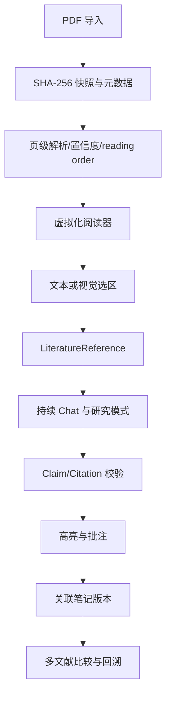
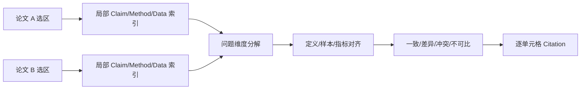
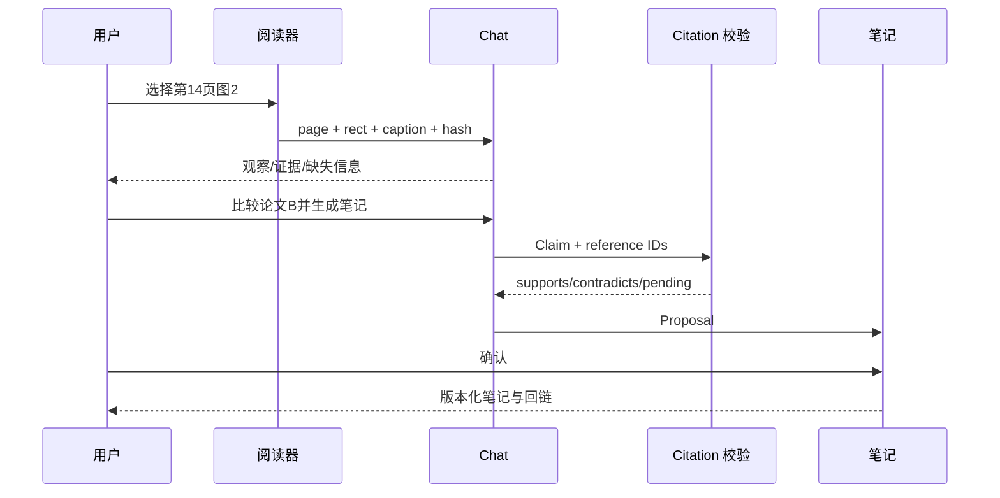

# 文献研读链路：资深面试官 75 分钟 Grilling 面试稿

> 目标：把 PDF 选区、页码和文献信息结构化注入 AI 会话，支持持续追问、分析、回溯，并与高亮、批注和关联笔记形成“阅读—研读—整理”闭环。面试中必须区分已实现、部分实现和规划，不能把目标架构冒充现状。

## 一、时间表、评分与白板

| 时间 | 模块 | 重点 |
| --- | --- | --- |
| 0–10 分钟 | 问题定义 | 为什么持续研读不等于全文摘要 |
| 10–25 分钟 | 导入与解析 | hash、revision、文本层、OCR、复杂版面 |
| 25–40 分钟 | 选区与证据 | page/rect/excerpt、Claim、Citation、置信度 |
| 40–52 分钟 | 会话与笔记 | ActiveWorkNoteContext、批注、版本、冲突 |
| 52–63 分钟 | 多文献与研究模式 | 比较、反事实、图谱和回溯 |
| 63–70 分钟 | 安全与版权 | 最小披露、删除、数据出境 |
| 70–75 分钟 | 白板与终极追问 | 图 2 是否支持结论 |

| 维度 | 权重 | 高分标准 |
| --- | ---: | --- |
| 问题定义 | 15% | 能说明研究者的持续问题和可验收目标 |
| 解析与定位 | 20% | 能处理文本层、OCR、多栏、表格、公式、图表 |
| 证据合同 | 25% | Claim 与页码/区域/hash/置信度可回链 |
| 会话闭环 | 15% | 选区、批注、Chat、笔记版本可恢复 |
| 安全与版权 | 15% | 最小授权、删除、外部来源隔离 |
| 评测与取舍 | 10% | 有 Precision/Recall、回放和降级门禁 |



## 二、问题定义（0–10 分钟）

### 问题 1：为什么不是“上传 PDF，总结全文”？

**推荐回答**

研究者需要围绕原文持续追问：方法假设什么、图 2 是否支持结论、样本怎样选、统计结果能否复现、限制在哪里、与另一篇论文为何不同。一次摘要缺少稳定页码、选区和版本，不能支撑纠错、反事实和后续笔记。目标是让每个回答都知道基于哪一个 PDF revision、哪一页、哪一个区域、哪种解析置信度。

**继续追问：选区为什么也是权限边界？**

选区是用户主动授权的最小上下文，降低 token、版权和隐私风险。扩大范围时应显示页码、字符数、图片区域、provider 和保存策略；不能默认把整个工作区上传。

### 问题 2：如何定义可验收目标？

至少有：引用页码/区域回链成功率、Citation Precision/Recall、unsupported-claim rate、OCR 置信度校准、用户回原文验证时间、批注到笔记的保留率和删除后的残留扫描结果。回答流畅、长度或用户主观满意不能替代这些指标。

### 问题 3：当前非目标是什么？

当前不宣称自动理解所有扫描件、Claim 级逐句引用已经完备、知识图谱可以替代原文、模型生成页码是真实页码，或版权材料可以无限改写传播。当前主链主要依赖 `read_pdf_pages` 文本层；复杂版面、OCR、图表视觉理解需低置信度或 blocked 降级。

## 三、导入、快照和解析（10–25 分钟）

### 问题 4：导入 PDF 时必须保存哪些不可变信息？

保存 `libraryItemId、fileHash、fileSize、pageCount、metadata、importedAt、parserId、parserVersion、permissionPolicy`，并为页面文本和结构化元素保存 hash。原文件替换后 hash 变化，应创建新 revision 或使旧引用 stale；不能按路径或文件名继续使用旧证据。

### 问题 5：快照和缓存有什么区别？

快照是研究对象的不可变身份，决定引用有效性；缓存是可重建的性能产物。缓存 key 至少包含 fileHash、parserId、parserVersion 和 optionsHash。清理缓存不能删除已确认的引用事实；删除原文时则需要清理派生缓存、批注、引用和笔记中的派生副本。

### 问题 6：为什么只保存拼接文本不够？

拼接文本丢失页边界、bbox、列顺序、脚注、表格和图表位置。统一 `DocumentElement` 保存 `pageIndex、elementType、bbox、readingOrder、contentHash、confidence、parserVersion`，既支持搜索也支持回到视觉区域。

### 问题 7：扫描件、多栏、表格和公式如何降级？

分层处理：先读文本层；无文本或低置信页面进入 OCR/Vision Worker；多栏按 readingOrder 重排但保留 bbox；表格保存单元格坐标、标题和单位；公式保存原始截图/文本、识别结果和置信度。低置信数字、负号、单位和公式只能作为检索线索，不能直接支持强结论。

**反例**：两栏 PDF 按 x 坐标排序导致右栏插入左栏中间。系统应保留 readingOrder 和冲突标记，必要时要求用户选区确认。

### 问题 8：OCR 错误如何传递到 Claim？

Claim 的置信度不能高于关键元素的解析质量。若 OCR 把 `0.05` 识别成 `0.5`，数字证据标 pending verification；回答可以描述“文本层显示为……但需核验”，不能自动支持统计结论。用户修正保留为独立 evidence，不覆盖原始 OCR。

## 四、选区、LiteratureReference 与 Citation（25–40 分钟）

### 问题 9：怎样让选区在缩放、重启和解析升级后仍能回到原文？

**推荐回答**

保存 `libraryItemId、revisionHash、pageIndex、normalizedRect、excerptText、excerptHash、elementIds、createdAt`。像素坐标会受窗口、DPI 和缩放影响，因此 rect 使用 0–1 归一化；页码、文本和 hash 作为语义锚点。恢复时先校验 revision，再尝试 element IDs/文本匹配；冲突时显示 stale，要求重新选择。

### 问题 10：当前 LiteratureReference 能证明什么？

当前可以保存文献、页码、摘录、类型以及部分 Annotation rects，证明 Chat/笔记关联了某页或选区；它还不是完整的 Claim 级事实证明。目标 Claim 合同包括：

```text
claimId
sourceReferenceIds[]
pageIndex / normalizedRects[]
excerptText / excerptHash
supportLevel: supports | contradicts | insufficient | inferred
confidence
parserVersion
generatedAt
```

### 问题 11：结论正确但页码错，算成功吗？

不算完整成功。`answer_correctness` 和 `citation_precision` 是两个指标；内容可能正确而引用失败。UI 应显示“回答可能正确，但引用待核验”，提供返回原文入口，并把该样本计入 Citation Precision 失败。

### 问题 12：如何防止模型编造页码、DOI 或引用？

模型只能选择已有 reference ID，不能自由创建页码；Rust 在提交前校验 ID、revisionHash、页范围、excerptHash 和标题。外部检索若开放，必须单独授权网络工具，并把外部来源和本地 PDF 分开标识。不存在的引用进入 Validator 错误，而不是自动纠正成“看起来合理”的页码。

### 问题 13：supports、contradicts、insufficient 为什么都要保留？

引用存在不代表支持关系。作者可能在限制段落承认反例，第二篇论文可能得到相反结果；`insufficient` 防止模型在证据不足时被迫二选一。关系类型是研究审阅和多文献比较的核心数据，而不是装饰标签。

## 五、持续会话与笔记闭环（40–52 分钟）

### 问题 14：ActiveWorkNoteContext 的作用是什么？

它把当前文献 ID、revision、选区、页码、有限快照、关联笔记 ID 和 note revision 作为可恢复上下文注入 Chat。Channel 只做实时通知；断线/切页后由 SQLite Detail 重建，不能依赖 React 内存。`note_read` 只读取有限快照，避免把全文和整篇笔记反复发送。

### 问题 15：批注如何转成笔记而不丢来源？

Annotation 保存 `annotationId、referenceId、rects、text、author、createdAt`；Chat Turn 记录使用了哪些批注/选区；笔记 Proposal 的段落带 sourceReferenceIds；Version 反向链接 Claim/Annotation。原文 revision 变化时依赖段落标 stale，不能静默保留旧页码。

### 问题 16：用户在 Chat 中纠正模型怎么办？

保存 correction event，并区分用户事实纠正、偏好和未核验意见。后续回答可以提示该纠正，但不能把用户意见伪装成论文证据；若与原文冲突，显示冲突并提供回到页码的入口。

### 问题 17：用户编辑笔记后 AI 生成更新如何合并？

Proposal 携带 `baseRevisionHash` 和段落 diff。当前 Note hash 变化时进入冲突界面；用户标题/段落优先保留，不能静默覆盖。无法自动合并时让用户选择，最终 Note、Version、Sources、Coverage 和引用一起事务提交。

## 六、研究模式、多文献和知识图谱（52–63 分钟）

### 问题 18：文献 Chat 应该支持哪些模式？

原文释义、方法拆解、结果复核、限制与反事实、术语定义、复现实验清单、研究问题生成和多文献比较。每种模式有自己的 schema：结果复核必须包含指标、样本、对照、统计假设、页码和无法判断项；不能用一个通用 prompt 生成所有回答。

### 问题 19：两篇论文如何比较而不污染上下文？

先分别构建每篇论文的 Claim/Method/Data/Result 局部索引，再按问题选择相关 Source Chunk；每个比较单元保留 paperId 和页码。相似词不代表变量相同，必须核对定义、单位、数据集和时间范围；不可比时明确写出原因。



### 问题 20：知识图谱能替代引用吗？

不能。图谱适合导航、聚类和比较；每条支持/冲突边仍须回到页码/区域或明确标为推断。图谱节点和边也要带 revision、confidence 和来源类型，避免把模型推断画成事实。

### 问题 21：如何支持持续回溯？

每个 Chat Turn 保存 context snapshot（PDF revision、选区、引用 IDs、note revision、模型配置）；用户点击引用回到原页，点击笔记段落看到生成它的 Claim 和来源。历史上下文按需加载，不把所有轮次无限塞给模型。

## 七、安全、版权、隐私与删除（63–69 分钟）

### 问题 22：默认向模型发送多少内容？

默认发送用户选区和必要邻近上下文，发送前显示标题、页码、字符数、图片范围、provider 和保存策略；不发送本地路径、未选页面和隐藏元数据。用户可以选择本地模型、关闭保存或删除缓存。

### 问题 23：全文讲义是否可以自动生成？

先遵循授权、服务条款和最小披露；优先输出结构化大纲、短摘录、比较和用户自己的批注。长文本处理需要明确范围和用户确认，不能用“改写”绕过版权策略。

### 问题 24：撤销权限或删除 PDF 后要清理什么？

原文件快照、解析/OCR 缓存、缩略图、批注、Chat 引用、笔记派生副本和外部上传都要处理；审计日志只保留最小不可逆标识。删除后做残留扫描，确认不能从缓存恢复全文。

## 八、质量评测与故障注入（69–73 分钟）

指标至少有 Citation Precision/Recall、页码/区域回链成功率、unsupported-claim rate、OCR/reading-order 置信度校准、用户回原文验证率、多文献维度一致性和删除策略泄露测试。fixture 要覆盖文本层、扫描、多栏、表格、公式、图表、冲突结论和损坏文件。

### 问题 25：怎样注入“回答写了但 Citation 没写入”的故障？

在 Chat 完成、Claim 校验、Citation 持久化、Note commit 之间分别断电/抛错。恢复后不能显示 verified；要么通过 request key 重建，要么标 pending verification。批注和笔记版本不能在引用缺失时宣称完成。

### 问题 26：如何测试页码正确但区域错误？

构造同页两个相似段落、caption、脚注和重复短句，分别标 page precision 与 region precision；只有文本 hash 和视觉区域都匹配才算完整。只对页码正确不能给满分。

## 九、终极白板题（73–75 分钟）

### 题目

用户从扫描多栏 PDF 第 14 页图 2 选择一个区域，问“结果是否支持作者结论”，然后要求生成笔记并与论文 B 比较；当前模型不支持 Vision。

**推荐回答**

1. 保存 file/revision hash、pageIndex、normalizedRect、excerptText/hash、parser confidence。
2. Vision 不支持时，图形本身 blocked；若 caption/表格文本可靠，只分析文本，并明确不能判断颜色、趋势和布局。
3. 回答拆成作者主张、可观察数字、支持程度、替代解释和缺失信息；不自由生成页码。
4. 论文 B 只读取相关选区，按 Method/Data/Result 对齐；每个比较单元保留 paper-specific citation。
5. Claim/Citation 校验通过后生成 Proposal；用户确认后以 note revision 事务写入。
6. PDF 或解析器变化使 hash 失效时，旧引用标 stale，要求重新核验。



## 十、面试官评分记录与备用反例

| 题组 | 0 分 | 1 分 | 2 分 | 得分 |
| --- | --- | --- | --- | ---: |
| 导入解析 | 全文上传总结 | 会保存页码 | hash/revision/bbox/order/confidence 完整 |  |
| 选区引用 | 只存文本 | 存页码 | rect/hash/Claim/回链/stale 完整 |  |
| OCR 复杂版面 | 假设都能读 | 提到 OCR | 分层回退、低置信度、人工核验 |  |
| 会话笔记 | 只看最后一轮 | 有关联笔记 | snapshot、批注、版本、冲突完整 |  |
| 安全版权 | 默认全文上传 | 有提示 | 最小授权、删除、审计、外部隔离 |  |
| 评测 | 看流畅度 | 看引用存在 | Precision/Recall、区域精度、回放 |  |

备用反例：同页重复短句、文件名相同但内容替换、OCR 小数点错误、caption 与图形冲突、用户意见与原文冲突、撤销权限后打开旧 Chat、两篇论文同名指标不同分母。每个反例都要求回答“状态是什么、用户看到什么、能否恢复”。

## 十一、终极复盘清单

- 文件 revision、解析版本和引用 hash 是否相互绑定？
- 文本、视觉区域、OCR 和图表证据是否能区分？
- Claim 的支持、冲突和信息不足是否显式表达？
- 用户批注、Chat Turn、笔记段落是否能双向回溯？
- 删除、版权和数据出境是否有真实清理路径？
- 多文献比较是否先对齐定义、单位和样本？
- 任何低置信度来源是否都避免强断言？

**终面判定**：高分候选人会把“研究体验”落实为数据合同、版本、坐标、hash、置信度、权限和可回放测试；如果只描述一个漂亮的 PDF 聊天界面，却无法回答谁拥有字段、何时失效、如何恢复，应判定为高风险。

## 十二、深挖加试：面试官继续追问 30 分钟

以下问题用于候选人完成主线后继续施压。每题都要求回答“当前实现/目标设计/验证方式”，不允许只给抽象原则。

### 问题 27：为什么页码从 0 开始还是从 1 开始并不只是 UI 问题？

**推荐回答**

内部索引和用户显示页码可能不同，封面、罗马数字和 PDF logical page label 还会造成偏移。数据合同应同时保存 `pageIndex`（稳定的 0-based 物理索引）和可选的 `pageLabel`（用户看到的页码），引用回链优先使用 pageIndex，UI 显示 label。模型不能自由填写显示页码替代内部索引。

### 问题 28：选区文本规范化会不会改变证据？

会。去除空白、连字符或换行有助于匹配，但可能改变公式、负号、代码和表格。保存原始 excerpt、规范化 excerpt、规范化规则版本和两个 hash；匹配只用于定位，原始文本仍是展示和审计证据。

### 问题 29：同一段文字被两个用户选中，是否应该去重？

可以共享底层 Source Element，但 Annotation/Reference 是不同的用户行为对象。去重只发生在不可变内容缓存层，不合并作者、颜色、评论、创建时间或权限。引用显示谁创建、基于哪个 note revision，避免一人的批注泄露给另一人。

### 问题 30：如何处理 PDF 中的脚注、参考文献和正文同名概念？

readingOrder 和 elementType 要保留 `body、footnote、caption、bibliography` 等类型；检索时可以提高正文权重，但不能删除脚注证据。回答引用脚注时明确标注位置，避免把参考文献条目误当作作者的实验结果。

### 问题 31：模型只读了 caption，为什么不能说“看懂了图”？

caption 是文本描述，通常缺少颜色、趋势、异常点和坐标关系。系统应将 `text_evidence` 与 `visual_evidence` 分开，Vision 不可用时只允许前者支持相关 Claim。UI 显示“基于 caption 的部分分析”，并给出换模型或人工描述的路径。

### 问题 32：如何处理 PDF 里的恶意链接或嵌入脚本？

解析器在沙箱/只读模式运行，不自动打开外链、执行 JavaScript、下载嵌入文件或访问本地路径。链接作为未验证元数据显示，用户主动点击前给出域名和权限提示。外部内容若被导入，另建 Source Unit 和安全策略，不能混入原文可信层。

### 问题 33：文献元数据从 DOI 自动补全是否可信？

自动补全是候选，不是事实。保存 provider、检索时间、原始响应和匹配置信度；标题/作者/年份与 PDF 内页冲突时标 conflict，要求用户确认。引用和笔记仍以本地 PDF revision 为主，外部元数据不能替代页码证据。

### 问题 34：如何做文献问答的上下文裁剪？

先以用户选区为硬边界，再加入有限的同页邻近元素、标题、表头和必要定义；按问题类型选择 Method/Data/Result 等 chunk。裁剪结果保存 context manifest，包含被纳入和排除的 Source IDs，便于解释“为什么没有使用某一页”。

### 问题 35：上下文太长时，先删什么？

先删重复和低相关邻近文本，保留用户选区、定义、单位、图表 caption 和直接支持 Claim 的元素；不能按 token 截断数字、否定词和限定条件。若仍超限，拆成多次检索/分析，并在回答中标明证据分批完成。

### 问题 36：如何避免摘要递归导致事实漂移？

摘要只能作为导航索引，不能替代原始 Source Chunk。每次再摘要都保存父 chunk IDs、摘要版本和生成模型；高风险 Claim 必须回到原文或结构化元素验证。超过层级上限时重新读取原文，而不是继续压缩摘要。

### 问题 37：用户要求“只告诉我作者结论，不要批判”，是否仍需显示不确定性？

可以切换回答风格，但事实边界不变。作者主张、原文观察和模型推断仍分栏；用户要求不展开批判，不等于允许删除页码、限制条件或低置信度提示。模式配置写入 Turn，便于后续回溯。

### 问题 38：如何处理作者结论在摘要和正文中不一致？

分别建立 Claim，绑定各自 page/element；Global Reviewer 标记 contradiction 或 qualification。回答按证据位置说明差异，不能只选摘要或最后一页作为“最终真相”。用户可以指定以方法/结果章节为主，但该偏好要显式记录。

### 问题 39：如何判断两个 Claim 真正矛盾，而不是条件不同？

比较 Claim 的对象、条件、时间、样本、指标方向和置信区间；先做条件归一化，再判定 supports/contradicts/compatible/unknown。模型提出矛盾候选后由规则和用户确认校验，不以关键词相反就下结论。

### 问题 40：研究笔记中的“下一步实验”是否算原文事实？

不算。它是用户/模型派生的行动建议，必须标注 `inferred` 或 `proposal`，绑定触发它的 Claim 和限制。笔记结构可分“原文事实、作者解释、我的理解、待验证实验”，避免未来复习时混淆。

### 问题 41：如何支持同一论文的多个阅读版本？

预印本、会议版、期刊版分别建 revision，保存 parent/derived 关系。相同段落可通过 hash 候选对齐，但页码和图表可能变更；引用必须指向具体 revision。比较版本时输出新增、删除、修订 Claim，而不是覆盖旧文献。

### 问题 42：如果用户只导入论文摘要，没有正文，能否生成方法分析？

可以生成“基于摘要的有限分析”，但 Source Coverage 明确只覆盖摘要，缺少方法/数据页不能强断言。Planner 将缺失章节列为 blocked，回答显示需要原文的具体问题。摘要不是全文的代理。

### 问题 43：怎样识别表格列错位？

保留列标题、行标题、合并单元格、bbox 和读取顺序；对抽取结果做单位/数量级和总和 sanity check。模型发现异常时标 parsing_conflict，要求用户选择区域或上传截图；不能静默把错位数据输入统计推理。

### 问题 44：如何处理图像中的坐标轴和单位？

视觉解析结果要保存轴名、单位、刻度和置信度；估读点值标 approximate，并区分“趋势判断”和“精确数值”。若单位缺失或多个轴冲突，Claim 进入 insufficient。图像视觉理解和文本 caption 需分别引用。

### 问题 45：如何支持研究者的自定义术语表？

术语表是用户知识层，保存 term、定义、来源、revision 和 scope；它可以影响解释和检索，但不能覆盖原文事实。用户定义与作者定义冲突时并列显示，模型必须说明采用哪一个。

### 问题 46：如何从文献自动生成英语学习卡片而不泄露全文？

只从用户明确选区和已确认笔记中提取术语，卡片保存短语、义项、出处页码和许可范围；不批量复制整篇论文。卡片的学习状态与文献引用分离，删除 PDF 后卡片按策略保留用户派生内容或标记来源失效。

### 问题 47：文献 Chat 的延迟如何控制？

首轮只做选区检索和轻量回答，复杂 Claim 校验、跨文献比较和笔记提案异步执行；显示阶段性状态和预计范围。缓存按 revision/context manifest 命中，但不能使用 stale citation。P95 延迟、引用完整率和用户取消率一起评估。

### 问题 48：如何处理用户连续快速改变选区？

每个选区有 generation/request ID；旧请求可取消，完成时校验当前 selection revision，防止回答错配到新区域。历史 Turn 仍保留旧选区，当前 Composer 只显示最新有效选择。取消不应推进引用或笔记 Coverage。

### 问题 49：如何避免批注颜色成为事实等级？

颜色是用户偏好，不自动映射 support level 或 confidence。数据层分别保存 annotation color、claim support 和 parser confidence；UI 可以提供筛选，但不能让红色批注被模型当作“错误事实”。

### 问题 50：如果用户离线阅读，回来后模型服务不可用怎么办？

阅读、搜索、选区、批注和已有笔记应继续可用；新 AI Turn 进入 queued/blocked，显示原因和重试策略。离线期间新增批注保存在本地，联网后按 revision/hash 合并；不能丢失用户工作或假装已生成。

## 十三、研究链路现场数据合同

```text
pdf_revision:
  library_item_id, revision_hash, file_hash, page_count, parser_id,
  parser_version, metadata_json, created_at
document_element:
  element_id, revision_hash, page_index, type, bbox, reading_order,
  raw_text, normalized_text, content_hash, confidence
selection_reference:
  reference_id, revision_hash, page_index, normalized_rects[],
  excerpt_text, excerpt_hash, element_ids[], created_by
claim_citation:
  claim_id, reference_ids[], support_level, confidence, parser_version,
  generated_at, verification_status
annotation:
  annotation_id, reference_id, note_revision, text, color, author, created_at
```

**现场追问**：哪个字段变化会使引用失效？

`revision_hash`、关键 `content_hash`、页码/区域映射和 parserVersion 变化都可能使引用 stale；颜色、用户显示标题等偏好通常不影响事实引用。回答必须区分“视觉位置变化”和“内容变化”。

## 十四、面试官终极取舍题

如果只能优先做一项，选择 Selection Reference → Claim/Citation → 可回链持久化的最小闭环；随后做 OCR/复杂版面降级和多文献比较。没有证据合同，更多模型、图谱和插件只会更快地产生不可验证的幻觉。上线红线是：未读页面被标覆盖、模型自由生成页码、低置信度强断言、用户编辑静默覆盖、删除后仍可恢复全文。
