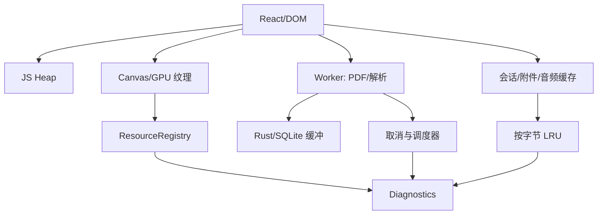
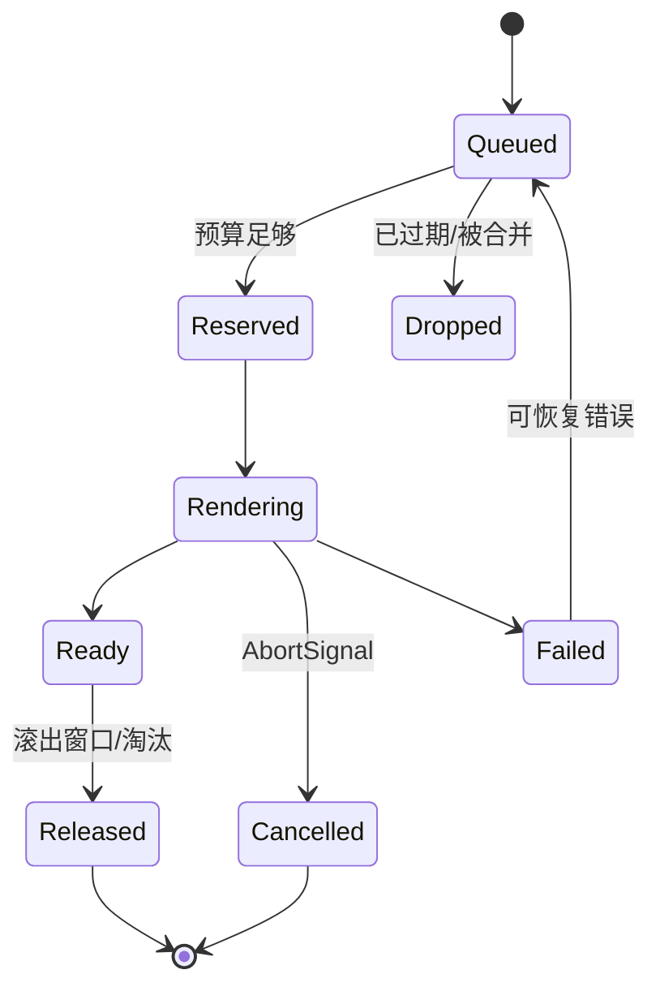
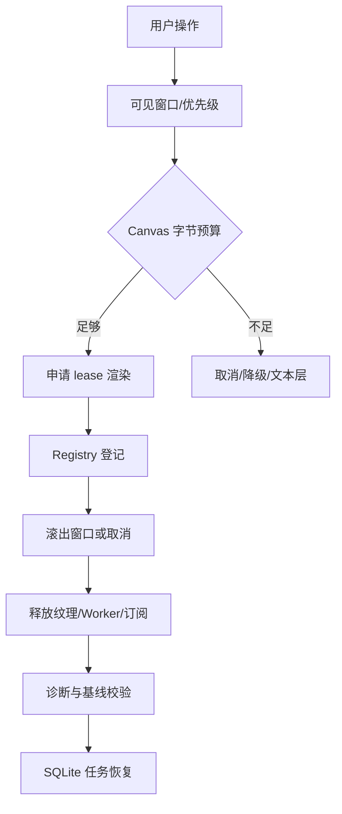

# 长会话与大 PDF 内存优化：资深面试官 75 分钟 Grilling 面试稿

> 本稿要求候选人从“把页面做成虚拟列表”继续深入到 JS Heap、DOM、Canvas/GPU、Worker、Rust 缓冲、缓存所有权、取消、可观测性和上线门禁。虚拟化只是策略之一，不等于系统低内存。

## 一、评分和资源地图

| 维度 | 权重 | 高分表现 |
| --- | ---: | --- |
| 问题分解 | 15% | 能区分 JS/DOM/GPU/Worker/Rust/缓存 |
| 所有权和生命周期 | 25% | 能说明 lease、引用、取消和释放的责任 |
| PDF/Canvas 策略 | 20% | 有像素预算、DPR、降级和调度优先级 |
| 长会话缓存 | 15% | 有 L0/L1/L2、字节预算、pinned 和 dirty 规则 |
| Benchmark | 15% | 固定环境、P95/P99、soak、故障注入 |
| 取舍与上线 | 10% | 能量化体验、内存和正确性的平衡 |

## 二、问题定义（0–10 分钟）

### 问题 1：大 PDF 和长会话为什么会占内存？

**推荐回答**

资源至少有六类：消息字符串和 React 对象（JS Heap）、已挂载节点（DOM）、PDF 页面 Canvas 和纹理（GPU/Native）、解析 Worker 的中间缓冲、Rust/PDF parser 缓冲，以及附件/音频/Mermaid/KaTeX/宠物资源。PDF 虚拟化主要减少 DOM 和可见 Canvas 数量，不能自动释放字符串、纹理或 Worker 缓冲。RSS 不上涨也可能有 GPU 或 WebView native 泄漏，因此必须分层观测。

**追问：用户只看到滚动卡顿，为什么还要测内存？**

卡顿可能来自纹理上传、主线程 GC、Worker 阻塞或合成层，不一定对应 RSS。性能和内存要同时看 P95/P99 帧耗时、长任务、JS Heap、Canvas 预算、Worker 队列以及回收后基线。

### 问题 2：优化的非目标是什么？

不以牺牲阅读正确性为代价盲目压缩；不只报告启动时 RSS；不把缓存越大越快当原则；不让后台任务无界运行；不因宠物或 Mermaid 动画泄漏主窗口资源；不在用户编辑未保存时淘汰草稿。

## 三、Canvas、PDF 虚拟化与预算（10–25 分钟）

### 问题 3：如何估算一页 PDF 的 Canvas 内存？

**推荐回答**

RGBA 粗略预算：

\[
bytes \approx width \times height \times scale^2 \times 4
\]

其中 scale 已包含设备像素比和渲染倍率。例如 CSS 1000×1400、DPR=2 时，像素约 2000×2800，单张约 21.4 MiB；还要加 PDF.js 中间 buffer、纹理副本和合成开销。因此应使用总 Canvas 预算（当前实现约 32 MiB 作为保护目标，具体以设备能力配置），而不是只限制页数。

**追问：预算不够时怎么办？**

按优先级保留当前页、邻近页和用户正在选择的页；取消低优先级离屏渲染，降低 scale，必要时退回文本层。释放 canvas、ImageBitmap、纹理引用和 Worker 任务，并验证 lease 归零。不能只把旧 DOM 隐藏，因为 GPU 资源可能仍在。

### 问题 4：为什么虚拟化不等于低内存？

虚拟化只控制窗口内组件挂载；以下对象可能跨窗口存活：消息全文、解析结果、ImageBitmap、PDF 文档对象、Worker 闭包、缓存 Promise 和事件监听器。必须把“可见性”“引用计数”“字节预算”和“任务状态”分开建模。滚出窗口后资源进入可淘汰状态，但被批注、下载或活动任务引用时不能立刻释放。

### 问题 5：PdfRenderScheduler 应该如何工作？

**推荐回答**

调度器维护优先级队列：当前可见 > 选区所在页 > 邻近预取 > 用户主动跳转 > 离屏预览。每项任务带 `pageIndex、scale、requestId、priority、AbortSignal、estimatedBytes`。领取前检查预算，完成后把 canvas 注册到 ResourceRegistry；取消必须传播到 PDF worker、ImageBitmap 和 React 订阅。快速滚动时合并同一页的旧请求，避免队列堆积。

## 四、资源所有权和 ResourceRegistry（25–38 分钟）

### 问题 6：ResourceRegistry 解决什么，不能解决什么？

**推荐回答**

它是跨模块资源账本，登记 audio、canvas、image、worker、pet 等资源的 kind、estimatedBytes、owner、createdAt、lastUsedAt、pinned 和 release 函数，并提供诊断快照。它不能替代浏览器 GC，也不能自动知道业务引用是否仍然有效；调用方必须在 mount/unmount、任务完成/取消、窗口关闭时成对注册和释放。

### 问题 7：如何处理引用计数、pinned 和 dirty draft？

淘汰条件应是 `refCount=0 && !pinned && !activeTask && !draftDirty`，再按 lastAccess 和字节收益排序。当前会话、可见 PDF 页、用户未保存笔记、正在播放音频和宠物窗口资源可暂时 pinned；但 pinned 也要有上限和超时，避免一个“忘记解除”的引用永久泄漏。所有权转移必须显式记录 ownerId。

**反例**

组件卸载时只移除 DOM，不调用 canvas release；测试只看元素数量，因此问题到用户滚动数千页才暴露。

### 问题 8：主窗口关闭时后台深度笔记怎么办？

任务状态在 SQLite，不依赖 UI；产品策略要明确是继续、暂停还是取消。无论哪种，窗口关闭都应解除前端订阅并释放预览、宠物、音频和 Mermaid 资源；若任务继续，Rust 后台只保留必要的解析/网络缓冲，完成后写检查点。重新进入从 Detail 恢复最后任务进度，而不是重新加载全部对话。

## 五、长会话与附件缓存（38–50 分钟）

### 问题 9：L0/L1/L2 会话缓存怎样设计？

**推荐回答**

| 层 | 内容 | 淘汰策略 |
| --- | --- | --- |
| L0 | 当前可见消息、编辑草稿、活动任务 | 不淘汰，除非用户明确关闭/保存 |
| L1 | 最近会话的结构化消息和缩略图 | 按字节 LRU，切换后可重建 |
| L2 | 历史摘要、Source Chunk、解析索引 | 可压缩、按需加载，parser 版本变化时失效 |

缓存 key 至少包含 conversationId、revision、content hash；附件解析还要包含 parserId/version/optionsHash。淘汰前检查 pinned、activeTask、draftDirty 和被引用的 Source Unit。

### 问题 10：为什么按对象数量淘汰不够？

一张 4K 图片、一个长 PDF 页面或一条超长消息可能比几百个小对象更大。预算要用 bytes、像素和 Worker buffer 三种单位；估算误差也要上报。淘汰算法可按 `estimatedBytes / reuseProbability` 计算收益，不能只按 lastAccess。

### 问题 11：缓存命中但内容是旧的怎么办？

hash/revision 校验必须先于命中返回。解析器升级、PDF 文件替换、用户编辑消息都会使旧缓存 stale；旧结果可以保留用于历史版本回看，但不能注入当前 Run。缓存的正确性优先于命中率。

## 六、Worker、取消和故障（50–60 分钟）

### 问题 12：如何证明快速滚动后没有 Worker 泄漏？

做故障注入：连续滚动、跳页、切换会话、关闭窗口、取消深度笔记。在每次操作后记录活动 Worker 数、队列长度、Abort 完成时间、Canvas lease、ImageBitmap 数和 JS Heap；5/30/60 分钟 soak 后斜率应回到基线附近。Worker 若无法及时终止，要有硬超时和重建策略，不能无限等待。

### 问题 13：取消语义怎样跨层传播？

用户取消 → Rust run cancellation token → 网络请求/模型调用 → Reader/解析 Worker → PdfRenderScheduler → Canvas lease → 前端订阅。每层都返回可识别的 cancelled，而不是把取消当失败重试。Race 条件要处理：任务刚完成时取消不能删除已提交结果；任务未提交时取消不能推进 Coverage。

### 问题 14：Mermaid、KaTeX、音频和桌面宠物如何进入资源预算？

它们都登记到同一账本：Mermaid SVG/布局缓存、KaTeX DOM、音频 buffer、宠物动画帧和窗口资源。不可见时延迟渲染或停帧；切换页面时释放订阅；宠物只接收脱敏状态，不为显示进度加载对话全文。统一账本能在诊断页解释“内存去哪了”。

## 七、Benchmark 与指标（60–69 分钟）

### 问题 15：如何设计可复现 Benchmark？

固定 commit/release、操作系统、WebView2、设备内存/DPR、模型和数据集；每个场景预热后重复多次，记录中位数、P95/P99 和方差。场景至少包括：

1. Idle 空闲主窗口；
2. 20/500/2000 条消息切换；
3. 10 张图片预览；
4. 100/1000/5000 页 PDF，快速滚动和跳页；
5. Mermaid/KaTeX 密集笔记；
6. 深度笔记运行、暂停、恢复和重试；
7. 英语音频播放/释放；
8. 宠物窗口开关与主窗口退出。

指标包括 cold start、first useful paint、交互延迟、P95/P99 长帧、JS Heap、DOM count、private bytes/RSS、GPU/Canvas 估算、Worker 数/队列、缓存命中/淘汰、取消尾延迟和 soak 后增长斜率。

### 问题 16：为什么平均值不够？

内存和卡顿常是长尾：平均 20ms 可能掩盖 1% 的 500ms 长帧；一次 RSS 采样也看不到纹理累积。P95/P99、最大峰值、回收后基线和 30/60 分钟斜率更接近用户真实风险。指标必须按设备档位分层，不能用高端机器掩盖低端 OOM。

### 问题 17：如何设上线门禁？

示例门禁（需按基线校准）：

- 空闲 30 分钟内存增长不超过基线的 10%；
- 5000 页 PDF 快速滚动无未处理 OOM，Canvas 峰值不超过预算的 1.2 倍；
- 取消后 2 秒内活动渲染任务和订阅归零；
- 长会话切换 P95 交互延迟不超过目标阈值；
- 解析/渲染错误可见且不改变 Coverage；
- 关键资源 registry 在测试结束时为空或只剩明确 pinned 项。

阈值必须由固定设备和数据集测得，不能凭感觉写死。

## 八、综合白板题（69–75 分钟）

### 题目

5000 页 PDF、2000 条消息、10 张高分辨率图片同时打开；用户快速滚动、切换英语和深度笔记，打开桌面宠物后关闭主窗口。设计不会 OOM 且可恢复的链路。

**推荐回答**

1. 工作区按需挂载，只加载当前视图的 Detail；历史消息先加载摘要，正文分页。
2. PDF 虚拟化只保留当前/邻近页，按 32 MiB 左右 Canvas 预算申请 lease；超预算取消离屏任务、降 scale 或回退文本层。
3. 图片只保留缩略图和引用，原图按需解码并设 10 张总像素/字节上限。
4. 会话使用 L0/L1/L2 字节 LRU，活动任务、未保存草稿和引用来源 pinned；切换页面不删除 SQLite 状态。
5. 解析放入受限 Worker，所有任务带 AbortSignal、超时和 parser cache key；取消向下游传播并验证释放。
6. Mermaid/KaTeX 延迟渲染；音频和宠物资源登记 ResourceRegistry，宠物只订阅脱敏的任务状态。
7. 关闭主窗口前解除 UI 订阅、释放预览和宠物资源；后台任务按策略继续或取消，完成后持久化检查点。
8. 重启后从 run detail、cache key 和 revision 恢复，不重新加载全部 PDF；诊断页展示剩余任务、缓存和内存基线。

### 终极追问 1：只允许做一个优化，做什么？

优先建立统一 ResourceRegistry + 可复现 Benchmark。没有所有权账本，不知道是谁泄漏；没有基线和故障注入，无法证明任何优化或防止回归。之后再针对最大占用层做精确优化。

### 终极追问 2：什么时候否决上线？

如果只看 RSS、没有 GPU/Worker 指标；取消后任务仍在增长；虚拟化页面仍保留无限纹理；缓存淘汰会删除脏草稿；主窗口关闭导致任务状态丢失；宠物/插件资源绕过账本；或低端设备没有降级策略，应否决。

## 九、面试官记录表

| 题组 | 低分 | 中分 | 高分 | 得分 |
| --- | --- | --- | --- | ---: |
| 资源分层 | 只说 RSS | 提到 JS/DOM | 覆盖 GPU/Worker/Rust/缓存所有权 |  |
| PDF 预算 | 只限制页数 | 会算 RGBA | 考虑 DPR、纹理副本、调度和降级 |  |
| 缓存 | 只加大缓存 | 有 LRU | 按字节、版本、引用、dirty 和活动任务治理 |  |
| 取消 | 只停止按钮 | 有 Abort | 能解释跨层传播、race 和释放验证 |  |
| Benchmark | 单次测试 | 有场景 | 固定环境、P95/P99、soak、故障注入和门禁 |  |

最终判断标准：候选人是否能证明“更快”没有换来“更容易丢数据或泄漏资源”，并能在真实故障后恢复到可解释状态。

## 十、备用深挖题：把“虚拟列表”追到资源工程

### 问题 18：JS Heap、private bytes、GPU memory 为什么可能相互背离？

**推荐回答**

JS Heap 只覆盖 JavaScript 管理对象；Canvas 纹理、WebView native、浏览器进程和 Worker 可能计入 private bytes 或 GPU，而不出现在 heap snapshot。反过来，GC 尚未运行会让 Heap 暂时高但最终可回收。诊断页要标明指标来源、采样时间和估算误差，不把不同层数字相加后当成精确总内存。

### 问题 19：Canvas 预算按页数还是按像素？

按估算像素字节，页数只作辅助。不同页面尺寸、DPR、缩放和纹理格式差异很大；要加上中间 buffer 和合成副本的安全系数。预算配置按设备档位，当前页面和用户选区优先；超预算时降级而不是继续申请。

### 问题 20：如何避免快速滚动产生“幽灵渲染”？

每次页请求有 requestId/AbortSignal/viewport generation。视口变化时取消或标记过期请求，完成回调先验证 generation 和 lease owner，再决定是否挂载。旧请求即使完成，也不能把已淘汰的 canvas 重新插回 DOM。测试要模拟快速滚动、跳页和乱序完成。

### 问题 21：Worker 队列为什么会造成内存峰值？

每个待处理页面可能持有 ArrayBuffer、字体、图片和闭包；无限预取会把“未显示的未来”全部缓存。队列设最大任务数、总估算 bytes、优先级和背压；只保留有限邻近页，过期任务合并/取消。Worker 发送 Transferable 后要清理发送端引用，异常时重建 Worker。

### 问题 22：如何设计 ResourceRegistry 的 API 才不容易漏 release？

返回带 `release()` 的 lease，并支持一次性幂等释放；登记 owner、kind、bytes、createdAt、lastUsedAt、pinned 和诊断标签。React 使用 effect cleanup，任务使用 finally，窗口生命周期使用集中销毁。开发模式下检测未释放 lease 和 owner stack；生产只记录聚合指标，避免诊断本身占太多内存。

### 问题 23：引用计数和 LRU 同时存在会不会互相矛盾？

引用计数决定“能否释放”，LRU 决定“可释放对象中先释放谁”。`refCount>0` 的对象不能被 LRU 淘汰，但可在长时间未使用时发出 owner 泄漏警告。pinned 是业务强引用的显式补充，必须有解除条件；不能用一个全局 pinned 集合绕开字节预算。

### 问题 24：缓存压缩会不会损害用户体验？

压缩/摘要有 CPU 和延迟成本，且可能丢失选区定位。只对可重建的历史内容做压缩，保留 revision/hash 和原始事实在 SQLite；当前编辑、Source Chunk 引用和活动任务不压缩。Benchmark 比较命中延迟、解压峰值和用户可感知 P95，而不只看占用下降。

### 问题 25：长会话消息如何分层加载？

首屏只加载标题、时间、角色、短摘要和当前窗口；滚动到历史再按页加载正文和附件缩略图；深度笔记/文献只读取需要的 Source Chunk。搜索走持久化索引，不把全量消息一次性放进 React state。切换会话时清理非 pinned 的 L0，保留 L1/L2 可重建缓存。

### 问题 26：为什么 Mermaid/KaTeX 也会造成长会话内存增长？

每个图可能有 SVG DOM、布局缓存和字体对象，公式渲染会产生大量 DOM；如果每次更新都生成新 ID/监听器而未清理，历史消息越多越明显。只对可见区域渲染，缓存按内容 hash，更新时复用或释放，设置图节点/字符上限。源码仍保留在消息中，渲染产物可淘汰。

### 问题 27：音频和桌面宠物怎样避免被忽略在性能预算之外？

音频要区分压缩文件、解码 AudioBuffer 和播放节点；播放结束/切换时释放。宠物窗口要限制帧率、纹理尺寸、动画资源和后台运行时间，Reduced Motion 时停帧。两者都登记 ResourceRegistry，主窗口关闭时执行明确销毁流程；宠物只消费脱敏事件，不读取会话正文。

### 问题 28：任务取消后什么时候算“释放完成”？

不是按钮点击就算完成。要等网络/Worker promise settle 或硬超时、渲染 lease 归零、订阅解除、队列移除、Audio/Canvas 释放并在诊断快照中确认。取消结果区分 cancelled、timed_out、failed；不能把未完成的后台工作隐藏起来。

### 问题 29：如何诊断“内存没降但其实是正常缓存”？

诊断快照列出每个 owner/kind 的 bytes、引用、pinned、lastAccess 和可淘汰状态；主动触发 GC（若测试环境可用）并等待浏览器回收，再比较可淘汰集合和 baseline。若内存保留由明确 L1/L2 预算解释，属于策略；若 owner 已销毁但 lease 仍存在，才是泄漏。

### 问题 30：低端设备和高端设备应该同一套预算吗？

不应。按内存等级、DPR、GPU 能力和 WebView 版本选择预算档位，低端设备更早启用文本层、低分辨率和少预取；功能语义保持一致。设备探测结果只用于资源策略，不应上传不必要的硬件指纹。

### 问题 31：Benchmark 数据集如何避免“只测合成小文件”？

同时准备真实匿名化 fixture 和极端合成 fixture：多栏扫描 PDF、超长消息、嵌套 Mermaid、10 张高分辨率图、损坏附件、重复切换和网络慢场景。数据集版本化，固定操作脚本和预热次数；每次 release 回放并保存原始采样，不能只报告最好的一次。

### 问题 32：如何把内存回归和功能测试接起来？

功能测试在关键动作后断言 ResourceRegistry owner 数、取消状态、缓存 bytes 和持久化任务；长时测试断言斜率和峰值。失败时保存 trace、操作序列、设备档位和最后 registry 快照，便于定位到具体组件，而不是只报“内存超限”。

### 问题 33：如果优化导致页面文字闪烁或选区丢失怎么办？

以内存正确性和阅读连续性共同设门禁。虚拟化卸载前持久化 scroll/selection state；重挂载使用 revision/hash 恢复；降级文本层应保留可读内容和明确提示。任何优化若损害用户已选证据或未保存草稿，应回滚或缩小范围。

### 问题 34：如何处理“只加缓存就更快”的方案？

先问命中率、字节成本、失效策略和长尾；缓存会把短期延迟换成长期峰值。只有在命中收益超过解码/网络成本、且有明确预算、版本和淘汰时才接受。用 A/B benchmark 比较 P95、峰值、回收后基线和用户任务完成率。

### 问题 35：窗口重启后资源和任务如何恢复？

资源本身通常不跨进程恢复，事实和任务状态跨进程恢复。SQLite 保存 conversation/note revision、run node checkpoint、source hash 和用户偏好；重启按需重建 PDF 文档、Canvas、Worker 和宠物资源，并用 cache key 复用可验证结果。正在运行/不确定请求按 request key 处理，不能根据旧 UI 状态直接“完成”。

## 十一、内存专题快问快答

| 快问 | 合格回答 |
| --- | --- |
| 虚拟化等于低内存吗？ | 不等于，GPU/Worker/缓存仍需治理。 |
| Canvas 估算？ | width × height × scale² × 4，再加安全系数。 |
| 按页数淘汰够吗？ | 不够，要按 bytes/像素和引用。 |
| 取消完成的定义？ | 跨层 settle、lease/订阅归零并经诊断确认。 |
| 只看 RSS？ | 不够，需 Heap/DOM/GPU/Worker/P95/soak。 |
| 脏草稿能淘汰吗？ | 不能，除非用户明确保存/放弃。 |
| 第一优先改进？ | ResourceRegistry + 可复现 Benchmark。 |

## 十二、现场故障注入题

### 题目 A：快速滚动 + 关闭窗口

要求候选人列出每一层的取消事件、最终释放信号和验证指标。合格链路是 viewport generation → AbortSignal → Worker/PDF → Canvas lease → React subscription → ResourceRegistry snapshot；任一层没有 owner 或 timeout，都要追问泄漏如何发现。

### 题目 B：低端设备打开 5000 页扫描 PDF

答案必须包括设备档位、文本/OCR 降级、低 scale、有限预取、页面缓存上限和用户可见提示；不能只说“增加内存”或把所有页面预渲染。

### 题目 C：宠物和音频同时播放导致峰值

要求将动画帧、AudioBuffer、播放节点和窗口 WebView 纳入统一账本，并说明隐藏/Reduced Motion/播放结束/主窗口关闭的释放策略。

## 十三、内存专题上线门禁

- 取消后活动 Worker、Canvas lease 和订阅在规定时间内归零；
- 30/60 分钟 soak 后增长斜率接近基线；
- 低端设备超预算时有可读降级而不是 OOM；
- 脏草稿、活动任务和被引用来源不会被缓存淘汰；
- Mermaid/KaTeX/音频/宠物均有 owner 和 release 记录；
- Benchmark 包含 P95/P99、GPU/Worker 和功能正确性，不只看平均 RSS。

## 十四、面试官逐题评分记录

| 题组 | 0 分 | 1 分 | 2 分 | 得分 |
| --- | --- | --- | --- | ---: |
| 资源分层 | 只说 RSS | 提到 Heap/DOM | 能区分 GPU、Worker、Rust、缓存和观测误差 |  |
| Canvas/PDF | 只限制页数 | 会虚拟化 | 有像素预算、DPR、lease、优先级和降级 |  |
| 所有权 | 依赖 GC | 有 release | owner、ref、pinned、dirty、幂等释放完整 |  |
| 缓存 | 只加大容量 | 有 LRU | 按 bytes、revision、parser 版本和引用治理 |  |
| 取消 | 停止按钮 | 有 Abort | 跨层传播、race、timeout 和验证完整 |  |
| Benchmark | 单次 RSS | 有几种场景 | 固定环境、P95/P99、soak、故障注入和门禁 |  |

## 十五、面试官备用反例

- 只卸载 PDF 页面组件，GPU 纹理和 ImageBitmap 仍被闭包引用。
- 用 `setTimeout` 取消任务但没有中止 Worker，快速滚动后队列持续增长。
- LRU 按对象数淘汰，10 张高分辨率图把整个进程推向 OOM。
- 为了提高命中率把所有会话正文放入 L1，切换会话时出现长 GC。
- 把未保存笔记标为可淘汰，用户回来后发现草稿消失。
- 宠物窗口隐藏后动画仍以 60 FPS 运行，主窗口关闭后 WebView 未销毁。
- Mermaid 失败重试不断创建新 SVG，历史消息越多越慢。
- 只看平均帧率，P99 长帧导致用户滚动时明显卡顿。

## 十六、现场容量估算题

**题目**：页面 CSS 尺寸 1200×1600，DPR=2，渲染 scale=1.5；同时保留当前页和两张邻近页，估算 Canvas 粗预算。

**推荐回答**

实际像素约为 `1200×1600×(2×1.5)^2 = 10,800,000`，RGBA 约 41.2 MiB/页；三页已经超过 120 MiB，还未计 PDF 中间 buffer 和纹理副本。因此必须按设备预算降低 scale、只保留当前页或退回文本层。关键不是算出一个绝对精确值，而是证明候选人会把 DPR/scale 和副本计入决策。

**追问**：如果用户正在框选邻近页，能否释放？

不能直接释放；选区页进入 pinned/高优先级，但可降低其他页并限制选区截图尺寸。选择结束后解除 pin 并核验 lease。

## 十七、现场故障注入记录表

| 注入点 | 预期状态 | 必须验证 |
| --- | --- | --- |
| 排队前取消 | dropped/cancelled | 没有创建资源 lease |
| 渲染中取消 | cancelled | Worker settle、Canvas release |
| 渲染完成后卸载 | released | DOM/纹理/registry 归零 |
| Worker 崩溃 | failed/requeued | 有界重建，不重复挂载 |
| 窗口关闭 | continued/aborted | 任务与 UI 订阅分离 |
| 重启恢复 | rehydrated | 只恢复事实，不恢复旧资源句柄 |

## 十八、内存模块最终判断

高分候选人会把“内存”描述成所有权和生命周期问题，而不仅是调一个缓存参数：谁创建、谁引用、谁取消、谁释放、如何证明释放、如果释放过早如何恢复。只要这些问题没有答案，任何虚拟化或压缩优化都可能把性能问题变成数据丢失或不可复现的故障。

## 十九、最后十分钟压力追问

**面试官**：产品要求“永远预加载下一百页，滚动必须零延迟”。

**推荐回答**：拒绝无条件承诺，先给设备分档和预算；只预取有限邻近页，按用户滚动速度动态调整，超预算降级。零延迟不能以 OOM、后台队列和电量为代价，应以 P95 目标和可见提示定义体验。

**面试官**：为什么不把所有缓存交给浏览器？

**推荐回答**：浏览器 GC 不知道业务引用、脏草稿、任务取消和 GPU lease；业务层必须拥有可观测的所有权账本，浏览器只是最后的回收机制。

**面试官**：线上只有低端设备出现 OOM，如何复现？

**推荐回答**：固定设备档位、WebView 版本、DPR 和操作脚本，采集 Heap/private/GPU/Worker/registry，多次重复并做 soak；不能在高端开发机上凭感觉修复。

**面试官**：内存优化和数据正确性冲突时谁优先？

**推荐回答**：未保存草稿、来源引用、已确认任务状态优先保留；可重建渲染和摘要缓存可以淘汰。若只能二选一，应降级体验而不是丢数据，并向用户解释。

**终面判定**：候选人能否把资源预算、用户体验、取消语义、故障恢复和发布门禁联在一起，决定其是否具备生产级性能工程能力。
### 终极复盘清单

- 是否分开测量 Heap、DOM、GPU、Worker、Rust 和缓存？
- Canvas 预算是否考虑 DPR、scale、纹理副本和设备档位？
- 每个资源是否有 owner、lease、引用和幂等 release？
- LRU 是否按 bytes、版本、pinned、dirty 和活动任务治理？
- 取消后是否能证明队列、Worker、Canvas 和订阅都结束？
- Benchmark 是否固定环境并包含 P95/P99 与 soak？
- 优化失败时是否优先保护草稿、证据和任务状态？
