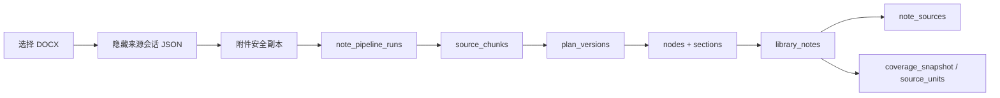

# 06｜Mnemora 数据库三小时 Grilling 模拟面试
> 使用方式：先遮住“推荐回答”独立作答，再对照追问。面试官会持续追问“为什么不是另一种设计”“失败发生在哪一行”“数据如何恢复”，不能只背表名。
>
> 预计时长：180 分钟。问题按真实资深面试节奏排列，而不是知识点目录。

## 时间分配

| 阶段 | 时间 | 重点 |
| --- | ---: | --- |
| 架构总览 | 0–20 分钟 | 数据边界、为什么两个 SQLite、哪些不是数据库 |
| Library 领域模型 | 20–55 分钟 | 文献、笔记、软删除、来源、版本 |
| 深度笔记 DAG | 55–105 分钟 | Run、Plan、Node、Chunk、Evidence、Event、幂等、恢复 |
| English / FSRS | 105–135 分钟 | 高基数数据、事务、调度状态、历史上限 |
| 一致性与并发 | 135–160 分钟 | 外键、跨库、锁、故障、迁移 |
| 性能与演进 | 160–180 分钟 | WAL、体积、观测、未来架构 |

---

## 第一轮：架构总览

### Q1：一句话描述 Mnemora 的数据库架构。

推荐回答：

Mnemora 采用本地优先的多持久化架构。事务数据拆成两个 SQLite：`library.sqlite3` 负责文献、Markdown 笔记和深度笔记 Agent DAG；`learning.sqlite3` 负责词书、学习计划、FSRS 卡片和答题历史。Chat 会话、设置和大文件留在文件系统，通过稳定 ID、Hash 快照和应用层补偿与 SQLite 关联。

面试官追问：为什么不说“我们都用 SQLite”？

推荐回答：因为会话不是 SQLite，PDF/附件也不是 BLOB。如果忽略这些事实，就无法解释跨库外键为何不存在、删除对话为何不级联删除笔记、来源恢复为何必须重新读取 JSON 和附件字节。

### Q2：为什么是两个 SQLite，而不是一个数据库全部建表？

推荐回答：

拆分依据是一致性和生命周期，而不是页面模块。Library 域中“文献—笔记—来源—深度任务”需要事务协作，所以同库；English 有 4.9 万级学习项、独立 FSRS 迁移、历史清理和音频生命周期，与文献事务没有跨域原子需求，因此独立。这样备份、迁移、锁竞争和性能调优都可按领域进行。

反问：如果以后要做“论文单词加入英语计划”，是否应该合库？

推荐回答：不必。跨域动作可以用应用层 Saga：先创建英语学习项，再记录来源 ID；失败则补偿。只有产品要求“笔记写入和 FSRS 卡片创建必须同一事务 exactly-once”时才需要重新评估。

### Q3：为什么 Chat 使用 JSON，而不是第三个 SQLite？

推荐回答：

会话天然是按会话整体读取的有序文档，单个会话上限 500 条消息，每个 `conv_<id>.json` 可独立原子替换、备份、隔离损坏并重建轻量索引。附件单独存目录。这样删除、导出和人工查看简单。代价是跨会话查询、消息级索引和与笔记的强外键较弱。

追问：你认为这个决定永远正确吗？

推荐回答：不是。若未来需要十万级消息全文搜索、多窗口协作、消息级增量同步或复杂统计，JSON 会成为瓶颈，届时应迁移到会话 SQLite/FTS，而不是继续扩大 `index.json`。

### Q4：SQLite 在整个系统中的职责是什么？

推荐回答：

它保存稳定身份、关系、状态机、检查点、来源索引和可恢复结果；不承载模型执行和大文件正文。对深度笔记而言，SQLite 是控制平面，附件与模型是数据平面和计算平面。

### Q5：为什么选 SQLite，而不是 PostgreSQL、IndexedDB 或纯 JSON？

推荐回答：

- PostgreSQL 需要服务部署，违背单机本地优先和离线目标；
- IndexedDB 在 WebView、备份、Rust 事务和文件迁移方面不如 Rusqlite 可控；
- 纯 JSON 不适合多表关系、唯一约束、复杂事务和高基数队列；
- SQLite 提供单文件、ACID、外键、CHECK、Partial Index 和成熟迁移能力。

### Q6：当前共有多少张 SQLite 表？

推荐回答：

源码目标版本共 32 张：Library v9 有 25 张，English v3 有 7 张。不能只根据当前本机数据库 `.schema` 回答，因为本机已安装版本可能尚未执行工作区新增迁移。

---

## 第二轮：Library 核心领域

### Q7：`library_items` 和 `library_files` 为什么拆开？

推荐回答：

Item 是领域文献，File 是物理资产。拆分后可以支持一篇文献多个文件、独立 Hash 去重、替换主文件和保留文献元数据。`library_primary_file_per_item` 部分唯一索引保证一个 Item 只有一个 `is_primary=1` 文件。

### Q8：PDF 为什么不存 BLOB？

推荐回答：

PDF 大、读取范围化、由 PDF.js 和 Reader 按需打开。写入 BLOB 会让数据库备份、VACUUM、页缓存和迁移成本上升。当前数据库只存相对文件名、大小、Hash 和 MIME，文件系统保存正文。

追问：文件和数据库提交如何保持一致？

推荐回答：导入使用 staging、Hash 校验和数据库事务；失败时清理复制文件。长期仍需要 orphan sweep 和启动一致性检查，因为文件系统与 SQLite 不可能共享单一原子提交。

### Q9：为什么 `library_items` 使用软删除？

推荐回答：

`deleted_at` 支持回收站和恢复，避免误删 PDF、批注和笔记。正常查询显式过滤 `deleted_at IS NULL`，永久删除才触发外键级联。索引 `library_items_deleted_at` 支撑两种视图。

### Q10：Collections 和 Tags 为什么都是多对多表？

推荐回答：

一篇文献可属于多个集合、拥有多个标签。关联表用复合主键防重复，并允许按集合/标签 SQL 查询。把数组塞进 JSON 会失去外键、唯一性和索引选择性。

### Q11：为什么 `library_notes.item_id` 可空？

推荐回答：

同一张表同时支持文献内笔记和全局 Markdown 笔记。`item_id=NULL` 是独立笔记，非空时随文献永久删除而级联。这样编辑器、同步和版本功能不需要复制两套实现。

### Q12：`group_name` 为什么不是 FK 到 `library_note_groups`？

推荐回答：

当前是轻量分组设计，组名就是身份，删除组时笔记回到未分类。优点是迁移简单；缺点是重命名依赖批量更新、无法拥有稳定 group ID。若分组要支持排序、颜色、嵌套和同步，应改为 `group_id` FK。

### Q13：`note_sources` 解决什么问题？

推荐回答：

它保存笔记章节与对话消息或 AI 补充之间的来源锚点，使用户能回溯“这段结论来自哪里”，也提供 `summarized_until_message_id` 作为增量更新锚点。它不是 Claim 级引用，而是章节级溯源。

### Q14：为什么 `conversation_id/message_id` 没有外键？

推荐回答：

对话存在 JSON 文件中，不在 `library.sqlite3`。物理外键不可实现，而且产品语义也不希望删除聊天时删除笔记。删除对话时应用层把来源 detach，笔记保留但跳转失效。

### Q15：应用层 detach 会不会失败？

推荐回答：

会，所以删除流程先持有 `conversation_writes` 和 `library_operations`，再删除文件并更新来源。但这仍不是跨文件系统/SQLite 的原子事务。更严格的做法是引入删除意图日志或 outbox，重启后完成补偿。

### Q16：`library_note_versions` 为什么保存完整快照而不是 diff？

推荐回答：

完整 Markdown 快照恢复简单、不会依赖 diff 链完整性，适合个人笔记规模。缺点是大笔记频繁编辑会冗余。未来可以使用周期性全量快照 + 中间 patch，但必须先有体积 Benchmark。

### Q17：`note_edit_proposals` 为什么同时存 old/new content 和 diff？

推荐回答：

old/new 是应用和冲突检查的事实，diff 是 UI 展示派生物。`expected_note_updated_at` 是乐观锁：用户确认时若笔记已经改变，拒绝应用旧提案。这样 AI 永远不能绕过用户确认直接覆盖正文。

### Q18：为什么不用数据库 Trigger 自动创建版本？

推荐回答：

版本原因、提案 ID、来源快照推进等业务上下文在应用层。Trigger 难以表达跨表 JSON 和用户确认语义，也更难测试。数据库负责约束，Repository 事务负责业务原子性。

---

## 第三轮：深度笔记 Plan-and-Execute

### Q19：为什么深度笔记需要十几张表？一张 Run 表加 JSON 不行吗？

推荐回答：

一张 JSON 可以保存状态，但无法高效查询 Ready Node、局部重试章节、按顺序重放事件、检查 Evidence 覆盖或实现幂等输出。拆表让 Run 成为聚合根，Plan、Node、Section、Chunk、Evidence、Ledger、Event 分别承担单一职责。

### Q20：`note_pipeline_runs` 中最重要的字段是什么？

推荐回答：

- `phase`：业务状态机；
- `conversation_id/note_id`：来源和输出；
- `input_snapshot_hash`：输入身份；
- `current_plan_version/execution_version`：计划和运行版本；
- `budget_json`：语义调用预算；
- `preflight_json`：模型、Reader、Skill 快照；
- `idempotency_key`：输出幂等；
- `warnings/error_message`：可恢复诊断。

### Q21：Partial UNIQUE `note_pipeline_active_conversation` 有什么价值？

推荐回答：

它在数据库层保证同一来源会话最多一个活跃 Run，防止双击或多个窗口并发创建两条任务。只约束非终态 phase，因此完成或取消后可创建新 Run。

追问：本地文件隐藏来源也适用吗？

推荐回答：适用。每次本地文件导入创建一个独立来源 ID，所以不会与普通 Chat 冲突，也能复用现有防重入和恢复机制。

### Q22：Plan Version 为什么不可变？

推荐回答：

提纲调整不能覆盖历史，否则无法解释某个 Node 按哪版依赖执行。`run_id + version` 为主键，保存 `plan_json`、`compiled_dag_json`、Hash、修订原因和确认时间。当前 Run 只通过 `current_plan_version` 指向活动版本。

### Q23：Node 表和 Section 表是否重复？

推荐回答：

不是。Node 是调度单元，包含类型、依赖和执行状态；Section 是业务输出，包含章节定义、Markdown、修订次数和验证报告。一个章节至少有 Draft 与 Validate 两类 Node，它们共享一个 Section 结果。

### Q24：DAG 如何恢复？

推荐回答：

Run 恢复时把 InProgress/Interrupted 节点重置为 Pending，保留 Completed 节点的 output_ref 和章节 Markdown；调度器根据依赖重新标 Ready。输入快照必须先重新校验，否则拒绝恢复。

### Q25：A/B/C 中断后新增 D，为什么旧 Run 忽略 D？

推荐回答：

Run 保存启动时有序 `message_ids`、逐消息 Hash 和附件字节 Hash。恢复验证原会话是否仍以相同 A/B/C 为前缀；只追加 D 不改变旧快照，所以旧 Run继续处理 A/B/C。D 由下一次增量更新处理。

### Q26：为什么附件要计算真实字节 Hash，不只存文件名和大小？

推荐回答：

同名同大小文件仍可能被替换。仅元数据无法证明恢复时读到的是同一来源。字节 Hash 把输入身份绑定到真实内容，是安全恢复和增量的基础。

### Q27：Source Chunk 是什么？

推荐回答：

它是 Reader/Vision 实际读取后的可追溯内容块，包含来源类型、message/attachment/library ID、页码或行号位置、摘录、Hash 和可选 OCR 置信度。模型章节不能只凭文件名声称读取了内容。

### Q28：Evidence 和 Source Chunk 有什么区别？

推荐回答：

Chunk 是来源事实单元；Evidence 是某章节 Claim 对一个或多个 Chunk 的绑定，并记录模型综合、原文摘录、支持等级和状态。Chunk 可以被多个 Evidence 复用。

### Q29：为什么当前 Evidence 表可能为空？

推荐回答：

这暴露实现尚未完全达到 Claim 级 Evidence。源码支持表结构和调度节点，但部分运行仍主要依赖 Chunk 与章节级 source IDs。面试不能把“建表”夸成“已完整实现事实核验”。

### Q30：Ledger 的目的是什么？

推荐回答：

长会话无法把全部原文反复发送给 Planner。Chunk Analyst 先生成规范术语、验证事实、主题、冲突和问题，再合并为有版本的 Ledger。Planner 使用 Ledger 生成提纲，减少上下文和 504 风险。

### Q31：Event 表为何不是日志文件？

推荐回答：

事件需要与 Run CASCADE、按 sequence 强排序、在详情 API 中分页/重放，并参与 UI 状态投影。SQLite 复合主键比日志文件更容易保证每个 Run 内顺序唯一。

### Q32：事件表会不会无限增长？

推荐回答：

会。当前本机样本 13 个 Run 已有 442 条 Event。未来需要已完成 Run 的保留策略、摘要归档或压缩，但不能直接删除所有事件，因为它们用于诊断和面试级审计。

### Q33：`note_pipeline_outputs` 设计为何重要？

推荐回答：

它把最终 Markdown、Sidecar 和 idempotency key 固定为 Run 的唯一输出，目标是 exactly-once。即使客户端重试持久化，也应返回同一个 output。当前不足是生产写入尚未完全以该表为最终权威。

### Q34：如何完成 exactly-once？

推荐回答：

在一个事务中：

1. `INSERT note_pipeline_outputs ... ON CONFLICT(idempotency_key)`；
2. 首次时创建 `library_notes/note_sources/coverage`；
3. 把 output.note_id 和 run.note_id 绑定；
4. 更新 Run 为 done；
5. 冲突时读取已有 output 返回，不重复创建笔记。

### Q35：为什么有 Coverage Snapshot 和 Source Unit 两套结构？

推荐回答：

Coverage Snapshot 是整个笔记的严格有序输入快照，适合判断恢复是否安全；Source Unit 是消息正文或单个附件的细粒度覆盖状态，适合增量更新。前者解决“整体是否仍同一输入”，后者解决“新增了哪些最小来源”。

### Q36：`note_edit_source_units` 为什么暂存 JSON 而不是直接写正式表？

推荐回答：

增量提案尚未被用户接受。如果提前写 `deep_note_source_units=covered`，用户拒绝提案后数据库会错误声称内容已合入。暂存表与 Proposal 级联，接受时才原子推进正式覆盖。

### Q37：Node 依赖存 JSON 是否违反规范化？

推荐回答：

是有意反规范化。依赖集合小、整组读写、不需要跨 Run 联表查询，JSON 降低边表数量。代价是数据库无法检查依赖 Node 是否真实存在和无环，必须由 Rust `validate_section_dag` 与编译器保证。

### Q38：为什么 Section Markdown 直接存 TEXT？

推荐回答：

章节是检查点，必须在崩溃后恢复；保存完整 Markdown 能局部预览、验证和组装。它比只保存模型响应日志更接近业务结果。

---

## 第四轮：English / FSRS

### Q39：为什么 English 单独建库？

推荐回答：

它有独立高基数数据、调度器版本、批量导入、历史清理和音频缓存，且不需要与文献事务原子提交。拆库可以独立迁移、备份和性能分析。

### Q40：`english_learning_items` 为什么保存 snapshot_json？

推荐回答：

词典来源可能升级或删除，学习记录仍需显示当时的单词、翻译、例句和音频。Snapshot 让学习项自包含。代价是 49,213 项下体积明显增大。

### Q41：为什么还要 canonical_text、normalized_text 等列，不全放 JSON？

推荐回答：

需要唯一性、搜索、判题和索引的字段必须结构化；展示型来源快照可以放 JSON。这是“查询字段规范化、长尾字段快照化”的折中。

### Q42：`english_item_progress` 为什么既有 stability/difficulty，又有 card_json？

推荐回答：

结构化列用于 due 队列、统计和 UI；完整 `card_json` 保存 FSRS Card 的可恢复状态和未来字段。`scheduler_version` 用来解释不同算法版本的结果。

追问：双写会不会不一致？

推荐回答：会，所以更新必须在同一事务中由同一个 next Card 计算结果生成两套字段，并用测试验证序列化一致性。

### Q43：为什么只允许一个 Active Plan？

推荐回答：

产品当前是一条统一学习队列。Partial UNIQUE `english_one_active_plan ON status WHERE active` 直接阻止并发创建两条 active 计划，比前端判断可靠。

### Q44：答题提交涉及哪些原子变化？

推荐回答：

读取 Card、判题、计算 next Card、更新 Progress、更新 Skill Stats、插入 Attempt、清理超过 1000 条历史。任何一步失败都应该回滚。

### Q45：为什么 Attempt 保存 previous_state_json 和 next_state_json？

推荐回答：

它提供调度决策审计：可以回答“这次 Good 为什么把 due 推到某天”，也支持问题排查和未来算法对照。它比只存 rating 和 due 更可解释。

### Q46：为什么历史只保留 1000 条？

推荐回答：

这是内存和数据库增长预算。产品当前统计只需要近期窗口，完整终身事件会不断增长。保留上限必须与导出、隐私和复盘需求协调；如果未来做长期学习分析，应转为按日聚合 + 有界明细。

### Q47：本机 English 数据库为什么 116 MiB，即使 attempts 为 0？

推荐回答：

49,213 个学习项、词书映射和进度，每项都有 `snapshot_json` 和 `card_json`。体积主要来自高基数快照，不是答题历史。优化前应使用支持 dbstat 的构建或离线分析列级平均长度。

---

## 第五轮：一致性、并发、故障

### Q48：每次连接为什么都执行 `PRAGMA foreign_keys=ON`？

推荐回答：

SQLite 的 foreign_keys 是连接级配置，不是数据库永久开关。CLI 新连接显示 0 不代表应用没启用；Repository 打开连接后显式开启。

### Q49：busy_timeout 5 秒解决了什么？

推荐回答：

并发连接遇到写锁时不会立即 `database is locked`，而是等待 5 秒。它不是并发控制的全部，应用还用领域 Mutex 避免多个长写操作竞争。

### Q50：为什么当前不用 WAL？

推荐回答：

当前个人桌面负载、短事务和应用层串行锁使 DELETE journal 足够简单。WAL 能改善读写并发，但会增加 `-wal/-shm` 文件、备份和迁移复杂度。应通过真实 Benchmark 决定，不是默认开启。

### Q51：什么时候必须考虑 WAL？

推荐回答：

当后台同步、深度笔记事件写入、笔记编辑和统计读取明显并发，出现锁等待或 UI 读被写阻塞时。要同时验证 checkpoint、关机、数据目录迁移和备份流程。

### Q52：数据库和文件系统如何做备份？

推荐回答：

数据目录迁移按清单复制管理文件，比较源/目标 Hash，并对两个 SQLite 执行 `PRAGMA quick_check`。更严格在线备份可使用 SQLite Backup API，避免复制正写入的 DB 文件。

### Q53：迁移中途崩溃怎么办？

推荐回答：

表结构迁移使用 `BEGIN IMMEDIATE + user_version`，事务回滚；数据目录迁移有 staging、phase metadata、验证和恢复分支。不能直接复制到最终目录后再祈祷成功。

### Q54：为什么拒绝高于当前代码的 schema version？

推荐回答：

旧应用无法理解新表/状态，继续写可能破坏数据。Fail closed 比“尽量打开”安全，应提示用户升级应用而不是自动降级数据库。

### Q55：如何验证外键真的有效？

推荐回答：

单元测试级联删除和约束失败；运维检查使用应用连接或显式 `PRAGMA foreign_keys=ON; PRAGMA foreign_key_check;`。不能仅在 CLI 新连接查询 foreign_keys 后得出结论。

### Q56：如果创建笔记成功，但写 Coverage Snapshot 失败，会怎样？

推荐回答：

若不在同一事务，会生成一个无法安全增量的笔记。正确做法是创建 note、sources、coverage、output、run done 同事务提交。当前代码需要继续强化这条 exactly-once 事务边界。

### Q57：如何处理损坏数据库？

推荐回答：

打开错误向用户报告；迁移复制使用 quick_check；建议保留最近一次原子备份。不能像单个会话 JSON 那样简单隔离一张表，因此数据库备份策略更重要。

### Q58：为什么应用层还有 Mutex，SQLite 已经有锁了？

推荐回答：

SQLite 锁保证文件正确，但不能表达“删除会话 + detach 来源”“导入文件 + 建元数据”等跨文件系统业务序列。Mutex 降低竞争并保护跨资源操作的顺序。

### Q59：Mutex 会不会降低并发？

推荐回答：

会。当前是用吞吐换简单正确性。后续可以缩小锁粒度、把只读移出锁、使用事务和 outbox 替代全域锁，但必须先测量等待时间。

---

## 第六轮：性能、观测和未来

### Q60：如何定位 SQLite 性能问题？

推荐回答：

先建立指标：操作名称、耗时、锁等待、返回行数、数据库大小、page_count、freelist_count、Run/Event/Chunk 增长。对慢查询使用 `EXPLAIN QUERY PLAN`，而不是先加索引。

### Q61：索引越多越好吗？

推荐回答：

不是。索引增加写放大和文件体积。应围绕真实过滤、排序和 join 建立。深度笔记 Event 主要按 `(run_id, sequence)` 主键读取，不需要额外单列 sequence 索引。

### Q62：如何优化 English 数据库体积？

推荐回答：

顺序是：测量 JSON 平均长度 → 识别重复字段 → 评估压缩或拆表 → 验证读取 CPU 和迁移成本。可能方案包括共享 source snapshot、只保留必要 Card 字段、压缩大 JSON、按词书懒创建 progress。不能先 VACUUM，因为 freelist 为 0，VACUUM 不会解决逻辑冗余。

### Q63：为什么当前 49,213 个词一开始就创建 49,213 个 Progress？

推荐回答：

它让队列和统计简单，但为未学习词预分配了大量 Card JSON。未来可改成 lazy progress：新词第一次进入计划时创建 Progress，同时用 book_items 表代表可用新词。

### Q64：深度笔记数据如何归档？

推荐回答：

保留 Run 摘要、最终 Output、Plan 和关键 Event；旧 Source Chunk、完整 Event 或失败中间稿可以压缩到归档文件或按策略清理。归档必须保证用户仍能解释最终笔记来源。

### Q65：需要 FTS5 吗？

推荐回答：

当前笔记列表在前端过滤，规模小时足够。若笔记/文献达到万级并需要正文搜索，应在 SQLite 增加 FTS5 虚表和同步 Trigger/Repository；Chat JSON 则需要单独索引或迁移。

### Q66：如何做数据库可观测面板？

推荐回答：

只读显示两个 DB 的版本、大小、页数、freelist、quick_check、表计数、最近迁移和最近慢操作；危险操作如 VACUUM、修复或导出必须明确确认。不能把原始敏感内容放进诊断包。

### Q67：如果未来支持云同步，SQLite 架构还能用吗？

推荐回答：

可以作为本地物化视图，但需要稳定变更日志、全局 ID、冲突策略和 tombstone。直接同步整个 DB 文件会产生冲突和大流量。应同步领域事件或记录级 patch。

### Q68：为什么不用 Event Sourcing 重写全部系统？

推荐回答：

深度任务适合事件审计，但文献标题、阅读位置等 CRUD 不需要完整事件溯源。全量 Event Sourcing 会增加投影、迁移和调试成本。当前采用“关键长任务事件化，普通实体状态化”的混合模型。

### Q69：这套数据库设计最大的创新点是什么？

推荐回答：

不是 SQLite 本身，而是把 AI 长任务拆成可持久化 Plan、DAG Node、Source Chunk、Evidence、Event 和 Coverage Snapshot，使模型的不确定执行被确定性的数据库状态机约束，并与用户确认和增量更新连接。

### Q70：最大的不足是什么？

推荐回答：

数据库结构走在部分生产闭环前面：Evidence、Ledger、Output 表已存在，但并非每条运行都充分使用；跨 JSON/SQLite 仍靠补偿；English 快照体积大；缺少统一观测。诚实承认这些差距比宣称“完整 Agent 数据平台”更可信。

### Q71：如果只能做一项数据库改进，你选什么？

推荐回答：

完成深度笔记最终输出的事务与幂等闭环。因为它直接影响重复笔记、崩溃恢复、覆盖快照和用户信任，优先级高于 WAL 或压缩。

### Q72：如果面试官说“这只是 CRUD”，你怎么反驳？

推荐回答：

文献表确实包含 CRUD，但深度笔记部分是持久化工作流引擎：有输入身份、版本化计划、DAG 调度、节点检查点、来源块、证据状态、事件序列、预算、暂停恢复和幂等输出。数据库不是被动存结果，而是在约束 Agent 的执行语义。

---

## 白板题

### 题 1：画出从本地 DOCX 到深度笔记的数据库链路。

推荐答案：

### 题 2：设计“用户双击确认”不会生成两篇笔记。

推荐答案：

- 前端禁用按钮只是体验层；
- Run 有稳定 `idempotency_key`；
- Output 对 key UNIQUE；
- 事务中 `INSERT OR IGNORE/ON CONFLICT`；
- 冲突时返回已有 output.note_id；
- Run done 和 note 创建同事务。

### 题 3：如何把 English Progress 改成按需创建？

推荐答案：

1. `book_items` 保留全部候选；
2. `progress` 只为已引入/复习项创建；
3. 新词队列用 anti join 找无 Progress 的 item；
4. 首次出题事务内 INSERT progress；
5. 迁移保留已有 progress；
6. Benchmark anti join，并建立 `(book_id, position)` 与 `(plan_id,item_id)` 索引。

---

## 最终陈述模板

> 我们没有把 SQLite 当成简单持久层，而是按事务边界把 Library 和 English 拆成两个数据库。Library 中，文献和笔记是稳定业务实体，深度笔记则被建模为版本化 Plan-and-Execute：Run 负责状态机，Node 负责 DAG，Section 负责输出检查点，Chunk/Evidence 负责来源，Event 负责审计，Coverage Snapshot 负责安全恢复和增量。English 中，结构化 FSRS 字段支撑队列，Card JSON 保留可恢复状态，答题事务同时推进 Progress、Skill Stats 和 Attempt。当前的挑战是跨 JSON/SQLite 补偿、最终输出幂等闭环、English 快照体积和数据库可观测性；下一步会先完成正确性，再根据 Benchmark 决定 WAL、连接复用和压缩，而不是先做无证据优化。
