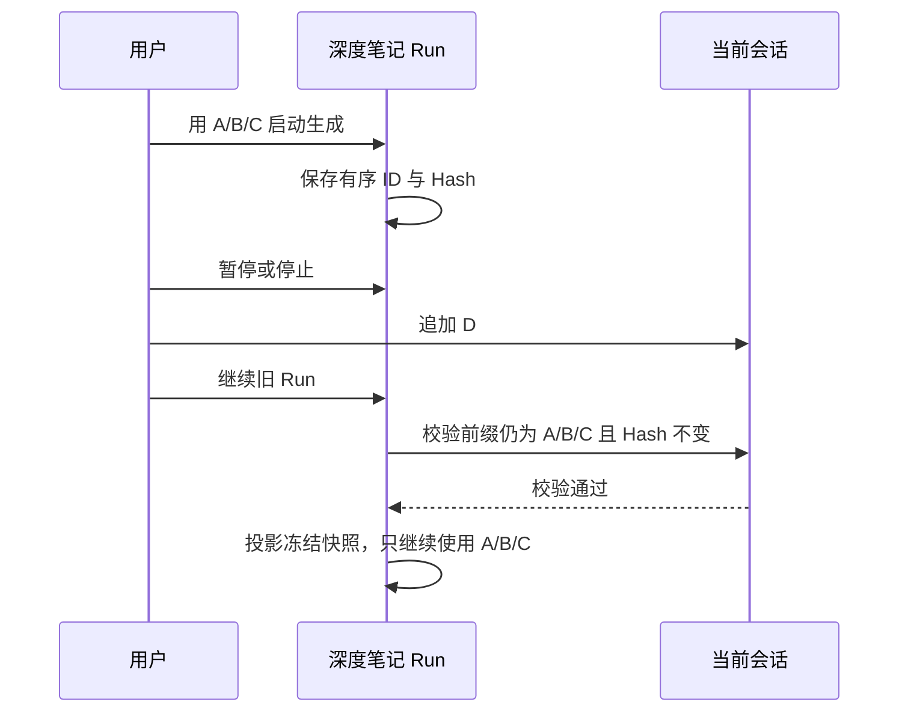
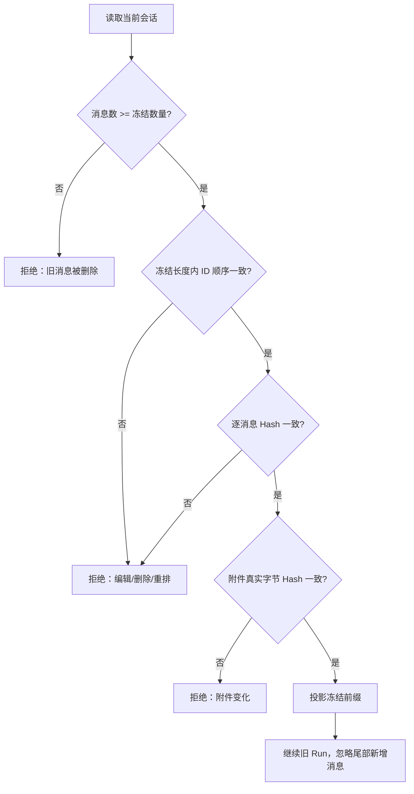
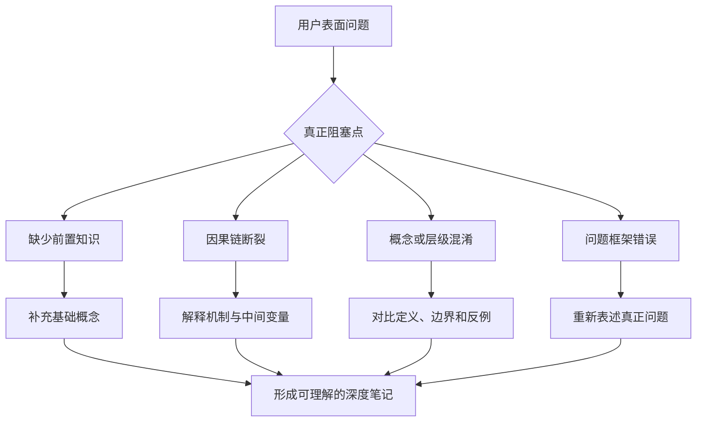

# 04：深度笔记安全恢复、增量更新与 Skill/Tool/DAG 增强

> 更新时间：2026-08-21
> 文档性质：实现记录、安全边界、架构说明与验证结果
> 对应计划：`md/plan/10-深度笔记Skill与Tool协同增强计划.md`
> 适用范围：Chat 对话生成深度笔记、暂停/停止后恢复、已有笔记增量更新、附件来源侦察

## 1. 本轮结论

本轮将深度笔记从“主要依赖对话文本的章节生成管线”推进为一条可冻结输入、可读取附件、可追溯证据、可验证恢复边界的本地知识编排链路。

核心规则已经收敛为：

1. Run 创建时冻结消息 A/B/C 的有序 ID、逐消息内容 Hash、附件 ID 与附件真实字节 Hash。
2. 如果任务中断后只在尾部新增消息 D，继续旧 Run 时仍只使用 A/B/C；D 不会被静默混入旧计划、Ledger 或章节正文。
3. 如果 A/B/C 中任一消息被编辑、删除、重排，或者其附件、引用发生变化，旧 Run 拒绝恢复。
4. 深度笔记完成后再次生成，后端和前端都会检查已有笔记：无新增内容提示“已是最新”；有新增内容询问是否生成增量更新提案；覆盖快照失效时只能明确确认后重新生成。
5. 文件附件不再错误依赖模型 Function Calling。文本、PDF、DOCX、XLSX 由 Rust 本地只读 Reader 执行；图片仍要求模型具备 Vision。
6. Source Chunk、Evidence、Ledger 与 DAG 准备节点已经接入真实产物，不能再仅凭“代码执行到该阶段”把节点标记为完成。
7. Planner、Writer、Reviewer 使用 Run 创建时冻结的 Skill Profile；Skill 只改变方法论，不扩大权限和来源。
8. 提纲与章节 Prompt 会主动识别隐藏问题、知识缺口、逻辑断裂、误解和因果链，并在关系复杂时优先生成安全 Mermaid 图。

整体链路如下：


## 2. 为什么“冻结 A/B/C，忽略新增 D”更合理

深度笔记是一个带计划、证据、预算和检查点的长任务。任务开始后，A/B/C 已经决定了：

- 输入覆盖范围；
- 提纲和章节依赖；
- Source Chunk 与 Evidence；
- 模型调用预算；
- 用户已经确认的 Plan Version。

如果恢复时自动把后来出现的 D 混入旧 Run，会出现三个问题：

1. 已确认的计划实际输入发生变化，用户确认失效。
2. 已完成章节与未完成章节使用不同来源集合，正文可能自相矛盾。
3. 无法判断 D 应该补充旧章节、创建新章节，还是推翻 A/B/C 中的结论。

因此恢复使用“前缀冻结”而不是“会话必须完全不变”：



允许：

- 在 A/B/C 后追加 D、E、F；
- 会话的非来源 UI 状态变化；
- 当前目录中 Skill 文件更新，但旧 Run 继续使用冻结的 Skill 正文。

拒绝：

- 编辑 A/B/C 的正文；
- 删除或重排 A/B/C；
- 修改 A/B/C 的文献引用、笔记引用或附件元数据；
- 替换附件文件但保留相同文件名、大小或 ID；
- 旧任务缺少逐消息 Hash，无法证明安全前缀。

## 3. 消息与附件快照安全

`DeepNoteInputSnapshot` 现在保存：

- `messageIds`：有序消息 ID；
- `messageContentHashes`：正文、角色、状态、附件元数据、文献引用和笔记引用的稳定 Hash；
- `attachmentIds`；
- `attachmentContentHashes`：附件元数据 Hash 与文件真实字节 SHA-256 的组合 Hash；
- 文献与笔记来源 ID；
- 模型身份、能力和权限模式。

附件 Hash 通过会话仓库的安全相对路径解析文件，并在 blocking task 中流式读取，不把整份附件一次性加载进异步执行线程。

恢复校验遵循以下状态机：



## 4. 已有笔记与增量更新

新增 `note_pipeline_inspect_start` 检查入口，并在后端 `start()` 再次执行门禁，避免调用方绕过前端直接重复生成。

检查结果分为四种：

| 状态 | 含义 | 行为 |
| --- | --- | --- |
| `new` | 当前会话没有深度笔记 | 正常启动 |
| `upToDate` | 已有笔记覆盖当前全部来源 | 提示已是最新，不重复生成 |
| `updateAvailable` | 覆盖快照有效，锚点后存在新增消息 | 询问是否仅合入新增消息 |
| `invalidated` | 覆盖消息、顺序、引用或附件发生变化，或旧笔记缺少安全快照 | 阻止增量；明确确认后重新生成新笔记 |

SQLite schema 升级到 v8，新增 `deep_note_coverage_snapshots`：

```text
(note_id, conversation_id)
    → snapshot_json
    → updated_at
```

深度笔记首次保存时，笔记、章节来源与覆盖快照在同一事务中写入。增量编辑提案增加 `coverage_snapshot_json`，只有用户接受提案并成功更新正文后，才在同一事务中推进覆盖快照和增量锚点。

这解决了过去“只看最后一个消息 ID”的缺陷：消息 ID 仍存在，并不能证明它之前的内容没有被编辑或重排。

当前安全边界：如果新增消息包含附件，增量编辑不会忽略附件并直接合并，而是要求重新生成深度笔记，让完整 Source Recon 读取附件。普通纯文本新增消息仍可生成增量提案。

## 5. Skill 选择与冻结

仓库已经包含适合此任务的高质量内置 Skill，因此本轮没有再引入来源不明或功能重叠的新 Skill。

| Profile | Skill | 作用 |
| --- | --- | --- |
| Planner | `question-framing` | 从用户表面问题中定位真正目标、隐藏约束和错误问题框架 |
| Planner | `knowledge-capture` | 区分事实、观点、决定、冲突、待确认项和来源 |
| Writer | `beginner-teaching` | 补齐零基础读者缺少的前置知识，用直觉、机制和例子解释 |
| Writer | `document-authoring` | 构造可长期阅读的文档结构 |
| Writer | `markdown-notes` | 生成稳定的 GFM Markdown、表格和可渲染结构 |
| Writer/Reviewer | `diagram` | 识别适合流程图、层次图、状态图和时序图的关系，并生成 Mermaid |
| Reviewer | `visual-evidence-analysis` | 仅在存在图片来源时加入，区分可见事实与不确定推断；现已默认启用并明确支持 `notes` 模式 |

每个 Run 创建时保存 Skill 的：

- ID、名称和版本；
- Content Hash；
- 已渲染的方法论正文。

暂停、继续和重试只使用该快照，不会因为用户后来升级 Skill 而改变旧 Run。真实注入模型请求时记录 `skillApplied` 事件；前端不需要根据阶段名称猜测 Skill 是否使用。

Skill 仍不拥有 Tool 权限。它不能读取文件、联网、写笔记或改变 DAG，只能影响 Planner/Writer/Reviewer 的分析与表达。

## 6. 隐藏问题、知识缺口与逻辑混乱

用户“问不出来”通常不是表达能力问题，而是问题模型尚未形成。真正阻塞理解的内容常在表面问题后面，例如：

- 缺少一个未被意识到的前置概念；
- 把相关性当成因果关系；
- 混淆了两个层级、两个时间尺度或两个评价标准；
- 观察到了现象，但没有能解释现象的机制；
- 使用了错误的二选一问题，实际存在第三种结构；
- 术语相同，但上下文中的定义不同。

`DeepNoteOutline` 因此新增：

- `hiddenQuestions`；
- `knowledgeGaps`；
- `misconceptions`；
- `causalChains`；
- `visualizationOpportunities`。

Planner 必须优先寻找“什么缺失导致用户无法正确提问”，Writer 再按“直觉 → 前置知识 → 因果机制 → 边界 → 反例 → 自检”的顺序解释。前端提纲确认窗口会显示这些判断，用户可以在正式生成前校正。



## 7. Tool Gateway 与真实 Source Recon

新增 `execute_bounded_attachment_reader()`，它复用普通 Agent 已有的解析器和参数校验，但只允许四个确定性只读 Reader：

- `read_attachment_text`；
- `read_pdf_pages`；
- `read_docx_blocks`；
- `read_xlsx_rows`。

该入口不暴露：

- Tool 搜索与任意 Tool 选择；
- 网络读取；
- 工作区文件读写；
- Memory 修改；
- Note 写入；
- 任意 Skill 脚本。

Rust 根据附件类型和固定窗口产生 Tool 参数，模型不能提供文件路径。每次执行记录 `toolStarted`、`toolCompleted` 或 `toolFailed`，并将 Reader 输出转换为带位置与 Hash 的 Source Chunk。

图片通过专门的 Vision Source 节点发送给模型。辅助请求只有在 `deepNote` 且全部附件均为图片时才允许携带附件，避免放宽其他辅助操作的附件边界。

为降低合法 Reader 结果被统一输出上限截断的风险，本轮只为深度笔记只读网关放宽到 64K 字符；普通 Chat Agent 的 Tool 输出上限保持不变。同时将读取窗口收窄为：文本每次 100 行、DOCX/XLSX 每次 50 项、PDF 每次 2 页。任何 Reader 返回 `outputTruncated = true` 都会记录 `toolFailed` 并中止覆盖完成，不能只保留头尾后继续声称已完整读取。

附件类型识别在预检、Source Recon 与 Agent Reader 中统一采用 MIME + 小写扩展名规则，避免同一文件在不同阶段被判成不同类型。

## 8. Source Chunk、Evidence、Ledger 与 DAG

附件存在时，系统强制走分块 Ledger 规划，不再使用只包含对话 transcript 的 Direct Planner。章节 Writer 发现所选消息包含附件时，也必须使用可追溯 Ledger，而不能因为原始对话较短就回退为纯对话文本。

持久化产物包括：

- `note_pipeline_source_chunks`：来源类型、消息/附件 ID、位置、摘录、内容 Hash；
- `note_pipeline_evidence`：章节、Claim、Source Chunk ID、支持级别和验证状态；
- `note_pipeline_ledgers`：术语、事实、冲突、开放问题、分块摘要与全局约束；
- `note_pipeline_events`：Skill、Tool、节点和覆盖事件；
- `note_pipeline_nodes`：真实 DAG 状态与输出引用。

Evidence 的安全修正：章节明确声明 `sourceMessageIds` 时，如果没有任何 Source Chunk 匹配，Evidence 标记为 `Insufficient`，不再回退到全部来源。只有 `Verified` Evidence 才能让 `ExtractEvidence` 节点完成。

Verified Evidence ID 现在同时写入：

- `note_pipeline_nodes.evidence_ids_json`，用于 `evidence:*`、`draft:*`、`validate:*` 节点反查；
- `note_pipeline_sections.evidence_ids_json`，用于章节检查点与验证报告；
- `DeepNoteValidationReport.checkedEvidenceIds`，不再用消息 ID 冒充 Evidence ID。
- 最终 Sidecar 的章节 `evidenceIds`，用于离线审计正文与证据的绑定关系。

`complete_preparation()` 现在要求：

1. `ReconSource` 有真实 Source Chunk；
2. 每个 `ExtractEvidence` 有该章节的 Verified Evidence；
3. `BuildLedger` 有已保存 Ledger，并且所有 Evidence 节点就绪。

任一条件不满足，DAG 不会释放章节节点。

## 9. Mermaid 图形化输出

Writer Profile 接入 `diagram` Skill，Prompt 和验证器共同要求：

- 至少三个步骤、节点、分支、层级、状态或时序关系时优先考虑 Mermaid；
- 流程使用 `flowchart`，交互使用 `sequenceDiagram`，状态变化使用 `stateDiagram`；
- 图形只表达来源支持的关系，不把装饰性图表当成证据；
- 禁止 `click`、`javascript:`、`iframe`、`script`、外部图片等不安全内容；
- Mermaid fenced code block 必须正确闭合；
- 图后必须有文字解释，不能要求读者只看图猜结论。

章节计划明显包含流程、层次、依赖、状态或时序但没有 Mermaid 时，Validator 会产生质量警告；危险语法和未闭合代码块会直接进入修订。

## 10. 主要代码改动

| 文件 | 改动 |
| --- | --- |
| `src-tauri/src/chat/note_pipeline/service.rs` | 快照恢复、附件 Hash、Source Recon、Skill Profile、Evidence/Ledger、已有笔记检查、后端启动门禁、增量安全校验 |
| `src-tauri/src/chat/note_pipeline/types.rs` | 隐藏问题字段、Source/Evidence/Skill 类型、逐消息 Hash、已有笔记检查契约 |
| `src-tauri/src/chat/note_pipeline/scheduler.rs` | 准备节点只有存在真实产物时才能完成 |
| `src-tauri/src/chat/note_pipeline/prompts.rs` | 隐藏问题、因果机制、误解辨析与 Mermaid 质量要求 |
| `src-tauri/src/chat/agent/registry.rs` | 四类附件 Reader 的确定性只读网关 |
| `src-tauri/src/library/store.rs` | Source/Evidence/Ledger 持久化、覆盖快照 schema v8、增量提案原子推进 |
| `src-tauri/src/skills/repository.rs` | Skill 方法论正文快照渲染 |
| `src/app/hooks/useNoteActions.ts` | 已是最新、可更新、失效重生成的交互与准确错误提示 |
| `src/features/chat/notePipeline/*` | 新提纲字段、隐藏问题与图形机会展示、API 类型更新 |

## 11. 验证结果

本轮完成以下验证：

- `cargo check --manifest-path src-tauri/Cargo.toml`：通过；
- `cargo test --manifest-path src-tauri/Cargo.toml`：290 个测试通过；
- Rust 单元测试覆盖新增 D 可恢复、冻结前缀投影、前缀编辑拒绝、附件真实字节 Hash 变化拒绝、明确来源缺失不得扩大 Evidence、DAG 准备产物门禁、Ledger 完整覆盖与真实语义产物门禁、DAG Evidence ID 持久化、覆盖快照只在接受增量提案后推进，以及关闭自动重试时允许 0 次重试；
- `cargo check --features deep-note-e2e --bin deep-note-e2e --manifest-path src-tauri/Cargo.toml`：通过；无窗口 E2E 契约已改为检查当前生产事件 `dagNodeCompleted`、Skill/Source/Evidence 事件和章节 Evidence ID；
- `npm test`：42 个测试文件、161 个测试通过；
- `npm run build`：通过；
- `cargo fmt --check` 与 `git diff --check`：通过。

现有少量 dead-code warning 属于仓库已有或预留接口，不影响本轮构建和测试。

## 12. 仍然保留的边界

本轮没有把深度笔记改造成自由 Agent，也没有引入以下能力：

- 任意网络搜索；
- 模型自行选择写入 Tool；
- 新增附件的无审计增量合并；
- 真正并行的章节模型请求；
- 独立全局语义 Reviewer 和自动 Replan 完整闭环；
- 跨 Run 的附件解析缓存；
- `note_pipeline_outputs` 的完整幂等恢复事务。

这些属于后续增强，但不影响本轮最重要的安全合同：

> 旧 Run 只继续处理它开始时冻结的来源；已有笔记只在覆盖快照仍有效时增量更新；Skill、Tool、Evidence 和 DAG 的完成状态都必须对应真实注入、真实执行和真实持久化产物。
