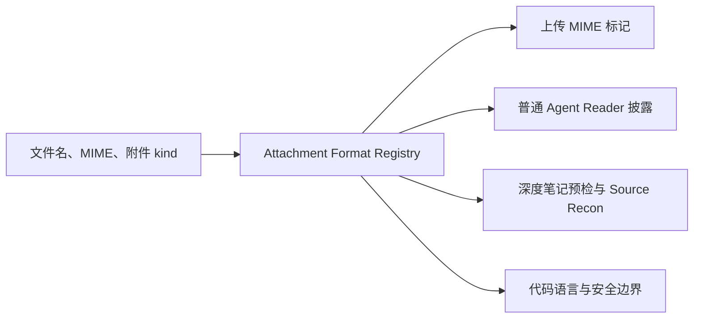
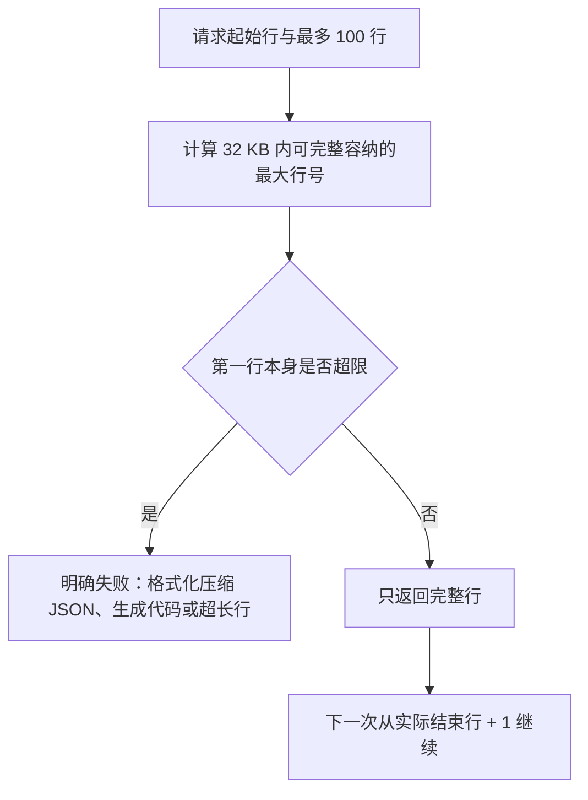
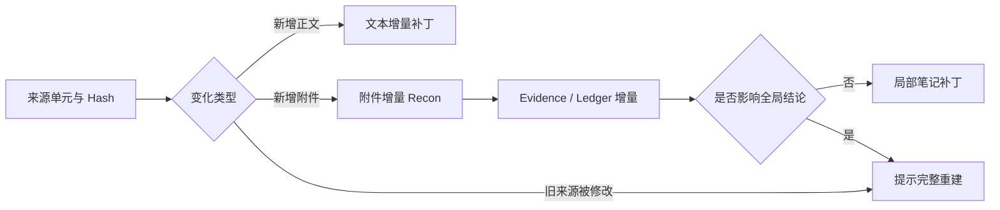

# Mnemora 修改记录 05：深度笔记多格式附件、代码来源与安全重建优化

> 修改日期：2026-08-22
>
> 范围：深度笔记 Source Recon、普通 Agent 附件 Reader、附件上传识别、已有笔记更新入口与能力展示。
>
> 原则：先保证来源不漏读、不误报覆盖和不自动读取敏感配置，再扩大可安全读取的格式范围。

## 1. 本轮解决的问题

深度笔记此前有四个确定性本地 Reader：文本、PDF、DOCX、XLSX。四个 Reader 并不意味着只能支持四种扩展名，但代码中出现了三个真实问题：

1. 普通 Agent 和深度笔记分别维护文本扩展名白名单，支持范围已经漂移。
2. `.py` 等代码文件虽然能按文本读取，但 Source Chunk 没有明确说明语言和“未执行代码”的能力边界。
3. 已有笔记遇到新增附件时，增量编辑拒绝附件，而完整生成入口又被 `updateAvailable` 门禁拒绝，形成流程死路。
4. 文本 Reader 先选择固定 100 行、再按字节截断，极端长行或密集代码可能造成不完整范围。
5. `.env`、凭据文件等虽然属于文本，却不应该被后台深度笔记自动送给模型。

本轮采用的问题框架是：

```text
文件能否上传
    ≠ 文件能否安全解析
    ≠ 当前解析器能否完整覆盖
    ≠ 模型能否理解项目级语义
```

因此没有通过“继续添加 if/else 扩展名”来解决，而是建立统一能力分类，并把新增附件的处理规则显式化。

## 2. 统一 Attachment Format Registry

新增：

- `src-tauri/src/chat/attachment_formats.rs`

该模块成为以下链路共享的格式事实来源：



统一注册表现在负责：

- 扩展名与特殊无扩展名文件识别；
- 文本 MIME 判断；
- PDF、DOCX、XLSX、图片和未知格式分类；
- 代码语言识别；
- 敏感文本文件识别；
- 上传时更准确的 MIME 标记。

这消除了普通 Agent 与深度笔记对 `mjs`、`cjs`、`cs`、`scss`、`bash`、`ini`、`env` 等格式判断不一致的问题。

## 3. 当前文本与代码覆盖范围

### 3.1 文本、标记与数据

当前统一文本入口覆盖：

```text
txt md markdown rst csv tsv
json jsonl ndjson ipynb
xml html htm svg
css scss sass less
yaml yml toml ini cfg conf config properties
log tex bib adoc
```

`.ipynb` 当前按 Notebook JSON 文本读取，不等于已经理解 Cell 执行顺序、输出对象或 Notebook 依赖图。

### 3.2 源代码与 Schema

当前会识别并按带行号文本读取：

```text
Python、JavaScript、TypeScript、Vue、Svelte、Astro
Rust、Java、C、C++、C#、Go、Ruby、PHP
Swift、Kotlin、Dart、Scala、Lua、R
Objective-C、F#、Visual Basic、Groovy
Clojure、Elixir、Erlang
Shell、PowerShell、Windows Batch
SQL、GraphQL、Protocol Buffers、Prisma
HCL/Terraform、Nix、CMake、TeX
```

还支持常见特殊文件名：

```text
Dockerfile Containerfile Makefile GNUmakefile
CMakeLists.txt Jenkinsfile Procfile Vagrantfile
Gemfile Rakefile Justfile
```

### 3.3 代码能力边界

代码附件生成的 Source Chunk 现在明确包含：

```text
[代码来源；语言=Python；文件=main.py；仅做静态文本读取，未执行代码]
```

`DeepNoteSourceKind` 新增 `code`，使代码来源不再与普通 TXT 混为一类。

当前已经做到：

- 文件名和语言元数据；
- 带行号、只读、可追溯文本；
- 不执行用户代码；
- 不因模型没有 Tool Calling 而拒绝本地 Reader。

当前没有宣称实现：

- AST、符号表、函数调用图；
- import/export 跨文件解析；
- 项目入口和仓库级依赖；
- 代码执行、测试或编译；
- Tree-sitter 或 LSP 级项目 DAG。

后续如果需要项目级代码笔记，应在统一格式注册表之上增加独立的 Code Recon 层，而不是让提示词假装已经理解仓库结构。

## 4. 敏感文本自动读取门禁

`.env`、`.env.production`、`.npmrc`、`.pypirc`、`.netrc`、`credentials.json`、`secrets.json` 以及名称包含 `secret` / `credential` 的文件，仍可被识别为文本，但不会自动进入深度笔记 Source Recon。

这是有意区分：

```text
普通文本可读能力
        ↓
敏感性检查
        ├─ 普通文本 → 深度笔记可读取
        └─ 凭据/密钥风险 → 阻止自动读取并明确提示
```

当前没有实现自动脱敏后继续生成，因为正则脱敏无法可靠覆盖所有密钥格式。安全默认值是失败关闭。

## 5. 文本窗口不再静默切断源码行

旧行为是：

```text
请求 100 行
→ 先拼成字符串
→ 超过 32 KB 时截断字符串
→ 调度器仍可能前进到下一组 100 行
```

新行为是：



因此 Reader 不会在源码行中间截断，也不会因固定窗口推进而跳过未读后缀。深度笔记事件会记录 `requestedEndLine` 与 `actualEndLine`，便于诊断真实读取范围。

## 6. 新增附件时的安全行为

本轮保持旧 Run 的冻结语义不变：

```text
Run 启动时冻结 A/B/C
后来新增 D 与附件 X
旧 Run 恢复时仍只处理 A/B/C
```

对已经完成的笔记，当前采用两级策略：

| 新增内容 | 行为 |
| --- | --- |
| 只有新消息正文 | 继续生成增量补丁提案 |
| 新消息包含受支持附件 | 明确提示按当前全部来源完整重建；旧笔记保留 |
| 新消息包含不支持附件 | 不启动重建，提示转换格式或移除附件 |
| 旧覆盖范围内附件变化 | 快照失效，明确确认后完整重建 |

### 6.1 为什么本轮仍然选择完整重建

新增附件理论上可以只执行增量 Source Recon，但当前 `noteEdit` 链尚未拥有完整的：

```text
新附件 Reader / Vision
→ 增量 Source Chunk
→ 增量 Evidence
→ Ledger 合并
→ 全局影响判断
→ 笔记补丁
```

如果只把附件名或消息正文交给增量编辑，会产生“附件没有真正读取，但覆盖锚点已经推进”的错误。因此本轮先修复流程死路，提供安全、真实可执行的完整重建入口；没有把不完整的附件增量伪装成已实现。

### 6.2 `forceRebuild` 合同

`NotePipelineStartRequest` 新增：

```text
forceRebuild: boolean
```

后端只有在用户明确确认时才允许 `updateAvailable` / `upToDate` 状态启动全新 Run。新 Run 会：

- 使用当前全部消息和附件建立新快照；
- 重新执行完整 Source Recon；
- 创建一份新笔记；
- 保留旧笔记，不做覆盖删除。
- 原子地把“未来增量更新锚点”切换到新笔记；旧笔记保留历史消息来源，但不再被误选为最新可更新笔记。

如果存在不支持附件，即使 `forceRebuild=true` 也会拒绝，因为“重新生成”不能解决“没有 Reader”的问题。

## 7. 前端交互变化

`DeepNoteStartInspection` 新增：

```text
newAttachmentCount
requiresFullRebuild
unsupportedAttachmentNames
```

前端现在会区分：

1. 已经是最新；
2. 只有新增文本，可以增量更新；
3. 有新增受支持附件，需要确认完整来源重建；
4. 有不支持附件，直接说明具体文件并停止；
5. 旧快照失效，需要确认重新生成。

深度笔记能力面板把本地文本 Reader 从简单的 `TXT` 改为“文本 / 代码 / 配置”，避免用户误以为 `.py` 不受支持。

## 8. 当前仍不支持的主要类型

以下格式仍不会被误判为可完整理解：

- PPT/PPTX；
- DOC、XLS 等旧二进制 Office；
- RTF、ODT、ODS、EPUB；
- ZIP、TAR、7Z、RAR；
- SQLite、Parquet、Arrow、Avro；
- 音频和视频；
- 可执行文件和未知二进制；
- 非 UTF-8 文本；
- 超过 2 MB 的文本/代码附件；
- 超过现有 Office Reader 安全限制的 DOCX/XLSX；
- 扫描版 PDF OCR。

这些类型上传后仍可能作为会话附件保存，但深度笔记预检会明确拒绝，不会根据文件名猜测内容。

## 9. 主要代码改动

| 文件 | 作用 |
| --- | --- |
| `src-tauri/src/chat/attachment_formats.rs` | 统一格式、MIME、代码语言和敏感文件注册表 |
| `src-tauri/src/chat/attachments.rs` | 上传 MIME 识别复用统一注册表 |
| `src-tauri/src/chat/agent/registry.rs` | 普通 Agent 复用格式分类；完整行自适应文本窗口 |
| `src-tauri/src/chat/note_pipeline/types.rs` | `code` 来源类型、启动检查字段、`forceRebuild` 合同 |
| `src-tauri/src/chat/note_pipeline/service.rs` | 统一调度、代码 Source Chunk、附件差异检查与完整重建门禁 |
| `src/features/chat/api/notePipeline.ts` | 前端 IPC 类型和 `forceRebuild` 参数 |
| `src/app/hooks/useNoteActions.ts` | 文本增量、附件重建和不支持格式的分支交互 |
| `src/features/workspace/views/DeepNoteView.tsx` | Reader 能力显示更新 |

## 10. 验证结果

本轮验证：

- `cargo check --manifest-path src-tauri/Cargo.toml`：通过；
- `cargo test --manifest-path src-tauri/Cargo.toml --no-default-features`：305 个测试通过；
- 新增统一格式、代码语言、敏感文件、完整行窗口、`forceRebuild` 和未知格式门禁测试；
- `npm test -- --run`：43 个测试文件、170 个测试通过；
- `cargo fmt`：已执行。

仓库仍存在既有 dead-code warning，不属于本轮引入的失败。

## 11. 下一阶段建议

本轮完成的是安全、可用的第一阶段。下一阶段建议按以下顺序继续：

1. 为增量编辑建立附件级 Source Unit 与内容 Hash；
2. 实现新增附件的增量 Source Recon、Evidence 和 Ledger 合并；
3. 增加 `requiresGlobalReview`，区分局部补丁与需要全局重审的附件；
4. 引入 Tree-sitter Code Recon，形成符号、导入和有限项目 DAG；
5. 评估非 UTF-8 编码探测，但必须明确显示编码和置信度；
6. 按真实需求增加 PPTX、OCR、Notebook Cell、压缩包安全清单等 Reader；
7. 给格式注册表增加版本号和 extractor version，支持解析缓存失效。

目标状态应是：



在该闭环完成前，当前“有新增附件则完整重建”的策略是有意识的安全边界，不是最终能力上限。
