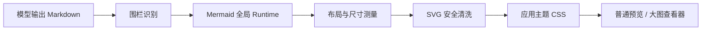
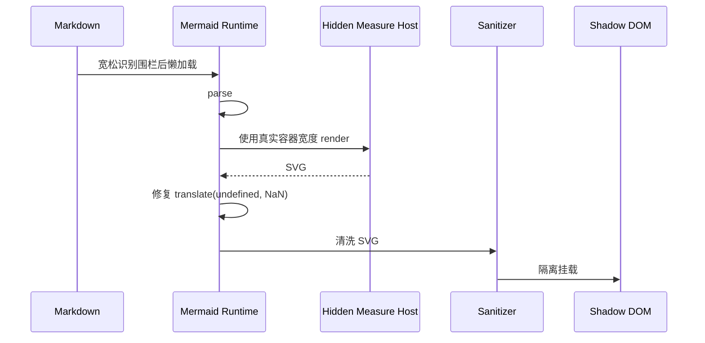

# 07｜Mermaid 疑难演进与根因复盘

> 文档性质：依据 Git 提交、当前工作区、Cherry Studio 源码对照与视觉验证形成的故障史。这里不把“曾经尝试过”写成“最终正确方案”。
>
> 审计范围：`3622294` 至 `4b97f40`，以及 2026-08-22 当前未提交工作区。

## 1. 为什么它会成为疑难杂症

这不是一个单点 CSS Bug，而是五个子系统耦合：



任何一层都可能表现成“Mermaid 渲染坏了”：

- 围栏漏判：显示源码，不进入 Mermaid；
- 折叠或不可见时渲染：宽度为零，产生 NaN 变换；
- 并发初始化：明暗主题互相覆盖；
- SVG 尺寸合同冲突：异常放大、空白或裁切；
- 清洗过严：中文换行和 HTML Label 消失；
- CSS 过强：`classDef` 被覆盖，出现黑底黑字；
- 查看器再次缩放：预览正确，大图错误。

真正隐藏的问题是：过去多次把 Mermaid 当作“普通 SVG 插进 Markdown”，但它其实是一个拥有全局配置、内部样式、布局测量、安全边界和交互查看器的独立渲染子系统。

## 2. 按提交还原演进

| 阶段 | 提交 | 主要变化 | 解决了什么 | 仍留下什么 |
| --- | --- | --- | --- | --- |
| Markdown 基础 | `3622294`、`285913f`、`18e9839` | 建立流式 Markdown、HTML 安全、同步链路 | 为增强渲染建立基础 | 尚无独立 Mermaid 边界 |
| 首次 Mermaid | `43eb375` | 新增 `MermaidBlock`、动态导入、可见区渲染、源码切换、基础清洗和主题 | Mermaid 从代码块变成图 | Runtime 仍按组件初始化；尺寸和主题策略简单 |
| 内存回收 | `e22a80c` | 离开可视区释放 SVG，流式尾部降级 | 长会话内存降低 | 重进可视区需重新布局；折叠容器宽度仍不稳定 |
| 颜色解析 | `7d4caee` | 把 CSS 变量通过浏览器解析成 RGB 后交给 Mermaid | 修复 `color-mix(...)` 被 Mermaid/khroma 拒绝 | 只修了配置输入，没解决 SVG 内部样式冲突 |
| 串行 Runtime 与色板 | `ec5385e` | 新增单例懒加载、串行 `initialize/parse/render`；默认节点标记六色色板；大量 CSS 覆盖 | 修复并发主题污染，提高默认图可读性 | `!important` 逐渐接管 Mermaid 内部样式，埋下 authored style 冲突 |
| 大图查看器 | `9c5aced` | 离屏真实宽度测量、尺寸读取、缩放/平移、焦点约束、图表阈值 | 大图可查看，横向和纵向极端图可操作 | `dangerouslySetInnerHTML` 与全局 CSS 仍直接作用于 SVG；预览和查看器尺寸合同不统一 |
| 布局硬化 | `eb3abfe` | 抽出 `mermaidLayout`，增加 fit/width/actual、键盘平移、围栏与嵌套 Markdown 检查、集群色调 | 改善高图、宽图、嵌套围栏和查看器可用性 | 为“可读”增加的节点/文字/集群强制色，反过来覆盖 `classDef`；最小可读缩放会把小图或高图放大 |
| 当前 Cherry Studio 风格修复 | 当前工作区 | 离屏测量、NaN 修复、SVG 深度清洗、Shadow DOM、去除全局颜色覆盖、补 viewBox、保留 intrinsic max-width | 黑底黑字、异常放大、高图内层裁切得到系统性修复 | Mermaid 本身仍是重型全局库；复杂图型和未来版本仍需 fixture 回归 |

### 2.1 `3622294`：流式 Markdown 的前置条件

这一提交没有 Mermaid 组件，但建立了后来所有问题的上游边界：模型输出会被按流式块解析。Mermaid 围栏可能先出现开头、下一帧才闭合。如果对未闭合围栏直接启动 Mermaid，解析错误会闪烁；如果直到整条消息完成才识别，用户会长时间看到源码。

因此后续形成的正确策略是：流式尾块只显示安全源码，settled block 才启动增强渲染。Mermaid 的“有时不渲染”曾部分来自流式块状态，而不是 Mermaid API。

### 2.2 `285913f`：HTML 安全模型奠定 SVG 清洗思路

安全 HTML 提交把原始 HTML 与生成内容放入白名单管线，为 Mermaid 提供了一个原则：模型输出不是可信 DOM。但 Mermaid 的 SVG 不是普通 Markdown HTML，包含 `style/defs/marker/foreignObject` 等内部结构，不能直接套聊天 HTML Schema。

后续多次反复，本质上是在寻找独立 SVG Sanitizer 的正确边界：

```text
过松 → script / 外链 / event 属性风险
过严 → 标签、样式、marker 和中文换行丢失
```

### 2.3 `18e9839`：同步笔记扩大了渲染场景

笔记开始进入 Obsidian/Notion 等同步链路后，Mermaid 不再只出现在 Chat。相同 Markdown 可能在聊天、笔记预览、同步导出和再次导入中经过不同解析器。嵌套源码围栏、四反引号示例和真实顶层 Mermaid 的区别开始变得关键。

这解释了后来为何必须在生成 Prompt、Rust Validator 和前端 fence detector 三处同时约束“顶层 Mermaid”。只改前端无法修复模型把图包进 `markdown` 源码块的问题。

### 2.4 `43eb375`：第一个完整 MermaidBlock

首次实现包含：

- `MermaidBlock.tsx`；
- IntersectionObserver 接近可视区才渲染；
- 动态 `import("mermaid")`；
- `parse` 前置校验；
- light/dark 配置；
- SVG 清洗；
- 源码/渲染切换、复制、重试；
- 每条消息和单块字符预算；
- 主题变化触发重绘。

这是功能从 0 到 1 的关键提交，但当时有三个结构性弱点：

1. 每个组件都调用全局 `mermaid.initialize`，并发图可能交叉修改主题；
2. `mermaid.render(id, code)` 没有真实宽度的测量容器；
3. `dangerouslySetInnerHTML` 让应用全局 CSS 可以直接覆盖 SVG 内嵌样式。

此外当时 `DANGEROUS_SVG_TAGS` 删除 `foreignObject`，`htmlLabels:false`，换取安全简单，却降低中文长标签体验。

### 2.5 `992992a` 与 `e22a80c`：内存优化改变生命周期

`992992a` 收缩部分增强资源；`e22a80c` 让离开可视区的 Mermaid 释放 SVG 字符串。对于长会话，这是必要的：SVG DOM 和 Mermaid 生成结果不应永久驻留。

但生命周期优化引入了新的测试维度：

- 从可视区离开再进入必须重新生成；
- 折叠消息 `display:none` 后展开，初次宽度可能为 0；
- 主题切换与可视状态同时变化会重复 render；
- 清空 SVG 时 viewer 也必须关闭或稳定恢复。

Cherry Studio 后来专门监听折叠容器的 class/style 变化，正是同类问题。

### 2.6 `7d4caee`：Mermaid 颜色解析器不懂 CSS Color 4

Mnemora 主题广泛使用 CSS 自定义属性和 `color-mix(...)`。浏览器可以解析，但 Mermaid 的 khroma 颜色解析器只接受具体 HEX/RGB/HSL 或有限关键字。直接把 `var(--color-*)` 最终读取到的表达式交给 Mermaid，会产生初始化或渲染错误。

提交增加一个隐藏 probe：让浏览器先计算成 `rgb(...)`，确认属于 Mermaid 可接受格式后再注入 themeVariables。它修复的是“配置解析失败”，而不是 SVG 输出后的可读性，所以随后仍然出现节点颜色问题。

### 2.7 `ec5385e`：全局串行化正确，CSS 接管过度

这一轮最重要的正确改进是 `mermaidRuntime.ts`：

```text
modulePromise 单例
+ renderQueue 串行
+ initialize → parse → render 原子顺序
```

因为 Mermaid 配置是进程级全局状态，串行队列是必要设施，至今仍保留。

同一轮为了让默认节点多彩且可读，引入：

- 默认节点形状检测；
- `data-mnemora-node-tone=0..5`；
- 明暗六色色板；
- 节点文字、边标签、连线和 marker 的 `!important` CSS。

短期截图变好，但宿主开始“理解并改写 Mermaid 内部 DOM”。这违反封装：不同 diagram 的节点 class 与结构不同，用户 `classDef` 也与默认样式共用选择器。之后的黑底黑字，正是这一策略累积到极端后的表现。

### 2.8 `9c5aced`：从源码长度到 SVG Metrics

之前只按 Mermaid 源码字符数或行数判断大图，无法区分“代码长但图小”和“代码短但图极高”。这一提交解析 SVG `viewBox/width/height`，以真实 Metrics 决定大图，并新增：

- 离屏固定宽度测量容器；
- Lightbox；
- 缩放、滚轮、拖动；
- Escape、Tab focus trap；
- 尺寸显示；
- 安全清洗测试。

这是从文本启发式走向几何事实的正确方向。问题在于普通预览仍通过 `dangerouslySetInnerHTML` 挂载，查看器又对同一响应式 SVG 施加 transform，两层尺寸策略没有完全分开。

### 2.9 `b114edd`：生成端开始主动要求图

这一提交主要是深度笔记来源和恢复，但它改变了 Mermaid 负载：Planner/Writer 开始在关系密集章节主动生成图，并把“无图”作为 Warning。图的数量、复杂度和来源多样性都上升。

此后 Mermaid 问题不能只用手写一张 `A-->B` 验证。真实负载包含：

- 深层 flowchart；
- subgraph；
- 中文长标签；
- Writer 生成的 classDef；
- 嵌套 Markdown 外壳；
- 失败后局部修订产生的围栏边界。

### 2.10 `eb3abfe`：布局系统成熟，但启发式仍会过度

这一轮抽出 `mermaidLayout.ts`，引入三种查看模式和投影算法；增强 fence 检测、嵌套 Mermaid 安全预览、集群色调和键盘平移。它解决了很多“图太大看不全”，却仍留下两个过度策略：

1. 极端比例图最小缩放设为 1.0，相当于不允许它在预览中缩小到容器；
2. 为修复集群和节点对比度，继续扩大宿主 CSS 对 SVG 的控制。

这说明一个重要教训：布局和主题修复都应尽量保留 Mermaid 输出的 authored intent；宿主只决定容器、滚动和隔离，不应重新绘制图。

## 3. 每轮优化为何又引出新问题

### 3.1 从“主题不可读”到“覆盖用户语义颜色”

`ec5385e` 的六色色板和全局 `!important` 初衷合理：默认 Mermaid 在 Mnemora 多主题下对比度不稳定。但 CSS 选择器覆盖了 `.node text`、`.label`、集群和 marker，导致 Mermaid 源码中的 `classDef dark ... color:#fff` 不能成为最终权威。

因此截图中的黑色节点仍出现黑字。这里不是 Mermaid 没生成白字，而是应用 CSS 在 SVG 插入后又改回了主题文字色。

### 3.2 从“保证可读尺寸”到“强制放大”

`eb3abfe` 的布局算法引入最小缩放：普通图最小 0.75，极端比例图最小 1.0。这能防止宽图被压得太小，却也意味着：容器比图宽时，图可能被强行放到容器或舒适上限；高图再按宽度投影，高度会显著增长。

最终修正为：

```text
projectedWidth = min(intrinsicWidth, containerWidth)
projectedHeight = projectedWidth / aspectRatio
```

小图保持原始尺寸，只缩小不放大；是否进入滚动视口由真实投影高度判断。

### 3.3 从“宿主预留高度”到“双重高度合同”

早期 Shadow Host 曾给宿主设置 `aspect-ratio`，SVG 自身又用 viewBox、width 和 height 决定高度。宿主和 SVG 同时负责高度，导致大块空白、异常放大或滚动范围与真实图不一致。

当前只保留 SVG 的 intrinsic 尺寸；普通宿主不固定高宽比，大图查看器才显式使用真实像素盒。

### 3.4 从“安全清洗”到“中文标签能力丢失”

最初把 `foreignObject` 作为危险标签全部移除，同时配置 `htmlLabels:false`。这确实降低攻击面，但中文自动换行、富标签和部分 Mermaid 内部布局能力也被牺牲。

当前保持 `securityLevel:strict`，允许 Mermaid 自己生成的 `foreignObject`，再移除：

- `script/iframe/object/embed/image`；
- `on*`、`srcdoc`；
- 非 `#` 的 href/xlink；
- 外部 CSS `url(...)` 与 `@import`。

安全边界从“删掉整个能力”转为“保留静态排版，删除主动内容和外部资源”。

### 3.5 从“渲染成功”到“进入大图又坏了”

普通预览和大图查看器曾共享同一个响应式 CSS：查看器给宿主真实宽高并使用 transform，Shadow 内部 SVG 又 `width:100% + max-width:intrinsic`，造成二次缩放语义不清。

当前为 viewer host 增加独立属性，让它固定 intrinsic 宽高；外层 transform 只负责 fit、width、actual 和用户 zoom。

## 4. Cherry Studio 的可复用做法

核对文件：

```text
src/renderer/hooks/useMermaid.ts
src/renderer/components/Preview/MermaidPreview.tsx
src/renderer/components/Preview/utils.ts
src/renderer/components/chat/messages/markdown/ChatMarkdown.tsx
packages/ui/src/components/composites/markdown/presets.ts
```

它的核心不是某条 CSS，而是一条稳定管线：



Mnemora 已采用这些原则，同时保留自己的内存回收、图表数量预算、大图查看器和主题变量。

## 5. 当前仍要承认的风险

1. Mermaid 11 包较大，首次图表仍会动态加载约数百 KB 代码。
2. `initialize` 是全局状态，串行队列不能删除，只能控制并发。
3. 不同图型的 SVG DOM 不一致，不能再通过应用 CSS 遍历修改内部节点。
4. `mindmap`、`requirementDiagram`、`xychart-beta` 等图型需要单独 fixture；“flowchart 通过”不能代表全部图型通过。
5. 模型可能生成语法合法但认知上错误的图；渲染测试不能代替语义检查。
6. Mermaid 升级必须固定版本并跑视觉回归，否则内部 class、viewBox 或 label 结构变化会再次触发问题。

## 6. 后续治理规则

### 6.1 禁止回归的做法

- 禁止对 Shadow DOM 内部 Mermaid 节点追加应用级 `!important` 色彩覆盖；
- 禁止用容器宽度强制放大 intrinsic 小图；
- 禁止普通预览和 viewer 共用同一尺寸合同；
- 禁止只用源码行数判断图是否“大”；
- 禁止“渲染失败就显示源码”后仍宣称 Mermaid 已可用。

### 6.2 必备视觉矩阵

| 维度 | Fixture |
| --- | --- |
| 主题 | light / dark / high contrast |
| 颜色 | 默认节点 / 黑底白字 classDef / 自定义集群 |
| 比例 | 小图 / 超宽图 / 高流程图 |
| 图型 | flowchart / mindmap / state / sequence / ER / class / gantt / journey / requirement / xychart |
| 标签 | 中文、英文、长标签、边标签 |
| 容器 | 普通消息、折叠后重开、滚动离场再进入、大图查看器 |
| 安全 | script、外链、click、CSS url、错误语法 |

### 6.3 Definition of Done

Mermaid 修复只有同时满足以下条件才算完成：

1. 语法被识别并真正渲染；
2. authored style 没被宿主覆盖；
3. 图不被无意义放大；
4. 高图可以完整滚动；
5. viewer 的 fit/width/100% 正确；
6. 明暗主题可读；
7. 安全 fixture 被清洗；
8. 失败时可查看源码和重试；
9. 全量测试、构建和真实截图通过。

## 7. 本轮修复落地（2026-08-22）

本轮把取证中确认的两个根因落实为代码修复，并针对“又瘦又长、文字被遮挡”补齐生成约束：

1. **HTML Label 与 XML 清洗合同修复**：新增 `normalizeMermaidSvgForXml`，在安全清洗和 Shadow DOM 解析前把 Mermaid `htmlLabels` 输出的裸 `<br>` 规范化为 XML 合法的 `<br/>`，保留中文换行能力，不关闭 `htmlLabels`。
2. **预览与 Viewer 都改为有界 viewBox**：普通消息中的大图预览和全屏查看器都不再创建 intrinsic 数万像素的宿主，也不再用 `transform + will-change` 扩大合成层；通过固定画布和动态 `viewBox` 实现首屏可读预览，以及 fit、width、100%、拖动、方向键平移和滚轮缩放。导航更新只改现有 SVG 的 `viewBox`，不会重复克隆整棵 SVG 树。
3. **生成结果资源预算**：记录 SVG 字节数、元素数、`foreignObject` 数和 intrinsic 尺寸；超过 600KB、12,000 元素、800 个 `foreignObject` 或任一 50,000px 尺寸时，不创建第二份交互查看器，保留有界预览、源码复制和拆图提示。
4. **长图与文字可读性**：移除 intrinsic `max-width` 对窄图的限制，让图使用可用阅读宽度；提高 flowchart wrapping width、间距，并为 ER 图设置更宽实体、内边距、LR 布局和更大的节点/层级间距；Shadow CSS 放宽 `foreignObject` 的可见性，降低标签裁切概率。
5. **生成侧约束**：diagram Skill 与深度笔记 Writer Prompt 规定线性链超过 6 个节点优先 `LR`，单图 12–18 个核心节点，巨型 ER 按领域拆分，换行只使用 `<br/>`，禁止把几十个节点塞进单张纵向图。

### 7.1 新增验证

- `mermaidSecurity.test.ts`：裸 `<br>` 规范化、真实输出合同、viewer 预算超限。
- `mermaidLayout.test.ts`：44,000px 高图的有界 viewBox、顶部起始和边界钳制。
- `mermaidShadow.test.ts`：viewer viewBox 初始化与只更新 viewBox 的导航路径。
- 验证结果：前端 49 个测试文件、197 项通过；`npm run build`、`cargo test --lib`（318 项）、`cargo check --lib`、`cargo fmt --check`、`git diff --check` 通过。

取证报告 `md/test/02-Mermaid有效SVG与超长大图查看器取证.md` 记录的是修复前基线；它指出的“未生成有效 SVG”与大图空白/卡死风险已分别由 XML 规范化和有界 viewBox/资源预算处理。真实 Chrome/WebView2 的视觉回归仍应在发布包中按视觉矩阵逐项执行。
