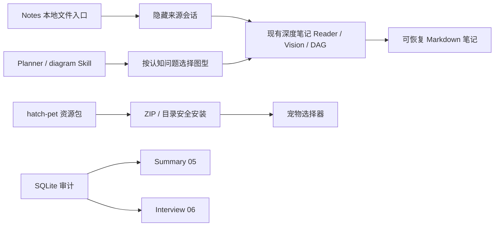
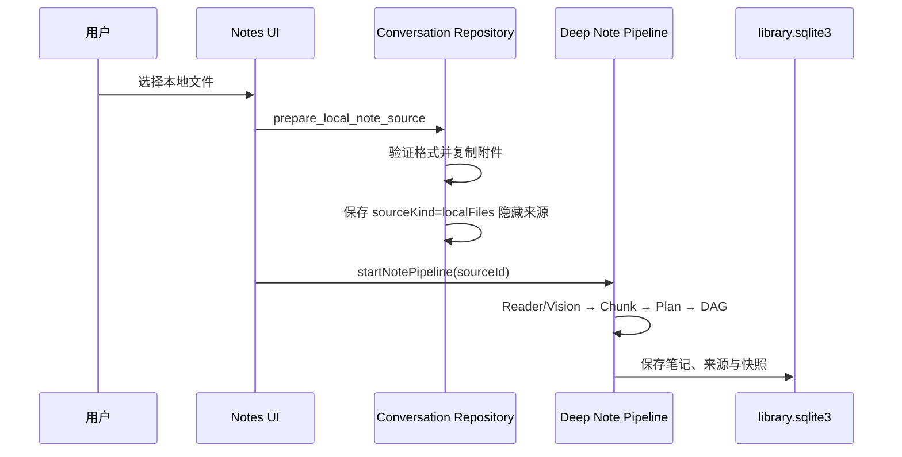

# 08｜本地文件笔记、图表 Skill、宠物安装与数据库文档

## 1. 本轮改动总览



本轮不是把若干按钮拼在一起，而是扩展了三个“来源进入宿主”的边界：本地文件进入深度笔记、图表方法进入 Planner/Writer、宠物资源进入桌面宠物库。

## 2. 本地文件生成深度笔记

### 2.1 用户入口

Notes 列表工具栏新增“从本地文件生成”。选择器支持：

- Markdown、TXT、RST、CSV、JSON、XML、HTML；
- 常见代码与配置文本；
- DOCX、XLSX、PDF；
- PNG、JPEG、WebP、GIF。

### 2.2 为什么复用隐藏来源会话

深度笔记生产链已经以 `conversation_id` 为聚合根，拥有：

- 附件安全副本；
- 字节 Hash 快照；
- 本地 Text/PDF/DOCX/XLSX Reader；
- 图片 Vision；
- Source Chunk、Evidence、Ledger；
- Planner、DAG、章节检查点、暂停恢复；
- `library_notes`、`note_sources` 和覆盖快照。

若另建一套“文件笔记管线”，会复制最复杂、最容易漂移的安全与恢复逻辑。因此新增 `sourceKind=localFiles` 的宿主来源会话：每个文件独占一条完成态消息，文件正文只在附件目录保存，不经过前端 IPC，也不出现在普通 Chat 侧栏分页。



### 2.3 安全与失败处理

- 一次 1~100 个文件；
- 单文件、总大小、图片像素继续使用聊天附件预算；
- 不支持的二进制、敏感配置和损坏图片在启动前拒绝；
- 隐藏来源不进入普通侧栏和 Overview；
- 若初始深度笔记没有启动成功，前端调用 `discard_local_note_source` 清理附件与来源 JSON；
- 任务成功启动后保留来源，用于恢复、来源跳转和未来增量更新。

当前来源生命周期仍有一个待完善点：用户在任务已启动后“永久遗弃”本地文件 Run 时，隐藏来源不会自动随 Run 删除，以免误删仍被已生成笔记引用的证据。后续需要引用计数或显式“删除来源文件”管理页，而不是简单级联清理。

## 3. 图表策略升级

### 3.1 原问题

此前 Prompt 主要列出 flowchart、classDiagram、sequenceDiagram 和 stateDiagram，验证器虽认识部分 ER/gantt/timeline，但 Planner 没有稳定的“认知问题 → 图型”合同。模型容易把所有复杂关系都画成 flowchart，图数量也没有明确质量边界。

### 3.2 新选型矩阵

| 认知任务 | Mermaid 图型 |
| --- | --- |
| 步骤、分支、依赖 | flowchart |
| 概念层级与分类 | mindmap |
| 状态生命周期 | stateDiagram-v2 |
| 多角色时序 | sequenceDiagram |
| 实体、外键、基数 | erDiagram |
| 类型与接口 | classDiagram |
| 真实排期和里程碑 | gantt / timeline |
| 用户/任务执行体验 | journey |
| 需求与验收追踪 | requirementDiagram |
| 来源中真实数值 | xychart-beta / pie |
| 版本分支 | gitGraph |

Planner 的 `visualizationOpportunities` 现在要求写成：

```text
图型｜要回答的认知问题｜建议章节
```

Writer 不再为了图的数量作图；短笔记通常 0~2 张，长笔记通常 2~5 张不同目的的图。统计图禁止编造数据。

### 3.3 Skill 接入

内置 `diagram` Skill 升级到 1.1.0，并继续被深度笔记 Writer 和 Reviewer 冻结进运行快照，因此方法论版本和 Hash 可审计。验证器新增 mindmap、journey、requirementDiagram、xychart-beta、pie 和 gitGraph 关键字。

参考来源不是再引入一个可执行插件，而是组合已有高质量方法：Mnemora `diagram` Skill 固定来源于 GitHub `awesome-copilot` 的图表方法，深度笔记同时使用 `document-authoring`、`markdown-notes` 与 `question-framing`。`json-canvas` 适合未来生成可交互知识地图，但当前笔记正文的跨端兼容格式仍以 Mermaid 为主。

## 4. hatch-pet 与宠物直接安装

### 4.1 不再依赖 Codex

设置页现在区分：

- “安装宠物包”：直接选择 ZIP；
- “导入目录”：选择 `pet.json + spritesheet.webp`；
- “从 Codex 迁移”：只是兼容已有用户目录的可选入口。

### 4.2 ZIP 安全合同

- ZIP 最大 25 MiB；
- 最多 16 个条目、目录深度最多 3；
- 禁止符号链接和越界路径；
- 只允许 `pet.json` 与 `spritesheet.webp`；
- 必须且只能包含一个 Manifest；
- 解压后仍复用现有 ID、WebP Header、尺寸和文件大小校验；
- staging + backup 原子替换；
- 不执行脚本、不加载网络、不授予 Skill/Tool 权限。

### 4.3 内置 Skill

新增经过 Mnemora 适配的 `hatch-pet` 内置 Skill，来源固定到 `openai/skills@49f948f...`，保留：

- 1536×1872、8×9、192×208 Atlas；
- idle、左右移动、waving、jumping、failed、waiting、running、review 九行；
- 透明背景、未使用帧透明、视觉 QA；
- 纯资源包边界。

没有图像生成工具时，Skill 只输出制作规格，不伪造已生成图片。

## 5. 数据库文档

新增：

- `md/Summary/05-数据库.md`：两个 SQLite、32 张源码目标表、ER、迁移、索引、并发、样本体积和演进建议；
- `md/interview/06-数据库面试.md`：72 道主问题与追问、白板题和推荐回答；
- `md/modify/07-Mermaid疑难演进与根因复盘.md`：按 Git Commit 还原 Mermaid 每轮优化与反复失效原因。

数据库文档明确了一个容易误判的事实：Chat 会话不在 SQLite，`note_sources` 和 `note_pipeline_runs` 到对话的关系是应用层软引用；删除会话需要遗弃任务并 detach 来源。

## 6. 关键源码

```text
src-tauri/src/commands/conversations.rs
src-tauri/src/chat/attachments.rs
src-tauri/src/chat/conversation_types.rs
src-tauri/src/chat/storage.rs
src/app/hooks/useNoteActions.ts
src/features/notes/api/localNoteSource.ts
src/features/notes/components/NotesBrowser.tsx
src/features/notes/components/NotesWorkspace.tsx
src-tauri/resources/skills/diagram/SKILL.md
src-tauri/resources/skills/hatch-pet/SKILL.md
src-tauri/src/commands/pet.rs
src/features/pet/api.ts
src/features/settings/components/PetSettingsPanel.tsx
```

## 7. 当前边界与后续工作

1. 本地文件首版复用隐藏来源会话；未来可增加专门的 Source Workspace 与来源管理 UI。
2. 本地文件生成后的再次更新，当前可以沿来源会话与附件增量机制继续演进，但 Notes UI 尚未提供“向这份文件笔记追加新文件”的专门入口。
3. hatch-pet Skill 已进入应用方法库，但 Mnemora 本身不内置图像生成模型；生成视觉资产仍取决于用户所用模型/工具。
4. Mermaid 新图型必须继续补视觉 fixture，不能只靠 Validator 关键字判断质量。
5. 数据库 `note_pipeline_outputs` 的 exactly-once 生产闭环仍是 P0 改进项。

## 8. 同轮公式渲染增强

同一工作区还包含独立数学公式的代码块式展示：KaTeX 默认渲染，可切换到 LaTeX 源码并复制；行内公式保持自然排版。为避免 `/md/modify` 出现两个 07，本轮统一以本文 08 记录该项，旧的临时 `07-数学公式代码块式渲染与LaTeX切换.md` 已合并移除。
