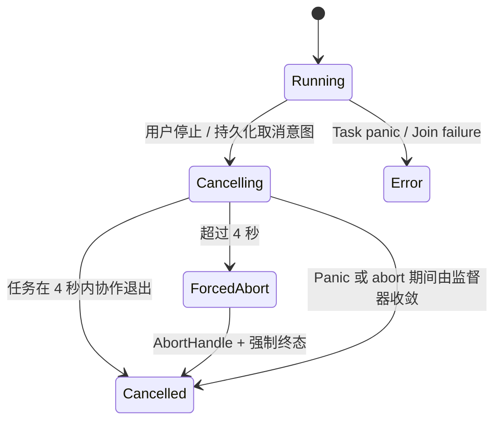
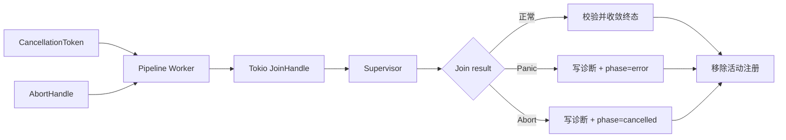

# 10：深度笔记取消监督与 Panic 诊断

## 问题结论

旧链路把“`CancellationToken` 已触发”当作取消成功，但数据库仍可能停留在 `analyzing`，前端又会永久保持 `controlBusy`。一旦后台 task panic、丢失或卡在同步检查点，任务既没有终态，也没有可再次执行的停止或遗弃入口。

## 新取消状态机

- SQLite Schema v10 新增 `cancelling` 阶段。
- 取消命令先写入 `runCancellationRequested`，避免“内存已经取消、数据库仍显示运行”。
- 普通阶段更新不得覆盖 `cancelling/cancelled`，消除迟到事件复活任务的竞态。
- 应用启动时将遗留的 `cancelling` 任务恢复为 `cancelled`。

## 任务监督架构

活动任务注册从 `runId → CancellationToken` 扩展为：

- `CancellationToken`
- `AbortHandle`
- task kind
- task instance ID
- started timestamp

分析和章节生成 task 不再丢弃 JoinHandle，而由 Supervisor 等待并处理正常结束、panic、abort 和 join failure。强制终止后如果同步调用尚未立刻返回，旧 instance 会被隔离：检查点写入与事件写入会被抑制；Supervisor 也只能清理与自身 instance ID 匹配的注册，不能误删之后的新任务。

## Panic 与线程诊断

新增 `task-diagnostics.jsonl`：

- task kind 与 Run ID
- panic/join/forced-abort 类型
- 当前线程名称与 ThreadId
- panic 发生位置
- Rust `Backtrace::force_capture()` 线程栈
- 最近 12 条有界 Pipeline Event
- task 启动时间、年龄、是否收到取消、是否具备 AbortHandle

日志有 64KB 单条上限、1MB 文件上限和单份轮换；字符串、层级、数组和对象数量均有边界，并对凭据、Authorization、Base64 和私钥标记脱敏。全局 panic hook 使用 `try_lock`，避免 panic 期间因日志锁再次死锁。

## 前端恢复能力

- 新增明确的“正在停止”状态，不再宣称任务已经停止。
- 首次停止等待后端最多 4 秒；超时后后端自动强制终止。
- 前端无论成功或失败都会解除 `controlBusy`。
- 停止期间仍可“再次停止”或“遗弃任务”，不再锁死全部按钮。
- 迟到的 progress、outlineReady 和 paused 事件不能把正在停止的任务改回运行态。
- 强制停止时向用户显示诊断日志路径。

## 验证覆盖

- Schema v1 → v10 迁移。
- `cancelling` 阶段拒绝迟到的 `analyzing` 更新。
- 应用重启恢复遗留 `cancelling`。
- Panic 诊断脱敏与有界写入。
- Task Center 的 stopping 投影和逃生控制。
- 深度笔记诊断对强制停止事件的解释。
