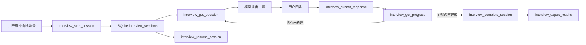

# 面试 Skill 与本地面试会话 Tool 接入

## 变更目标

本次把五个开源面试 Skill 和 `survey-mcp-server` 的面试会话生命周期能力引入 Mnemora。Skill 负责方法论、题型和追问策略；Tool 负责可恢复的会话状态、回答记录、进度和导出。两者分工后，模型可以用 Skill 组织面试，用 Tool 保存事实状态，而不是把会话进度埋在模型上下文中。

## 引入的原版 Skill

| Skill | 固定 Commit | 许可证 | 用途 |
| --- | --- | --- | --- |
| `noamseg/interview-coach-skill` | `634a8dd8689e0420c21e5f0c8ae3cfa9e1a7ab7e` | MIT | 通用面试教练、追问与反馈 |
| `Hazehacker/backend-interview-simulator` | `7a00b21f037026d0782444881123fbbbd007cf39` | MIT | 后端、系统设计和工程权衡 |
| `karanb192/algo-sensei` | `5d4421396994494e74ea2e6cc9cde785be742c5b` | MIT | 算法与数据结构训练 |
| `stratascratch/interview-grinder` | `047eb94f729268e2cb86dd663a6300ec2b85e73e` | Apache-2.0 | SQL 与数据分析面试 |
| `llx9826/llm-interview-coach` | `7d95860557d8c210b2165ce2ca422a04e2ddd34f` | MIT | LLM、RAG、Agent 面试 |

每个目录保留上游 `SKILL.md`、参考资料和资源，不改写原文；`mnemora.json` 只提供本地触发词、默认启用状态和工具能力声明。`SOURCE.md` 与 `THIRD_PARTY_NOTICES.md` 记录固定来源和许可证，便于升级、审计和回溯。

## Tool 适配

`cyanheads/survey-mcp-server` 固定在 Commit `345882f2b298b2398814735d1a6ebafe70820536`，许可证为 Apache-2.0。当前 Mnemora 没有外部 MCP 进程运行时，因此没有把 Node 服务作为隐式后台进程启动，而是把其核心生命周期能力实现为 Mnemora 原生 Agent Tool：

已接入八个工具：`interview_list_available`、`interview_start_session`、`interview_get_question`、`interview_submit_response`、`interview_get_progress`、`interview_complete_session`、`interview_export_results`、`interview_resume_session`。

## 数据与安全边界

新增 SQLite 迁移版本 v14，表为 `interview_sessions`，保存场景、参与者、问题 JSON、回答 JSON、元数据、状态和时间戳，并按参与者及状态建立索引。每次打开数据库统一走迁移；工具层仍保留 `IF NOT EXISTS` 兼容保险。

- 数据只落本机 SQLite，不启动外部进程，不联网。
- 问题最多 100 个，单题最多 4000 字符。
- 单个回答最多 50000 字符，元数据最多 20000 字符，导出最多 100000 字符。
- 会话 ID、问题 ID 和参与者 ID 有长度与路径字符校验。
- 写操作受现有 Agent 审批和 `library_operations` 串行锁保护，可被任务取消机制中断。
- 完成前必须回答全部必答题；重复提交同一问题会更新该问题的回答，不会增加虚假的题数。

## 验证结果

- `cargo check --manifest-path src-tauri/Cargo.toml --locked` 通过。
- `cargo test --manifest-path src-tauri/Cargo.toml --lib library::interview` 通过，覆盖创建、读取、提交、进度、完成、恢复、JSON/Markdown 导出和非法输入。
- `npm run skills:provenance:check` 通过，当前共 34 个 Skill 来源声明同步。

## 当前边界与后续方向

当前 `interview_start_session` 使用内置场景题目，尚未把自定义题目数组暴露给模型；这样可以先保证题目来源稳定、上下文可控。后续可在 Skill 明确声明允许时增加经过大小限制和审核的自定义题目，并增加面试评分、错题回流、逐题反馈及与 FSRS 英语训练模块的关联。外部 MCP 连接如果未来引入，应放入独立沙箱和显式连接配置，不能改变当前本地 Tool 的确定性行为。
