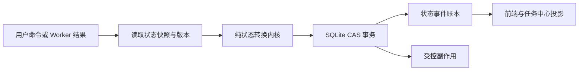
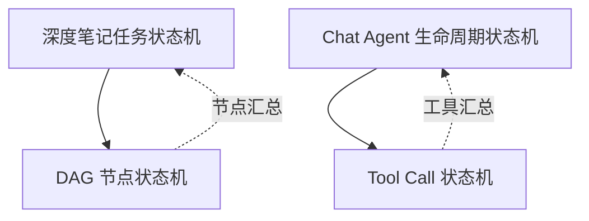
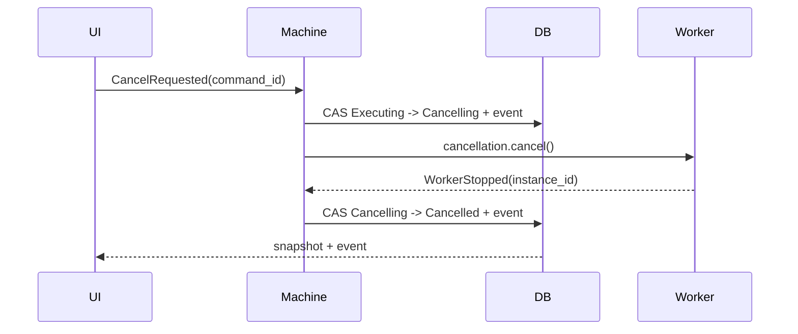
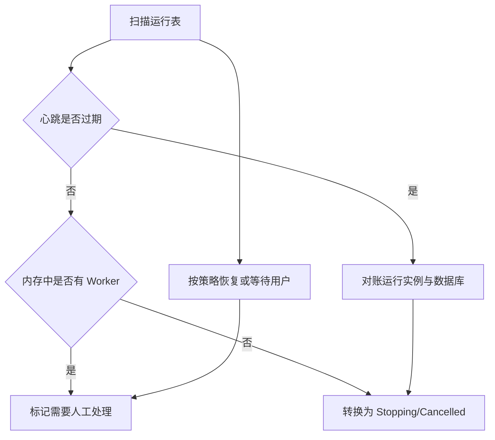

# Mnemora Plan 13：统一状态机内核与三类任务状态机实施设计

> 状态：五阶段核心链路已实施（2026-08-23）；后续新增状态必须继续遵守本文合同。
>
> 范围：深度笔记任务、深度笔记 DAG 节点、Chat Agent/Tool 三类长生命周期运行单元。
>
> 目标：把当前分散在 Rust Service、SQLite、CancellationToken、React Hook 和任务中心投影中的隐式状态逻辑，收敛为可验证、可恢复、可审计的状态转换内核。

---

## 一、先回答真正的问题

当前不是没有状态，而是没有一个不可绕过的状态决定者。

现有代码已经具备：

- `NotePipelinePhase`、`DeepNoteNodeStatus`、`AgentRunStatus` 等状态枚举；
- SQLite 中的运行表、节点表和事件表；
- `CancellationToken`、`AbortHandle` 和运行注册表；
- 前端任务中心和 Agent Workflow 投影；
- 暂停、取消、恢复、重试、重新生成和遗弃入口。

但是，状态转换分散在多个函数中，数据库更新入口没有完整的合法转换表，前端还保留一个已经落后于后端的 `pipelineState.ts`。因此当前更准确的定义是：

> 有状态协议，没有统一状态机内核。

统一内核要解决的不是“把状态名称集中起来”，而是确定并发情况下谁有权推进状态：



核心规则：

1. 所有状态改变必须由领域事件驱动。
2. 所有事件必须经过领域状态机的合法转换检查。
3. 状态和状态事件必须在同一数据库事务内提交。
4. Worker 结果必须携带 `execution_version`、`state_version` 和运行实例标识。
5. 旧 Worker、迟到模型响应、过期审批不能覆盖新状态。
6. React 只能发送命令和投影状态，不能成为运行真相。
7. 取消令牌负责停止副作用，状态机负责决定任务是否已经停止；两者不能互相替代。

---

## 二、总体目标架构

### 2.1 四层边界

```text
领域状态机（纯函数）
        ↓ 返回 next state + effects
持久化协调器（事务、CAS、事件）
        ↓ 提交成功后执行
副作用执行器（Worker、取消、通知、模型、Reader）
        ↓ 生成事实事件
投影层（Task Center、Chat Workflow、Deep Note UI）
```

### 2.2 状态机的职责边界

| 层 | 负责 | 不负责 |
|---|---|---|
| 领域状态机 | 判断事件是否合法、生成新状态和副作用计划 | SQL、网络请求、启动线程 |
| SQLite 协调器 | CAS、事务、事件序号、检查点 | 决定业务是否允许跳转 |
| Worker | 执行模型、Tool、Reader 和组装操作 | 直接写任意状态 |
| 前端 | 命令、订阅、展示和重新读取快照 | 自行推进任务阶段 |
| Task Center | 统一投影多个运行单元 | 持有运行真相 |

### 2.3 不采用一个全局大状态机

三类状态机必须独立：



- 深度笔记任务控制生命周期和用户操作。
- DAG 节点控制依赖、租约、重试和产物。
- Chat Agent 控制模型循环、审批、取消和最终回复。
- Tool Call 控制单个工具提议、审批、执行和终止。

---

## 三、统一状态机内核设计

### 3.1 建议目录

```text
src-tauri/src/task_runtime/
├── mod.rs
├── machine.rs       # 通用 trait 与 Transition
├── error.rs         # 非法转换、版本冲突、过期事件
├── event.rs         # 通用事件元数据与 command_id
├── persistence.rs   # CAS、事务、事件序号
└── recovery.rs      # 崩溃、租约和僵尸运行恢复
```

领域实现分别放在：

```text
src-tauri/src/chat/note_pipeline/run_machine.rs
src-tauri/src/chat/note_pipeline/node_machine.rs
src-tauri/src/chat/agent/run_machine.rs
src-tauri/src/chat/agent/tool_machine.rs
```

### 3.2 纯函数接口

```rust
pub trait StateMachine {
    type State: Copy + Eq;
    type Event;
    type Context;
    type Effect;

    fn transition(
        state: Self::State,
        event: &Self::Event,
        context: &Self::Context,
    ) -> Result<Transition<Self::State, Self::Effect>, TransitionError>;
}

pub struct Transition<S, E> {
    pub next_state: S,
    pub effects: Vec<E>,
    pub reason: &'static str,
}
```

实现约束：

- `transition()` 不得访问全局状态、文件、网络或数据库。
- `Context` 只携带已读取的事实，例如是否存在提纲、预算是否耗尽、依赖是否完成。
- `Effect` 是声明式操作，不在转换函数内执行。
- 非法事件返回结构化错误，不用字符串匹配控制流程。
- 每个领域机器必须有完整的状态矩阵测试。

### 3.3 统一运行元数据

三类可恢复运行都应具备以下元数据：

```text
run_id
state
activity
state_version       # 每次成功状态转换递增
execution_version   # 每次恢复/重试执行递增
runtime_instance_id # 当前 Worker 实例
last_event_sequence
heartbeat_at
created_at
updated_at
finished_at?
error_code?
error_message?
```

### 3.4 CAS 与事件事务

状态更新必须带旧状态和旧版本：

```sql
UPDATE note_pipeline_runs
SET phase = ?,
    state_version = state_version + 1,
    execution_version = ?,
    updated_at = ?
WHERE id = ?
  AND phase = ?
  AND state_version = ?
  AND execution_version = ?;
```

事务中同时写：

```text
状态更新
事件账本
错误或警告
检查点引用
```

影响行数为 `0` 时，返回 `VersionConflict`，调用方必须重新读取状态，而不是盲目重试写入。

### 3.5 幂等命令

所有外部命令携带 `command_id`：

```text
start / pause / resume / cancel / retry / restart / confirmPlan / resolveApproval
```

同一 `command_id` 重复到达时返回第一次结果，不重复执行副作用。事件表增加唯一约束：

```sql
UNIQUE(run_id, command_id)
```

### 3.6 事件信封

```rust
pub struct StateEventEnvelope {
    pub event_id: String,
    pub run_id: String,
    pub command_id: Option<String>,
    pub from_state: String,
    pub to_state: String,
    pub event_type: String,
    pub execution_version: u32,
    pub runtime_instance_id: Option<String>,
    pub payload_json: String,
    pub created_at: u64,
}
```

前端事件丢失或序号断层时，必须重新读取数据库快照；不能依靠“补发最后一条字符串进度”恢复一致性。

---

## 四、五阶段实施总览

| 阶段 | 名称 | 核心结果 | 是否改变用户行为 |
|---|---|---|---|
| 1 | 内核与影子迁移 | 统一转换接口、版本和事件合同 | 尽量不改变 |
| 2 | 深度笔记任务机 | Run 的暂停、取消、恢复、完成受统一约束 | 修复一致性问题 |
| 3 | DAG 节点机 | 节点租约、依赖、重试和产物状态统一 | 提升恢复和并发可靠性 |
| 4 | Chat Agent/Tool 机 | 审批、取消、工具批次和 Agent 生命周期统一 | 改善任务显示和安全 |
| 5 | 清理、恢复和治理 | 删除旧写入口、迁移完成、监控和回滚闭环 | 降低长期维护成本 |

阶段关系：


每个阶段都必须满足：

1. 新旧状态可以在一段时间内并行观测。
2. 发生版本冲突时保守拒绝写入。
3. 失败任务可以查看最后一个合法状态和事件。
4. 有明确的回滚开关，不通过删除数据库数据回滚。

---

# 阶段一：统一内核与影子迁移

## 1.1 目标

先建立“所有状态转换都可被描述和测试”的基础，不立即重写深度笔记或 Chat Worker。第一阶段的成功标准不是功能变多，而是能够发现旧代码中的非法跳转和状态漂移。

## 1.2 现有代码接入点

重点清点并包裹以下入口：

- `src-tauri/src/library/types.rs`：状态枚举和可恢复性。
- `src-tauri/src/library/store.rs`：`update_note_pipeline_phase`、节点状态更新、章节检查点。
- `src-tauri/src/chat/note_pipeline/service.rs`：启动、确认、暂停、恢复、取消、重试和 Worker。
- `src-tauri/src/state.rs`：活动任务、取消令牌、AbortHandle。
- `src-tauri/src/chat/service.rs`：Chat Agent Run、Tool Trace 和取消。
- `src/features/tasks/projections/taskRunProjection.ts`：只保留投影职责。
- `src/app/hooks/useNoteActions.ts`：只发送命令、接收事件和刷新快照。

## 1.3 数据库迁移

新增字段，使用兼容默认值：

```sql
ALTER TABLE note_pipeline_runs ADD COLUMN state_version INTEGER NOT NULL DEFAULT 0;
ALTER TABLE note_pipeline_runs ADD COLUMN runtime_instance_id TEXT;
ALTER TABLE note_pipeline_runs ADD COLUMN heartbeat_at INTEGER;
ALTER TABLE note_pipeline_runs ADD COLUMN last_event_sequence INTEGER NOT NULL DEFAULT 0;
```

如果 SQLite 迁移层不允许直接 `ALTER` 多次，新增版本迁移一次完成，并为旧行填充：

- `state_version = 0`
- `last_event_sequence = COALESCE(MAX(sequence), 0)`
- `heartbeat_at = updated_at`

新增通用事件元数据列或在现有 `payload_json` 中先兼容保存；推荐最终独立列化，便于诊断。

## 1.4 影子转换

旧流程仍负责真正执行，但每次旧代码准备写状态前：

1. 读取当前状态。
2. 将旧动作映射为领域事件。
3. 调用新 `transition()`。
4. 比较新内核的 `next_state` 与旧代码目标状态。
5. 一致则继续旧写入并记录 `shadowMatched`。
6. 不一致则记录 `shadowMismatch`，保守拒绝危险跳转或进入兼容旁路。

禁止在影子阶段静默修正所有差异；必须保存差异来源和调用栈，便于清理旧入口。

## 1.5 阶段一测试

- 每个状态枚举的合法/非法转换矩阵。
- 重复命令幂等性。
- 两个 Worker 使用同一版本写入时只有一个成功。
- 事件序号严格递增。
- 旧状态转换和新内核目标状态一致性测试。
- 旧数据加载、缺失字段、未知状态的兼容测试。

## 1.6 阶段一验收

- 所有直接更新 Run 状态的调用点都有清单。
- 新内核可以在纯单元测试中覆盖完整状态矩阵。
- `state_version` 和 `execution_version` 不再混用。
- 运行日志可以指出非法跳转的调用方。
- 影子不一致率降到 0 后，才进入阶段二。

## 1.7 回滚

保留 `state_machine_shadow_enabled` 和 `state_machine_write_enabled` 两个开关：

- 关闭 shadow：停止比较，但不删除新增字段和事件。
- 关闭 write：继续使用旧写入路径，保留事件供诊断。

不能通过删除迁移列或回滚 SQLite 文件恢复。

---

# 阶段二：深度笔记任务状态机

## 2.1 目标

让深度笔记 Run 的生命周期成为唯一任务级事实来源，优先解决取消卡死、暂停后迟到事件、切换对话后进度不一致和恢复阶段漂移。

## 2.2 状态模型

保留外部 API 的 `NotePipelinePhase` 兼容字符串，但内部拆成生命周期和活动：

```rust
pub enum DeepNoteRunState {
    Created,
    Planning,
    AwaitingConfirmation,
    Executing,
    Pausing,
    Paused,
    Cancelling,
    Blocked,
    Completed,
    Cancelled,
    Failed,
}

pub enum DeepNoteActivity {
    Idle,
    Preflight,
    Analyzing,
    Compiling,
    Queuing,
    Drafting,
    Validating,
    Replanning,
    Assembling,
    Persisting,
}
```

兼容映射示例：

| 旧 phase | Run state | Activity |
|---|---|---|
| `preflight` | `Planning` | `Preflight` |
| `analyzing` | `Planning` | `Analyzing` |
| `awaiting_outline` | `AwaitingConfirmation` | `Idle` |
| `compiling` | `Executing` | `Compiling` |
| `queued` | `Executing` | `Queuing` |
| `drafting` | `Executing` | `Drafting` |
| `validating` | `Executing` | `Validating` |
| `replanning` | `Planning` | `Replanning` |
| `assembling` | `Executing` | `Assembling` |
| `persisting` | `Executing` | `Persisting` |
| `paused` | `Paused` | `Idle` |
| `blocked` | `Blocked` | `Idle` |
| `done` | `Completed` | `Idle` |
| `cancelled` | `Cancelled` | `Idle` |
| `error` | `Failed` | `Idle` |

## 2.3 任务事件

```rust
pub enum DeepNoteRunEvent {
    StartRequested,
    PreflightSucceeded,
    OutlineGenerated,
    OutlineAdjustmentRequested,
    OutlineConfirmed,
    PlanCompiled,
    ExecutionStarted,
    PauseRequested,
    PauseAcknowledged,
    ResumeRequested,
    CancelRequested,
    WorkerStopped,
    DagCompleted,
    DagBlocked,
    AssemblyStarted,
    PersistenceStarted,
    PersistenceCompleted,
    RetryRequested,
    RestartRequested,
    PanicDetected,
    TimeoutDetected,
}
```

## 2.4 合法转换摘要

```text
Created + StartRequested                 → Planning / Preflight
Planning + OutlineGenerated              → AwaitingConfirmation / Idle
AwaitingConfirmation + OutlineAdjustment → Planning / Replanning
AwaitingConfirmation + OutlineConfirmed   → Executing / Compiling
Executing + PauseRequested               → Pausing
Pausing + PauseAcknowledged              → Paused / Idle
Paused + ResumeRequested                 → Executing / checkpoint activity
任意非终态 + CancelRequested              → Cancelling
Cancelling + WorkerStopped               → Cancelled
Executing + DagCompleted                 → Executing / Assembling
Executing + PersistenceCompleted         → Completed
Executing + DagBlocked                   → Blocked
任意非终态 + Panic/Timeout               → Failed
Failed/Blocked + RetryRequested          → Executing 或 Planning
Failed/Blocked/Cancelled + Restart       → Created
```

以下跳转必须拒绝：

- `Completed` 再次执行、暂停或取消；
- `Cancelled` 接收旧 Worker 的完成事件；
- 未确认计划直接进入 `Executing`；
- `Persisting` 直接进入 `Paused`；
- `Failed` 通过普通章节完成事件进入 `Completed`。

## 2.5 取消协议



取消请求成功只代表进入 `Cancelling`，不能立即向用户宣称已经停止。只有 Worker 退出或经过强制终止诊断流程后，才能进入 `Cancelled`。

## 2.6 恢复协议

- `AwaitingConfirmation`：只恢复提纲和计划确认界面，不自动生成。
- `Paused`：从最后完成节点和 `execution_version` 恢复。
- `Failed/Blocked`：必须由 `RetryRequested` 或 `RestartRequested` 离开。
- `Cancelling`：启动恢复扫描；若实例不存在或心跳超时，执行 `WorkerStopped`，否则等待真实停止。
- `Completed/Cancelled`：只允许查看或创建新 Run。

## 2.7 阶段二验收

- 取消和完成竞态下，只有一个终态，且取消优先级明确。
- 任务切换到其他对话后，任务中心仍能从数据库显示最后快照。
- 应用重启后不重复写入最终笔记。
- 所有状态写入都带 CAS 和事件。
- 前端不再自行把任务设置为完成。

---

# 阶段三：深度笔记 DAG 节点状态机

## 3.1 目标

让每个 DAG 节点拥有独立的依赖、租约、执行、验证和重试状态，消除 `note_pipeline_nodes` 与 `note_pipeline_sections` 状态漂移。

## 3.2 节点状态

```rust
pub enum DagNodeState {
    Pending,
    Ready,
    Leased,
    Running,
    Reviewing,
    RevisionRequired,
    Completed,
    Failed,
    Blocked,
    Skipped,
    Interrupted,
    Superseded,
}
```

`Leased` 和 `Superseded` 是必须补充的状态：

- `Leased` 解决同一节点被多个 Worker 同时执行的问题。
- `Superseded` 解决 Plan Version 重规划后旧节点迟到写入的问题。

## 3.3 节点事件

```rust
pub enum DagNodeEvent {
    DependenciesSatisfied,
    DependencyFailed,
    LeaseAcquired,
    ExecutionStarted,
    ExecutionSucceeded,
    ValidationPassed,
    ValidationFailed,
    RevisionScheduled,
    RetryScheduled,
    AttemptLimitReached,
    CancellationRequested,
    LeaseExpired,
    PlanSuperseded,
}
```

## 3.4 转换

```text
Pending + DependenciesSatisfied → Ready
Pending + DependencyFailed      → Blocked
Pending + PlanSuperseded        → Superseded
Ready + LeaseAcquired           → Leased
Leased + ExecutionStarted       → Running
Leased + LeaseExpired           → Ready
Running + ExecutionSucceeded    → Reviewing
Running + RetryScheduled        → Ready
Running + AttemptLimitReached   → Failed
Reviewing + ValidationPassed    → Completed
Reviewing + ValidationFailed    → RevisionRequired
RevisionRequired + RevisionScheduled → Ready
RevisionRequired + AttemptLimitReached → Failed
```

## 3.5 节点租约和版本

`note_pipeline_nodes` 应新增：

```text
state_version
execution_version
lease_token
lease_owner
lease_expires_at
heartbeat_at
```

领取节点使用条件更新：

```sql
UPDATE note_pipeline_nodes
SET status = 'leased',
    lease_token = ?,
    lease_owner = ?,
    lease_expires_at = ?,
    state_version = state_version + 1
WHERE run_id = ?
  AND plan_version = ?
  AND node_id = ?
  AND status = 'ready'
  AND state_version = ?
  AND execution_version = ?;
```

完成节点必须校验 `lease_token`。租约过期后，旧 Worker 返回一律进入 `StaleWorkerResult`，不能更新节点。

## 3.6 章节状态归属

推荐长期方案：

- DAG 节点状态是执行状态唯一来源。
- `note_pipeline_sections` 保存正文、验证 JSON、证据和检查点。
- 章节状态由 Draft/Validate/Review 节点投影得到。

过渡期如果仍保留 `note_pipeline_sections.status`，必须在同一事务更新，且增加一致性断言：

```text
Draft completed + Validate completed → section completed
Draft failed / Validate failed      → section failed 或 needs_revision
Node blocked                        → section blocked
```

## 3.7 DAG 调度器

调度器只认节点状态和依赖，不认进度字符串：

1. 查询 `Pending` 节点并判断依赖。
2. 满足依赖则转换为 `Ready`。
3. 通过租约 CAS 领取 `Ready` 节点。
4. 执行 Reader、模型或验证器。
5. 保存产物，再提交节点事件。
6. 重新计算下游节点。

默认单 Run 最大并发为 `2`；写 Ledger、全局验证、组装和持久化节点必须串行。

## 3.8 阶段三验收

- 同一节点只能被一个租约持有者执行。
- 依赖失败会阻塞下游，不会伪造完成。
- 重规划后旧节点不会覆盖新 Plan Version。
- 节点失败可只重试失败分支，不重复成功节点。
- 应用崩溃后能从节点检查点恢复。

---

# 阶段四：Chat Agent 与 Tool 状态机

## 4.1 目标

先统一 Chat Agent 的审批、取消和工具调用；模型循环、流式输出和最终消息保存逐步接入。普通 Chat 的消息状态不能继续承担 Agent 运行状态。

## 4.2 Agent 生命周期与活动

```rust
pub enum AgentRunState {
    Created,
    Running,
    Waiting,
    Stopping,
    Completed,
    Stopped,
    Failed,
    BudgetExhausted,
}

pub enum AgentActivity {
    Preparing,
    CallingModel,
    WaitingApproval,
    ExecutingTools,
    WaitingUser,
    Finalizing,
    Idle,
}
```

`AgentRunState` 决定任务能否继续，`AgentActivity` 只描述当前活动。一个 Agent 可以处于 `Running`，同时有多个 Tool Call 处于不同状态。

## 4.3 Agent 事件

```rust
pub enum AgentRunEvent {
    StartRequested,
    PreparationCompleted,
    ModelCallStarted,
    ModelCallCompleted,
    ToolCallsProposed,
    ApprovalRequired,
    AllApprovalsResolved,
    ToolBatchStarted,
    ToolBatchCompleted,
    FinalizationStarted,
    FinalizationCompleted,
    UserInputRequired,
    UserInputReceived,
    CancelRequested,
    WorkerStopped,
    BudgetExceeded,
    TimeoutDetected,
    PanicDetected,
}
```

## 4.4 Agent 转换摘要

```text
Created + StartRequested             → Running / Preparing
Running + ModelCallStarted           → Running / CallingModel
Running + ApprovalRequired           → Waiting / WaitingApproval
Waiting + AllApprovalsResolved       → Running / ExecutingTools
Running + ToolBatchCompleted         → Running / CallingModel
Running + UserInputRequired          → Waiting / WaitingUser
Running + FinalizationStarted        → Running / Finalizing
Running + FinalizationCompleted      → Completed / Idle
任意非终态 + CancelRequested          → Stopping / Idle
Stopping + WorkerStopped             → Stopped / Idle
Running + BudgetExceeded             → BudgetExhausted / Idle
任意非终态 + Panic/Timeout            → Failed / Idle
```

## 4.5 Tool Call 状态

现有 `ToolTraceStatus` 需要扩展为运行态合同：

```rust
pub enum ToolCallState {
    Proposed,
    AwaitingApproval,
    Approved,
    Queued,
    Running,
    Completed,
    Rejected,
    Failed,
    Cancelled,
    TimedOut,
}
```

转换：

```text
Proposed + NoApproval       → Queued
Proposed + ApprovalRequired → AwaitingApproval
AwaitingApproval + Approve  → Approved
AwaitingApproval + Reject   → Rejected
AwaitingApproval + Timeout  → TimedOut
Approved + Enqueued         → Queued
Queued + LeaseAcquired      → Running
Running + Success           → Completed
Running + Failure           → Failed
任意非终态 + RunCancelled    → Cancelled
```

## 4.6 审批安全合同

审批记录必须绑定：

```text
approval_id
agent_run_id
tool_call_id
execution_version
state_version
expires_at
```

批准接口必须通过 CAS：

```sql
UPDATE agent_tool_calls
SET state = 'approved', state_version = state_version + 1
WHERE call_id = ?
  AND approval_id = ?
  AND state = 'awaitingApproval'
  AND execution_version = ?
  AND expires_at > ?;
```

Agent 被取消时，必须原子地：

1. Agent 进入 `Stopping`。
2. 取消模型请求。
3. 关闭所有未决审批。
4. 将未开始 Tool 设为 `Cancelled`。
5. 等待运行中 Tool 退出。
6. 收到 `WorkerStopped` 后进入 `Stopped`。

## 4.7 建议新增表

```sql
agent_runs(
  id, conversation_id, message_id, state, activity,
  state_version, execution_version, runtime_instance_id,
  model_id, budget_json, error_code, error_message,
  heartbeat_at, created_at, updated_at, finished_at
)

agent_tool_calls(
  call_id, run_id, name, state, state_version,
  execution_version, approval_id, risk, arguments_hash,
  lease_token, result_preview, error_kind,
  created_at, updated_at
)

agent_run_events(
  run_id, sequence, command_id, event_type,
  from_state, to_state, payload_json, created_at,
  UNIQUE(run_id, sequence),
  UNIQUE(run_id, command_id)
)
```

消息仍保存最终快照：

- `agent_run_id`
- `tool_traces`
- `agent_events`
- `workflow_summary`

但运行期以 `agent_runs` 和 `agent_tool_calls` 为事实来源，不能只修改消息 JSON 表示运行状态。

## 4.8 前端接入

- `useStreamingRun` 只消费事件和最终快照。
- `workflowProjection.ts` 优先读取后端 Agent Run 状态。
- `AgentWorkflow` 的批准/拒绝操作带 `approval_id` 和命令 ID。
- `TaskCenter` 显示真实状态，不把 `message.status` 映射成完整 Agent 生命周期。
- 事件断层时重新读取 Agent Run 快照。

## 4.9 阶段四验收

- 用户批准 Tool 的同时取消 Agent，Tool 不会启动。
- 审批过期后点击旧按钮不能执行 Tool。
- Agent 取消后所有未决审批释放，不留下等待中的 Promise。
- Tool 超时和成功竞态只能产生一个终态。
- Chat 消息完成后，工作流和消息状态一致。
- 应用重启后未决 Chat 审批全部失效，不会被误批准。

---

# 阶段五：清理、恢复与长期治理

## 5.1 目标

在三类状态机稳定后，删除绕过内核的旧路径，完成恢复、监控、迁移和文档治理，防止下一次功能迭代重新制造分散状态。

## 5.2 清理清单

### 后端

- 删除所有直接写 `phase/status/state` 而不调用状态机的 SQL。
- 把 `update_note_pipeline_phase` 改为只接受合法领域事件或内部转换结果。
- 所有 Worker 结果增加版本验证。
- 所有强制终止记录 `forced`、原因和诊断路径。
- 统一 panic、timeout、cancelled、stale result 错误分类。

### 前端

- 删除或重建已失效的 `src/features/chat/notePipeline/pipelineState.ts`。
- 清理 `useNoteActions` 中自行改变阶段的逻辑。
- 任务中心只消费 `TaskRunProjection`。
- 页面切换不清除最后一个任务快照。
- 事件流停止时使用快照轮询或显式刷新。

### 数据库

- 完成旧状态值兼容迁移。
- 给事件、运行、节点和 Tool Call 增加必要索引。
- 清理无引用的临时事件/产物，但保留审计摘要。
- 不删除仍可恢复的运行记录。

## 5.3 恢复扫描器

应用启动时按下面顺序处理：



恢复原则：

- 深度笔记可从安全检查点恢复。
- Chat Agent 第一版不自动恢复模型循环，只恢复为可查看的 `Stopped/Failed`。
- 未决审批跨重启全部失效。
- 发现输入 Hash 变化时，新建 Run，不复用旧检查点。
- 发现旧 Plan Version 时标记 `Superseded`，不允许写入新笔记。

## 5.4 可观测性和诊断

每次状态转换记录：

```text
run_id
entity_id
from_state
to_state
event_type
command_id
state_version
execution_version
runtime_instance_id
thread/task id
latency_ms
error_code
diagnostic_path
```

必须可以回答：

1. 谁发起了状态转换？
2. 转换前后状态是什么？
3. 哪个 Worker 实例写入？
4. 是否发生版本冲突？
5. 哪个 Tool、Skill 或模型请求正在运行？
6. 取消为什么没有立即结束？
7. 是否存在迟到事件或重复命令？

## 5.5 性能和内存约束

- 状态机本身必须是无分配或低分配的纯计算。
- 事件 payload 只保存摘要、Hash、引用和错误，不保存完整 PDF 或模型正文。
- 任务中心只加载最近任务和最近事件，详细事件分页读取。
- Agent Tool 结果保存有界预览，完整结果按需读取。
- 租约和心跳更新不能高频触发 React 全量重渲染。
- 所有状态转换路径增加延迟指标，重点观察 SQLite 锁等待。

## 5.6 回滚策略

使用功能开关而不是回滚数据库：

```text
state_machine_shadow_enabled
state_machine_run_enabled
state_machine_dag_enabled
state_machine_agent_enabled
```

回滚顺序：

1. 停止新 Worker 创建。
2. 等待正在进行的转换完成或强制标记。
3. 关闭对应状态机写路径，切换兼容读取/旧执行路径。
4. 保留新事件和版本字段。
5. 修复后从最后一个合法检查点重新进入新状态机。

禁止：

- `git reset --hard` 代替运行数据恢复；
- 删除事件账本；
- 直接把所有失败任务改为 `running`；
- 直接把 `cancelling` 改为 `completed`。

## 5.7 阶段五验收

- 全仓库不存在绕过状态机的运行状态写入。
- 状态事件可重放出当前快照。
- 任务中心、Chat Workflow 和深度笔记页面的状态一致。
- 崩溃、超时、取消、迟到 Worker 和版本冲突均有测试和日志。
- 数据库迁移可在旧数据上重复验证。
- 新增状态必须同时更新 Rust、TypeScript、投影、恢复和测试合同。

---

## 六、跨阶段测试矩阵

### 6.1 状态转换

1. 每个状态的合法事件全部成功。
2. 每个终态拒绝继续执行。
3. 非法状态跳转返回结构化错误。
4. 重复命令幂等。
5. 版本冲突不产生副作用。

### 6.2 竞态

1. 取消与完成同时发生。
2. 暂停与章节完成同时发生。
3. 重试与旧 Worker 返回同时发生。
4. Tool 审批与 Agent 取消同时发生。
5. Tool 超时与成功同时发生。
6. Plan Version 替换与旧节点完成同时发生。

### 6.3 崩溃恢复

1. 状态提交前崩溃。
2. 状态提交后、事件通知前崩溃。
3. 事件提交后、Worker 启动前崩溃。
4. Worker 运行中崩溃。
5. SQLite 锁等待或进程被强制关闭。
6. 应用重启后存在过期心跳和租约。

### 6.4 投影一致性

1. 页面切换后仍显示最后任务快照。
2. Channel 事件丢失后快照修复。
3. 事件乱序不会回退 UI 状态。
4. 完成任务默认折叠过程但正文保持可见。
5. 普通 Chat 没有实际活动时不显示虚假 Tool/Skill 步骤。

---

## 七、实施排期和退出条件

### 阶段一退出条件

- 影子状态不一致为 0。
- 所有直接状态写入点有迁移归属。
- CAS 和 `command_id` 测试通过。

### 阶段二退出条件

- 深度笔记暂停、取消、恢复和重试均走内核。
- 取消卡死问题有回归测试。
- 旧进度事件不能覆盖新终态。

### 阶段三退出条件

- 节点租约和版本生效。
- 节点状态和章节投影一致。
- 节点级恢复不重复成功产物。

### 阶段四退出条件

- 审批、取消、Tool 终态唯一。
- 未决审批跨重启失效。
- Chat 任务中心状态与消息快照一致。

### 阶段五退出条件

- 旧写路径删除。
- 事件可审计、可诊断、可恢复。
- 前后端状态合同和迁移文档完整。

---

## 八、关键取舍

### 为什么不立即使用 XState

XState 可以表达前端状态图，但当前真正的并发、持久化和取消问题在 Rust/SQLite。引入前端状态机不能约束后端 Worker，也不能替代数据库 CAS。若未来需要前端交互状态图，可以从同一状态合同生成 TypeScript 类型和投影，而不是让前端拥有第二套事实。

### 为什么不一次性重写全部 Chat

Chat Agent 已经有消息事件、Tool Trace 和工作流投影，直接重写会同时影响流式输出、审批、模型协议和历史会话兼容。先处理审批、取消和 Tool Call 状态，再逐步把模型循环接入 `agent_runs`，风险最低。

### 为什么需要 `state_version` 和 `execution_version` 两个版本

- `state_version`：同一运行实例内每次状态变化的乐观锁版本。
- `execution_version`：暂停后恢复、失败重试或重新生成产生的新执行世代。

只使用一个版本无法同时判断“是否有并发写入”和“是否来自旧一轮执行”。

### 为什么状态机不能替代取消和 Panic 诊断

状态机只决定逻辑状态，不能杀死阻塞的同步 Reader、网络连接或线程。必须保留 CancellationToken、AbortHandle、超时、心跳、task panic 日志和线程栈。取消不成功时，状态机应进入 `Cancelling` 并等待证据，而不是伪造 `Cancelled`。

---

## 九、最终判断

五阶段设计完成后，Mnemora 的任务架构应满足：

```text
命令
 → 合法状态转换
 → CAS 事务和事件
 → 副作用
 → 事实事件
 → 前端投影
```

最终不再允许：

- Service 直接把任务改成任意 phase；
- Worker 用迟到结果覆盖新状态；
- 前端把消息状态当成 Agent 状态；
- Tool 审批脱离 Agent Run 和 execution version；
- DAG 节点在没有真实产物时标记完成；
- 取消尚未完成就向用户显示已停止。

这五个阶段的核心成果不是增加更多状态，而是建立一条不可绕过的事实链：

> 任何状态变化都必须可验证、可持久化、可审计、可恢复，并能解释为什么发生。

---

## 十、实施落点（2026-08-23）

- 阶段一：新增 `task_runtime` 纯状态机内核，并在 SQLite 中加入状态版本、执行版本、运行实例、心跳和事件信封。
- 阶段二：深度笔记 Run 的阶段推进、暂停、取消、重试、遗弃和终态写入统一经过合法转换、CAS 与同事务事件。
- 阶段三：DAG 节点接入独立状态机、节点状态版本、执行世代、租约、心跳、过期接管和节点状态事件；迟到 Worker 会被拒绝。
- 阶段四：新增 `agent_runs`、`agent_tool_calls`、`agent_run_events`，打通流式 Chat Agent、Tool 审批、超时、取消、并行 Tool 与终态唯一性；任务中心优先投影后端 Agent 快照。
- 阶段五：应用启动会收敛僵尸 Chat Run 和未决审批；移除未被生产代码使用的旧前端 `pipelineState`，前端命令不再乐观伪造取消、重试和重启阶段。

验证基线：Rust 334 项单元测试、前端 204 项测试以及生产构建均通过；迁移目标版本为 SQLite v12。
