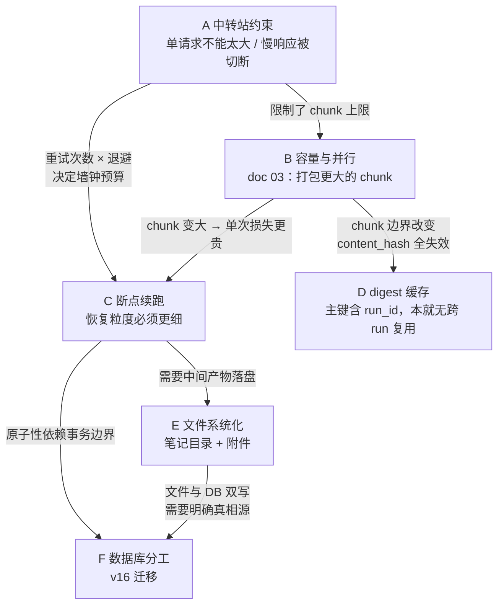
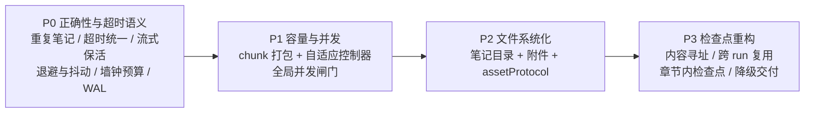

# 14-DeepNote 深度优化：总览与关键决策

> 输入：`md/test/03-深度笔记管线容量与并行缺陷分析.md`（以下简称 **doc 03**）
> 本目录是 doc 03 的下一步：把「容量与并行」这一个切面，扩展成**中转站约束、文件系统化输出、断点续跑与原子性、数据库分工**四条线的研究 + 设计 + 分阶段实施计划。
> 全部结论基于对 `src-tauri/src` 的三轮只读审计，代码断言均带 `文件:行号`，基线版本 0.1.28。

## 阅读顺序

| 文档 | 内容 |
| --- | --- |
| `00-总览与关键决策.md`（本文） | 问题全景、四条线的相互约束、七条拍板决策、风险台账 |
| `01-中转站约束下的容量与超时.md` | 网关四类约束的取证、超时语义不对称缺陷、流式保活、自适应体积控制器 |
| `02-笔记输出改为文件系统.md` | 目录形态设计、附件归属、三层图片拦截与 assetProtocol 硬阻塞、迁移路径 |
| `03-断点续跑与原子性.md` | 重复笔记缺陷、恢复粒度分级、检查点重构、内容寻址与跨 run 复用 |
| `04-数据库与文件的分工.md` | v16 迁移 DDL、真相源划分、死表处置、崩溃一致性顺序 |
| `05-分阶段实施计划.md` | 四个阶段的任务分解、验收口径、回滚方案、测试补强 |

---

## 1. 一句话结论

当前深度笔记管线的四个问题**不是并列的，而是有依赖顺序的**。doc 03 把「把 attachment chunk 打包得更大」列为 P0，但在超时语义、流式保活、自适应体积控制器就位之前执行这一项，会**放大**中转站上的失败率而不是减少。本目录的核心贡献是重排了实施顺序，并给出四条线彼此的约束关系。

## 2. 四条线的相互约束

四个问题两两之间都有耦合，单独优化任何一个都会踩到另一个的雷。



四条关键约束，逐条说明：

**约束一：A 给 B 设了天花板。** doc 03 的结论是「attachment 路径每 100 行发一个 chunk，平均只用掉 16000 token 预算的 6.1%，导致 chunk 数膨胀约 16 倍」。修法是累积打包。但中转站的真实约束不是 token 数，而是**单请求字节数**和**单请求墙钟时长**。把 chunk 从 974 token 打包到 16000 token，意味着单请求体积涨 16 倍、生成时长涨数倍 —— 在一条本来就不出字节的非流式连接上（见 `01` 第 2 节），这是从「chunk 数太多」换成「每个 chunk 都可能 504」。所以打包目标值不能取满预算，必须由**实测安全包线**决定。

**约束二：B 让 C 变得更重要。** chunk 越大，单次失败丢掉的工作越多。当前 Drafting 阶段的恢复粒度是**章节级** —— 正在写的那一节全部丢弃，章节内部没有任何中间保存（`chat/note_pipeline/service.rs:4440-4606`，只在 `:4571` 写 Failed、`:4591` 写 Completed）。chunk 变大后，这个粒度从"可以忍"变成"不可接受"。

**约束三：B 会一次性作废全部 digest 缓存，而且是静默的。** chunk_id 是位置序号 `format!("chunk-{:04}", chunks.len() + 1)`（`service.rs:771`）。改分块策略后 `chunk-0001` 依然存在，但它的 `excerpt` 变了 → `content_hash` 变 → 四项复用门禁（`service.rs:3169-3180`）第一项就失配 → 判定 miss、全量重算，**不产生任何告警**。ID 稳定反而掩盖了失效。必须在切换时显式 bump 缓存版本号，让失效变成一次可观测的事件。

**约束四：C 和 E、F 共享同一个原子性问题。** 断点续跑要求中间产物落盘，落盘就要决定「文件先写还是 DB 先写」。当前 Persisting 段已经存在一个**真实的重复笔记缺陷**（见 `03` 第 1 节），根因正是"笔记提交"和"run 状态更新"分属两个事务。文件系统化会把这个问题从"两个 DB 事务"扩大到"文件 + DB 两种介质"，如果不先把事务边界修好，问题会更难诊断。

---

## 3. 七条拍板决策

以下决策贯穿四个文档，在此集中列出，便于后续实施时回查。

### 决策一：为 deep-note 启用流式，但仅作保活用途

deep-note 目前 **100% 非流式**，只用阻塞式 `dispatcher::complete`，单次 attempt 超时 300–420 秒（`chat/note_pipeline/service.rs:2688-2696`）。从中转站角度看，这是一条建立后 300 秒不传输任何字节的连接 —— 绝大多数网关的 idle read timeout 在 60–120 秒，这是 504 的首要来源，且**与载荷大小无关**。

改为流式后，token 每几百毫秒就产生一次字节流动，连接始终活跃。前端**不需要**渲染流式内容，后端累积完整响应后照原样返回给管线，对上层零改动。这是本次优化里投入产出比最高的一项：改动局限在调用层，收益是消除一整类超时。

| 方案 | 单请求墙钟风险 | 网关 idle 超时风险 | 改动面 |
| --- | --- | --- | --- |
| 保持非流式 | 高（300s 静默） | **高** | 无 |
| 流式 + 前端渲染 | 高 | 低 | 大（UI、事件、进度） |
| **流式 + 后端累积（选定）** | 高 | **低** | 小（仅调用层） |

### 决策二：稳定性优先 —— 单请求体积由实测包线决定，不取满模型窗口

`context_budget`（`service.rs:589-647`）当前用 `usable.saturating_sub(1_024).min(DEFAULT_CHUNK_TARGET_TOKENS).max(2_048)` 把 chunk 预算硬顶在 16000 token，与模型实际窗口脱钩。这个常量既不反映模型能力，也不反映网关能力。

新模型改为三重取最小值：

```
effective_budget = min(
    模型窗口推导值,          // 能力上限
    16000,                    // 保守常量上限（保留）
    实测安全包线              // 网关上限，按 provider + model 学习得到
)
```

第三项是新增的关键项，由**自适应体积控制器**（AIMD：成功则缓增、超时或限流则折半）维护，并按 `provider_id + model_id` 持久化，跨重启保留。冷启动取保守初值。

好消息是**不需要新增埋点**：现有 `modelCallCompleted` / `modelCallFailed` 遥测（`chat/note_pipeline/service.rs:2800-2842`）已经同时记录 `inputChars`、`durationMs`、`errorKind`、`statusCode`、`retryAfterMs`、`timeoutMs`，直接就能拟合"体积 → 时长 → 失败率"的包线。

### 决策三：统一超时语义 —— 本地超时与网关超时按同一原因处理

这是当前最反直觉的缺陷。`completion_attempt`（`chat/service.rs:908-929`）用 `tokio::time::timeout` 包裹调用，到期映射为 `ModelError::timeout`，其 kind 是 `ClientTimeout`。而 `should_retry_note_model_call`（`note_pipeline/service.rs:2528-2541`）只对 `UpstreamTimeout` 否决 HTTP 重试，且**`deepNoteChunk` 根本不在否决名单里**。

后果是同一个物理原因（载荷过大导致生成太慢）产生完全相反的行为：

| 触发形式 | 分类 | 是否重试 | 实际代价 |
| --- | --- | --- | --- |
| 本地 300s 到期 | `ClientTimeout` | 重试 5 次，退避 300ms | **约 25 分钟耗在同一份大载荷上**，然后才降级 |
| 网关返回 504 | `UpstreamTimeout` | 立刻否决 | 立刻降级，几秒 |

修法：把「重试同一份载荷不可能变好」的判据从 error kind 上移到**语义层** —— 超时类错误一律先缩小载荷再重试，而不是原样重试。同时给 `deepNoteChunk` 补上否决逻辑。

### 决策四：引入全局并发闸门与带抖动的退避

对中转站而言，本应用的并发是三处相加的：deep-note 并行度硬编码 2（`types.rs:735-736`）+ chat 流 1 条 + MCP 每 server 至多 8。没有任何全局 Semaphore 约束总量。

同时 `retry_delay`（`chat/service.rs:2258-2271`）对 `RateLimited` 的退避基数只有 **300ms** —— 一个不带 `Retry-After` 的 429 会被几乎立刻重试，这是典型的把限流打成雪崩。而 `ConcurrencyLimited` 是 15s、`UpstreamTimeout` 是 5s，三者量级差 50 倍，缺乏统一模型。全程无 jitter。

修法：`AppState` 持有一个跨 deep-note / chat / MCP 的全局许可池，容量按 provider 配置；deep-note 让位于交互式 chat（优先级反转保护）。退避基数按 kind 重定，全部叠加 jitter。

### 决策五：笔记落盘改为目录形态，DB 保留索引与元数据

笔记当前**只存在于 SQLite 的 `content TEXT` 列里**（`library/store.rs:4773-4780`），磁盘上没有任何副本，也没有路径列或附件表。而会话（conversation）早已是文件优先的 JSON 形态 —— 同一个仓库里存在两种截然不同的持久化哲学。

目标形态：一篇笔记 = 一个目录（正文 md + 元数据 json + `attachments/` + 版本快照）。DB 不再是正文的唯一载体，而是**索引与元数据的真相源**；正文的真相源迁移到文件。

`export_markdown_bundle`（`commands/conversations.rs:449-515`）是现成的生产级模板：staging 目录 + `fs::rename` 原子落地 + 失败清理 + 相对路径链接。直接复用其模式与四个辅助函数，不重新发明。

### 决策六：先修正确性，后动容量 —— 实施顺序不可颠倒

doc 03 的 P0 是「打包 attachment chunk」。本目录**下调**这一项的优先级，理由见约束一。正确顺序：



P0 里的每一项都是"不做就会持续产生错误数据或浪费墙钟"的问题，且改动小、风险低。P1 依赖 P0 的自适应控制器才安全。P3 依赖 P2 的落盘能力才有地方放中间产物。

### 决策七：死代码要么接线，要么删除，不保留中间态

审计发现大量"写好了但没接线"的能力，它们制造的认知负担已经在影响判断：

| 死代码 | 位置 | 处置 |
| --- | --- | --- |
| `skip_unfinished_sections` 零调用点 | `scheduler.rs:183-199` | **接线**（P3 降级交付的核心，代码已就绪，投入产出比最高） |
| 17 个 run 事件中 10 个从未派发 | `run_machine.rs:219-241`；且 `:168-173` 把 `TimeoutDetected` 与 `PanicDetected` 合并处理 | **接线**（先拆分支再派发事件，否则改了等于没改） |
| `DeepNoteNodeStatus::Leased` 不可达 | `node_machine.rs:45-51` + `scheduler.rs:326-353` | **删除**（多 worker 非当前目标，连带删 lease 列与回收逻辑） |
| `note_pipeline_nodes` 只写不读 | `store.rs:1647-1806` 写、无读取函数 | **接线**（恢复路径应读它，见 `03`） |
| `note_pipeline_outputs` 零读写 | `store.rs:5141-5149` | **删除**（v16 迁移中 DROP） |

---

## 4. 全局风险台账

| # | 风险 | 触发条件 | 缓解 | 责任文档 |
| --- | --- | --- | --- | --- |
| R1 | chunk 打包后 504 率上升 | 未先做流式保活与自适应控制器 | 严格按 P0→P1 顺序；控制器冷启动取保守初值 | `01` |
| R2 | digest 缓存一次性全失效且静默 | 分块策略切换 | 显式 bump 缓存版本；切换时打一条 info 级事件 | `03` |
| R3 | 文件与 DB 不一致 | 双写期间任一侧失败 | 文件先落盘 + fsync + rename，再提交 DB；孤儿目录由 GC 回收 | `02` `04` |
| R4 | 迁移 v16 破坏既有笔记 | 正文从 DB 迁到文件时中断 | 迁移期 DB `content` 保持权威，新增列先做影子写 + 哈希对账 | `04` |
| R5 | assetProtocol 放开引入越权读取 | scope 写得过宽 | 只加 `$APPDATA/library/**`，不用通配根；`htmlSecurity` 按上下文分叉而非放宽公共实现 | `02` |
| R6 | 全局并发闸门导致交互式 chat 被 deep-note 饿死 | 许可池被后台任务占满 | deep-note 走低优先级通道，预留交互式配额 | `01` |
| R7 | WAL 切换后备份缺最近事务 | 备份未纳入 `-wal` / `-shm` 伴生文件 | 与 WAL 开关同批发布；来不及则先改备份 | `04` |

## 5. 与 doc 03 的分歧显式记录

本目录**不是**对 doc 03 的全盘继承，有两处明确分歧，避免后续实施时产生困惑：

**分歧一：优先级。** doc 03 §11 把「打包 attachment chunk」列为 P0。本目录将其降为 P1，前置条件是 P0 的流式保活与自适应体积控制器。理由：doc 03 的分析视角是"本地 token 预算利用率"，没有把中转站的单请求约束纳入模型；在真实部署环境下，预算利用率不是唯一目标函数，稳定性优先。

**分歧二：打包目标值。** doc 03 隐含的目标是把 chunk 打包到接近 16000 token 预算。本目录改为由实测安全包线决定，实际值很可能显著低于 16000，且随 provider / model 不同。`MAX_ANALYSIS_CHUNKS = 96` 与入口允许 100 个文件的不一致（doc 03 §11 的另一项 P0）本目录**认可并保留**为 P1 项。

doc 03 §11.2 第 4 条已经预警了 `content_hash` 作用域变化会使检查点缓存失效，本目录将其升级为具名风险 R2 并给出显式处置方案。
