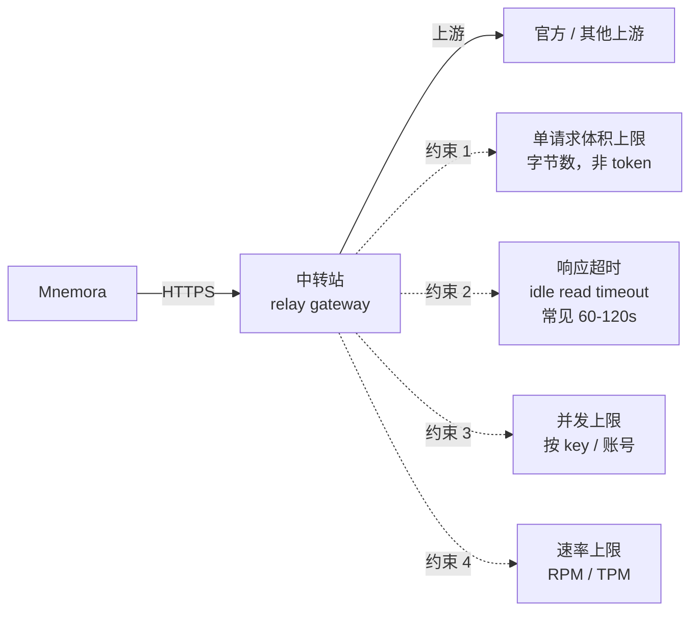
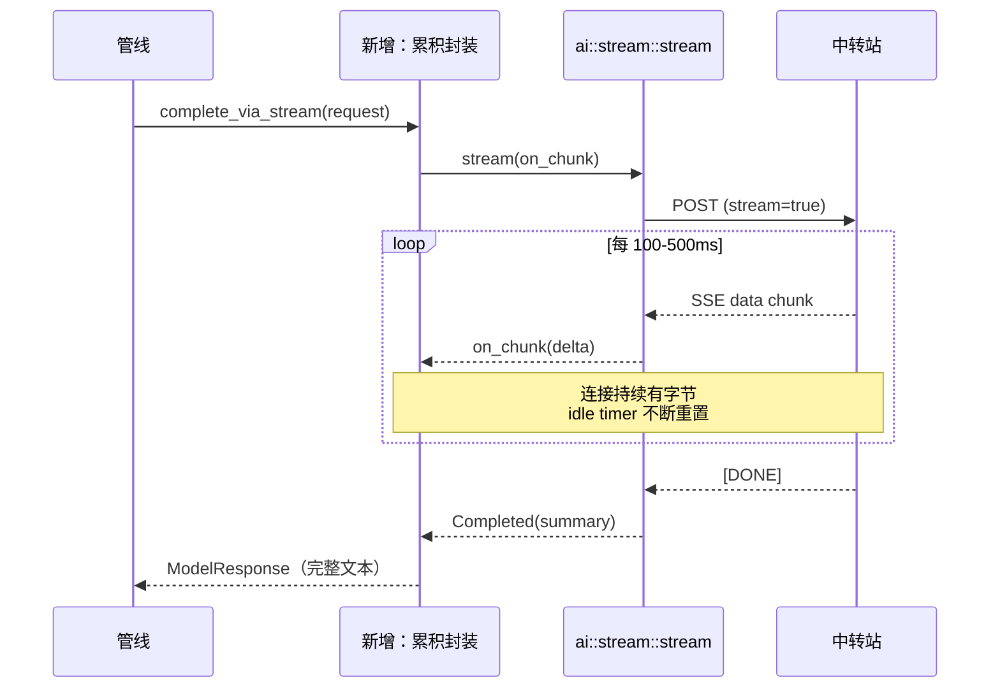
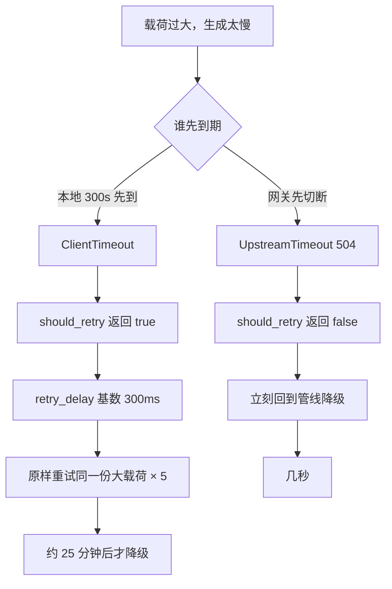
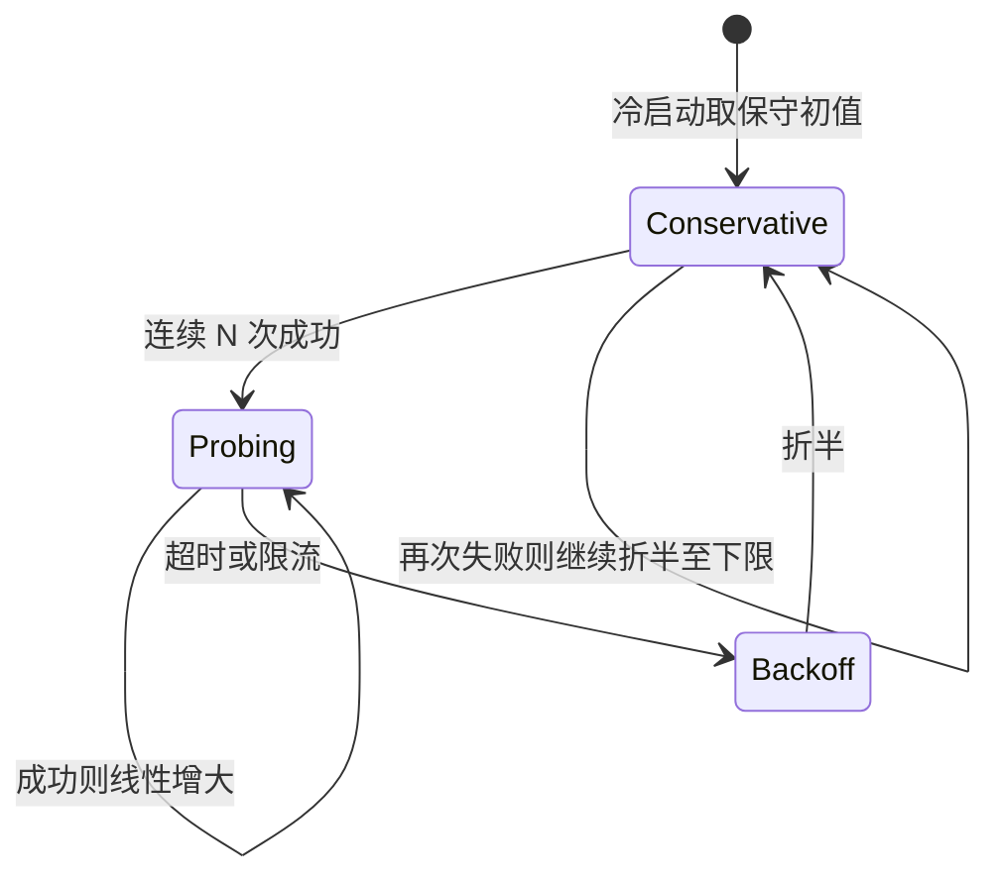

# 01 中转站约束下的容量与超时

> 前置阅读：`00-总览与关键决策.md`
> 本文回答：中转站到底约束了什么、当前代码在这些约束上有哪些具体缺陷、怎么改。

## 1. 部署事实与约束建模

生产部署中，模型请求不直连官方端点，而是经过**中转站（relay gateway）**。这带来四类约束，且它们与"模型窗口有多大"完全无关 —— 这是当前代码最大的认知盲区：`context_budget` 只关心 token，而网关关心字节和秒。



四类约束对应的代码现状，逐条取证：

| 约束 | 当前防护 | 缺陷 |
| --- | --- | --- |
| 单请求体积 | **无任何请求侧检查** | `truncate_chars` 是空实现；无 body 字节数上限 |
| 响应超时 | 有本地超时（300–420s） | 全程非流式，连接静默 300 秒，主动撞网关 idle 超时 |
| 并发 | 各子系统各自限流 | 无全局闸门，deep-note 2 + chat 1 + MCP ≤8 对网关是相加的 |
| 速率 | 有退避 | `RateLimited` 退避基数仅 300ms，无 jitter |

## 2. 缺陷一：全程非流式，主动制造 idle 超时

deep-note 的每一次模型调用都走阻塞式 `dispatcher::complete`（`ai/dispatcher.rs:17`），单次 attempt 超时如下（`chat/note_pipeline/service.rs:2688-2696`）：

```rust
let timeout_ms = match operation {
    "deepNoteChunk" => 300_000,
    "deepNoteChunkRepair" => 180_000,
    "deepNoteOutlineDirect" | "deepNoteOutline" => 300_000,
    "deepNoteOutlineFallback" => 180_000,
    "deepNote" => 420_000,
    _ if max_output_tokens <= 8_192 => 300_000,
    _ => 420_000,
};
```

问题不在这些数值，而在**这段时间里连接上没有任何字节流动**。中转站（以及中间的任何反向代理、负载均衡）看到一条建立后 300 秒无数据的连接，按 idle read timeout 策略切断是完全正常的行为。这解释了一个否则难以解释的现象：**即便载荷不大，长生成也会 504**。

顺带修正一处误导性注释：`state.rs:129-137` 的全局 `reqwest::Client` 设了 `timeout(900s)`，其注释声称 deep-note "不共享这个全局上限"。这是错的 —— 它就是同一个 Client，deep-note 只是因为自己的 attempt 超时（全部 ≤420s）总是先触发，所以 900s 从来没生效过。该 Client 也没有配 `pool_idle_timeout` / `read_timeout` / `tcp_keepalive`。

### 修法：流式保活

`ai::stream::stream`（`ai/stream/mod.rs:43`）**已经存在**，覆盖全部四种协议（OpenAI Chat / OpenAI Responses / Anthropic / Gemini），已接 `CancellationToken`，并有 `first_token_ms` 指标。不需要新写任何适配器。

改法是在 deep-note 的调用层加一个薄封装：调用 `ai::stream::stream`，把 chunk 累积进 String，结束后合成一个 `ModelResponse` 返回给管线。管线上层完全不感知。



额外收益有三个，都不是主要动机但值得记账：`first_token_ms` 让"网关排队"与"生成慢"可以区分；`CancellationToken` 让取消能真正中断在途 HTTP 请求，而不是等 attempt 超时；出现"首字节已到但中途断流"时，能拿到部分内容而非全部丢弃。

需要注意一个反向风险：部分中转站对流式和非流式的路由策略不同，个别上游可能不支持流式。所以这个开关要按 provider 可关闭，默认开启、允许回落到非流式。

## 3. 缺陷二：超时语义不对称，把 25 分钟浪费在同一份大载荷上

这是本次审计发现的最反直觉缺陷，也是修复优先级最高的一项。

`completion_attempt`（`chat/service.rs:908-929`）用 `tokio::time::timeout` 包裹调用，到期后映射为 `ModelError::timeout`，其 `kind` 是 **`ClientTimeout`**。而 `should_retry_note_model_call`（`note_pipeline/service.rs:2528-2541`）的实现是：

```rust
fn should_retry_note_model_call(operation: &str, error: &ModelError) -> bool {
    // A gateway timeout on an outline aggregation request means the current
    // payload did not finish inside the upstream gateway window. Return to the
    // pipeline immediately so it can reduce the payload before trying again.
    if error.kind == ModelErrorKind::UpstreamTimeout
        && matches!(
            operation,
            "deepNote" | "deepNoteOutline" | "deepNoteOutlineFallback" | "deepNoteOutlineDirect"
        )
    {
        return false;
    }
    !matches!(error.kind, ModelErrorKind::ProviderUnavailable)
}
```

注释本身的推理是对的："载荷没能在网关窗口内跑完，立刻回到管线去缩小载荷"。但判据挂在 `UpstreamTimeout` 上，而**本地超时是 `ClientTimeout`**，走不进这个分支。而且 `deepNoteChunk` 不在 operation 名单里 —— chunk 分析是调用次数最多的操作，恰恰没有保护。

两条路径的实际行为对比：



同一个物理原因，代价差两个数量级。而且 `ClientTimeout` 这条路径的每一次重试都在**给中转站重复施加同样的大载荷压力** —— 既慢又不友好。

### 修法：把判据从 error kind 上移到语义层

原则：**"重试同一份载荷不可能变好"的错误，不能原样重试。** 具体三步：

1. 引入 `is_payload_sensitive_timeout(error)`，同时覆盖 `ClientTimeout` 与 `UpstreamTimeout`（`ai/error.rs:19-37` 的 17 个 kind 中这两个都算）。
2. operation 名单补上 `deepNoteChunk` 与 `deepNoteChunkRepair`，或者更彻底 —— 改为白名单（只有明确幂等且与载荷无关的操作才允许原样重试）。
3. 超时后不是"直接放弃"，而是**缩小载荷再试**：把当前 chunk 按比例切分后重投。这需要 P1 的自适应控制器配合，在 P0 阶段先做到"不原样重试、立刻降级"即可。

## 4. 缺陷三：两层重试相乘，无墙钟上限

重试有两层，且是**乘法关系**：

- HTTP 层：`retry_attempts`（provider 配置）
- 管线阶段层：`node_attempt_limit = 5`、`section_revision_limit = 5`（`types.rs:703-747`）

最坏情况下单个 section 的墙钟开销可达约 3.5 小时，而**没有任何墙钟总预算来兜底**。`run_machine.rs:21` 定义了 `TimeoutDetected` 事件，但它从未被 dispatch，而且 `run_machine.rs:168-173` 还把它与 `PanicDetected` 合并成同一个转移（详见 `03` 第 5.1 节）—— 也就是说"整体超时"这个概念在状态机里既没有触发者，也没有独立语义。

预算模型本身也低估了真实压力。`MAX_DEEP_NOTE_SEMANTIC_CALLS = 640`（`types.rs:10`）统计的是**语义调用**，乘上 HTTP 重试后，真实到达中转站的请求数约 3840 次 —— 差 6 倍。更麻烦的是 `reserve_semantic_calls`（`types.rs:740-746`）的实现是**抬高上限**而不是消耗配额，所以这个数字连自己声称的约束都没做到。

### 修法

引入三级墙钟预算，逐级收紧：

| 级别 | 预算 | 超出后行为 |
| --- | --- | --- |
| 单次 attempt | 由自适应控制器给出（不再是固定 300/420s） | 缩小载荷重投 |
| 单个 section | 例如 15 分钟 | 标记该 section 降级，继续其他 section |
| 整个 run | 例如 90 分钟 | 派发 `TimeoutDetected`，调用 `skip_unfinished_sections` 做部分交付 |

同时把预算模型从"语义调用数"改为**"上游请求数 + 累计上游墙钟"双维度**，让它反映中转站看到的真实压力。

## 5. 缺陷四：请求侧零体积保护

`truncate_chars` 的完整实现（`note_pipeline/service.rs:410-412`）：

```rust
fn truncate_chars(value: String) -> String {
    value
}
```

一个名字承诺截断、实际原样返回的函数。`transcript()` 依赖它做长度控制，因此**从不截断**。全代码路径中也没有任何 body 字节数检查 —— 只有响应侧有 `max_output_tokens` 上限。

另有一个尺度不一致问题：`estimate_text_tokens` 与 `text_budget_units` 是两套互不兼容的估算标度，混用会让预算计算本身失准。

### 修法

在序列化请求体之后、发出之前加一道**字节数硬闸**（而不是 token 估算闸，因为网关限的是字节）。超限时不是报错，而是触发载荷缩减路径。同时删除或正确实现 `truncate_chars` —— 保留一个说谎的函数名比没有这个函数更危险。两套 token 标度需要统一到一个，并在转换处加断言。

## 6. 缺陷五：无全局并发闸门，退避基数失当

### 并发

三处并发对中转站是相加的，但没有任何全局约束：

| 来源 | 并发度 | 位置 |
| --- | --- | --- |
| deep-note 节点 | 2（硬编码） | `types.rs:735` |
| deep-note chunk | 2（硬编码） | `types.rs:736` → `types.rs:715-717` |
| chat 流 | 1 | — |
| MCP 工具 | 每 server ≤8 | — |

`buffer_unordered(parallelism)` 的 parallelism 来自上表，没有 Semaphore，也没有跨子系统的协调。用户一边聊天一边跑深度笔记、同时有 MCP 工具在跑，是完全正常的使用模式，此时对网关的瞬时并发可达两位数。

### 退避

`retry_delay`（`chat/service.rs:2258-2271`）：

```rust
let base_ms: u64 = match error.kind {
    ModelErrorKind::ConcurrencyLimited => 15_000,
    ModelErrorKind::UpstreamTimeout => 5_000,
    _ => 300,
};
let exponential_ms = base_ms.saturating_mul(1u64 << retry_index.min(4));
Duration::from_millis(error.retry_after_ms.unwrap_or(exponential_ms).clamp(100, 120_000))
```

三个问题：

1. **`RateLimited` 落进 `_ => 300`**。一个不带 `Retry-After` 的 429 会在 300ms 后被重试 —— 这是把限流打成雪崩的标准做法。而中转站的 429 常常不带 `Retry-After`；即便带了，`ai/error.rs:105-110` 只解析整数秒格式，HTTP-date 格式会被忽略。
2. **无 jitter**。多个并行 worker 同时被限流后会同步重试，形成 thundering herd。
3. 三个基数（15000 / 5000 / 300）差 50 倍，缺乏统一模型；`ConcurrencyLimited` 的 15s 在指数放大后（左移上限 4）可达 240s，被 clamp 到 120s。

### 修法

**全局许可池**：`AppState` 持有一个按 provider 分组的 Semaphore，deep-note / chat / MCP 全部从它取许可。为避免风险 R6（deep-note 把交互式 chat 饿死），deep-note 走低优先级通道并为交互式请求预留固定配额。

**退避重定**：按 kind 给出有理据的基数，全部叠加 jitter：

| kind | 基数 | 理由 |
| --- | --- | --- |
| `RateLimited` | 2000ms | 429 需要真正让出窗口，300ms 无意义 |
| `ConcurrencyLimited` | 15000ms | 保留，语义是"上游并发满" |
| `UpstreamTimeout` | 5000ms | 保留，但配合缩载荷 |
| `ClientTimeout` | 不重试，先缩载荷 | 见第 3 节 |
| 其他 | 1000ms | 300ms 过于激进 |

另外 `ai/error.rs:88-101` 的 `from_reqwest` 把"响应中途断流"collapse 成 `Connection`，丢失了"已经收到部分内容"这个信息。流式化之后这个信息变得可用，分类应当细化。

## 7. 自适应体积控制器

这是把上述所有修复串起来的机制，也是 doc 03「打包更大 chunk」能够安全落地的前提。

### 设计

按 `provider_id + model_id` 维护一个安全包线，AIMD 调节：



- **加性增大**：连续成功若干次后，把安全体积上调一个固定增量。
- **乘性减小**：一旦出现超时或限流，立刻折半。
- **持久化**：按 provider + model 存库，跨重启保留，避免每次启动重新试探。
- **下限保护**：不低于一个能完成最小任务的值，否则会退化成无法工作。

### 无需新增埋点

现有遥测已经够用。`modelCallCompleted` / `modelCallFailed`（`chat/note_pipeline/service.rs:2800-2842`）记录的字段相当完整：`inputChars`、`systemPromptChars`、`responseChars`、`durationMs`、`errorKind`、`statusCode`、`providerCode`、`retryAfterMs`、`maxOutputTokens`、`maxRetries`、`timeoutMs`。这意味着可以**先用历史数据离线拟合**出各 provider 的包线形状，再决定控制器的初值与步长 —— 不必盲调。

`retryAfterMs` 这个字段尤其有用：它能直接统计"中转站的 429 有多大比例带 `Retry-After`"，从而验证第 6 节关于退避基数的判断。

### 与 `context_budget` 的接合

`context_budget`（`service.rs:589-647`）当前的硬顶：

```rust
usable.saturating_sub(1_024).min(DEFAULT_CHUNK_TARGET_TOKENS).max(2_048)
```

改为三重取最小值，新增第三项：

```
min(模型窗口推导值, DEFAULT_CHUNK_TARGET_TOKENS, 控制器给出的安全包线)
```

保留 16000 这个保守常量作为第二道防线 —— 即便控制器学出了更大的值，也不放开，因为大载荷还有"失败代价更高"的次生问题（见 `00` 约束二）。

## 8. 本文对应的实施项

| 项 | 阶段 | 依赖 |
| --- | --- | --- |
| 统一超时语义，`deepNoteChunk` 补入否决名单 | P0 | 无 |
| 流式保活封装（复用 `ai::stream::stream`） | P0 | 无 |
| 退避基数重定 + jitter | P0 | 无 |
| 请求侧字节数硬闸；删除/实现 `truncate_chars` | P0 | 无 |
| 三级墙钟预算；派发 `TimeoutDetected` | P0 | 状态机接线（`00` 决策七） |
| 修正 `state.rs:129-137` 误导性注释；补 `tcp_keepalive` | P0 | 无 |
| 自适应体积控制器 | P1 | 遥测离线拟合 |
| 全局并发许可池 | P1 | 无 |
| attachment chunk 打包（doc 03 的 P0） | P1 | 自适应控制器 |
| 预算模型改为"上游请求数 + 累计墙钟" | P1 | 无 |
| 统一两套 token 估算标度 | P1 | 无 |
