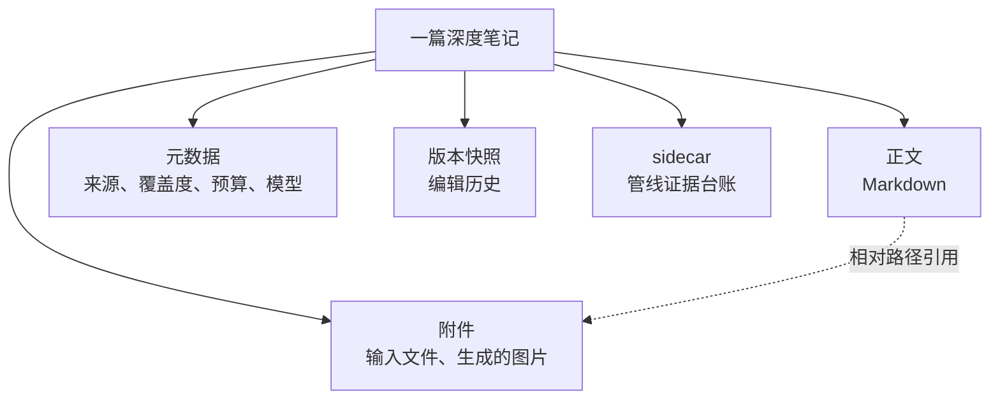
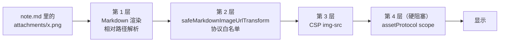
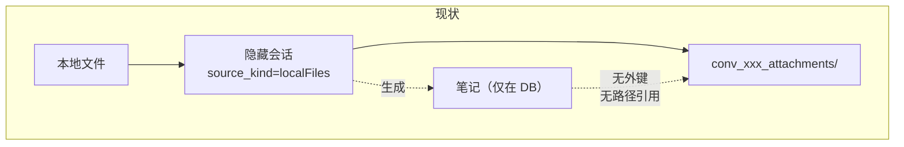
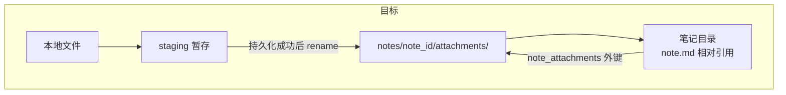
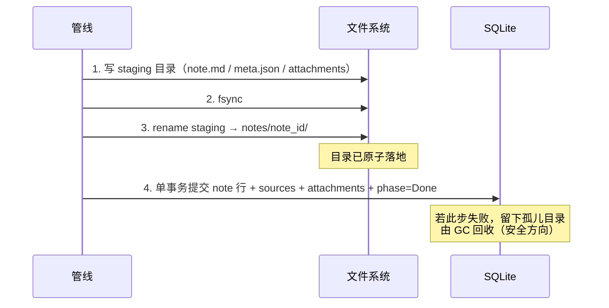
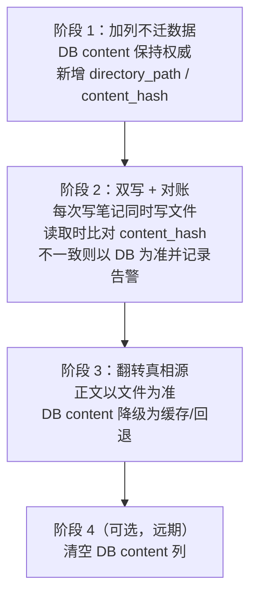

# 02 笔记输出改为文件系统（带附件）

> 前置阅读：`00-总览与关键决策.md`
> 本文回答：为什么单个 md 文件不够、目录形态怎么设计、附件归属怎么改、有哪些硬阻塞、怎么迁移。

## 1. 现状：笔记只存在于数据库里

`library_notes` 的完整 DDL（`library/store.rs:4773-4780`）：

```sql
CREATE TABLE IF NOT EXISTS library_notes (
   id TEXT PRIMARY KEY,
   item_id TEXT REFERENCES library_items(id) ON DELETE CASCADE,
   title TEXT NOT NULL,
   content TEXT NOT NULL DEFAULT '',
   created_at INTEGER NOT NULL,
   updated_at INTEGER NOT NULL
);
```

三个观察，都是本次改造的直接动因：

**没有路径列。** 笔记正文完全存在 `content TEXT` 里，磁盘上没有任何副本。用户在文件管理器里找不到自己的笔记；备份要备整个 SQLite；外部工具（Obsidian、VS Code、grep）无法直接访问。

**没有附件表。** 一篇笔记不能拥有任何文件。这与实际需求直接冲突 —— 深度笔记的输入常常是一批本地文件（图片、PDF、表格），生成的笔记理应能引用它们。

**同一仓库里存在两种持久化哲学。** 会话（conversation）早已是文件优先的 JSON 形态，附件放在 `conversations/conv_<uuid>_attachments/`。笔记却是数据库优先。这种不一致本身就是维护成本。

## 2. 为什么单个 md 文件不是答案

一个自然的想法是"把笔记导出成一个 .md 文件就行了"。这不够，原因是**笔记是一个有内部结构的复合物**：



正文用相对路径引用附件，这个引用关系只有在"正文和附件在同一个目录树里"时才稳定。一旦拆成"DB 里的正文 + 别处的文件"，引用就必然依赖某种运行时拼接，而拼接逻辑一变（或者用户移动了文件），链接就断。

所以目标形态是**目录**，而不是文件。

## 3. 目标目录形态

```
$APPDATA/library/notes/<note_id>/
├── note.md                    # 正文，真相源
├── meta.json                  # 元数据：title、来源、覆盖度、模型、预算
├── attachments/               # 附件目录
│   ├── <hash>-原文件名.png
│   └── <hash>-数据表.xlsx
├── versions/                  # 版本快照
│   └── <timestamp>-note.md
└── sidecar.json               # 管线证据台账（可选，仅深度笔记有）
```

几个设计取舍：

**用 `note_id` 而不是标题做目录名。** 标题会改、会重名、含非法字符。目录名用不变的 UUID，可读性由 `meta.json` 里的 title 和 UI 承担。导出给用户时才用标题命名（复用现有的 `sanitize_export_name`）。

**附件文件名带内容哈希前缀。** 同名文件不冲突，且能天然去重。保留原文件名后缀便于用户识别。

**`versions/` 存快照而不是 diff。** 与现有 `library_note_versions` 的语义一致（`store.rs:4939-4948` 存的是全文快照），迁移时可以直接搬。

**`sidecar.json` 独立成文件。** 当前它挤在 `note_pipeline_runs.sidecar_json` 列里（唯一写入点 `note_pipeline/service.rs:5122-5127`），而它的生命周期跟笔记绑定、不跟 run 绑定 —— run 记录会被清理，笔记不会。

## 4. 三层图片拦截 + 一个硬阻塞

要让笔记正文里的 `` 真正显示出来，需要穿过四道关卡。这四道**目前全部关闭**，任何一道漏掉都会表现为"图片不显示"，且报错信息各不相同，很容易误诊。



### 第 1 层：相对路径无人解析

正文里的 `attachments/x.png` 是相对路径。渲染器需要知道"相对于哪个基准目录"，而这个基准目录信息当前根本没有传到前端。需要把 note 的目录路径（转成 `asset:` 前缀）沿 DTO 传下去，在渲染前完成拼接。

### 第 2 层：协议白名单拒绝相对路径

`safeMarkdownImageUrlTransform`（`src/features/chat/utils/htmlSecurity.ts:99-107`）：

```ts
export function safeMarkdownImageUrlTransform(value: string) {
  try {
    const url = new URL(value);
    return ["https:", "asset:", "blob:"].includes(url.protocol) ? value : "";
  } catch {
    return "";
  }
}
```

相对路径进 `new URL()` 会抛异常 → 落到 `catch` → 返回 `""`。所以即便第 1 层不做拼接，这里也会拦下来。

关键约束：**这个函数是 chat 和 notes 共用的**。直接放宽它会让聊天消息里的相对路径图片也放开，扩大攻击面。正确做法是**按上下文分叉** —— 新增一个 notes 专用的 transform，它接受一个 baseUrl 参数、先做拼接再走同样严格的协议校验。公共实现保持不变。

### 第 3 层：CSP

`tauri.conf.json` 的 CSP 里 `img-src` 已包含 `asset:` 和 `http://asset.localhost`，所以第 3 层**实际上是通的**，前提是第 1、2 层把路径转成了 `asset:` 形式。不需要改 CSP —— 这一点很重要，因为放宽 CSP 是高风险动作。

### 第 4 层：assetProtocol scope —— 硬阻塞

`tauri.conf.json:25-32`：

```json
"assetProtocol": {
  "enable": true,
  "scope": [
    "$APPDATA/english/audio-cache/**",
    "$APPDATA/conversations/**",
    "$APPDATA/pets/**"
  ]
}
```

**`$APPDATA/library/**` 不在列表里。** 这是一个真正的硬阻塞：无论前端怎么改，Tauri 的 asset 协议都会拒绝读取 library 目录下的文件。

修法是加一条 scope，且**只加需要的那一条**（风险 R5）：

```json
"$APPDATA/library/notes/**"
```

不要写成 `$APPDATA/library/**` —— library 目录下还有原始 PDF 等文件（`files_directory`，见 `store.rs:58-60`），没必要一并暴露给渲染层。

## 5. 附件归属：从会话搬到笔记

### 现状

`prepare_local_note_source`（`commands/conversations.rs:208-303`）处理本地文件输入：

- 批量上限 100 个文件（`:215-217`）
- 文件落在 `conversations/conv_<uuid>_attachments/`
- `source_kind: Some("localFiles")`（`:285`），这个标记让 `chat/storage.rs:54-59` 的过滤器把这个会话从列表里隐藏
- 失败时回滚（`:296-298`），但**成功后没有任何自动清理**

所以现状是：源文件确实已经在磁盘上了，但它们**属于一个隐藏的会话**，而不属于笔记。笔记与这些文件之间没有外键，没有任何东西阻止会话被清理时把笔记的源文件一起带走。





### 改法

在 Persisting 阶段把附件从会话目录**移动**（而非复制）到笔记目录，并写入新的 `note_attachments` 表建立外键。注意这一步必须与笔记创建同事务 —— 这正是 `03` 和 `04` 要解决的原子性问题。

上限一致性问题也在这里处理：入口允许 100 个文件，但 `MAX_ANALYSIS_CHUNKS = 96`（doc 03 §11 的 P0 项之一）。这两个数必须对齐，否则第 97 个文件会被静默丢弃。

## 6. 原子落地：复用 export_markdown_bundle 的模式

不需要发明新方案。`export_markdown_bundle`（`commands/conversations.rs:449-515`）已经是一个生产级的目录原子写实现：

| 机制 | 位置 | 复用方式 |
| --- | --- | --- |
| staging 目录 `.mnemora-export-<uuid>` | `:462` | 改名为 `.mnemora-note-<uuid>`，逻辑照搬 |
| 整段包在闭包里、末尾统一判错 | `:465-509` | 照搬这个结构，它让清理逻辑只写一次 |
| `fs::rename` 原子落地 | `:506` | 直接照搬 |
| 失败清理 | `:511-513` | 直接照搬 |
| 相对路径链接 `` | `:380-387` | 直接照搬。注意两个已处理的细节：反斜杠转正斜杠、用尖括号包裹以容纳空格 |
| `sanitize_export_name` | `:517` | 用于导出时的标题目录名 |
| `unique_export_directory` | `:563` | 处理目录重名 |
| `unique_export_file_name` | `:578` | 处理附件重名 |
| `escape_markdown_label` | `:600` | 处理标题里的 markdown 特殊字符 |

**一处不照搬：`fs::write` 之后要补 fsync。** 现有实现（`:503-505`）直接 `fs::write` 然后 rename，没有显式 fsync。对"导出"这个场景够用（用户可以重新导出），但对"笔记正文的真相源"不够 —— rename 是原子的，但被 rename 的内容是否已经落盘，在断电场景下没有保证。写入笔记目录时需要对文件和父目录都做 fsync 再 rename。

写入顺序（崩溃一致性的关键，详见 `04` 第 4 节）：



**顺序不能反。** 如果先提交 DB 再写文件，崩溃会留下"DB 行指向不存在的目录"—— 这是用户可见的坏数据。反过来则只留下一个孤儿目录，GC 可以静默回收。永远让不一致朝着"多余的垃圾"而不是"缺失的数据"倾斜。

## 7. 需要改动的位置清单

按模块归类，便于分工。

### 后端 Rust

| 位置 | 改动 |
| --- | --- |
| `library/store.rs:5460` | v16 迁移分支入口（当前版本 15，见 `:57`） |
| `library/store.rs:4773-4780` | `library_notes` 加 `directory_path`、`content_hash` 列 |
| 新增 | `note_attachments` 表（含 FK 到 `library_notes`） |
| `library/store.rs:740-758` | `create_note_with_sources` |
| `library/store.rs:762-807` | `create_note_with_sources_and_coverage` |
| `library/store.rs:813-865` | `create_rebuilt_note_with_sources_and_coverage` |
| `library/store.rs:2891-2897` | `library_note_versions` 写入点（编辑路径） |
| `library/store.rs:3678-3693` | `open_connection`（顺带处理 WAL，见 `04`） |
| `library/types.rs` | DTO 增加路径与附件字段 |
| `note_pipeline/service.rs:5113-5186` | Persisting 段改为"先文件后单事务" |
| `note_pipeline/service.rs:1196-1240` | 视觉来源路径处理 |
| `note_pipeline/service.rs:3425-3490` | `assemble()` 生成正文时产出相对链接 |
| `commands/conversations.rs:208-303` | `prepare_local_note_source`：附件改为可移交给笔记 |
| 新增 | 笔记导出命令（复用 `export_markdown_bundle` 模式） |
| 新增 | 孤儿目录 GC |

### 配置与前端

| 位置 | 改动 |
| --- | --- |
| `tauri.conf.json:25-32` | scope 加 `$APPDATA/library/notes/**` |
| `src/features/chat/utils/htmlSecurity.ts:99-107` | **不改**，新增 notes 专用 transform |
| 笔记预览 / 编辑器组件 | 把 note 目录作为 baseUrl 传入渲染 |

### 同步与备份

| 位置 | 改动 |
| --- | --- |
| `sync/obsidian.rs:76-86` `validate_mapped_path` | 当前要求路径以 `.md` 结尾（`extension().is_some_and(eq_ignore_ascii_case("md"))`），目录形态后需放宽为"目录内的 note.md"。它同时校验了非绝对路径与无 `..` 组件，这两项要保留 |
| `storage/mod.rs:20-28` `MANAGED_DIRECTORIES` | **不需要改** —— 它已含 `("library", "library")`，笔记目录在 `library/notes` 下天然被覆盖 |
| 备份校验逻辑 | 目录形态后校验口径改变（从"库文件的哈希"变成"库文件 + 目录树"）；WAL 切换后还要含 `-wal` / `-shm` |

## 8. 迁移路径（风险 R4）

正文从 DB 迁到文件是**有损风险最高**的一步，采用三阶段影子写，任何一步失败都可回退：



阶段 2 的**对账是关键**：它把"文件写入是否可靠"这个问题变成可观测的，而不是等到翻转后才发现问题。只有当告警率持续为零，才进入阶段 3。阶段 4 不着急做 —— 保留 DB 里的正文副本作为最后的安全网，成本只是磁盘空间。

批量迁移既有笔记时，逐条处理并支持中断续跑（`directory_path IS NULL` 就是天然的待办队列）。

## 9. 本文对应的实施项

| 项 | 阶段 | 依赖 |
| --- | --- | --- |
| assetProtocol scope 加 `$APPDATA/library/notes/**` | P2 | 无 |
| notes 专用 image transform（不改公共实现） | P2 | 无 |
| v16 迁移：加列 + `note_attachments` 表 | P2 | 无 |
| 笔记目录写入（复用 export bundle 模式） | P2 | v16 |
| Persisting 改为"先文件后单事务" | P2 | `03` 的原子性修复 |
| 附件从会话移交笔记 | P2 | `note_attachments` |
| 100 文件 vs 96 chunk 上限对齐 | P1 | 无 |
| 前端 baseUrl 传递与渲染 | P2 | scope + transform |
| 笔记导出命令 | P2 | 目录形态就位 |
| 孤儿目录 GC | P2 | 目录形态就位 |
| 同步适配器放宽 `.md` 要求 / 备份校验口径 | P2 | 目录形态就位 |
| 三阶段影子写迁移 | P2 | 全部就位后逐阶段推进 |
