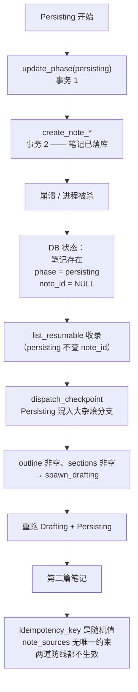
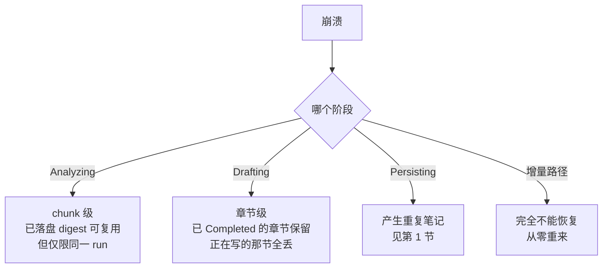

# 03 断点续跑与原子性

> 前置阅读：`00-总览与关键决策.md`
> 本文回答：现在能恢复到什么粒度、有哪些原子性缺口（含一个会产生重复笔记的真实缺陷）、检查点该怎么重构。

## 1. 缺陷：Persisting 阶段崩溃会产生重复笔记

这是本次审计发现的唯一**会产生用户可见坏数据**的缺陷，优先级最高。它由四个独立的疏漏叠加而成，其中两个本该是防线。

### 1.1 笔记提交与 note_id 写入分属两个事务

Persisting 段的实现（`note_pipeline/service.rs:5113-5186`）：

```rust
let note = {
    let _guard = state.library_operations.lock().await;
    state.library_repository.update_note_pipeline_phase(&run_id, Persisting, None, &warnings, None)?;
    state.library_repository.update_note_pipeline_runtime_json(&run_id, ..., Some(&sidecar))?;
    // ... 笔记在这里提交（:5134-5152）
    state.library_repository.create_note_with_sources_and_coverage(create, sources, ...)?
};
// ... :5154-5163 scheduler 状态
let completed = {
    let _guard = state.library_operations.lock().await;   // ← 另一个 guard 块
    state.library_repository.update_note_pipeline_phase(&run_id, Done, Some(&note.id), ...)?
};
```

笔记在 `:5134-5152` 提交，`note_id` 却在 `:5164-5172` 的**另一个 `library_operations` guard 块**里才写入。而且每次 `update_note_pipeline_phase` 和 `create_note_*` 各自开自己的 SQLite 事务，彼此不共享。

**崩溃窗口**：在 `:5152` 之后、`:5172` 之前进程死亡 → 笔记已经落库，但 run 的 `phase` 还是 `persisting`、`note_id` 还是 NULL。

### 1.2 恢复路径不检查 note_id

`list_resumable_note_pipeline_runs`（`store.rs:1382`）的 WHERE 条件里，`persisting` 与其他十几个 phase 并列进入可恢复集合。有意思的是它**只对 `cancelled` 检查了 `note_id IS NULL`**：

```sql
OR (candidate.phase = 'cancelled' AND candidate.note_id IS NULL AND ...)
```

说明这个守卫的必要性被意识到过，只是没有推广到 `persisting`。

`dispatch_checkpoint`（`service.rs:6406-6481`）更彻底：`Persisting` 被和 `Compiling`、`Queued`、`Drafting`、`Validating`、`Replanning`、`Assembling`、`Cancelling`、`Paused`、`Blocked`、`Cancelled`、`Error` 一起塞进同一个 match 分支（`:6434-6445`），分支内只判断两件事 —— `outline_json.is_empty()` 和 `selected_section_ids.is_empty()`，都不满足就无条件 `spawn_drafting`（`:6474`）。**全程没有读取 `run.note_id`。** 我在整个 `dispatch_checkpoint` + `resume` 区间（`:6400-6600`）grep `note_id`，零命中。

于是恢复会重跑一遍 Drafting，再走一遍 Persisting，再创建一篇笔记。

### 1.3 两道本该拦住的防线都是虚的

**幂等键是随机值。** `service.rs:6034`：

```rust
idempotency_key: stable_hash(format!("deep-note-output:{run_id}"))
```

而 `run_id` 来自 `:6018` 的 `Uuid::new_v4()`。唯一索引 `note_pipeline_output_idempotency` 能保证"一个 run 只有一个输出记录"，但同一个 run resume 后是 **UPDATE 同一行**，索引毫无察觉；两个不同 run 处理相同输入也各有各的 key。这个幂等键实际上没有幂等能力。

**note_sources 无唯一约束。** DDL 在 `store.rs:4873-4886`，没有任何唯一索引；`insert_note_sources`（`store.rs:5815-5842`）每次都生成新 UUID。重跑就是纯追加。

### 1.4 完整因果链



### 1.5 修法

四处都要动，缺一不可：

1. **Persisting 改单事务**：新增一个 store 层方法，在同一个 `TransactionBehavior::Immediate` 事务内完成"创建笔记 + 写 sidecar + phase=Done + note_id + append 事件"。现成的范式参照 `save_note_pipeline_outline`（`store.rs:1445-1541`），它已经把 outline + phase + sections 的 DELETE/INSERT 装进一个事务。
2. **恢复路径加 note_id 守卫**：`dispatch_checkpoint` 把 `Persisting` 从大杂烩分支拆出单独处理，进入前先判 `run.note_id.is_some()` → 已有笔记就只补写 Done 收尾，不再 `spawn_drafting`。`run_drafting_task`（`service.rs:4608`）入口同样加一道，防止绕过 dispatch 的路径。`list_resumable_note_pipeline_runs` 把 `note_id IS NULL` 条件从 `cancelled` 推广到 `persisting`。
3. **幂等键改为内容派生**：用 `input_snapshot_hash` + outline + `selected_section_ids` + provider + model 求哈希，让相同输入产生相同 key。
4. **note_sources 加唯一约束**，或把 `insert_note_sources` 改为 upsert。

## 2. 真正的检查点是一个 JSON blob

审计中最反直觉的发现：表结构给人细粒度恢复的错觉，实际是单 blob 存档。

| 中间产物 | 是否落盘 | 位置 | **恢复时是否读取** |
| --- | --- | --- | --- |
| 运行时状态总览 | 是 | **`preflight_json` 列** | **是** —— 这是真正的检查点 |
| 大纲 outline | 是 | `outline_json` | 是 |
| 章节选择 | 是 | `selected_section_ids` | 是 |
| 每章节结果 | 是 | `note_pipeline_sections` | 是（`service.rs:4700-4708`） |
| chunk 分块清单 | 是 | `note_pipeline_source_chunks` | 是 |
| chunk 分析结果 | 是 | `note_pipeline_chunk_digests` | 是（`service.rs:3143`） |
| 调度器 DAG | 是 | `compiled_dag` + `preflight_json` | 是 |
| **节点状态明细** | **是** | `note_pipeline_nodes` | **否 —— 不存在任何读取函数** |
| **ledger 证据台账** | 是 | `note_pipeline_ledgers` | **否**（仅 UI 详情读，`service.rs:6908`） |
| sidecar | 是 | `sidecar_json` | 否 |

`save_runtime_state`（`service.rs:2358-2378`）把整个 `DeepNoteRuntimeState`（类型定义 `types.rs:872-884`）序列化后塞进 `preflight_json`，恢复时 `runtime_state`（`service.rs:2235-2238`）整体反序列化回来。

两个具体的坑：

**列名与内容已经脱节。** `preflight_json` 装的是全量 `DeepNoteRuntimeState`，不只是预检数据。这个命名不是随意的 —— `DeepNoteRuntimeState` 的第一个字段恰好就是 `preflight`（`types.rs:872-876`），列名是"最初只存 preflight、后来扩成全量状态"的历史残留。但残留的结果是：第一次读代码的人会去找一张叫 checkpoint 的表，而真正的检查点在一个名叫 preflight 的列里。处置见 `04` 第 3.4 节（加注释而不改名，改名的收益不值得动所有读写点）。

**`note_pipeline_nodes` 是纯写死数据。** `update_note_pipeline_node_state`（`store.rs:1647-1806`）是一个 160 行的函数，勤恳维护节点状态、版本号、租约字段，而**没有任何函数读取这张表**。它消耗写入 IO 和认知带宽，产出为零。

## 3. 恢复粒度分级

按崩溃发生的阶段，能恢复到什么程度：



三个明确的"不能恢复"：

**章节内部进度不能恢复。** `execute_dag_section`（`service.rs:4440-4606`）只在终态写库（`:4571` Failed / `:4591` Completed），章节内部即便已经生成了 80% 的正文，崩溃后也是从头重写。chunk 打包变大后（`00` 约束二），这个粒度会更痛。

**增量路径零持久化。** `digest_incremental_chunks`（`service.rs:1671-1736`）是纯内存循环，**既不读也不写** `note_pipeline_chunk_digests`。走增量路径的运行没有任何 chunk 级断点能力。

**跨 run 不能复用。** 见下一节。

## 4. digest 缓存：主键设计使跨 run 复用不可能

`note_pipeline_chunk_digests` 的 DDL（`store.rs:5395-5418`，v13 引入）：

```sql
CREATE TABLE IF NOT EXISTS note_pipeline_chunk_digests (
   run_id TEXT NOT NULL REFERENCES note_pipeline_runs(id) ON DELETE CASCADE,
   chunk_id TEXT NOT NULL,
   content_hash TEXT NOT NULL,
   prompt_hash TEXT NOT NULL,
   provider_id TEXT NOT NULL,
   model_id TEXT NOT NULL,
   digest_json TEXT NOT NULL,
   semantic_calls INTEGER NOT NULL DEFAULT 1,
   created_at INTEGER NOT NULL,
   updated_at INTEGER NOT NULL,
   PRIMARY KEY (run_id, chunk_id)
);
```

**主键含 `run_id`。** 每个 run 都是新 UUID（`service.rs:6018`），所以哪怕输入和模型完全相同，新 run 的缓存命中率是零。这不是内容寻址的全局缓存，只是"同一次运行内重试可复用"的暂存。

复用门禁是四项全等（`service.rs:3169-3180`）：`content_hash` && `prompt_hash` && `provider_id` && `model_id`。其中 `prompt_hash` 由 `"chunk-digest-v2\0{provider}\0{model}\0{max_tokens}\0{system_prompt}\0{user_prompt}"` 构造（`service.rs:3161-3168`）—— 注意它已经带了 `-v2` 版本号，这是个好设计，说明作者预见过失效需求。

读写方全集（面小，改动可控）：

| 角色 | 位置 |
| --- | --- |
| 读 | `list_note_pipeline_chunk_digests` — `store.rs:1967-1997` |
| 写 | `save_note_pipeline_chunk_digest` — `store.rs:2000-2047`（upsert） |
| 唯一读调用点 | `build_chunked_ledger` — `service.rs:3143-3148` |
| 唯一写调用点 | `execute_chunk_digest_job` — `service.rs:3063-3072` |
| 孤儿清理 | `replace_note_pipeline_source_chunks` — `store.rs:1907-1913` |

### 风险 R2：分块策略切换会静默作废全部缓存

chunk_id 的生成（会话路径，`service.rs:771`）：

```rust
let chunk_id = format!("chunk-{:04}", chunks.len() + 1);
```

**位置序号，与内容脱钩。** 改分块策略后 `chunk-0001` 依然存在，但 `excerpt` 变了 → `content_hash` 变 → 门禁第一项失配 → 判定 miss、全量重算，**不产生任何日志或告警**。ID 的稳定性反而掩盖了失效。

附件路径的 chunk_id 是内容派生的（`service.rs:1043-1050`），改策略后 ID 本身就变，这些旧行会被 `replace_note_pipeline_source_chunks` 的孤儿清理（`store.rs:1907-1913`）物理删除 —— 反而更干净。

处置：切换时**显式 bump 缓存版本号**（沿用 `chunk-digest-v2` → `v3` 的既有做法），并打一条 info 级事件记录"因分块策略变更失效 N 条缓存"。让一次性失效成为可观测事件，而不是一个查无实据的性能回退。

### 改法：去掉 run_id，改为内容寻址

主键改为 `(content_hash, prompt_hash, provider_id, model_id)`，`run_id` 降级为普通列（用于审计）。chunk_id 也改为内容派生哈希，对齐附件路径的做法 —— 这同时消除了"ID 相同但内容不同"的伪命中风险。

连带影响两处，不能漏：
- `store.rs:1907-1913` 的孤儿清理不能再按 run 裁剪，需改为 TTL 或 LRU 淘汰。
- `store.rs:5396` 的 `ON DELETE CASCADE` 要移除，否则删一个 run 会带走全局缓存。

收益：重跑同一份输入（用户改了大纲重新生成、或上次失败后重试）不再重复付费。这是本次改造中唯一能直接省钱的一项。

## 5. 状态机与调度器：写好了但没接线

### 5.1 事件层完全没有接线

`run_machine.rs` 定义 16 个 phase、17 个 event、6 个 effect。但唯一的对外入口 `transition_to`（`run_machine.rs:219-241`）接受的是**目标状态**，然后反推事件：

```rust
let event = match target {
    NotePipelinePhase::Cancelling => DeepNoteRunEvent::CancelRequested,
    NotePipelinePhase::Cancelled if current == NotePipelinePhase::Cancelling => DeepNoteRunEvent::WorkerStopped,
    NotePipelinePhase::Cancelled => DeepNoteRunEvent::ForceCancelled,
    NotePipelinePhase::Paused => DeepNoteRunEvent::PauseRequested,
    NotePipelinePhase::Error => DeepNoteRunEvent::PanicDetected,
    _ => DeepNoteRunEvent::AdvanceTo(target),
};
```

**10 个事件从未被派发**：`StartRequested`、`OutlineGenerated`、`OutlineAdjustmentRequested`、`OutlineConfirmed`、`ResumeRequested`、`DagCompleted`、`PersistenceCompleted`、`RetryRequested`、`RestartRequested`、`TimeoutDetected`。整个 `DeepNoteRunMachine` 在本文件外只有一个调用点：`store.rs:4216`（位于 `transition_note_pipeline_phase_in_transaction`，函数起始 `store.rs:4165`）。

这个事件驱动状态机退化成了目标状态合法性校验器。**这对恢复决策有实际损失**：`TimeoutDetected` 和 `PanicDetected` 应当导向不同策略（超时可自动缩载荷重试，panic 不应自动重试）。

而且问题比"事件没派发"更深一层：即便派发了 `TimeoutDetected`，结果也和 panic 一样。`run_machine.rs:168-173` 把两者合并在同一个 match 分支：

```rust
E::PanicDetected | E::TimeoutDetected,
) => ok(
    S::Error,
    vec![DeepNoteRunEffect::PersistFailure],
    "任务异常终止",
),
```

同一个目标状态、同一个 effect、同一句描述。所以要真正区分二者，需要改两处：

1. `store.rs:4216` 的调用点改为传递真实事件，相应调整 `store.rs:4165` `transition_note_pipeline_phase_in_transaction` 的函数签名。
2. `run_machine.rs:168-173` 把 `TimeoutDetected` 拆出独立分支，给它一个不同的 effect（例如新增 `ScheduleShrinkRetry`），并允许它转向一个可自动恢复的状态而非终态 `Error`。

第 2 点是前提 —— 只做第 1 点等于把真实事件传进去然后被合并掉，看起来改了实际没变。

### 5.2 skip_unfinished_sections 零调用

`skip_unfinished_sections`（`scheduler.rs:183-199`）在整个 `src-tauri/src` 中**零调用点，含测试**。它靠声明为 `pub` 逃过了 `dead_code` 警告。

对照 `DeepNoteScheduler` 的其他方法都有实际调用点（`scheduler.rs:71`、`:131`、`:156`、`:171`、`:201`、`:211`、`:224`），唯独它是孤立的。

语义上这是**"降级完成"的核心操作** —— 放弃未完成章节、用已完成部分交付。这个能力已经写好了，只是没接线。接上它是本次改造投入产出比最高的一项：墙钟预算耗尽、用户取消、预算超限时，从"全盘丢弃"变成"部分交付"。

### 5.3 节点级 lease 不可达

`DeepNoteNodeStatus::Leased`（`types.rs:636`、`:653`、`:670`）在生产中永远不会出现，两个原因叠加：

1. `node_machine.rs:45-51` 有一个兼容旁路，注释写着"兼容旧调度器直接领取并开始节点"，把 Ready → InProgress 短路，跳过 Leased。
2. `scheduler.rs` 自己的 `valid_transition`（`scheduler.rs:326-353`）**根本没有 Leased 分支**。

后果：`lease_token` / `lease_owner` / `lease_expires_at` 三列，以及 `recover_expired_note_pipeline_nodes_in_transaction`（`store.rs:3962-4059`）近百行的节点级过期回收逻辑，操作的是调度器从不写入的状态。

对比之下 **run 级 lease 是活的**：`claim_note_pipeline_runtime`（`store.rs:1071-1114`，60 秒 stale 窗口）、`heartbeat_note_pipeline_runtime`（`store.rs:1116-1151`，续约到 90 秒）、`release_note_pipeline_runtime`（`store.rs:1153-1166`），CAS 语义正确。

处置（`00` 决策七）：多 worker 不是当前目标，**删除**节点级 lease 的列与回收逻辑。不要维持"写了但不生效"的中间态。

## 6. 取消路径：设计良好，粒度偏粗

取消是本次审计中质量最好的部分，值得记录以免误改。

链路：`note_pipeline_cancel`（`commands/note_pipeline.rs:78-83`）→ `note_pipeline::cancel`（`service.rs:6666-6789`）→ `AppState::cancel_note_pipeline_run`（`state.rs:340-347`）。

机制是 `tokio_util::sync::CancellationToken`（不是 AtomicBool，不是 channel）。注册表 `active_note_pipeline_runs` 提供完整生命周期管理：`register`（`state.rs:264-289`）、`attach_abort_handle`（`:291-306`）、`finish`（`:308-319`）、`cancel`（`:340-347`，协作式）、`abort`（`:349-360`，强制）、`snapshot`（`:362-377`）、`cancel_all`（`:386-395`）。

采用**先协作后强杀**两段式：先 cancel token，`wait_for_pipeline_task_to_stop`（`service.rs:246-254`）等待，超时才 abort。DB 侧有对应状态机：`request_note_pipeline_cancellation`（`store.rs:1168`）→ `finalize_note_pipeline_cancellation`（`store.rs:1205-1269`），加三个兜底：`fail_note_pipeline_task`（`store.rs:1271-1303`）、`recover_stale_cancelling_runs`（`store.rs:1305-1326`）、`abandon_note_pipeline_run`（`store.rs:1330-1380`）。

看门狗 `supervise_note_pipeline_task`（`service.rs:5617-5792`）15 秒心跳，处理 panic、abort、以及 `workerExitedWithoutTerminalState` 这类"worker 悄悄退出但状态没落地"的情况。

**唯一的不足是粒度**：取消检查点都在章节边界（`service.rs:4715`、`:4963`、`:4969`），进行中的那节工作全部丢弃。修法与"章节内检查点"是同一件事。

另外流式化（`01` 决策一）会让取消变得更即时 —— `ai::stream::stream` 已接 `CancellationToken`，能真正中断在途 HTTP 请求，而不是等 attempt 超时。

## 7. 本文对应的实施项

| 项 | 阶段 | 依赖 |
| --- | --- | --- |
| Persisting 改单事务 | **P0** | 无 |
| `dispatch_checkpoint` / `run_drafting_task` 加 note_id 守卫 | **P0** | 无 |
| `list_resumable` 把 note_id 守卫推广到 persisting | **P0** | 无 |
| 幂等键改为内容派生 | **P0** | 无 |
| note_sources 加唯一约束 | **P0** | v16 迁移 |
| 派发真实事件（区分 TimeoutDetected / PanicDetected） | P0 | 无 |
| 删除节点级 lease 与回收逻辑 | P1 | 无 |
| 接线 `skip_unfinished_sections` 实现部分交付 | P3 | 墙钟预算（`01`） |
| chunk_id 改内容寻址 + bump 缓存版本 | P3 | 与分块策略同时切换 |
| digest 缓存去 run_id，改全局 + TTL/LRU | P3 | 无 |
| 章节内检查点 | P3 | `02` 落盘能力 |
| 增量路径补 checkpoint | P3 | 无 |
| 恢复路径读取 `note_pipeline_nodes` | P3 | 无 |
