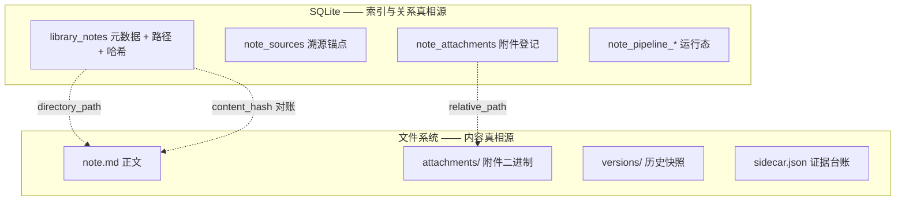
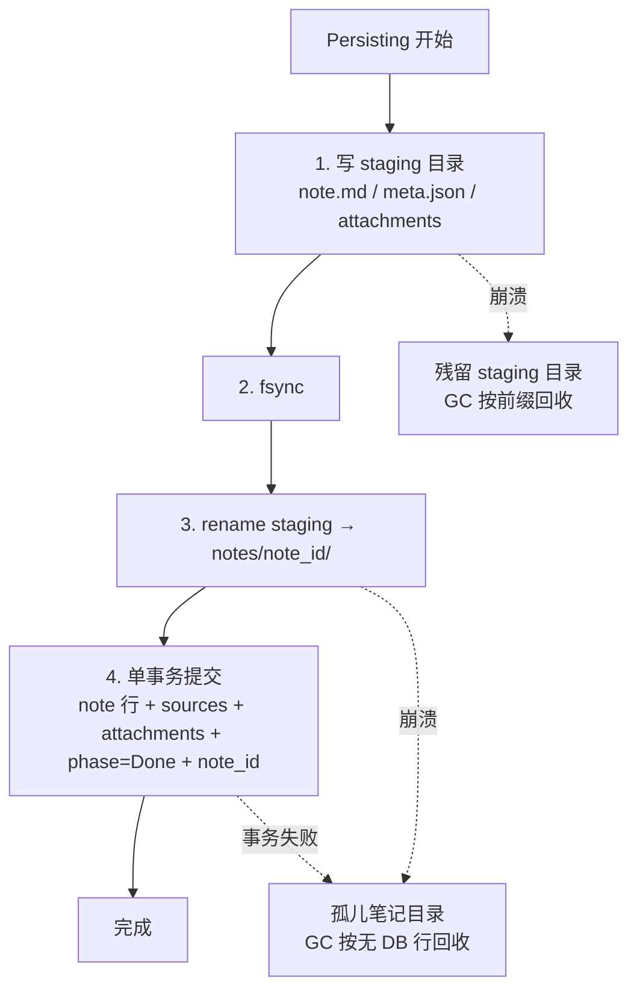

# 04 数据库与文件的分工

> 前置阅读：`00-总览与关键决策.md`、`02-笔记输出改为文件系统.md`、`03-断点续跑与原子性.md`
> 本文回答：什么该进数据库、什么该进文件、v16 迁移怎么写、崩溃时一致性朝哪边倾斜、SQLite 基建要改什么。

## 1. 现状：两种哲学并存

同一个仓库里存在两套持久化策略，且它们的选择理由从未被写下来：

| 数据 | 形态 | 位置 |
| --- | --- | --- |
| 会话 conversation | **文件优先**（JSON） | `$APPDATA/conversations/` |
| 会话附件 | 文件 | `conversations/conv_<uuid>_attachments/` |
| 笔记 | **数据库优先**（`content TEXT`） | `library.sqlite3` |
| 笔记版本 | 数据库（全文快照） | `library_note_versions` |
| 管线运行态 | 数据库（含一个大 JSON blob） | `note_pipeline_runs` |

`note_sources` 表的注释（`store.rs:4866-4869`）恰好把这个分裂点讲清楚了：

> note_id 对笔记 ON DELETE CASCADE；conversation_id / message_id 是普通可空列，
> **绝不加外键、绝不 CASCADE——对话与笔记分属两库**，断链在应用层维护。

「分属两库」是当前架构的既成事实。笔记改为目录形态后，这条边界会变成三方：会话文件、笔记目录、SQLite 索引。所以必须先把真相源划清楚。

## 2. 真相源划分原则

一条判据：**能被外部工具直接使用的、体积大的、以整体读写为主的 → 文件。需要按条件查询、排序、join 的 → 数据库。**



逐项理由：

**正文进文件。** 体积大（一篇深度笔记可达数十 KB）、整体读写、需要被外部工具访问（grep、Obsidian、版本控制）。留在 DB 里唯一的好处是全文检索方便，但这个需求可以用单独的 FTS 索引表满足，不必让 `content` 列充当真相源。

**附件必须进文件。** 二进制入库是明确的反模式。

**版本快照进文件。** 当前 `library_note_versions` 存全文快照（`store.rs:4939-4948`），随编辑次数线性膨胀数据库体积。移到 `versions/` 目录后，DB 里只留时间戳与元信息。

**元数据留数据库。** 标题、时间、收藏、分组、`item_id` 关联 —— 这些要排序、过滤、join，文件形态做不了。

**运行态留数据库。** 管线运行态天生是关系型的（run → sections → nodes → chunks），且生命周期短，不需要外部可见。

**唯一的例外是 `sidecar.json`。** 它当前在 `note_pipeline_runs.sidecar_json` 列（唯一写入点 `note_pipeline/service.rs:5122-5127`），但生命周期跟笔记绑定而非跟 run 绑定 —— run 记录会被清理，笔记不会。移进笔记目录。

## 3. v16 迁移设计

当前 `LIBRARY_SCHEMA_VERSION = 15`（`store.rs:57`），v15 分支在 `store.rs:5447-5461`，v16 追加在其后、`Ok(())` 之前。

沿用既有迁移风格：`execute_batch` 包 `BEGIN IMMEDIATE; ... PRAGMA user_version = 16; COMMIT;`，错误信息用中文（与 v14 及更早一致；v15 用了英文，属于风格漂移，新增的跟随中文主流）。

### 3.1 library_notes 加列

```sql
ALTER TABLE library_notes ADD COLUMN directory_path TEXT;
ALTER TABLE library_notes ADD COLUMN content_hash TEXT;
```

两列都可空 —— 迁移阶段 1 只加列不迁数据（`02` 第 8 节），`directory_path IS NULL` 天然就是待迁移队列。`content_hash` 用于阶段 2 的双写对账。

**`content` 列保留**，且在阶段 2 之前仍是权威。这是风险 R4 的核心缓解：任何时候都可以停下来回退到纯 DB 模式。

### 3.2 新增 note_attachments

```sql
CREATE TABLE IF NOT EXISTS note_attachments (
   id TEXT PRIMARY KEY,
   note_id TEXT NOT NULL REFERENCES library_notes(id) ON DELETE CASCADE,
   relative_path TEXT NOT NULL,
   original_name TEXT NOT NULL,
   content_hash TEXT NOT NULL,
   byte_size INTEGER NOT NULL,
   mime_type TEXT,
   created_at INTEGER NOT NULL,
   UNIQUE (note_id, relative_path)
);
CREATE INDEX IF NOT EXISTS note_attachments_note ON note_attachments(note_id);
```

设计要点：

- `relative_path` 相对于笔记目录（例如 `attachments/ab12cd-图表.png`），不存绝对路径 —— 否则用户迁移 APPDATA 就全断。
- `UNIQUE (note_id, relative_path)` 提供幂等：重跑不产生重复登记。
- `ON DELETE CASCADE` 让删笔记时登记自动清理；**磁盘文件的删除由应用层负责**（SQLite 管不到文件系统），交给同一个孤儿 GC。
- `content_hash` 支持去重与完整性校验。

### 3.3 note_sources 补唯一约束

`03` 第 1.3 节的防线之一。当前 DDL（`store.rs:4873-4886`）无任何唯一索引，`insert_note_sources`（`store.rs:5815-5842`）每次生成新 UUID，重跑纯追加。

SQLite 不能给已有表加 UNIQUE 约束，但可以加唯一索引。注意 `conversation_id` / `message_id` 可空，NULL 在 SQLite 唯一索引中互不相等，所以要用 `COALESCE` 规范化：

```sql
CREATE UNIQUE INDEX IF NOT EXISTS note_sources_dedupe
   ON note_sources(note_id, section_id, origin,
                   COALESCE(conversation_id, ''), COALESCE(message_id, ''));
```

加索引前需要先清理既有重复行，否则迁移会失败。迁移脚本里先 `DELETE` 保留 `MIN(rowid)` 的那条。

### 3.4 处置死表与死列

| 对象 | 状态 | 处置 |
| --- | --- | --- |
| `note_pipeline_outputs` | 零读写死表（`store.rs:5141-5149`） | **DROP**。它甚至有一个正确的 `idempotency_key TEXT NOT NULL UNIQUE` 和 `markdown TEXT` —— 这张表原本的设计意图（把输出与 run 解耦）是对的，只是从未接线。现在改文件系统等于用另一种方式实现了同一目标，留着只会误导 |
| 节点级 lease 三列 | `Leased` 状态不可达（`03` 第 5.3 节） | DROP（`lease_token` / `lease_owner` / `lease_expires_at`），连带删 `store.rs:3962-4059` 的回收逻辑 |
| `preflight_json` 列名 | 装的是全量运行时状态，名不副实 | **不改名**。改列名要重建表、动所有读写点，收益只是可读性。改为在 DDL 处加注释说明，并在 `save_runtime_state`（`service.rs:2358-2378`）处留一行说明 |

`note_pipeline_outputs` 的 DROP 需要确认一次：它的 `idempotency_key UNIQUE` 是否被任何代码依赖。审计结论是零读写，但 DROP 属于不可逆操作，实施时应先在一个版本里保留、仅停止创建，下一版本再删。

### 3.5 迁移分支骨架

```
v16 迁移（单个 execute_batch，BEGIN IMMEDIATE ... COMMIT）
├── ALTER library_notes ADD directory_path
├── ALTER library_notes ADD content_hash
├── CREATE TABLE note_attachments + 索引
├── DELETE note_sources 重复行（保留 MIN(rowid)）
├── CREATE UNIQUE INDEX note_sources_dedupe
└── PRAGMA user_version = 16
```

不在 v16 里做的事：不 DROP `note_pipeline_outputs`（推迟一版）、不迁移任何既有笔记的正文（由应用层后台任务逐条做，可中断续跑）。**迁移脚本只改结构，不搬数据** —— 搬数据涉及文件 IO，放在 `execute_batch` 里无法回滚。

配套要改的测试：`store.rs:6668-6670` 的版本断言、`store.rs:6688` 的表清单测试。

## 4. 崩溃一致性：让不一致朝安全方向倾斜

跨介质写入必然有窗口。设计目标不是消除窗口，而是**保证窗口内的状态是"多余的垃圾"而不是"缺失的数据"**。



三个窗口，全部落在"安全方向"：

| 窗口 | 残留 | 用户可见性 | 回收方式 |
| --- | --- | --- | --- |
| staging 写入中崩溃 | `.mnemora-note-<uuid>` 目录 | 不可见（隐藏前缀） | GC 按前缀清理 |
| rename 后、事务前崩溃 | `notes/<uuid>/` 无对应 DB 行 | 不可见（UI 只读 DB） | GC 扫描目录与 DB 差集 |
| 事务本身失败 | 同上 | 同上 | 同上 |

**反向顺序（先 DB 后文件）是错的**：崩溃会留下"DB 行指向不存在的目录" → UI 列出一篇打不开的笔记 → 用户可见的坏数据，且无法自动修复（不知道正文原本是什么）。

`fs::rename` 在同一文件系统内是原子的（Windows 上 `MoveFileEx` 对目录同样如此）。`export_markdown_bundle`（`commands/conversations.rs:462-463, 506-507`）已经在生产中依赖这个性质。

### 孤儿 GC 的设计

不要在启动时同步扫描（笔记多了会拖慢启动）。改为：

- 时机：空闲时、或笔记列表加载后异步触发
- 判据：目录名是合法 UUID 且 `library_notes` 中无对应行，且目录 mtime 早于某个宽限期（避免删掉正在创建的）
- 动作：移入回收站目录而非直接删除，保留 N 天。正文是用户数据，宁可占磁盘也不要误删

## 5. SQLite 基建：三个必须修的问题

这三项与深度笔记不直接相关，但会在并发写入变多后放大成故障。

### 5.1 没有 WAL

`journal_mode` 与 `SAVEPOINT` 在整个 `src-tauri/src` 中**零出现**（已验证）。默认 rollback journal 模式下读写互斥 —— 写入期间读会被阻塞，只能靠 `busy_timeout` 硬等。

对一个有 15 秒心跳（`service.rs:5617-5792`）+ 并行 chunk worker 的管线来说，这是可观的争用来源。开 WAL：

```
PRAGMA journal_mode = WAL;
PRAGMA synchronous = NORMAL;
```

`synchronous = NORMAL` 在 WAL 模式下是通行的取舍（断电可能丢最后几个事务，但不损坏数据库）。对本应用可接受 —— 丢失的是运行态进度，重跑即可；正文已经在文件里。

**连带必须改的（风险 R7）**：WAL 会产生 `library.sqlite3-wal` 和 `-shm` 两个伴生文件。备份逻辑必须把它们一起纳入，否则备份出来的数据库会缺最近的事务 —— 这比不开 WAL 更糟。`MANAGED_DIRECTORIES`（`storage/mod.rs:20-28`）本身**不用改**（已含 `library` 条目），要改的是备份时的文件枚举与校验逻辑。

### 5.2 每次操作新建连接并重跑 migrate

`open_connection`（`store.rs:3678-3693`）的完整行为：

```rust
pub(crate) fn open_connection(&self) -> Result<Connection, String> {
    fs::create_dir_all(&self.root_directory)?;
    fs::create_dir_all(&self.files_directory)?;
    let connection = Connection::open(&self.database_path)?;
    connection.busy_timeout(Duration::from_secs(5))?;
    connection.execute_batch("PRAGMA foreign_keys = ON;")?;
    migrate(&connection)?;          // ← 每次都跑
    Ok(connection)
}
```

每次 DB 访问都要：两次 `create_dir_all` 系统调用 + 新建连接 + 设 pragma + 跑一遍 `migrate()`。`migrate()` 靠 `PRAGMA user_version` 检查快速返回（当前 15），但这仍是每次访问的固定开销，且**读路径也付这个代价**。

改为连接池 + 启动时迁移一次。`migrate()` 从 `open_connection` 里移出，放到仓库初始化路径。

### 5.3 并发控制一半锁一半不锁

串行化依赖 `AppState::library_operations: Arc<Mutex<()>>`（`state.rs:57`，初始化 `state.rs:221`）—— 一个进程内的粗粒度互斥量。

但**管线热路径绕开了它**：`build_chunked_ledger` 里并行 chunk worker 的 digest 保存（`service.rs:3063-3072`，位于 `service.rs:3212-3216` 的 `buffer_unordered(parallelism)` 之内）各自开新连接、各自开 `Immediate` 事务、没有 `library_operations` 保护，只靠 5 秒 `busy_timeout` 撞运气。在 rollback journal 模式下这是 `SQLITE_BUSY` 的现成配方。

两条路选一，**不要维持现状**：

| 方案 | 做法 | 评价 |
| --- | --- | --- |
| A：全部走 mutex | 让并行 worker 的写入也取 `library_operations` | 简单，但把并行写序列化，抵消了并行的意义 |
| **B：WAL + 连接池（选定）** | 开 WAL 后依赖 SQLite 自身并发控制，`library_operations` 只保护真正需要跨多个事务原子的复合操作 | 与 5.1、5.2 天然配套；WAL 支持多读一写，正好匹配"并行读 + 少量写"的负载 |

选 B。注意 WAL 仍然是单写者，所以并行 digest 写入依然会串行，但不再阻塞读，且 `busy_timeout` 的等待会显著减少。

## 6. 全文检索的补偿

正文从 DB 迁到文件后，会失去一个隐含能力：对 `content` 列的 LIKE 查询。当前是否有代码依赖这一点需要在实施时确认。

补偿方案是加一张 FTS5 虚拟表，只存索引不存真相：

```
CREATE VIRTUAL TABLE note_search USING fts5(note_id UNINDEXED, title, body);
```

写笔记时同步更新。索引损坏或不一致的后果只是搜不到，可以从文件重建 —— 这正是"索引"与"真相源"分离的价值。

这一项不在 P2 的必做范围内，除非确认有代码依赖 `content` 的模糊查询。

## 7. 本文对应的实施项

| 项 | 阶段 | 依赖 |
| --- | --- | --- |
| 开 WAL + `synchronous = NORMAL` | **P0** | 备份逻辑同步更新 |
| 备份/校验纳入 `-wal` / `-shm` | **P0** | 与上一项同批 |
| `migrate()` 移出 `open_connection`，启动时跑一次 | P0 | 无 |
| 连接池 | P1 | WAL |
| v16 迁移：加列 + `note_attachments` + `note_sources` 唯一索引 | P2 | 无 |
| 清理 note_sources 既有重复行 | P2 | 与唯一索引同批 |
| 更新 `store.rs:6668-6670` 版本断言与 `:6688` 表清单测试 | P2 | v16 |
| 停止创建 `note_pipeline_outputs`（暂不 DROP） | P2 | 无 |
| DROP `note_pipeline_outputs` 与节点级 lease 列 | P3 | 上一项已发布一版 |
| 孤儿目录 GC（含回收站宽限期） | P2 | `02` 目录形态 |
| FTS5 索引（仅在确认有依赖时） | P3 | 正文迁至文件 |
