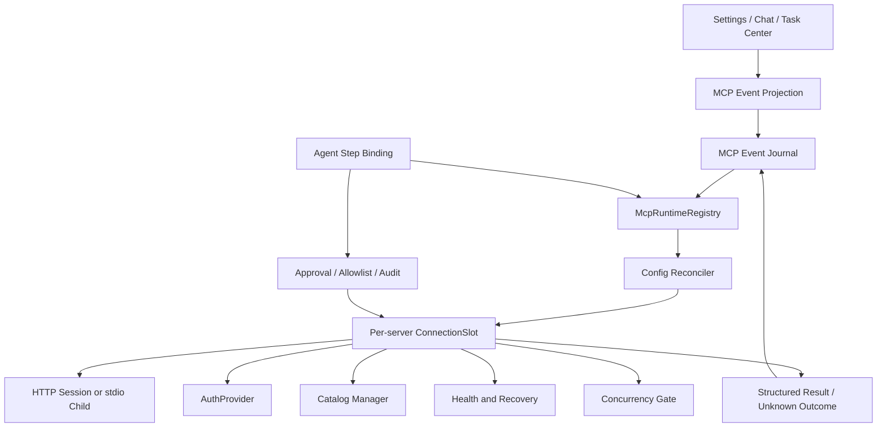
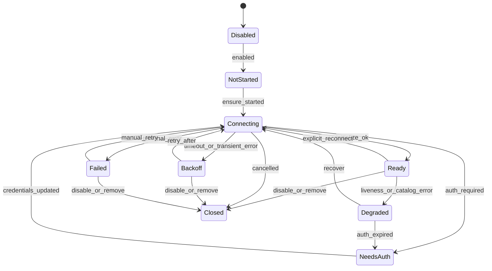
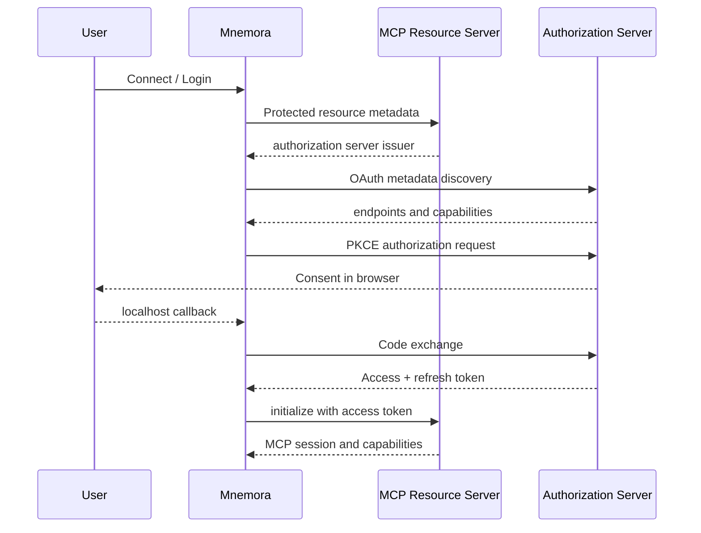

# Mnemora MCP 连接复用、认证、健康检查与端到端可靠性研究

> 研究日期：2026-08-29  
> 文档类型：源码级调研与落地设计  
> 研究对象：Mnemora 当前工作树、OpenAI Codex、Anthropic Claude Code、xAI Grok Build、xAI Python SDK、MCP 官方传输规范  
> 本轮状态：仅完成调查、取证和方案设计，尚未修改 Mnemora MCP 运行时代码。  
> 证据原则：对 Codex 与 Grok 只引用可直接阅读的官方开源源码；Claude Code 的运行时核心不是完整公开源码，因此将官方文档和 changelog 与“无法直接验证的内部实现”严格区分。

## 1. 结论先行

Mnemora 当前 MCP 已经可以被 Agent 发现和调用，不是空壳。现有实现已经覆盖：

- Streamable HTTP 与 stdio 两种 transport；
- mcp-servers.json 配置持久化；
- catalog-cache.json 工具目录缓存；
- 启用、禁用、刷新、删除；
- HTTPS 与 loopback HTTP 安全校验；
- keyring 中的 Bearer Token；
- allowlist、自动批准列表；
- 启动超时、调用超时、输出大小、参数大小、嵌套深度和并发限制；
- 稳定的 server/tool namespace；
- 外部不可信结果包装；
- Agent 的 search_tools -> inspect_tool -> execute 渐进披露；
- 审批、审计、取消和未知结果安全规则。

当前五个缺口的共同根因不是“少了几个配置字段”，而是 MCP 还没有按服务器维度维护一个长期运行时。现在的设置、缓存、状态、transport、重试和前端展示是分散的，发现和调用都临时创建连接，导致生命周期无法统一管理。

推荐的主线是：

```text
McpRuntimeRegistry
  └── McpConnectionSlot(server_id)
        ├── config_fingerprint
        ├── connection state machine
        ├── one reusable MCP client/session
        ├── stdio child process or HTTP session
        ├── AuthProvider
        ├── CatalogState
        ├── HealthState
        ├── Backoff / circuit breaker
        ├── hot-swappable concurrency gate
        ├── single-flight refresh
        ├── cancellation token
        └── event journal / frontend projection
```

实施顺序必须是：

1. 按 server_id 建立连接 slot 和配置指纹；
2. 让 discover 与 call 复用同一 session；
3. 建立 catalog revision、single-flight 和 stale-while-revalidate；
4. 再加入 custom headers、OAuth、mTLS；
5. 接入后台健康检查、有限恢复和事件推送；
6. 最后补齐真实 HTTP/stdio E2E 测试。

如果先分别补 OAuth、重试或前端状态，最终会出现多套连接、状态和重试逻辑，继续产生竞态和资源泄漏。

## 2. 当前 Mnemora 的真实实现

### 2.1 核心数据结构

当前实现位于：

- src-tauri/src/mcp/manager.rs
- src-tauri/src/mcp/types.rs
- src-tauri/src/mcp/repository.rs
- src-tauri/src/mcp/secrets.rs
- src-tauri/src/chat/agent/catalog.rs
- src-tauri/src/chat/agent/registry.rs
- src-tauri/src/commands/mcp.rs
- src/features/settings/components/McpSettingsPanel.tsx

manager.rs 的 McpManagerInner 目前保存：

```rust
repository: McpRepository,
secrets: McpSecretStore,
http: reqwest13::Client,
settings: RwLock<McpSettings>,
cache: RwLock<McpCatalogCache>,
statuses: RwLock<BTreeMap<String, McpServerStatus>>,
operation_locks: Mutex<HashMap<String, Arc<Mutex<()>>>>,
call_gates: Mutex<HashMap<String, Arc<Semaphore>>>,
```

这组字段能够支撑基础功能，但还没有一个保存“当前 transport/client/子进程”的字段。也就是说，状态 map 只是状态记录，不是连接运行时。

types.rs 的 McpTransportConfig 当前只有：

- StreamableHttp { url, has_bearer_token }
- Stdio { command, args, cwd, env }

McpServerStatus 当前只有 Disabled、Cached、Connecting、Ready、Backoff、Failed 六种状态，没有 NeedsAuth、Degraded、Closed、NotStarted、Reconnecting 等状态。

### 2.2 发现和调用的连接生命周期

manager.rs:474-507 的 discover()：

1. 根据配置创建 HTTP 或 stdio transport；
2. 调用 serve_with_lifecycle；
3. 调用 list_all_tools；
4. 完成后 client.cancel()。

manager.rs:510-553 的 call_once()：

1. 再次创建 HTTP 或 stdio transport；
2. 再次初始化 MCP client；
3. 调用 call_tool；
4. 再次 client.cancel()。

因此当前一次发现加一次调用会产生两个独立 MCP session：

```text
refresh_server
  -> create transport A
  -> initialize A
  -> tools/list A
  -> cancel A

call_tool
  -> create transport B
  -> initialize B
  -> tools/call B
  -> cancel B
```

直接后果：

- stdio 每次发现和调用都会重新启动外部进程；
- 两次调用之间无法复用 server 的内存缓存、连接池外的协议 session 或 server-side session state；
- Streamable HTTP 的 MCP-Session-Id 无法跨操作保持；
- 子进程启动、握手、退出的成本重复发生；
- 进程崩溃、断线、认证过期没有稳定的单一归属；
- 前端看见 Ready，并不等于实际 client 仍然存活。

需要区分一个容易混淆的点：manager 内的 reqwest13::Client 可以复用底层 HTTP TCP 连接池，但这不等同于复用 MCP client/session。当前缺的是后者。

### 2.3 maxConcurrency 的热更新缺陷

manager.rs:670-684 当前逻辑：

```rust
gates
    .entry(config.id.clone())
    .or_insert_with(|| Arc::new(Semaphore::new(config.max_concurrency)))
    .clone()
```

Semaphore 只在第一次调用时创建。服务器配置的 max_concurrency 后续改变时，旧 gate 仍然存在，新配置不会立即生效。

另一个问题是，删除 server 时只清理了 cache、status 和 Bearer Token，没有清理 operation_locks、call_gates 以及未来可能增加的 watcher、child process 和 refresh task。长期运行时会有小规模但持续的内存增长。

不能简单地 remove 旧 semaphore：旧调用可能仍持有 permit。正确做法是：

- 新调用进入新 gate；
- 旧 gate 只服务于已经获取或正在等待的旧调用；
- 旧 gate 在计数归零后自然释放；
- slot generation 负责区分新旧配置。

### 2.4 认证能力边界

当前 HTTP transport 只有 has_bearer_token 标记，manager.rs:556-572 从 keyring 读取 token 并设置 Authorization header。

目前不支持：

- OAuth metadata discovery；
- PKCE 浏览器登录；
- dynamic client registration 或 pre-registered client；
- access token 主动刷新；
- refresh lock；
- protected resource metadata；
- mTLS client certificate/key；
- 自定义认证头；
- 每次请求动态生成短时 token；
- 认证状态 NeedsAuth、InsufficientScope、Expired。

Bearer Token 本身并不是错误的第一阶段，但它不能作为完整 MCP 认证体系。特别是动态 header 和 OAuth 的刷新需要进入连接指纹，否则 token 已变化而 client 仍被误复用。

### 2.5 状态、刷新和前端可观测性

manager.rs:638-648 的 update_status() 只修改内存中的 statuses map，没有向 Tauri event、任务中心、Chat 页面或全局事件总线发布状态变化。

当前刷新主要来自：

- 设置页的手动刷新；
- 启用 server 后的刷新。

缺少：

- app 启动后的后台恢复；
- TTL 过期刷新；
- jitter，避免多个 server 同时打满；
- single-flight，避免同一 server 并发 tools/list；
- catalog changed 事件处理；
- 断线 watcher；
- circuit breaker；
- 前端重连后的 snapshot + sequence resync。

当前 constructor 如果有 cache，会把启用 server 设置成 Cached；没有 cache 的启用 server 设置成 Failed。这会把“从未尝试连接”和“连接失败”混成一个状态。

### 2.6 当前重试和安全规则

manager.rs:650-659 的 record_failure()：

- 连续失败次数递增；
- backoff 为 2^n 秒，最大 300 秒；
- 状态变为 Backoff；
- 记录 retry_after 和截断错误。

call_tool() 对取消和超时有明确的安全边界：

- cancellation 直接返回取消；
- 超时返回“结果未知”；
- 普通 call 失败时明确说明“没有透明重试，因为副作用结果可能未知”。

这条规则必须保留。连接恢复与业务调用重放是两件事：

| 操作 | 是否可自动重试 | 原因 |
|---|---|---|
| initialize | 可以，有限次数 | 尚未产生业务副作用 |
| tools/list、prompts/list、resources/list | 可以，短退避 | 读取型发现 |
| liveness/health probe | 可以，必须是只读 | 不应执行用户工具 |
| call_tool 已超时 | 默认不可以 | 服务端可能已经执行成功 |
| read-only 且明确 idempotent 的 call | 可由策略显式允许 | 仍需记录 request id 和重放次数 |
| write/destructive call | 默认不可以 | 避免重复副作用 |
| 401 | 进入 NeedsAuth 或执行一次 auth refresh | 不应无限循环 |
| 404 + 旧 session id | 可新建 session | 规范定义为 session 过期 |

## 3. MCP 规范边界

MCP 官方 Streamable HTTP 传输规范要求：

- initialize 成功后服务端可以返回 MCP-Session-Id；
- 后续请求必须携带该 session id；
- session 过期时，带旧 id 的请求返回 404；
- 客户端收到这种 404 后必须新建 session；
- 不再需要 session 时客户端应发送 DELETE；
- SSE 断线可以用 event id 和 Last-Event-ID 恢复；
- MCP-Protocol-Version 必须使用协商后的版本；
- 旧 HTTP+SSE transport 可以做兼容探测。

规范没有替 Mnemora 决定：

- 连接应当缓存多久；
- stdio 进程何时启动和退出；
- 是否自动调用工具；
- 如何处理未知副作用；
- OAuth token 存在哪里；
- 前端如何展示状态。

这些属于客户端运行时策略。Mnemora 不应 fork Mermaid 或 MCP 协议，只应在标准协议之上增加有边界的生命周期与安全策略。

## 4. OpenAI Codex 的源码级研究

研究快照：

- 仓库：[openai/codex](https://github.com/openai/codex)
- 本地快照：_research_tmp/codex
- 研究提交：0ae94fdd49b05ee7faa4d984d06a68492cb32b54
- 重点模块：
  - codex-rs/codex-mcp/src/connection_manager.rs
  - codex-rs/codex-mcp/src/runtime.rs
  - codex-rs/codex-mcp/src/tool_catalog_cache.rs
  - codex-rs/rmcp-client/src/oauth.rs
  - codex-rs/rmcp-client/tests/streamable_http_recovery.rs
  - codex-rs/app-server/src/request_processors/mcp_event_stream.rs

### 4.1 连接复用按身份判断，不按 server name 判断

connection_manager.rs 的 McpServerConnection::reusable_client() 会检查：

- McpServerConnectionIdentity 是否相同；
- startup 是否已经完成；
- 底层 client 是否已关闭；
- OAuth credentials 是否仍相同。

配置、token 或身份变化时拒绝复用。Mnemora 应采用同样的 identity/fingerprint 规则，不能只按 server_id 保留连接。

建议 fingerprint 至少包含：

- transport 类型；
- HTTP URL 的规范化 origin/path；
- stdio command、args、cwd；
- 允许的环境变量名称和值的摘要；
- auth provider 类型和 credential version；
- custom headers 的名称与 secret reference 版本；
- protocol/lifecycle mode；
- plugin revision；
- trust/sandbox profile。

敏感 token 不进入日志，也不建议直接写入 fingerprint；应使用稳定的 secret version/hash。

### 4.2 ConnectionSet 与 runtime snapshot

Codex 的 McpConnectionSet::new(previous, ...) 会：

- 对每个 server 计算 identity；
- identity 未变化则保留旧 connection；
- identity 变化才创建新 connection；
- 旧连接 drop 时取消 startup token。

Codex 的 McpRuntime 使用 thread-owned runtime、ArcSwap 和 PublishedMcpRuntime：

- 最新 runtime 以原子 snapshot 发布；
- 旧 binding 继续持有它创建时的精确 connection；
- replace() 可以携带 previous connection set；
- replace_fresh() 明确要求全新连接；
- reconnect_on_next_refresh() 让下一次刷新强制重连；
- binding 构建前后校验 catalog revision，防止竞态。

对 Mnemora 的直接启发：

- settings snapshot、connection slot、catalog snapshot、agent binding 必须分层；
- Agent step 应绑定 catalog revision；
- refresh 不能偷偷替换一个正在执行 step 的工具 schema；
- 配置变更通过 reconcile 处理，而不是让 Settings UI 直接碰 transport。

### 4.3 Lazy startup 与目录缓存

Codex 支持 LazyWhenCached：

- 有缓存工具定义时，启动可以延迟到第一次使用；
- 首帧不需要等待所有 MCP server；
- 目录缓存是 process-scoped LRU；
- 缓存容量为 32，TTL 为 30 分钟；
- identity/fingerprint 改变时缓存失效；
- generation ticket 防止旧 discovery 覆盖新 discovery；
- disabled server 会清除缓存；
- tool annotations 不直接从缓存复用，因为 annotation 会影响审批和并发策略。

Mnemora 的 catalog-cache.json 是很好的起点，但目前缺少：

- TTL；
- LRU/容量上限；
- generation；
- stale-while-revalidate；
- revision 与 agent binding 的一致性检查；
- tools/list_changed 的刷新入口。

### 4.4 状态事件和只读状态查询

Codex 在 startup 中发布结构化 Starting、Ready 和失败原因，区分：

- authentication required；
- timeout；
- cancelled；
- generic startup failure。

状态查询是 read-only，不会因为用户查看状态而启动 server。

Mnemora 应把状态查询和连接动作分离：设置页打开不应隐式唤醒所有 disabled 或从未使用的 server。

### 4.5 OAuth 与恢复测试

Codex rmcp-client 已覆盖：

- OAuth metadata discovery；
- protected resource metadata；
- issuer 校验；
- browser login；
- dynamic client registration；
- pre-registered client；
- callback server；
- keyring/file store；
- refresh token；
- refresh lock；
- expiration skew；
- OAuth status reporting；
- same-origin redirect 限制；
- 不把 resource server 的 Authorization/API key 头发给 authorization server。

streamable_http_recovery.rs 等测试覆盖：

- initialize 无响应后有限重试；
- 502 初始化重试；
- initialized notification 临时失败；
- tools/list 临时失败；
- 404 stale session 恢复；
- stale session 恢复失败；
- 401 不触发 session recovery；
- 403 insufficient scope；
- 只重试一次。

Mnemora 不需要一次复制完整 OAuth，但必须复制“状态分类、有限次数、凭据边界、可测试”的原则。

## 5. Claude Code 的官方能力边界

研究资料：

- 官方文档：[Claude Code MCP](https://code.claude.com/docs/en/mcp.md)
- 本地官方仓库资料：_research_tmp/claude-code
- 运行时核心不是完整公开 TypeScript 源码，因此不能声称已经读取 Anthropic 内部全部实现。
- 可验证证据主要来自官方文档、CHANGELOG.md 和 plugin-dev/mcp-integration 资料。

### 5.1 可验证的产品行为

官方文档说明：

- HTTP 是推荐的远程 transport；
- SSE 已 deprecated；
- 支持 stdio、HTTP、SSE、WebSocket；
- stdio server 由 Claude Code spawn，并运行到 session 生命周期结束；
- 支持静态 headers；
- 支持 headersHelper 动态生成认证头；
- HTTP/SSE 支持 OAuth；
- WebSocket 不支持 OAuth，只支持 headers；
- 支持 plugin .mcp.json；
- 支持 alwaysLoad 和 discovery cache；
- claude mcp list/get 显示 Connected、Needs authentication、Failed、Cached；
- disabled server 不进行连接式 health check；
- Reconnect 会丢弃旧 cache 并重新连接；
- Clear authentication 会撤销认证并清理 cache；
- 错误细节会显示 HTTP status/error，但会脱敏 URL 和 credential；
- 项目 .mcp.json 受 workspace trust 与审批控制。

### 5.2 Changelog 透露的可靠性经验

官方 CHANGELOG 提供了非常有价值的生产问题证据：

- remote MCP 在非交互和 SDK session 中掉线后自动 reconnect 或明确报告 failed；
- sandbox 和 MCP bring-up 不阻塞首帧；
- transient 5xx 的 mid-session reconnect 不再让 remote MCP 永久 failed；
- 修复 stdio MCP 在 initialize 前收到 discover，导致每个 session open 都启动后端；
- disabled server 不再为了 health check 连接；
- language server disconnect/reconnect 不再让整个 prompt cache 失效；
- mTLS 证书轮换在连接错误时自动 reload，无需重启；
- headersHelper 可重新运行并在 401/403 后重连；
- discovery 与 token 请求对临时网络错误有限重试；
- OAuth token 在过期前主动刷新；
- OAuth refresh 存在并发竞争、keychain timeout、redirect URI、scope、代理和无限 refresh loop 等真实问题。

这些 changelog 条目说明：MCP 的难点是长期运行的身份、缓存和恢复竞态，而不是把 transport 枚举加到配置文件。

### 5.3 可借鉴与不可照搬

可借鉴：

- Connected / Cached / Needs auth / Failed 的用户可理解状态；
- disabled 不做网络探活；
- discovery cache + first-use connect；
- headersHelper 动态头；
- trust/approval 与项目配置绑定；
- mTLS 轮换；
- 前端错误脱敏；
- 配置变化立即生效。

不可直接照搬：

- Claude CLI 的托管设置、账户和 workspace trust 体系；
- 未公开的内部实现；
- 与 Claude 云 session 强绑定的 cache 语义；
- 只适用于终端 UX 的状态文本。

## 6. xAI SDK 与 Grok Build 的边界

### 6.1 xAI Python SDK 不是本地 MCP runtime

xai_sdk/tools.py 的 mcp() 接口接收：

- server_url；
- server_label；
- server_description；
- allowed_tool_names；
- authorization；
- extra_headers。

它的语义是把远程 MCP tool 描述交给 xAI 服务端 agent/backend 执行。它不负责：

- 本地 stdio 子进程；
- MCP session 生命周期；
- 本地 catalog cache；
- liveness watcher；
- OAuth 浏览器流程；
- 本地断线恢复。

可以借鉴：

- server label/description；
- allowlist；
- extra headers；
- tool_call_id 与并行调用结果稳定关联；
- server-side tool 与 client-side tool 的边界。

不能把 xai_sdk.mcp() 误判成完整客户端实现。

### 6.2 Grok Build 的 session-owned clients

研究对象：

- 仓库：[xai-org/grok-build](https://github.com/xai-org/grok-build)
- 本地快照：_research_tmp/grok-build
- 重点目录：
  - crates/codegen/xai-grok-mcp
  - crates/codegen/xai-grok-shell
  - crates/common/xai-circuit-breaker

owned_clients.rs 的 OwnedClients 持有 HashMap<McpServerName, Arc<McpClient>>：

- insert/remove/clear 会取消旧 client 的 liveness watcher；
- Arc 管理连接生命周期；
- 旧 client 与 watcher 一起清理；
- server name 相同但 client_id 不同的事件不会互相误杀。

这是 Mnemora 当前最缺失的层：每个 server 要有一个明确归属的长生命周期 client slot。

### 6.3 Liveness watcher

liveness.rs 为每个 Ready client 建立 watcher：

- 默认约 500ms poll；
- 只在 Ready 且 transport closed 时发 TransportClosed；
- Initializing/Pending/Empty 静默退出；
- handle drop 会取消 watcher；
- 事件带 client_id，防止旧 client 的关闭事件杀掉新 client。

Mnemora 不必照抄 500ms。应分开：

- transport liveness：较短间隔或由读事件驱动；
- catalog refresh：分钟级 TTL；
- reconnect backoff：指数退避；
- 用户可见状态：事件驱动。

### 6.4 单一初始化状态机与配置 diff

servers.rs 的 InitProgress 使用单一 enum：

- NotStarted；
- Starting { handshaking }；
- Finished { handshaking }。

显式 try_start、finish、cancel、mark_handshaking、mark_handshake_complete，避免多个 bool/HashSet 组合出非法状态。

McpConfigDiff 明确区分：

- added；
- removed；
- retained。

retained server 保持原 client；added/changed server 拆除旧实例。

### 6.5 Dispatcher、重启和 circuit breaker

mcp_dispatcher.rs 监听：

- TransportClosed；
- HandshakeFailed；
- ToolsChanged；
- ResourcesChanged；
- Ready；
- ConfigDiff。

它使用约 50ms tumbling window：

- 按 server 与 event kind 合并；
- 同类事件 last-write-wins；
- TransportClosed 的 client identity 单独保留；
- 转换成 ACP x.ai/mcp/server_status；
- 状态包括 Ready、Initializing、Unavailable、NeedsAuth；
- reason 包括 transport_closed、handshake_failed、config_changed、disabled、auth_expired、initialized、restart_succeeded、restart_failed。

mcp_restart.rs 对 stdio 断线重启：

- debounce；
- in_flight_restart set 防重复；
- 检查 shutting_down；
- 检查 server 仍 configured/enabled；
- bounded restart task；
- RAII guard 释放 in-flight 标记；
- 不会让已删除的 server 被旧事件 resurrect。

xai-circuit-breaker 将错误分类为：

- Retryable；
- AuthRefresh；
- Terminal。

429/5xx 可重试，401 只做一次 auth refresh，400/403/404 等 terminal；TLS origin failure 不重试；另有滑动窗口错误率和最小样本数 breaker。

## 7. 五个缺口的逐项对照

| 缺口 | Mnemora 当前 | Codex | Claude Code | Grok Build | Mnemora 应采用 |
|---|---|---|---|---|---|
| 连接复用 | 每次 discover/call 临时 client | identity + previous connection set | session 生命周期 stdio、cached lazy connect | session-owned Arc client | per-server connection slot |
| maxConcurrency 热更新 | entry-or-insert，旧 semaphore 永不替换 | binding/step snapshot | 配置即时生效的产品行为 | config diff + retained client | fingerprint + 双 gate drain |
| 认证 | keyring Bearer Token | OAuth 完整流程、refresh lock | OAuth、headersHelper、mTLS rotation | OAuth、headers、native HTTP | headers -> OAuth -> mTLS 分阶段 |
| 健康检查/刷新 | 手动/启用刷新 | lazy cache、startup policy、有限恢复 | discovery cache、reconnect、disabled 不探活 | watcher、dispatcher、bounded restart | TTL + jitter + single-flight + watcher |
| 前端状态 | 仅内存 statuses | 结构化事件 | Connected/Cached/Needs auth/Failed | ACP status push | event journal + snapshot/sequence |
| E2E | 参数、安全、命名测试 | HTTP/stdio/OAuth/recovery fixtures | 生产 changelog 反馈 | liveness/restart/circuit tests | 真实 fixture + fault injection |

## 8. 推荐的 Mnemora 目标架构

### 8.1 组件分层



责任边界：

- Settings 只产生配置 snapshot；
- Registry 负责 reconcile；
- ConnectionSlot 是 transport/client/child process 的唯一所有者；
- Catalog Manager 负责 tools/list 和 revision；
- AuthProvider 负责 headers/token/cert；
- Health Manager 负责 liveness、TTL、backoff、breaker；
- Agent Binding 固定 catalog revision 和权限快照；
- Journal 是后端事实来源，前端只是投影。

### 8.2 ConnectionSlot 字段

建议新增一个内部结构，不直接暴露给前端：

```rust
struct McpConnectionSlot {
    server_id: String,
    config_fingerprint: String,
    generation: u64,
    state: ConnectionState,
    client: Option<McpClientHandle>,
    transport_kind: TransportKind,
    auth: AuthProviderHandle,
    catalog: CatalogState,
    health: HealthState,
    backoff: BackoffState,
    call_gate: GateEpoch,
    operation_lock: Arc<Mutex<()>>,
    refresh_singleflight: RefreshSingleflight,
    cancellation: CancellationToken,
    instance_id: Uuid,
}
```

McpClientHandle 必须能够保证：

- 同一 slot 的 discover 和 call 使用同一 client；
- cancel/Drop 时关闭 HTTP session 或 kill_on_drop stdio 子进程；
- connection instance id 变化时旧事件不会影响新实例；
- slot generation 变化后旧 Agent binding 不能调用新 schema。

### 8.3 连接状态机



状态的用户语义：

- Disabled：用户明确关闭，后台不得连接；
- NotStarted：已启用但按需等待；
- Connecting：正在建立 transport/session；
- Ready：client 和 catalog 可用；
- Degraded：连接仍可能存在，但目录或 liveness 异常；
- NeedsAuth：需要用户登录或更新凭据；
- Backoff：等待有限重试窗口；
- Failed：需要明确人工重试或配置修复；
- Closed：slot 已被拆除，不能自动 resurrect。

### 8.4 连接复用与配置变更

每次 settings 变化都计算 fingerprint：

```text
fingerprint =
  hash(
    transport kind,
    normalized URL or command/args/cwd,
    env reference versions,
    auth provider kind + credential version,
    custom header reference versions,
    protocol mode,
    plugin revision,
    trust/sandbox profile
  )
```

reconcile 规则：

1. fingerprint 相同：保留 slot、client、watcher 和 catalog；
2. 仅 display name、allowlist、auto approve 改变：可保留 transport，但立即生成新的 Agent policy snapshot；
3. URL、command、args、cwd、env、auth、protocol 或 plugin revision 改变：创建新 generation；
4. old slot 进入 Draining，取消 refresh 和 watcher；
5. 新 slot 先建立，再发布新 snapshot；
6. 旧连接关闭失败也不能阻塞新连接；
7. disable/remove 必须取消 child process、watcher、refresh task、semaphore waiters。

配置改变时不应让 Settings UI 直接调用 discover。UI 发出 save，Registry 根据 diff 决定是否重建。

## 9. Catalog 设计

### 9.1 CatalogState

```rust
enum CatalogState {
    Cold,
    Cached { revision: String, fetched_at: u64 },
    Refreshing { generation: u64 },
    Ready { revision: String, fetched_at: u64 },
    Stale { revision: String, stale_since: u64 },
    Failed { retry_after: u64, last_error_code: String },
}
```

catalog cache 至少要保存：

- server_id；
- config_fingerprint；
- catalog_revision；
- discovered_at；
- tools；
- protocol version；
- optional server metadata；
- generation；
- schema byte size；
- source (live/cache)。

### 9.2 TTL、single-flight 与 stale-while-revalidate

建议默认策略：

- 进程内热缓存：LRU 32 个 server；
- 持久化目录 TTL：30 分钟；
- TTL 可按 server 配置；
- TTL 到期后保留旧工具供只读 UI 展示；
- 后台单飞刷新；
- 首次 call 如果 catalog stale，先尝试刷新；
- 同一 server 同时只有一个 tools/list；
- 手动 refresh 是强制刷新，但仍不能并行创建第二个 session；
- 使用 generation ticket，旧结果不能覆盖新结果。

### 9.3 catalog revision 与 Agent step

每个 Agent step 绑定：

```text
{
  server_id,
  connection_generation,
  catalog_revision,
  tool_policy_revision,
  created_at
}
```

执行前检查：

- slot generation 是否仍然相同；
- catalog revision 是否仍然相同；
- tool 是否仍在 allowlist；
- approval policy 是否未收紧。

如果 revision 变化：

- 不执行旧 binding 中的工具；
- 重新生成 tool catalog；
- 让 Agent 进入一次“工具目录已更新”的可解释分支；
- 不悄悄替换 schema。

### 9.4 tools/list_changed

当 server 宣布 tools/list_changed：

1. 记录 catalog_changed 事件；
2. 标记 Stale；
3. 启动单飞 refresh；
4. 成功后计算新 revision；
5. 使旧 binding 失效；
6. 向 Chat/任务中心发布目录变化；
7. 仅在用户/Agent 下一步需要时重新编译工具列表。

## 10. 认证分阶段设计

### 10.1 第一阶段：安全的 custom headers

配置不要保存 plaintext header value。推荐：

```json
{
  "auth": {
    "type": "headers",
    "headers": [
      { "name": "X-Workspace-Id", "valueRef": "keyring:mcp/github/workspace" },
      { "name": "Authorization", "valueRef": "keyring:mcp/github/token" }
    ],
    "helper": null
  }
}
```

规则：

- header 名称 allowlist/blocklist；
- Authorization、Cookie、Set-Cookie 等值只进 keyring；
- 日志永不记录 header value；
- 禁止跟随跨 origin redirect；
- headersHelper 如果允许执行命令，必须走审批、超时、无继承凭据环境；
- helper 输出大小和格式严格限制；
- helper 的 config directory 和 project trust 需显式确认；
- credential version 变化时让 fingerprint 失效。

### 10.2 第二阶段：OAuth 2.1

流程：



必须具备：

- PKCE S256；
- state 防 CSRF；
- callback 使用 127.0.0.1；
- issuer/resource binding 校验；
- same-origin redirect 限制；
- keyring 优先，文件存储仅作为明确的受保护回退；
- access token 过期 skew；
- refresh single-flight；
- 401 只触发一次 refresh；
- refresh 失败进入 NeedsAuth，不无限循环；
- OAuth authorization server 不接收 resource server 的 Authorization/API key 头；
- scope 最小化并显示给用户；
- OAuth 事件脱敏。

### 10.3 第三阶段：mTLS

mTLS 配置只保存引用：

```json
{
  "auth": {
    "type": "mtls",
    "clientCertificateRef": "system-cert:mnemora/github",
    "privateKeyRef": "keyring:mcp/github/mtls-key",
    "caBundleRef": "file:/trusted/ca.pem"
  }
}
```

要求：

- 私钥不能写入普通配置和日志；
- 支持证书过期提前告警；
- 连接错误时 reload 最新证书；
- 证书轮换不强制重启整个 App；
- 证书、私钥和 CA 的 fingerprint 进入 connection identity；
- hosted session 不应无提示继承本地 mTLS；
- TLS hostname 验证默认开启。

## 11. 健康检查、刷新与断线恢复

### 11.1 三类周期不能混为一谈

| 机制 | 目标 | 频率 | 是否产生 tools/list |
|---|---|---:|---|
| transport liveness | 发现 stdio 进程或 HTTP session 已关闭 | 事件驱动或秒级 | 否 |
| connection health | 确认 initialize/session 可用 | 30 秒到数分钟 | 否 |
| catalog refresh | 发现工具目录变化 | TTL，默认 30 分钟 | 是 |

健康检查不能调用业务工具。disabled server 不应做任何网络探活。

### 11.2 调度器

建议每个 enabled server 有一个独立 refresh task，但任务由 Registry 统一托管：

- app start 仅恢复 enabled 配置；
- 有有效 cache 时先展示 Cached；
- 首次使用时 lazy connect；
- TTL 使用 jitter，例如 TTL * [0.8, 1.2]；
- 同一 server refresh single-flight；
- 失败使用指数退避和 Retry-After；
- 连续失败达到阈值后进入 circuit open；
- circuit open 期间只允许手动 refresh；
- disable/remove 取消 task；
- App shutdown 对 stdio 发送 cancel/kill_on_drop。

### 11.3 Streamable HTTP stale session

处理规则：

1. request 携带旧 MCP-Session-Id；
2. 返回 404；
3. 将 session 标为 stale；
4. 只对 initialize/tools/list/health 重新建立 session；
5. 对业务 call 默认返回“session expired，结果未产生/未知”，不透明重放；
6. 对明确只读且幂等的工具，由策略层决定是否允许一次恢复；
7. 404 连续出现一次以上进入 Degraded/Failed，防止循环。

### 11.4 stdio crash recovery

当 child process 退出：

- watcher 发 transport_closed，带 client instance id；
- slot 检查当前 generation 和 enabled 状态；
- 已 disable/remove 的 server 不重启；
- 相同 server 已有 in-flight restart 时合并事件；
- debounce 100-500ms，避免启动风暴；
- restart 次数受窗口限制；
- 超过阈值进入 Backoff/Failed；
- stderr 写入受大小限制的诊断日志；
- 新 child 成功后发布 restart_succeeded；
- 旧 child 的迟到事件不能影响新 slot。

## 12. maxConcurrency 热更新方案

推荐用 GateEpoch：

```rust
struct GateEpoch {
    config_revision: u64,
    limit: usize,
    gate: Arc<Semaphore>,
    draining: bool,
}
```

规则：

1. 计算 max_concurrency 对应的 concurrency fingerprint；
2. fingerprint 未变，复用 gate；
3. fingerprint 变化，创建新 gate；
4. 新调用只进入新 gate；
5. 已持有 permit 的调用继续使用旧 gate；
6. 旧 gate permit 归零后 drop；
7. 减小并发时不强行撤销正在运行的调用；
8. 删除 server 时标记 draining，并关闭等待队列；
9. slot generation 和 policy revision 一起进入审计日志。

需要测试的行为：

- 旧调用运行期间修改 4 -> 1；
- 修改后新调用最多 1 个并发；
- 修改 1 -> 4 后新调用可以立即增加；
- 删除 server 时等待中的调用收到可解释错误；
- server id 重用时不会复用旧 gate。

## 13. 前端实时状态协议

后端事件 journal 是唯一真相，Tauri event/stream 是传输层。建议事件：

```json
{
  "type": "mcp.server.status",
  "sequence": 1842,
  "serverId": "github",
  "generation": 7,
  "instanceId": "uuid",
  "state": "ready",
  "reason": "reconnected",
  "catalogRevision": "sha256:...",
  "toolCount": 12,
  "lastSuccessAt": 1750000000000,
  "retryAfter": null,
  "errorCode": null,
  "detail": null
}
```

设计要点：

- detail 必须脱敏；
- sequence 单调递增；
- 前端重新连接先请求 overview snapshot；
- snapshot 带 lastSequence；
- 前端只应用 sequence 更大的事件；
- 发现 gap 时重新拉 snapshot；
- Settings、Chat、Task Center 订阅同一事件；
- Chat 可显示 NeedsAuth、Reconnecting、ToolsChanged，但不暴露 token/URL query；
- 事件带 generation/instanceId，避免旧连接的迟到事件误更新新连接；
- 状态事件和 Agent tool call 事件通过 correlationId 关联。

建议的状态 projection：

| 状态 | 设置页 | Chat | 任务中心 |
|---|---|---|---|
| Cached | 显示缓存时间 | 不阻塞首个用户消息 | 低优先级 |
| Connecting | 连接中 | 可选轻量提示 | 活动任务 |
| Ready | 工具数和 revision | 正常 | 完成连接事件 |
| NeedsAuth | 登录按钮 | 阻塞依赖该 server 的步骤 | 待用户操作 |
| Degraded | 可展开错误 | 工具搜索可能过期 | 警告 |
| Backoff | 下次重试时间 | 不重复刷屏 | 计划任务 |
| Failed | 脱敏错误和重试 | 明确不可用 | 失败任务 |

## 14. 安全边界

MCP server 是外部不可信代码或远程服务。必须保持以下原则：

- server 配置不等于自动批准；
- plugin-owned server 不可被手工替换；
- stdio command、cwd、env 有路径和长度校验；
- 子进程继承环境要最小化；
- 不允许 server 通过工具结果注入系统提示；
- MCP result 持续标记 external_untrusted；
- 工具 schema 和 annotation 在本地再次校验；
- allowlist 在发现和调用两端都检查；
- 自动批准只对明确工具生效；
- 业务调用不透明重放；
- 输出截断和总字节预算必须在 transport、解析和 UI 三层生效；
- URL redirect 默认关闭或限同源；
- OAuth、Bearer、Cookie、private key 不进入日志；
- 删除/禁用是终态操作，旧事件不能 resurrect server；
- 所有状态变更、认证变更、审批和工具调用进入审计事件。

### 14.1 插件与 MCP 的边界

插件可以贡献 MCP 配置、skills、hooks 或 UI，但插件不应直接注入 Mnemora 主进程：

```text
Plugin manifest
  -> validate contribution
  -> mark plugin-owned
  -> sandbox/helper boundary
  -> McpRuntimeRegistry
  -> per-server ConnectionSlot
```

插件卸载时必须：

1. 禁用并关闭其 MCP slots；
2. 取消 refresh/watchers；
3. 清理 catalog cache；
4. 撤销 plugin-owned secrets；
5. 发布 config_changed 和 disabled 事件；
6. 等待旧 child process 退出或执行 kill-on-drop。

## 15. 真实端到端测试设计

当前 Rust MCP 测试主要覆盖 wire name 稳定性、参数大小/深度和 HTTP URL 安全校验，尚未覆盖真实 server 生命周期。应新增独立 mcp-e2e fixture crate 或 integration test harness。

### 15.1 HTTP fixture

测试 server 要能够控制：

- 返回 MCP-Session-Id；
- 记录 initialize/tools/list/call 次数；
- 记录每次 session id；
- 指定延迟；
- 返回 401、403、404、429、500、502；
- 断开连接；
- 模拟 tools/list_changed；
- 模拟 access token 过期；
- 模拟 OAuth metadata；
- 模拟 mTLS 证书轮换。

### 15.2 stdio fixture

测试 child process 要能够：

- 输出标准 MCP JSON-RPC；
- 记录自己的 PID 到临时文件；
- 在 initialize 前拒绝 discover；
- 延迟握手；
- 在 tools/list 后退出；
- 在 call 中途退出；
- 写大量 stderr；
- 读取环境变量并验证 env 清理；
- 接收 shutdown/cancel。

### 15.3 E2E 矩阵

| 场景 | 核心断言 |
|---|---|
| HTTP warm call | refresh 与 call 使用相同 session id，不重复 initialize |
| stdio two calls | 两次调用 PID 相同 |
| config change | old child 退出，new child 启动 |
| disable/remove | child、watcher、refresh task 全部结束 |
| maxConcurrency 4 -> 1 | 修改后新调用最多一个并发 |
| concurrent refresh | 只有一次 tools/list |
| TTL refresh | 旧 cache 可展示，后台最终更新 revision |
| tools/list_changed | revision 变化，旧 binding 失效 |
| startup timeout | child 被清理，状态为 Failed/Backoff |
| call timeout | cancellation 发出，结果 unknown，不重放 |
| HTTP stale 404 | session 重建；只对允许的 discovery 恢复 |
| HTTP 401 | NeedsAuth，不无限 retry |
| OAuth expiry | refresh single-flight，工具定义不重复抖动 |
| mTLS rotation | 下次连接读取新证书 |
| stdio crash | bounded restart，不产生启动风暴 |
| disable during restart | 不 resurrect |
| frontend reconnect | snapshot + sequence resync |
| oversized output | 截断且内存不线性泄漏 |
| secret redaction | 日志和错误中无 token、cookie、私钥 |
| server ID reuse | 不复用旧 generation、gate 或 catalog |

### 15.4 断言资源生命周期

不要只断言返回值，还要断言：

- initialize 次数；
- session id；
- child PID；
- 子进程退出码；
- watcher 数量；
- in-flight restart 数量；
- semaphore gate epoch；
- catalog revision；
- event sequence；
- 内存和文件句柄；
- cancel 到资源释放的延迟。

## 16. Benchmark 与可观测性

建议建立三个基准场景：

1. 空闲：10 个 enabled server，其中 8 个只有 cache；
2. 对话：连续 100 个 Agent step，混合 search/inspect/execute；
3. 文献阅读：1 个 HTTP MCP + 大量 resources/list 和附件。

指标：

- 首帧时间；
- 首次工具可见时间；
- warm call p50/p95；
- cold start p50/p95；
- stdio spawn 次数；
- initialize 次数；
- 每 server 活跃 child/client 数；
- catalog refresh 合并率；
- 401 refresh 成功率；
- reconnect 成功率；
- unknown outcome 数；
- event journal 延迟；
- cache hit ratio；
- RSS、句柄数、socket 数；
- shutdown drain 时间。

关键告警：

- 一个 server 同时存在超过一个 Ready instance；
- 单 server 1 分钟内 initialize 次数异常；
- 认证刷新循环；
- catalog revision 回退；
- 旧 generation 事件更新新 slot；
- disable 后 child 未退出；
- output truncation 失效。

## 17. 分阶段实施计划

### Phase 0：契约和测试先行

- 定义 ConnectionState、CatalogState、AuthState、event schema；
- 建立 HTTP/stdio fixture；
- 写连接复用、超时、404、取消和 disable 测试；
- 保持现有 discover/call 行为作为回归基线。

完成标准：测试能证明当前缺陷，并在未来实现后变绿。

### Phase 1：ConnectionSlot 与复用

- 引入 McpRuntimeRegistry；
- 每 server 一个 slot；
- discover/call 通过 slot.ensure_ready；
- stdio child 生命周期由 slot 所有；
- HTTP MCP-Session-Id 由 slot 所有；
- remove/disable 关闭 slot；
- 配置 fingerprint 和 generation。

回滚方式：feature flag 退回临时连接路径，但保留事件与审计。

### Phase 2：Catalog runtime

- TTL/LRU；
- single-flight；
- generation ticket；
- stale-while-revalidate；
- tools/list_changed；
- binding revision 校验；
- 首帧 lazy startup。

### Phase 3：并发与认证

- GateEpoch 热更新；
- custom headers/valueRef；
- headersHelper 安全边界；
- NeedsAuth；
- OAuth metadata/PKCE/refresh；
- secret redaction。

### Phase 4：健康检查与恢复

- liveness watcher；
- health scheduler；
- exponential backoff + jitter；
- circuit breaker；
- HTTP stale 404 recovery；
- stdio bounded restart；
- mTLS reload。

### Phase 5：前端事件与运营

- event journal；
- Tauri event projection；
- snapshot/sequence resync；
- Settings/Chat/Task Center 统一状态；
- doctor/diagnostic view；
- benchmark 与故障注入 CI。

## 18. 常见错误方案及原因

### 错误 1：只把 client 放到 HashMap

如果没有 fingerprint、generation 和 shutdown，HashMap 会留下：

- 配置变更后的旧 client；
- token 更新后的旧认证；
- 已删除 server 的 child；
- 旧 watcher 的迟到事件。

“有缓存”不等于“生命周期正确”。

### 错误 2：遇到任何错误都 retry

MCP 工具可能有写入、发送、删除、扣费等副作用。超时后重放会造成重复操作。必须先分类 transport/init/catalog 与业务 call。

### 错误 3：用 ping tool 做健康检查

ping 可能不存在，也可能有副作用或消耗额度。健康检查应验证 transport/session 或只读协议层操作。

### 错误 4：token 放入 config fingerprint 或日志

会造成凭据泄漏和不必要的 cache churn。应该使用 credential version/hash，token 本身只在 AuthProvider 内存中使用。

### 错误 5：刷新 catalog 时直接替换全局工具列表

正在运行的 Agent step 可能仍按旧 schema 生成参数。必须以 revision 绑定 step，并在执行前检查一致性。

### 错误 6：前端状态 map 直接当事实来源

窗口切换、前端重连或事件丢失后会回到旧状态。后端 journal + snapshot 才能恢复。

### 错误 7：复制 Claude Code 的全部行为

Claude Code 的内部 runtime 未完整公开，且其账户、CLI、项目 trust 和 hosted session 语义不属于 Mnemora。应借鉴可验证的不变量，不复制不可验证的实现细节。

## 19. 面试级追问与回答要点

### 问：为什么连接复用是第一优先级？

答：因为认证、健康检查、catalog、重试和前端状态都必须绑定到一个真实连接实例。如果每次调用临时建 client，任何状态都只能是猜测；先加 OAuth 只会把 token 绑定到短命 session，先加 health check 只会不断创建更多连接。

### 问：为什么不能在 404 后重试原始 call？

答：Streamable HTTP 的 404 可能只表示 session 过期，但原始业务 call 可能已经到达服务端并执行。重新发送可能产生重复副作用。因此可以恢复 session，但业务 call 默认返回 unknown outcome；只有明确幂等和策略允许时才一次重放。

### 问：maxConcurrency 为什么需要 epoch？

答：Semaphore 不能安全地把已有 permit 突然改成另一个容量。epoch 让旧调用有确定的完成边界，新调用立即进入新 gate，既保证热更新，又不打断正在运行的任务。

### 问：catalog revision 为什么要进入 Agent step？

答：工具名称相同不代表 schema 相同。没有 revision，模型可能基于旧参数调用新工具，导致错误或危险副作用。revision 是工具广告、审批和执行一致性的最小证据。

### 问：为什么状态事件还要 sequence？

答：Tauri/前端事件可能丢失或乱序。sequence 让前端能够发现 gap，并通过 snapshot 重新同步，而不是继续显示一个过期的 Ready。

### 问：Claude Code 没有完整公开源码，如何避免过度推断？

答：把证据分级。Codex/Grok 的实现可以引用源码；Claude 只引用官方文档和 changelog 的外部行为。架构结论只采用三者交集或能由协议规范证明的部分。

### 问：为什么 xAI SDK 的 mcp() 不能作为 Mnemora 的实现模板？

答：它是 server-side MCP tool descriptor，把连接执行交给 xAI backend；Mnemora 需要本地 stdio child、HTTP session、keyring、健康检查和本地事件，因此运行时责任完全不同。

## 20. 最终决策

本轮调研的最终建议：

- 不 fork MCP；
- 不为每个缺口新增一套独立状态和重试；
- 先建立 McpRuntimeRegistry + per-server ConnectionSlot；
- discover 与 call 复用 session；
- catalog 使用 revision、TTL、single-flight 和 generation；
- maxConcurrency 使用 GateEpoch 热替换；
- 认证按 custom headers -> OAuth -> mTLS 分阶段；
- 健康检查区分 liveness、connection health、catalog refresh；
- 业务 call 超时保持 unknown outcome，不透明重放；
- 用 bounded recovery、backoff、jitter、circuit breaker 控制恢复；
- 用 event journal + snapshot/sequence 向 Settings、Chat、Task Center 投影；
- 用真实 HTTP/stdio fixture 验证 PID、session、超时、取消、404、断线和资源清理；
- 将本文件作为后续实现和 code review 的验收基线。

Mnemora 的目标不是“支持更多 MCP 配置项”，而是让每一个 server 都有可解释、可复用、可取消、可恢复、可观测且不会重复副作用的运行时生命周期。

