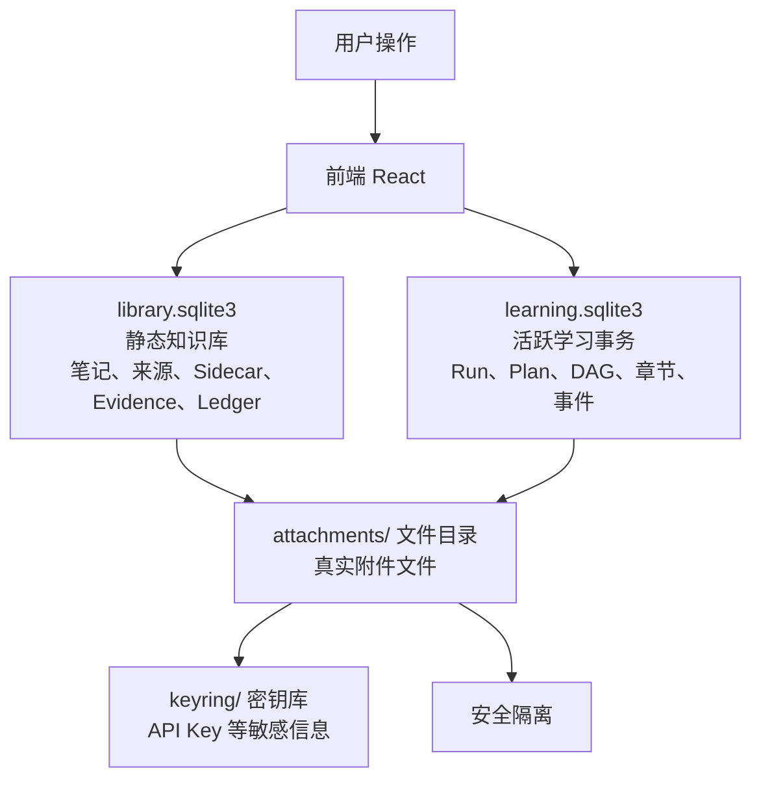
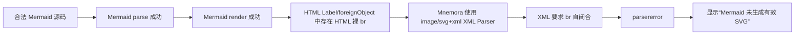

# Mermaid “未生成有效 SVG”与超长大图查看器取证

> 日期：2026-08-22
>
> 性质：修复前只读基线与复现实验。报告中的源码行号和行为描述用于说明根因；后续修复记录见 `md/modify/07-Mermaid疑难演进与根因复盘.md`。

## 1. 结论

两个问题都已确认存在，但不是同一个根因：

1. **“Mermaid 未生成有效 SVG”是后处理兼容性错误，不是截图中 Mermaid 源码的语法错误。** Mermaid 的 `parse()` 和 `render()` 均成功；失败发生在 Mnemora 把 Mermaid 返回的 HTML-Label SVG 强制交给 XML `DOMParser` 二次解析时。
2. **超长大图查看器存在确定性的资源与布局风险。** 查看器会复制完整 SVG/Shadow DOM，并给宿主设置原始宽高，再通过 `transform` 缩放；对于极高图，默认“适合宽度”还会放大高度，产生数万到十几万像素的合成层。当前只限制 Mermaid 源码字符数，不限制生成后的 SVG 字节、DOM 节点、`foreignObject` 数量或 intrinsic 高度。

## 2. 问题一：为何会出现“未生成有效 SVG”

### 2.1 截图源码复现

使用截图中的主要源码重建测试：



在真实 Chrome + 当前 Mermaid 11.17.0 中：

| 阶段 | 结果 |
| --- | --- |
| `mermaid.parse(source)` | 成功 |
| `mermaid.render(...)` | 成功，返回约 24,664 字符 SVG |
| 返回根标签 | `<svg>`，含 `viewBox="-2 -2 1060.84375 562"` |
| `foreignObject` | 18 个 |
| 裸 `<br>` | 6 个 |
| `DOMParser(..., "image/svg+xml")` | 失败 |
| XML 错误 | `Opening and ending tag mismatch: br ... and p` |

同一实验在 Mermaid 11.16.0 中也复现，说明不是本轮升级到 11.17.0 单独引入的回归。

### 2.2 因果链



代码证据：

- `mermaidSecurity.ts:24-29` 使用 `DOMParser(..., "image/svg+xml")`，一旦出现 `parsererror` 就抛出该报错。
- `mermaidSecurity.ts:122` 启用了 `htmlLabels: true`，因此流程图长标签会进入 `foreignObject` HTML。
- `mermaidRuntime.ts:33-39` 只修复 `translate(undefined, NaN)`，没有在 XML 解析前规范化 HTML void elements。
- `mermaidShadow.ts:39-50` 已经有 HTML fallback，但只有在安全清洗之后才执行；错误在进入 Shadow 层以前已经抛出，因此 fallback 无法生效。

因此截图中“源码明明可读，却报告未生成 SVG”是可解释的：**Mermaid 已生成 SVG，Mnemora 的 XML 严格清洗器拒绝了其中合法的 HTML Label 片段。**

## 3. 问题二：超长图打开大图查看器为何空白或卡死

### 3.1 当前查看器合同

```text
原始 SVG 字符串
→ 普通预览 Shadow DOM 一份
→ 打开查看器后再解析、importNode、创建 Shadow DOM 一份
→ viewer host width/height = intrinsic width/height
→ CSS transform 负责 fit/width/actual + zoom + pan
```

代码证据：

- `MermaidBlock.tsx:221-228` 根据 metrics 构造真实 `width/height` 和 `transform`。
- `mermaidShadow.ts:23-26` viewer host 使用原始 intrinsic 宽高。
- `mermaidLayout.ts:39-55` 极高图默认选择 `width`，宽度比例最多放大 4 倍。
- `enhanced-markdown.css:174-213` 画布 `overflow:hidden`，SVG 宿主 `contain:none`、`will-change:transform`。
- `renderLimits.ts:3` 仅有 24,000 Mermaid 源码字符上限，没有生成结果预算。

### 3.2 压力实验

使用合法纵向 flowchart 构造不同长度图，在真实 Chrome 中运行当前 Mermaid：

| 节点数 | 源码字符 | SVG 字符 | viewBox | foreignObject | Render 时间 |
| ---: | ---: | ---: | --- | ---: | ---: |
| 100 | 2,474 | 157,314 | `134 × 10,366` | 199 | 约 367 ms |
| 300 | 8,074 | 452,515 | `142 × 31,166` | 599 | 约 1,000–1,170 ms |
| 400 | 10,874 | 600,615 | `142 × 41,566` | 799 | 约 1,329 ms |
| 480 | 13,114 | 719,095 | `142 × 49,886` | 959 | 约 1,628 ms |

这些用例都低于当前 24,000 字符源码上限，却已经生成 0.45–0.72 MB SVG 和 599–959 个 `foreignObject`。

对一张约 `142 × 44,138` 的纵向图，当前算法得到：

```text
default view mode = width
widthScale ≈ 8.09
heightScale ≈ 0.0137
width mode 被 clamp 到 4
显示尺寸 ≈ 570 × 176,552 px
```

也就是说，“适合宽度”对极窄极高图不是缩小，而是放大四倍。画布只显示顶部一小段，其余 17 万像素被 `overflow:hidden` 裁掉，并要求浏览器为超高 transform layer、数百个 foreignObject 和重复 Shadow DOM 做布局/合成。

### 3.3 为什么用户会看到空白

空白有三种可叠加机制：

1. **可视区域错位**：极高元素使用 `transform-origin:center` 或 `top center`，加上 `overflow:hidden`；初始视口可能只命中巨大布局盒的空白区域或很小一段。
2. **合成层预算过大**：`will-change:transform` 主动提升合成；当 height 达数万/十几万像素时，Windows WebView2/GPU 可能放弃绘制、分块失败或长时间阻塞。
3. **DOM 双份与同步工作**：打开查看器会再次对完整 SVG 做 `DOMParser`、遍历/`importNode`、Shadow DOM 构造，同时普通预览仍保留一份；对 0.7 MB SVG 和近千 HTML Label，这些都在主线程同步发生。

## 4. 现有测试为何没有发现

当前测试覆盖的代表图只有 `617 × 1,162`：

- 校验普通高图不被固定高度压扁；
- 校验 fit、width、actual 三种比例；
- 校验 Shadow host 不强制 aspect-ratio。

它没有覆盖：

- HTML Label 中裸 `<br>` 的真实 Mermaid 输出；
- `DOMParser(image/svg+xml)` 与 `foreignObject` HTML 的兼容性；
- 30,000–50,000 px 高图；
- 0.5 MB 以上 SVG、数百 `foreignObject`；
- viewer 打开时的同步解析/克隆、WebView2 合成和内存峰值。

## 5. 根因判断

| 判断 | 证据等级 |
| --- | --- |
| 截图一不是 Mermaid 语法错误 | 已实测确认 |
| 错误由 XML parser 拒绝 HTML Label 裸 `<br>` 导致 | 已实测确认 |
| 11.16 与 11.17 都存在相同行为 | 已实测确认 |
| 查看器对极高图采用错误的默认 width 策略 | 代码与数值确认 |
| 查看器可构造 17 万像素级显示高度 | 数值确认 |
| 打开查看器会创建第二份 Shadow/SVG DOM | 代码确认 |
| WebView2 最终表现为空白/卡死 | 用户截图与机制高度一致；需 Tauri 实机性能 trace 精确量化 |

## 6. 后续修复方向（取证时建议，现已落实）

1. XML 清洗前规范化 Mermaid HTML Label：至少处理 HTML void elements；更稳妥的是从 HTML DOM/Trusted sanitizer 进入 SVG，而不是假定 `foreignObject` 内容为纯 XML。
2. 将“Mermaid 生成失败”和“生成后清洗失败”拆成不同错误，展示原始 parser detail。
3. 增加生成后预算：SVG 字节、DOM 元素、`foreignObject`、intrinsic 宽高、面积和 aspect ratio。
4. 极高图默认 `fit`，禁止 `width` 模式把预计显示高度放大到资源预算以上。
5. 查看器使用固定画布 + viewBox/scroll viewport，避免创建数万像素真实布局盒；去掉超大图 `will-change`。
6. 超预算时不打开交互式 SVG，而提供分段/缩略预览、源码、导出或分页视图。
7. 增加真实 Mermaid fixture：`<br/>` 长标签、ER 大表、300+ 节点纵向图，并在 Chromium/WebView2 中做打开/缩放/关闭基准。

当前实现已完成 XML void element 规范化、有界 viewBox 查看器、生成结果预算、超预算降级，以及长图/ER 的布局和生成约束；发布包中的 Chromium/WebView2 截图与性能 trace 仍属于最终人工验收项。

## 7. 最终结论

这不是一个模糊的“Mermaid 偶尔不稳定”问题，而是两个明确的合同缺陷：

- **内容合同缺陷**：开启 HTML Labels，却用纯 XML 假设清洗其输出。
- **资源合同缺陷**：只限制源码，不限制 SVG 结果，并让极高图按宽度放大到异常高度。

修复时必须同时处理；只改语法兼容会让更多超长图进入查看器，反而可能放大卡死问题。
